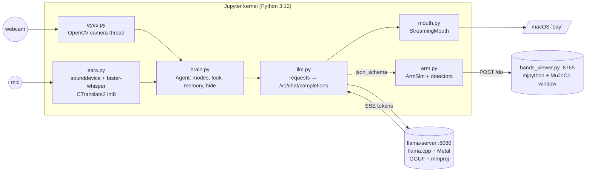
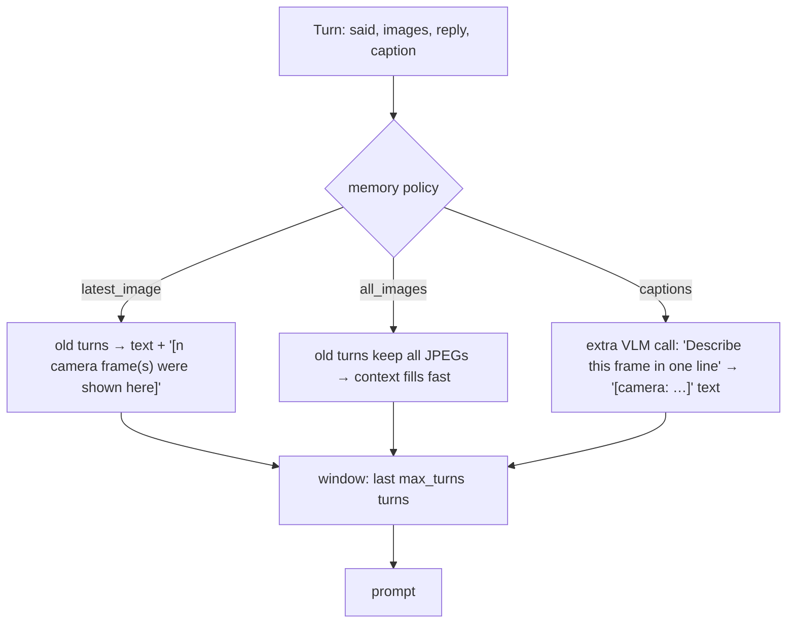
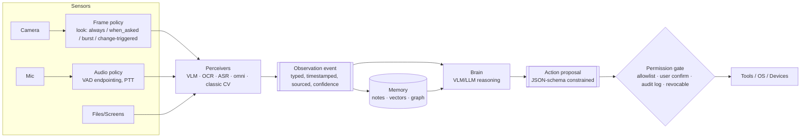

# Kavya's Architecture — reverse-engineered from `offline-agents@cb1a677`

Source: `Senses/demo/original/offline-agents-main/` (see `NOTEBOOK_AUDIT.md` for provenance).
Labels: **[CODE]** verified from source · **[DOC]** repo README/INSTALL · **[OBS]** our observation · **[HYP]** our hypothesis.

---

## Part A — WHAT KAVYA ACTUALLY BUILT

### A.1 One-sentence summary

A Python process (Jupyter kernel) captures camera frames (OpenCV) and microphone audio
(sounddevice), turns audio into text with a **separate local ASR model** (faster-whisper),
and sends text + downscaled JPEGs as an **OpenAI-style chat request** to a **single local
multimodal LLM** served by **`llama-server` (llama.cpp)**. Replies stream back and are
spoken sentence by sentence with the OS voice. "Memory" is the re-sent chat history.
"Hands" are either regex-parsed `ACTION:` text lines or **JSON-schema-constrained output**
that drives a simulated MuJoCo arm over localhost HTTP **[CODE]**.

### A.2 Process topology **[CODE]**

Three OS processes at most: the kernel, `llama-server` (detached; survives kernel restarts),
and the optional MuJoCo viewer. All IPC is **HTTP on 127.0.0.1** **[CODE]**.

### A.3 The actual data flow, stage by stage

| Stage | What happens | Where |
|---|---|---|
| **INPUT** | Webcam BGR frames (background thread keeps only the latest) or image files; mic float32 16 kHz mono, push-to-talk or fixed seconds; or typed text | `eyes.Eyes`, `ears.record_*`, `nb.agent_panel` |
| **PREPROCESSING** | Image: optional centre crop → `INTER_AREA` resize to `max_side` (default 512) → optional greyscale → JPEG q80. Audio: none beyond int16 WAV encode | `eyes.preprocess`, `ears.to_wav_bytes` |
| **PERCEPTION** | *Pipeline path:* faster-whisper `base.en`, greedy, Silero VAD trim → text. *Omni path:* none — raw WAV goes to the LLM. *Vision:* none outside the LLM — the VLM's own encoder (mmproj) does it | `ears.transcribe` / `llm.audio_part` |
| **REPRESENTATION** | OpenAI chat message: `content = [image_url(data:jpeg;base64)…, input_audio(wav b64)…, text]`. History = list of messages | `llm.user/system/assistant` |
| **MODEL** | One GGUF LLM + one mmproj GGUF (vision, and audio for Gemma 4 / Qwen2.5-Omni) in `llama-server` | `server.MODELS` |
| **REASONING** | Single forward pass per turn. Thinking disabled by default (`--reasoning off` + `chat_template_kwargs.enable_thinking=false`) | `llm.chat`, `server._thinking_flags` |
| **AGENT** | `Agent.turn`: decide whether/how to look → build messages from mode+history → stream → hide lines → optional caption call → append turn. **No loop / planner / reflection**; one model call per user turn (+1 for captions, +1 for router in Build 1) | `brain.Agent` |
| **TOOLS** | (a) `ACTION: name \| arg` lines → regex → `if/elif` (save_note, take_photo). (b) `response_format: json_schema` → grammar-constrained JSON → validated enum → `arm.send()` | `4_agent` cell 20, `arm.color_by_llm` |
| **OUTPUT / ACTION** | Streamed text in widget; OS TTS per sentence; files (`notes.txt`, `*.jpg`); simulated arm press | `mouth`, `nb`, `hands_viewer` |

### A.4 Answers to the brief's questions **[CODE]**

| Question | Answer |
|---|---|
| Separate vision model? | **No.** Vision is inside the VLM (GGUF + mmproj via llama.cpp `mtmd`). Classic HSV CV exists only as a baseline detector in notebook 6 |
| Multimodal VLM? | **Yes** — Gemma 4 E2B/E4B (default), SmolVLM2-2.2B, SmolVLM-256M, Qwen2.5-Omni-3B |
| Speech model? | **Yes, optional:** faster-whisper (tiny/base/small `.en`). Bypassed in notebook 5 |
| Text LLM? | Same model as the VLM; there is no separate text-only LLM |
| Embeddings? | **None.** No vector store, no retrieval |
| Structured messages / JSON? | OpenAI chat JSON over HTTP; JSON-schema constrained output for actions |
| Tool calls? | **Not** the OpenAI `tools` API. Text protocol + constrained JSON |
| Agent loop? | **No autonomous loop.** Reactive per-turn; two polling loops (`narrator`, `watch()`) are hand-written `while` loops with thresholds/debounce |
| MCP? | **No** |
| Device Connect? | **No** — not referenced anywhere in the repo |
| Other orchestration? | None. Plain Python + ipywidgets callbacks |

### A.5 Which "brain option" is it?

The brief's options: **A** (vision→text, audio→text, then LLM), **B** (image+audio → VLM),
**C** (specialised perceivers → event layer → reasoner).

Kavya's system **teaches A and B side by side, and deliberately makes them comparable**:

- Notebooks 3–4 = **hybrid A/B**: audio → Whisper → text (A), but images go **raw** into the VLM (B).
  Vision is never converted to text first, except in `captions` memory, where a second model call turns an
  old frame into text for cheap history. That is a small, **memory-only** instance of Option A.
- Notebook 5 = **pure B** (audio + image → one omni model), with an explicit **race** against the hybrid.
- Notebook 6 = a small **C**: a perceiver (HSV pixels *or* VLM) emits a **typed event**
  `{"color": …}` that drives an actuator through a debounced policy.

**[OBS]** The pedagogical message is "the model is fixed; what you put in front of it is yours".
The architecture's intelligence lives in **input policy** (when to look, how big, how many frames) and
**memory policy** (images vs captions vs text), not in orchestration.

### A.6 Memory, precisely **[CODE]**

- Volatile only: `Agent.turns` lives in kernel memory. The only on-disk memory is `notes.txt` (Build 3), re-injected into the system prompt.
- `{now}` substitution is the only notion of time. There are no timestamps on turns.
- The "memory palace" mode with `captions` + 20 turns is the closest thing to an episodic visual memory.

### A.7 Hands, precisely **[CODE]**

| Mechanism | Contract | Enforcement | Confirmation / audit |
|---|---|---|---|
| `ACTION:` lines (nb 4) | free text `ACTION: \w+ \| .*` | regex + `if/elif`; unknown names are `[skip]`ped | none; `print` only |
| JSON-schema output (nb 6) | `{"color": enum}` / `{"sequence": [enum ≤5]}` | **sampler-level grammar** in llama-server + Python re-validation + actuator-side validation in `hands_viewer` (400 on bad colour/action) | none; debounce (same colour twice) in `watch()` |

### A.8 Performance instrumentation built in **[CODE]**

`Reply.stats()` exposes wall-clock, time-to-first-token, `prompt_n`, and `predicted_per_second` from
llama-server's `timings`. Notebook-level benchmarks: the image-size sweep (nb 2), Whisper × realtime and
the model shoot-out (nb 3), stop-talking-to-first-word split (nb 3), pipeline-vs-omni race (nb 5), and
pixel-vs-LLM detector latency (nb 6). These are what we reuse for benchmarking in Phase 5.

---

## Part B — SENSES DECOMPOSITION (Phase 6)

### B.1 KAVYA IMPLEMENTATION → sense mapping

| Sense | Kavya's component | Tech | Notes |
|---|---|---|---|
| **EYES** — camera | `Eyes` thread, latest-frame-only | OpenCV `VideoCapture` | no timestamps, no frame IDs |
| EYES — image / preprocessing | `preprocess()` | resize/crop/grey/JPEG | the main speed knob |
| EYES — video | `burst` look mode, `before_after`, narrator | N stills at fixed gap | no video model; temporal reasoning left to the VLM |
| EYES — OCR | *implicit* in the VLM ("read this") | Gemma 4 vision | no dedicated OCR; `HONESTY` prompt discourages guessing |
| EYES — scene understanding / VQA | VLM | Gemma 4 / SmolVLM | |
| EYES — change detection | `how_different()` | 64×48 grey mean-abs-diff | cheap trigger for expensive VLM calls |
| EYES — classic CV baseline | `color_by_pixels()` | HSV masks | |
| EYES — visual embeddings / visual memory | **none**; `captions` is text memory of frames | | gap |
| **EARS** — microphone | `record_seconds`, `BackgroundRecorder` | sounddevice | push-to-talk |
| EARS — VAD | Silero VAD **inside** faster-whisper (`vad_filter=True`) | onnxruntime | trims silence; not used for endpointing |
| EARS — ASR | faster-whisper tiny/base/small `.en` | CTranslate2 int8 | English-only models by default |
| EARS — audio understanding | Gemma 4 / Qwen2.5-Omni `input_audio` | llama.cpp mtmd audio | mood, sounds, language ID |
| EARS — speaker processing | **none** | | gap |
| EARS — wake word | transcript prefix match (exercise) | | text-level, not acoustic |
| **BRAIN** | one VLM/omni model in llama-server | llama.cpp, GGUF Q4_0/Q4_K_M, Metal | thinking off by default |
| BRAIN — planning | none; JSON-array "sequence" is the only plan | | |
| BRAIN — routing | keyword `LOOK_WORDS` or LLM YES/NO router (Build 1) | | |
| **MEMORY** — context/history | re-sent chat list, `max_turns` window | | volatile |
| MEMORY — persistent | `notes.txt` via `ACTION: save_note` | plain text | re-injected into system prompt |
| MEMORY — embeddings / retrieval | **none** | | gap — Skein's strength |
| **HANDS** — tools | `ACTION:` regex; JSON-schema actions | | |
| HANDS — OS interaction | `say`; file writes | | |
| HANDS — devices | MuJoCo arm via localhost HTTP `/do` | typed enum API | simulated only |
| **MOUTH** (not in brief's list) | `StreamingMouth` | macOS `say`; README suggests Piper/Kokoro | sentence-level streaming TTS is the perceived-latency trick |
| **NERVOUS SYSTEM** — orchestration | `Agent.turn`, ipywidgets callbacks, `while` loops | plain Python | synchronous per turn |
| NERVOUS — event passing | none (direct calls); HTTP to arm | | |
| NERVOUS — tool protocol | text lines / JSON schema | | no MCP |
| NERVOUS — model routing | none (one model). Model choice = which GGUF you start | | |

### B.2 SENSES ABSTRACTION (ours — **[HYP]**, not Kavya's)

This is our proposed vocabulary for `Senses/`, derived from the gaps above. It is **not** a Skein
design decision, and it changes nothing in production.

What we take from Kavya:
1. **Input policy as a first-class object** (look / memory / hide modes).
2. **Downscale aggressively and measure** (the sweep).
3. **Constrained decoding for actions**, plus actuator-side validation.
4. **Self-transcription** (`HEARD:`) and **captions** as cheap text memory of rich media.
5. **Change-triggered perception** (`how_different`) to avoid continuous VLM calls.
6. **Streaming TTS at sentence granularity** for perceived latency.

What Skein must add (gaps in Kavya's system):
- A persistent, timestamped **Observation** record with media references and provenance, not volatile chat turns.
- **Retrieval** (embeddings + graph) instead of a sliding `max_turns` window.
- A **permission gate** for actions: user-visible, auditable, revocable. Kavya's actions have none.
- **Prompt-injection hygiene** for perceived text (camera OCR must never be able to issue actions directly).
- **Process isolation**: Kavya runs everything in one kernel plus an unauthenticated localhost server. Skein's Android isolated-process model is stricter.
