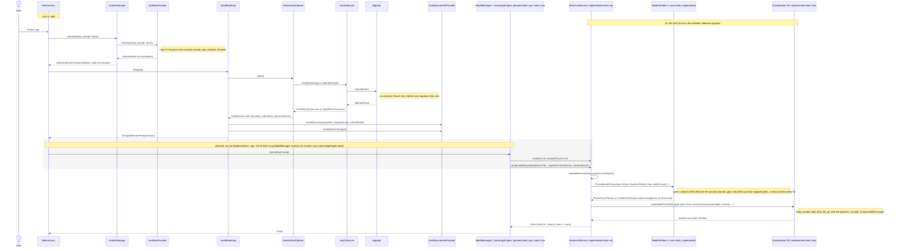

# Architecture

> **Status:** written by `E0.I18`/skein-edc at commit `c3d22b8`, re-verified
> against the tree at commit `ad98b7b` (2026-09-22), and amended for the
> on-device fixes of 2026-09-22/23 through `c681057` (see "Delta since
> `ad98b7b`" below) — every module row,
> dependency edge and guard reference below is verified against a build file
> or a `build-logic/guards` source file, cited inline. Where a step in the
> startup sequence is not yet implemented, its diagram participant is
> labelled `planned (skein-xxxx)` and cites the bead that owns it — nothing
> below is invented. Kept in sync going forward is `E9.I10`/skein-4aw's job
> (ARCHITECTURE.md refresh at M3); until then, re-verify a claim against the
> cited file before trusting it blindly.

This document is the one every dispatched agent reads first (see §6, "How to
pick up an issue"). It answers three questions: what are the modules and what
may each depend on (§2), what actually happens when the app starts (§1), and
what conventions hold across all of it (§3–§5).

## 0. North star

Skein is built as a **user-owned cognitive runtime**, not as an Android notes app with a local LLM.
The long-term architecture — a Skein Brain (sources, derived knowledge, skills, provenance, history)
served by one Agent Runtime, reasoning through replaceable models — is stated in
`docs/design/NORTH_STAR_BRIEF.md`. That document is direction, not scope: it explicitly does not
expand v1 (its §24–§25).

What it means for the code in this repository is settled in
`docs/design/NORTH_STAR_REVIEW.md`: where the current architecture already *is* the right seam
(with the type or file that proves it), the small number of boundaries being adopted inside work
already in flight, and the concepts recorded as ADRs with the one thing that must not be done now to
keep each of them possible. Before adding a type, a module or a dependency, check that review's §4 for
a "must not do now" line that covers it.

### 0.1 Delta since `ad98b7b` (2026-09-22 → 2026-09-23, through `c681057`)

The first on-device smoke (Fold, skein-94fh) produced these changes; each is on `main` and verified by a test named in its merge commit. Nothing below changes the module map or the dependency guards except where stated.

- **Lock sequence:** `LockObserverPriority` gained `TEARDOWN`; `UnlockManager` runs it after the HIGH/LOW pass under its own budget window and even when that pass timed out, and `VaultBootstrap`'s session close lives there (skein-1bx4). `DeviceVaultOpener` creates one `VaultLifecycle` per open, and `VaultLifecycle.close()` is total. The gate logs a failed bring-up reason at W (`VaultGate`, fixed text only).
- **Vault open on device:** `libskein_sqlite_jni.so` exports are named for `SkeinSQLiteNativeImpl`; `tools/ci/sqlite-jni-symbols.sh` gates that surface in CI alongside `jni-symbols.sh` (skein-8ryv). Add it to the §2.2 guard list when reading that section.
- **Biometric prompts:** `AndroidBiometricAuthenticator` derives a per-factor `PromptInfo` (biometric-only for the biometric wrap, credential-only for the credential wrap); `UnlockResult.DeviceLocked` covers the keyguard race at screen-on, and `BiometricUnlockScreen` does not auto-present until the device is unlocked (skein-f9ls, skein-9psb).
- **Shell:** window insets applied once at the root (`EdgeToEdgeSurface`, `enableEdgeToEdge`); the command bar hosts a `CommandRegistry` with the `/` palette, `/new note`, and title/body search (skein-ps0 slice A; slice B still open); `AppearancePrefs` (System/Light/Dark) feeds every `SkeinTheme` call site except the graph overlay (skein-7jc5); the editor has its own surface colour token.
- **Editor:** `NoteTab` passes the wikilink suggestion source, rendered wikilinks open on tap via an Initial-pass pointer peek, hardware Up/Down are handled by the editor because Compose's own handling skips the `OffsetMapping` on shorter rendered lines, and Left/Right move the caret through the same `OffsetMapping` (skein-pnqo, skein-hacu, skein-ex7d).
- **Graph:** `GraphSimulation` steps `ForceLayout` at frame rate with per-node drag detected on the Initial pointer pass so it wins over pan (skein-67ak); the integrator is damped semi-implicit Euler with force and velocity caps and no reheat on drag, so a dragged node leads and its neighbours follow without jitter (skein-8g4c).
- **Identifiers:** every package, the AIDL package, the `:core:ipc` namespace and the DocumentsProvider authority live under `app.skein.*` (`app.skein.documents`); the former `us.aherrera.skein.*` contract prefix is gone (skein-376c, `c681057`). No personal name appears in a code identifier; the schema `$id` and attestation fixtures are a pending decision (skein-a4e4).
- **Launcher icon:** generated deterministically by `tools/icons/generate_launcher_icons.py` from `docs/branding/`; the manifest points `android:icon`/`roundIcon` at it (skein-t9h2).
- **Designed, not implemented:** `docs/design/SKEIN_HUB.md` (a separate `app.skein.hub` APK as the only holder of `INTERNET`, a Core-initiated read-only URI handoff, GGUF inspection only inside `:inference`, one signature permission per capability) and `docs/design/NORTH_STAR_REVIEW.md` (the direction review; seams recorded on beads, deferred concepts as ADR entries). Nothing in this tree implements either; Core still declares no `INTERNET` permission (spec §2.1). The owner accepted the design on 2026-09-23: §1.2 below and the spec's §2 non-negotiable 11 carry the wording, and the H1–H16 beads are filed (handoff §2.0).

## 1. Process topology and startup

Skein runs as three Android processes from one APK (spec §4.1):

| Process | Manifest declaration | What runs there | Permissions |
|---|---|---|---|
| `:app` (main) | implicit (the process `SkeinApplication`/`MainActivity` run in) | UI, vault access, orchestration, RAG, editor, ingest | Full app permissions (`POST_NOTIFICATIONS`, `USE_BIOMETRIC`; SAF for file access — no `INTERNET`, ever) |
| `:inference` | `<service android:name="app.skein.inference.service.InferenceService" android:process=":inference" android:isolatedProcess="true" android:exported="false" />` (`app/src/main/AndroidManifest.xml`) | model mmap + llama.cpp inference | none — `isolatedProcess="true"` strips every permission |
| `:embedder` | `<service android:name="app.skein.embedder.service.EmbedderService" android:process=":embedder" android:isolatedProcess="true" android:exported="false" />` (same manifest) | ONNX Runtime embedding / NER / rerank | none |

Both isolated services communicate with `:app` only over the AIDL contract in
`:core:ipc` (§2.3) — no shared memory, no Android permissions, no path
strings crossing the boundary (fds only). This is the isolation the plan and
spec both call out as containing "the blast radius of any llama.cpp parser
exploit" (spec §4.1).

### 1.1 Startup sequence

Spec §4.1: *"`:app` → biometric unlock → StrongBox key unwrap → SQLCipher
open → bind `:inference` → hash-verify current model → mmap → ready."* The
diagram below names the real class/function for every step that exists in
this tree today, and labels the rest `planned` with the bead that owns it —
as of commit `8b6ac79` (2026-09-23), everything up to and including "vault
open, provider installed" is implemented, unit-tested and **verified on the
Fold** (setup, unlock, screen-off lock and same-process reopen, note
creation, wikilinks, graph — see §0); the isolated `InferenceService` and
the verifier it calls are implemented (skein-nxk, skein-v2s); and the
`:app`-side path is now wired end to end but **not yet verified on the
Fold**: `app.skein.models.ModelServices` builds `ImmutableModelStore`,
`ModelRegistryImpl`, `ModelManager` and `LlamaCppEngine` once per unlocked
session (skein-whg8), `/import model` copies and hash-verifies a picked
GGUF (skein-cyq), `LlamaCppEngine` binds `:inference`, pushes the session
epoch (two-way, skein-gg11.8) and builds the `LoadRequest` with
`gpuLayers = 0` (skein-1uw, skein-gg11.1), `/chat` streams through
`SendPipeline` (skein-6as), and the TEARDOWN lock tier unloads the model
before the key is zeroed. The first on-device proof is skein-830f.



Every arrow outside the shaded box is a real call in this tree:

- `UnlockManager.unlock`/`unlockWith` — `core/vault/src/main/kotlin/app/skein/core/vault/session/UnlockManager.kt`
- `VaultKeyProvider.unlock` — `core/vault/src/main/kotlin/app/skein/core/vault/key/VaultKeyProvider.kt` (contract); `VaultKeyProviderImpl` for the Keystore unwrap
- `VaultBootstrap.bringUp` / `openAndInstall` — `app/src/main/kotlin/app/skein/vault/VaultBootstrap.kt`
- `DeviceVaultOpener.open` / `createOrOpen` — `app/src/main/kotlin/app/skein/vault/DeviceVaultOpener.kt`
- `VaultLifecycle.create` / `.open` and `Migrator.migrate` — `core/vault/src/main/kotlin/app/skein/core/vault/lifecycle/VaultLifecycle.kt`
- `VaultDocumentsProvider.install` / `.notifyRootsChanged` — called through the `DocumentsProviderPort` seam in `VaultBootstrap.kt`
- `InferenceService.onBind` returns an `IInferenceService.Stub` — `inference-service/src/main/kotlin/app/skein/inference/service/InferenceService.kt`, declared in `inference-service/src/main/AndroidManifest.xml` with `isolatedProcess="true"`, `exported="false"`, `process=":inference"`; `load`, `generate`, `cancel`, `unload`, `embed`, `tokenCount`, `status` and the `onSessionLocking`/`onSessionLocked`/`onSessionUnlocked` gate methods are implemented (skein-nxk, `E4.I3`); `IsolatedSessionGate` guards every plaintext-touching entry point (`docs/design/LOCK_POLICY_INDEXING.md` §5.3)
- `ModelVerifier.verifyPinned` / `verifyBeforeMmap` / `verifyAfterMmap` and `PinnedModelFile.pin` — `core/verify/src/main/kotlin/app/skein/core/verify/{ModelVerifier,PinnedModelFile}.kt` (extracted from `:core:inference` by skein-nxk per coordinator decision `skein-hiwb`, so both isolated services may depend on them — §2.1)
- `LlamaNative.loadModelFromFd` / `newContext` / `tokenize` / `decodePrompt` / `sampleNext` / `freeContextSecure` — `inference-service/src/main/kotlin/app/skein/inference/service/LlamaNative.kt` over `native/llama/jni/skein_jni.cpp` (skein-3aw; 24 `Java_` symbols, checked by `tools/ci/jni-symbols.sh`)

Only the shaded box is designed but not wired:

- `ModelManager`/`ModelRegistry` — the `:app`-side caller that imports a model through `ImmutableModelStore`, builds the wire `ManifestBinding` with `WireBindings.toWire` (`core/inference/.../models/WireBindings.kt`, skein-28wm) and binds the service — is `E4.I5` (skein-cyq), not yet landed. The client-side `InferenceEngine` implementation (`LlamaCppEngine`) that talks to the service, maps codes via `ErrorCodes.toException` and threads the `sessionEpoch` is `E4.I4` (skein-1uw). Until it lands nothing in `:app` binds `:inference` — `grep -rn IInferenceService app/src/main core/inference/src/main` finds no client.
- `ImmutableModelStore` (`core/inference/.../models/ImmutableModelStore.kt`) and the `ModelManifest` v2 parser are implemented and tested (skein-st1r, skein-3v9); `docs/design/MODEL_STORE.md` §6 lists what still has to call them.

### 1.2 The second APK: Skein Hub (designed, not implemented)

Network-side model acquisition lives in a **separate application**, `app.skein.hub`, built from its
own Gradle build under `hub/` and signed with the same key. Hub holds `INTERNET`; Core
(`app.skein`) holds none, in any variant, forever (spec §2.1, §2.11). Design: `docs/design/SKEIN_HUB.md`.

Four properties are structural rather than conventional, and each has an enforcement point:

- **Core exports nothing to Hub.** The exported-component set stays `{MainActivity,
  VaultDocumentsProvider, SystemJobService}` — `ManifestPolicyTest`, `tools/ci/manifest-audit.sh`.
- **Core initiates every transfer.** Core starts an explicit `startActivityForResult` at Hub's picker
  and receives a one-shot, read-only, non-persistable `content://` grant. Hub cannot start, wake or
  message Core.
- **Core distrusts the artifact.** Core copies the bytes into `filesDir/models/<id>/` while hashing
  them, cross-checks Hub's digest for transfer integrity only, and derives every load-bearing manifest
  field itself. Hub's `name`/`license`/`source` are display hints.
- **The GGUF is parsed only in `:inference`.** `IInferenceService.inspect` runs the structural and
  metadata inspection inside the isolated process; `:app` never parses a model file.

Hub is optional. `external downloader → document picker → Core → validate → import` is the baseline
path and is asserted by a test that runs with Hub absent. Hub ships after v1 (spec §3.1).

## 2. Module map

### 2.1 Every Gradle module

All 22 modules below are declared in `settings.gradle.kts`; the "process"
column is where the module's code actually executes at runtime (a library
module has no process of its own — it is compiled into whichever
application/service module depends on it).

| Module | Kind | Runs in | Declared / allowed dependencies | Verified against | Owner epic |
|---|---|---|---|---|---|
| `:app` | Android application | `:app` | `:core:model`, `:core:vault`, `:inference-service`, `:embedder-service`, `:feature:shell`, `:feature:settings`, `:feature:editor`, `:feature:timeline`, `:feature:graph`, `:core:rag`, `:core:inference`; androidx.work/biometric/lifecycle/datastore, Compose. Guarded: `checkDependencyGuards*` (bans GMS/Firebase/Play Core/ML Kit transitively), `checkManifestGuards*` (bans `INTERNET`/exported components), `licenseAudit*RuntimeClasspath` (foss variant license allowlist) | `app/build.gradle.kts` | E1 (scaffold, `E1.I1`); vault bring-up `E3` |
| `:core:model` | Pure Kotlin/JVM | wherever it's linked (every process) | `kotlinx-coroutines-core` (api), `kotlinx-serialization-json` (api); no project deps | `core/model/build.gradle.kts`; isolation-guarded (`IsolationGuardPlugin.PURE_JVM_MODULES` includes `:core:model`) | E0 (contracts: `E0.I10`–`E0.I13`) |
| `:core:ipc` | Android library (AIDL + Parcelize) | `:app` (via `:core:inference`) and the isolated `:inference` process | `api(:core:model)` (skein-k7e9, for `ErrorCodes.toException` → `InferenceException`), `androidx.core.ktx`; consumed by `:core:inference` (`api`) and `:inference-service` (`implementation`); `:embedder-service` will depend on it when skein-lbw lands | `core/ipc/build.gradle.kts`; contract in `core/ipc/src/main/aidl/**` + `Parcels.kt`, `ErrorCodes.kt`, `TransportRules.kt` | E0 (`E0.I16`, v2) |
| `:core:vault` | Android library (+ native `libskein_sqlite.so`) | `:app` | `api(:core:model)`, `implementation(:core:markdown)`, androidx.biometric/sqlite, pdfbox-android | `core/vault/build.gradle.kts` | E2 (vault); keys/unlock `E3.I2`/`E3.I3a` |
| `:core:security` | Android library | `:app` | `api(:core:model)`; test-only `:testing`, `:core:markdown` | `core/security/build.gradle.kts` | E3 (`E3.I10`, PromptGuard) |
| `:core:inference` | Android library | `:app` | `api(:core:model)`, `api(:core:verify)`, `api(:core:ipc)` (skein-28wm — `WireBindings` returns the wire `ManifestBinding`), kotlinx-coroutines-core, kotlinx-serialization-json | `core/inference/build.gradle.kts` | E4 (models/thermal: `skein-st1r`, `E4.I9`; `ContextBudget`/`TokenCounter` `E4.I7`) |
| `:core:verify` | Pure Kotlin/JVM | wherever it's linked — `:app` (via `:core:inference`) AND both isolated processes | `api(:core:model)`; no other project deps | `core/verify/build.gradle.kts`; isolation-guarded BOTH ways (`IsolationGuardPlugin.PURE_JVM_MODULES` forbids it an Android plugin, and it is on `COMMON_SERVICE_PROJECT_ALLOWLIST` so the two services may depend on it) | E3/E4 (`E3.I5` verifier `skein-v2s`, extracted here by `E4.I3` per coordinator decision `skein-hiwb`) |
| `:core:rag` | Android library | `:app` | `api(:core:model)`, kotlinx-coroutines-android, kotlinx-serialization-json; test-only `:core:vault`, `:testing` (main source set deliberately has no `:core:vault` edge — see the module's own build-file comment) | `core/rag/build.gradle.kts` | E5 (RAG/ingest) |
| `:core:markdown` | Pure Kotlin/JVM | wherever it's linked | `jetbrains.markdown`, `kotlinx-serialization-json`, `compose-ui`/`compose-ui-graphics` (JVM target only — no Android plugin) | `core/markdown/build.gradle.kts`; isolation-guarded (`PURE_JVM_MODULES`) | E7 (`E7.I2`) |
| `:core:export` | Android library | `:app` | `:core:markdown`, `:core:model`, `:core:vault` (`SafeFileName` reuse), androidx-core-ktx, coroutines-core | `core/export/build.gradle.kts` | E2 (`E2.I10`–`E2.I12`) |
| `:core:agent` | Pure Kotlin/JVM | wherever it's linked | `implementation(:core:model)`; no project deps beyond that | `core/agent/build.gradle.kts`; isolation-guarded (`PURE_JVM_MODULES`) | **not in the v1 plan's epic numbering** — added by `docs/design/VAULT_TOOL_PRIMITIVES.md` (`skein-fvne`); see §7 drift note |
| `:inference-service` | Android library (`android:isolatedProcess`), native `libskein_llama.so` | `:inference` | `implementation(:core:model)`, `implementation(:core:ipc)`, `implementation(:core:verify)` — the isolation-guard allowlist limits project deps to exactly `{:core:ipc, :core:model, :core:verify}` and external groups to `{org.jetbrains.kotlin, org.jetbrains.kotlinx}`; nothing else compiles | `inference-service/build.gradle.kts`; enforced by `IsolationGuardTask.SERVICE_ALLOWLISTS[":inference-service"]` (`build-logic/guards/.../IsolationGuardPlugin.kt`); manifest `inference-service/src/main/AndroidManifest.xml` | E1/E4 (native build `E1.I4` skein-ca2 + `E4.I1` skein-3aw; service impl `E4.I3` skein-nxk — **implemented**) |
| `:embedder-service` | Android library (`android:isolatedProcess`) | `:embedder` | Same allowlist as `:inference-service` plus `com.microsoft.onnxruntime` | `embedder-service/build.gradle.kts`; `IsolationGuardTask.SERVICE_ALLOWLISTS[":embedder-service"]` | E5 (embedder) |
| `:feature:shell` | Android library + Compose | `:app` | `:core:vault`, androidx.biometric/window, material3-adaptive, coroutines. **Must never depend on `:feature:settings` or `:feature:editor`** — those depend on it, not the reverse (see `feature/settings/build.gradle.kts`'s and `app/build.gradle.kts`'s E6.I14 comments) | `feature/shell/build.gradle.kts` | E6 (`E6.I1`) |
| `:feature:timeline` | Android library + Compose | `:app` | `:core:model` only — deliberately no `:core:vault` or `:feature:shell` edge ("the screen takes an already-open repository and never unlocks anything itself") | `feature/timeline/build.gradle.kts` | E6 (`E6.I7`) |
| `:feature:chat` | Android library (stub) | `:app` | `androidx.core.ktx` only | `feature/chat/build.gradle.kts` | E6 (`E6.I8`, not yet implemented) |
| `:feature:editor` | Android library + Compose | `:app` | `:core:markdown`, `:core:model`, `:core:vault`, `:core:export`, `:feature:shell` (for the `SecureTextField`/`SecureBasicTextField` wrappers `RawTextFieldTest` requires) | `feature/editor/build.gradle.kts` | E7 (editor) |
| `:feature:graph` | Android library + Compose | `:app` | `:core:model`, `:feature:shell` (theme tokens only); deliberately no `:core:vault` | `feature/graph/build.gradle.kts` | E6 (`E6.I11`) |
| `:feature:personas` | Android library (stub) | `:app` | `androidx.core.ktx` only | `feature/personas/build.gradle.kts` | E6 (`E6.I10`, not yet implemented) |
| `:feature:settings` | Android library + Compose | `:app` | `:feature:shell` (one-way — shell must never depend back), `:core:vault` (`PassphraseStrength`) | `feature/settings/build.gradle.kts` | E6 (`E6.I14`) |
| `:feature:onboarding` | Android library (stub) | `:app` | `androidx.core.ktx` only | `feature/onboarding/build.gradle.kts` | E6 (`E6.I12`, not yet implemented) |
| `:feature:models` | Android library (stub) | `:app` | `androidx.core.ktx` only | `feature/models/build.gradle.kts` | E6 (`E6.I13`, not yet implemented) |
| `:testing` | Pure Kotlin/JVM | test classpaths only (`testImplementation`/`androidTestImplementation`) | `implementation(:core:model)`; `api` JUnit4 + `kotlinx-coroutines-test` | `testing/build.gradle.kts`; isolation-guarded (`PURE_JVM_MODULES`) so `:core:*` can depend on it without pulling in the Android SDK | E10 (`E10.I1`) |

(23 modules total: `:app`, `:core:agent`, `:core:model`, `:core:ipc`,
`:core:vault`, `:core:security`, `:core:inference`, `:core:verify`, `:core:rag`,
`:core:markdown`, `:core:export`, `:inference-service`,
`:embedder-service`, `:feature:shell`, `:feature:timeline`,
`:feature:chat`, `:feature:editor`, `:feature:graph`, `:feature:personas`,
`:feature:settings`, `:feature:onboarding`, `:feature:models`, `:testing` —
`grep include settings.gradle.kts` lists all 23 in one `include(...)` block.)

### 2.2 The dependency guards, and what each one enforces

Four Gradle plugins under `build-logic/guards` (`build-logic/guards/src/main/kotlin/app/skein/gradle/`) are the actual enforcement mechanism behind the table above — not just convention:

- **`DependencyGuardPlugin`/`DependencyGuardTask`** (`checkDependencyGuards*`, applied to `:app` only via `id("app.skein.guard.dependency")`) — walks every `*RuntimeClasspath`'s *resolved* dependency graph (direct + transitive) and fails if any resolved group is `com.google.android.gms`, `com.google.firebase`, `com.google.android.play`, or `com.google.mlkit` (or a subpackage). Spec §2.2.
- **`IsolationGuardPlugin`/`IsolationGuardTask`** (`checkIsolationGuards`, applied per-module via `id("app.skein.guard.isolation")`) — two independent checks depending on which allowlist a module's path matches: (a) `:core:model`, `:core:markdown`, `:core:agent`, `:core:verify`, `:testing` must never apply an Android Gradle plugin; (b) `:inference-service`/`:embedder-service` may declare only the project/external dependencies in `IsolationGuardTask.SERVICE_ALLOWLISTS`. Spec §2.6, plan §2.4.
- **`ManifestGuardPlugin`/`ManifestGuardTask`** (`checkManifestGuards*`, applied to `:app` only via `id("app.skein.guard.manifest")`) — inspects every variant's *merged* manifest (via the Variant API, `SingleArtifact.MERGED_MANIFEST`) for banned permissions/components and the isolation attributes on the two services. Spec §2.1/§2.2/§2.6.
- **`LicenseAuditPlugin`/`LicenseAuditTask`** (`licenseAudit*RuntimeClasspath`, applied to `:app` via `id("app.skein.guard.license")`) — resolves each foss-variant runtime dependency's POM, extracts its license, and fails if it's outside `tools/licenses/allowlist.txt`. Spec §10, `E1.I7`.
- **`NoRawLoggingGuardPlugin`/`NoRawLoggingGuardTask`** (`checkNoRawLogging`, applied to *every* subproject from the root `build.gradle.kts`, the same way `ktlint` is) — fails if any `src/main/kotlin` file other than `SkeinLog.kt` (and, in `:app`, `AndroidSkeinLogSink.kt`) calls `android.util.Log.*` or `println`. Spec §9, `E1.I11`. See §3.5 below.

All five are wired into `check` (`build.gradle.kts`'s `subprojects {}` block, or the plugin's own `project.tasks.matching { it.name == "check" }.configureEach { dependsOn(...) }`), so `./gradlew check` runs all of them — no separate command is needed to exercise them (this bead did not run Gradle; the wiring is verified by reading the plugin source, not by executing it).

### 2.3 The IPC contract (`:core:ipc`)

The wire contract between `:app` and the two isolated services is defined once, in `core/ipc/src/main/aidl/**` (the `.aidl` files enumerated in §2.1's table) plus the Parcelable/constant definitions in `core/ipc/src/main/kotlin/app/skein/ipc/Parcels.kt`. Landed by `skein-mfw` (`E0.I16`, v2 — supersedes plan §4.7 v1 per `docs/design/POST_REVIEW_RESOLUTIONS.md` §3.3/§2.3). Load-bearing rules, all cited in `Parcels.kt`'s own header comment:

- **No large payload ever travels inline.** Images, audio and oversized text are always a `SharedMemRef` (a `ParcelFileDescriptor` over ashmem/tmpfile + size + MIME hint), never a `ByteArray` field — Binder's 1 MiB per-process transaction buffer is shared across *all* in-flight transactions, so a single 4 MiB image alone would blow it. The inline budget for everything else is 32 KiB hard / 128 KiB refuse per transaction: `TransportRules` (`core/ipc/src/main/kotlin/app/skein/ipc/TransportRules.kt`, skein-nxk) declares the caps and `TransportRulesTest` proves a full-budget prompt must spill; a spilled chat message keeps its role and order via `ChatMessageParcel.contentFd` (J5). The service enforces the caps today; the client half is skein-1uw's.
- **Every model load is fd-based and hash-gated.** `ManifestFileRef` carries an already-open read-only fd plus `expectedSha256`/`expectedSizeBytes` for one file (main model or a named companion role); `ManifestBinding` bundles the full set for one model plus an optional `AttestationRefParcel`. The service hashes and mmaps *that exact fd* — it never re-opens a path (POST_REVIEW_RESOLUTIONS.md §2.3; see §1.1's diagram for how this connects to `ModelVerifier`).
- **The GGUF is inspected where it is parsed.** `IInferenceService.inspect(InspectRequest): ModelInspection` (`skein-91yy`, `docs/design/SKEIN_HUB.md` §3.3) runs the same pre-mmap verification `load` runs, then loads the model *without* a `llama_context` and reports architecture / quantisation / context length / embedding width / vision / chat-template / tokenizer from llama.cpp's own metadata accessors — so `:app` decides whether to accept a model without ever parsing one, and `E4.I5`'s `GgufMetadataProbe` is deleted rather than written.
- **Every request carries a `sessionEpoch`.** `IsolatedSessionGate.guard()` (service-side, `LOCK_POLICY_INDEXING.md` §5.3) admits a call only when `req.sessionEpoch == authorizedEpoch`, otherwise refuses with `ErrorCode.SESSION_LOCKED = 11` — this is what closes the race between a lock landing and a call already queued on Binder's thread pool.
- **The three session pushes are deliberately not the same shape** (`skein-gg11.8`). Binder orders `oneway` transactions only relative to each other on the same binder object; a *later* two-way call from the same caller thread can be serviced by a different, already-idle binder thread before the queued `oneway` push is processed. So `onSessionUnlocked` is **two-way**: it returns only once the gate holds the epoch, and the caller's next `load`/`generate` therefore cannot be dispatched ahead of its own authorization (while it was `oneway`, the first request after an unlock or after a rebind could be refused `SESSION_LOCKED` on a perfectly unlocked vault). `onSessionLocking`/`onSessionLocked` stay **`oneway`**, because `:app` sends them while tearing the session down and about to zero the master key and must never be blockable by the isolated process — a two-way lock push would hand a wedged or compromised `:inference` a lever over when the vault locks. Nothing is lost in that direction: both lock handlers revoke admission as their *first* act, before any cancellation or native free (`LOCK_POLICY_INDEXING.md` §4.1), and the per-request epoch above covers whatever was already on the thread pool — losing a race there can only refuse work, never admit it. `AidlContractTest` asserts the `FLAG_ONEWAY` bit of all three transactions directly, so the asymmetry cannot be undone silently.
- **`ErrorCode`** (`object ErrorCode` in `Parcels.kt`) enumerates every failure a synchronous AIDL call or `onError` can report (`OK`=0 through `INTERNAL`=99, plus `SESSION_LOCKED`=11); `ErrorCodes.toException(code, message)` (`core/ipc/src/main/kotlin/app/skein/ipc/ErrorCodes.kt`, skein-k7e9) maps every failing code to a distinct `InferenceException` subclass (`OK` and `CANCELLED` → none; an unrecognised code → `Internal`, so forward version skew degrades instead of crashing) — this is why `:core:ipc` carries an `api(project(":core:model"))` edge. `ErrorCodes.asServiceFailure`/`codeOf` (skein-nxk) carry a code across a synchronous AIDL failure, since `ServiceSpecificException` is absent from the public `android.jar`. Sanitising the service-supplied `message` before it reaches an exception or logcat is the open review finding skein-3yal.

## 3. Conventions

### 3.1 Contracts vs. implementations

Interface/contract types (`:core:model`'s domain types, `:core:ipc`'s AIDL package and Parcelables) and concrete implementations (`:app`, `:core:vault`, `:core:inference`, the feature modules, the two service modules) all live under `app.skein.*`. Before `skein-376c` (2026-09-23), contract types carried a separate `us.aherrera.skein.*` prefix — the owner decided no personal name should appear in code identifiers, and that rename folded both prefixes onto `app.skein.*`. `core/ipc/build.gradle.kts`'s own comment states the module-namespace reasoning: the AIDL package is what every client imports, so the module namespace matches it rather than an `app.skein.core.ipc` placeholder. Some older modules (e.g. `:core:vault`'s `app.skein.core.vault.key`) still predate that reconciliation and are tracked for a single pass (`skein-0j1`) rather than being moved piecemeal — see that package's own file header.

### 3.2 Coding conventions

- **Kotlin official code style**, enforced by `org.jlleitschuh.gradle.ktlint` applied to every subproject (`build.gradle.kts`).
- **`Result` for expected failures, exceptions for bugs.** The codebase's sealed-class outcome types (`SetupResult`, `UnlockResult`, `OpenResult`, `BringUpResult`, `ModelVerification`, ...) are the concrete expression of this: an *expected* failure (wrong key, user-cancelled biometric, hash mismatch) is a typed variant the caller must handle, never a thrown exception with a stack trace; an unhandled `Throwable` reaching one of these call sites is a bug, and is caught and converted at the boundary (see `DeviceVaultOpener.open`'s `catch (t: Throwable)` converting anything unexpected into `VaultOpenException`).
- **No `println`.** Enforced by `NoRawLoggingGuardTask` (§2.2) — the same guard that bans raw `android.util.Log`.
- **`SkeinLog` only**, and **never log document/prompt/chunk/embedding content** — see §3.5 below (kept from this file's original content, restructured under Conventions rather than discarded).
- **Coroutine dispatcher injection via constructor.** `DeviceVaultOpener(..., private val io: CoroutineDispatcher = Dispatchers.IO, ...)` is the pattern: a dispatcher is always a constructor parameter with a production default, never a hardcoded `Dispatchers.IO`/`.Main` reference inside a function body, so tests can substitute a `TestDispatcher`.
- **No static singletons except `SkeinLog`.** `SkeinLog.sink`/`SkeinLog.testHook` are the one sanctioned exception (a facade with no state of its own beyond the pluggable sink) — everything else is constructed and passed explicitly (`SkeinApplication.vault`, `VaultServices`, `UnlockManager`, etc. are all instance state owned by a composition root, never a Kotlin `object`).

### 3.3 Migration numbering

Migrations live in `core/vault/src/main/resources/migrations/`, one `NNN_<description>.sql` file per line in `INDEX.txt` (`Migrator` applies them in numeric order regardless of the manifest's line order — `ClassLoader.getResources` can't list a JAR directory, hence the manifest). As of commit `ad98b7b`, five are shipped: `001_initial.sql`, `003_document_revisions.sql`, `005_export_stages.sql`, `007_drop_attachment_master_key.sql`, `008_ingest_attempts.sql` (`PRAGMA user_version` reaches 8). Numbers **002, 004 and 006 are reserved, not free** — `docs/VAULT_FORMAT.md` §7 explains why: `002_attestation_status`, `004_post_mmap_blake3` and `006_recovery_drafts` are claimed by landed design docs and the coordination bead `skein-voys`; taking one of those numbers for something else would collide. Caveat (`skein-p8rn`): `Migrator` applies only versions above the current `user_version`, so a reserved number landing after a higher one — as 005 did after 007/008 — is skipped on an already-migrated database; the applied-migrations ledger that fixes this is uncommitted in its worktree as of this stamp (see the handoff §2.3). Read `INDEX.txt` and the migration file directly before adding a ninth.

### 3.4 Native builds and submodules

`third_party/*` (`llama.cpp`, `Vulkan-Headers`, `SPIRV-Headers`, ...) are git submodules pinned by exact commit in `native/llama/PINNED_COMMIT` — a git commit is itself a content hash, which is what the reproducible-build contract (`E1.I8`) needs; `.gitmodules`'s header explains when a dependency is a submodule vs. a vendored tarball (`native/sqlite/*.sha256`) vs. a checked-in source copy. `tools/ci/check-submodules.sh` fails the build if either the working tree's checked-out commit or the superproject's recorded gitlink disagrees with `PINNED_COMMIT`. Bumping a pin means editing `PINNED_COMMIT`, moving the submodule, and updating `native/llama/README.md` in one reviewed commit (that file's own instruction). `native/sqlite/` follows the same discipline for the SQLCipher + sqlite-vec + FTS5 amalgamation, with its own `verify_amalgamation.sh` check wired as a Gradle task in `core/vault/build.gradle.kts`.

### 3.5 Logging

Spec §9: **never log document, prompt, chunk, or embedding content, at any
level, in any build.** This is a hard rule, not a debug-build convenience —
Skein's entire value proposition is that a user's notes and model
conversations never leave their control, and a stray `Log.d` is exactly the
kind of leak that undermines that promise silently.

#### `SkeinLog` is the only logging facade

`app.skein.core.model.SkeinLog` (`:core:model`, pure Kotlin/JVM) is the one
place in this codebase allowed to reach a real log sink. It exposes
`d`/`i`/`w`/`e(tag, message)`, each routed through a pluggable
`SkeinLog.Sink`:

- On the JVM (unit tests, tooling, `:core:model` itself) the sink defaults
  to a no-op — nothing here ever calls `android.util.Log`, so plain JUnit
  tests don't need Robolectric just to exercise logging call sites.
- `app.skein.system.AndroidSkeinLogSink` (`:app`) wraps
  `android.util.Log` and is installed by `SkeinApplication.onCreate` in
  every process that `Application` subclass runs in (`:app`, the isolated
  `:inference` and `:embedder` processes alike).

**`NoRawLogging`** (`build-logic/guards`, applied to every Gradle
subproject via the root `build.gradle.kts`, the same way `ktlint` is)
fails `check` if any `src/main/kotlin` file other than `SkeinLog.kt` calls
`android.util.Log.{v,d,i,w,e,wtf}(...)` or `println(...)`. `:app` also
allowlists `AndroidSkeinLogSink.kt`, the one sanctioned bridge from
`SkeinLog` to the real platform logger — `SkeinLog` itself cannot import
`android.util.Log` (it is isolation-guarded pure Kotlin/JVM), so that bridge
has to live somewhere. Test and `androidTest` sources are not scanned: this
repo's tests already use `println` for developer-visible benchmark output
and it never reaches a shipped build.

#### Release stripping (AC(a))

`SkeinLog.d`/`SkeinLog.i` are `@JvmStatic` and are compiled out of the
release dex by R8: `app/proguard-rules.pro` declares
`-assumenosideeffects class app.skein.core.model.SkeinLog { public static
void d(...); public static void i(...); }`, and `app/build.gradle.kts`'s
`release` build type now sets `isMinifyEnabled = true` so R8 actually runs
(AGP only invokes R8 for a minified variant). This is scoped narrowly on
purpose — see `proguard-rules.pro`'s header comment — to just enable that
one optimization (`-dontobfuscate` plus a blanket `-keep` disable shrinking
and renaming) without taking on the full R8-full-mode / keep-rule audit
that `E1.I8` (reproducible-build configuration) owns; that issue is
expected to replace this file's blanket keep with an audited rule set.
`w`/`e` are **not** stripped in any build — they carry real diagnostics —
but see the next section for why that's still safe.

Verified once via `tools/logging/check-release-dex.sh`, which disassembles
the release APK's dex with `dexdump` and greps for an `invoke-*` call site
referencing `SkeinLog.d`/`SkeinLog.i` (not just the method's own
definition, which `-keep` intentionally leaves in the dex).

#### Defense in depth: content markers, at every level, in every build

Convention (never logging content) is necessary but not sufficient — spec
§9 asks for it to hold even when someone makes a mistake. `SkeinLog`
therefore checks every call, at every level, against a small set of content
markers (`prompt:`, `text:`, `chunk:`, `document:`, `embedding:`); if one is
followed by non-blank, non-already-redacted text, the message that reaches
the sink is replaced with a fixed placeholder instead. This is a safety net
for accidental raw content reaching `SkeinLog`, not the primary control —
callers must still never build such a message in the first place — but it
means a mistake at `w`/`e` (which R8 does not strip) still can't leak
content into logcat.

`SkeinLog.testHook`, set by `:testing`'s `SkeinLogCaptureRule` for the
duration of a test, observes every call's sensitivity flag so
`SkeinLogCaptureRule` can fail a test outright if anything sensitive was
logged — see `app.skein.testing.SkeinLogCapture`'s KDoc.

#### llama.cpp: `LlamaLogRedactor`

`app.skein.inference.service.LlamaLogRedactor` (`:inference-service`, pure
Kotlin, no JNI dependency) is the redactor the native `llama_log_set`
callback calls before anything from llama.cpp itself reaches `SkeinLog` —
llama.cpp logs prompt text directly at points `SkeinLog`'s own marker check
never sees, since that text never goes through `SkeinLog` at all until this
redactor has already run. `LlamaLogRedactor.forward(level, message)`:

- drops (returns `null` for) anything at `DEBUG`/`INFO` — llama.cpp's own
  verbose/info logging is never forwarded, sensitive or not;
- redacts anything after a `prompt:`/`text:` marker before returning it for
  `WARN`/`ERROR`, e.g. `LlamaLogRedactor.redact("prompt: hello world") ==
  "prompt: <redacted 11 chars>"` — the marker and a single separating space
  are preserved; only the content is replaced, and a message may contain
  more than one marker.

The native side is wired (skein-3aw, `E4.I1`): `LlamaNative.setLogCallback()`
→ `Java_app_skein_inference_service_LlamaNative_setLogCallback` in
`native/llama/jni/skein_jni.cpp` installs a `llama_log_set` callback that
calls back into `LlamaNative.onNativeLog(level, message)`, which routes
through `LlamaLogRedactor.forward` before `SkeinLog`. Independently,
`tools/ci/no-content-logging.sh` (skein-nxk, a `ci.yml` step) fails if any
`SkeinLog` call in the service sources references a prompt/token/piece
variable.

## 4. Test conventions

Full detail lives in `docs/TESTING.md`; the summary an agent needs before touching a test:

- **Three lanes, in order of preference:** (1) JVM unit tests — every module's `src/test/kotlin/`, no Android runtime, target under 30s/module (`./gradlew test`); (2) Robolectric tests — Android APIs without a device, used only where the JVM lane genuinely can't reach the API under test; (3) instrumented tests — real device/emulator, gated on the CI emulator lane (`skein-k3b2`) and compiled unconditionally in the meantime. Prefer the earliest lane that can actually exercise the behavior.
- **Test names:** `unit_condition_expectation` (per this bead's own acceptance criteria in `bd show skein-edc`).
- **`:testing`** (pure Kotlin/JVM, isolation-guarded — §2.1/§2.2) is where shared JVM-only rules and fakes live: `MainDispatcherRule`, `TempDirRule`, `FakeClock`, `SkeinLogCapture`/`SkeinLogCaptureRule`, and one fake per locked `core/model` contract (`InferenceEngine`, `VaultRepository`, `IndexStore`, `RetrievalService`, `PersonaService`, `EmbedderService`). Fakes must never grow real behavior — `docs/TESTING.md`'s own rule — a test that needs a smarter fake belongs against the real implementation instead.
- **`SecureTextField`/`SecureBasicTextField`-only text input.** `:testing`'s `RawTextFieldTest` asserts every text-entry Composable in the app goes through one of `:feature:shell`'s two allowlisted wrappers (`feature/shell/src/main/kotlin/app/skein/feature/shell/input/{SecureTextField,SecureBasicTextField}.kt`) — never a bare `BasicTextField`/`TextField`. This is why `:feature:editor` and `:feature:settings` both depend on `:feature:shell` (§2.1).
- Guard tasks (§2.2) run as part of `check` for every module, `:testing` included — there is no test-infrastructure exemption from `checkIsolationGuards`.

## 5. Commit convention

`type(scope): message`, signed off with `-s` (DCO). Example from this
tree's own history: `skein-3v9: lock the ModelManifest v2 schema, parser and
CI validator`. Every commit that closes or advances a bd issue should name
that issue's key in the subject or body so `git log --grep` finds it.

## 6. How to pick up an issue

This section is intentionally a direct quote of `bd prime`'s own workflow
(run it yourself for the full, current text — this is not paraphrased) and
`docs/BD_TAXONOMY.md`'s "Five-Step Dispatch":

```bash
bd ready              # Find available work
bd show <id>          # View issue details (description, acceptance criteria, metadata)
bd update <id> --claim  # Claim work
bd close <id>         # Complete work
```

Five-step version (`docs/BD_TAXONOMY.md`):

1. **Identify:** `bd ready -l tier:sonnet -l milestone:M1` (or your tier/milestone).
2. **Review:** `bd show skein-xxx` — read the description, acceptance criteria, **Interfaces** (what the issue consumes from and produces for neighbours — an agent sees only its own issue, so this is how names and types stay consistent), and **Files**.
3. **Claim:** `bd update skein-xxx --claim`. Status → `in_progress`.
4. **Work, TDD:** write the failing test first, run it and confirm it fails for the expected reason, implement, run it again, commit with `-s` (§5).
5. **Close:** `bd close skein-xxx --reason "Acceptance criteria met: [list]. Files: [list]."` — never close without a reason that maps back to the acceptance criteria, and never close without having pushed (`docs/BD_TAXONOMY.md`'s Anti-Patterns table: "Close without committing" is called out explicitly).

Also read, in order, before writing code: §2 (constraints) and §4 (contracts)
of the plan, this document, then the issue's own **Interfaces** and
**Acceptance criteria** — `docs/BD_TAXONOMY.md`'s Anti-Patterns table calls
out "dispatch an issue without reading its interfaces" as a named failure
mode.

## 7. Known drift filed as follow-ups

- `:core:agent` (`core/agent/build.gradle.kts`) is a real, isolation-guarded module in `settings.gradle.kts` but does not appear in the v1 plan's own module-existence checklist (`docs/superpowers/plans/2026-09-19-skein-v1-plan.md:1737`, the `E1.I2` acceptance criterion enumerating all 21 modules it expected) and has no `E<n>.I<n>` epic/issue number of its own — it was added later by `docs/design/VAULT_TOOL_PRIMITIVES.md` (`skein-fvne`). Filed as `skein-3siw` to either backfill the plan-doc checklist or record the module under an explicit epic.
