# Skein continuation: recover the UX build and establish answer accuracy

**Prepared:** 2026-09-27. **Code audited:** `1579a3f2d0cc839f133e0d116dd33c5244b543ec`.
**Planning bead:** `skein-i0zm`. **Implementation tracking:** existing `skein-xtov`, `skein-gg11`, and the beads referenced below.

This is the original continuation design and dispatch sequence, not a second task tracker. Beads owns status and acceptance evidence. The initial planning pass did not change the application or device. The owner subsequently authorized execution; see [the execution evidence](skein-ux-accuracy-execution.md) for implemented changes, observed failures and remaining verification limits.

## 1. Recommendation and meaning of success

Resume the existing UX architecture while making answer quality an immediate parallel priority. Recover the unfinished shell, prove the model receives a correct conversation, establish a real-model evaluation, repair evidence selection and context handling, and then select the strongest measured model configuration that the Fold can sustain.

The desired ChatGPT/Astra experience is a useful behavior target: direct answers, appropriate detail, continuity, evidence, and honest uncertainty. It is not a defensible promise of broad capability parity from a small phone model. Success should mean stronger measured answers and fewer unsupported claims on Skein's actual tasks, with published limits. A polished answer or valid citation number alone does not establish correctness.

Planning assumption pending the owner's example/model details: support both grounded questions about the vault and clearly distinguished general knowledge. Preserve the approved offline design, zero INTERNET permission, isolated inference/embedder processes, no telemetry, and no model-directed tool calls or writes. General knowledge cannot claim live web verification; current facts require a dated imported source or an explicit limitation.

## 2. What is actually present

The two requested handoffs are historical evidence, not current inventories. The UX migration plan and detailed UX specs remain the design authority; current code, bead notes, and per-commit test artifacts establish implementation state.

| Area | Audited state and consequence |
|---|---|
| Main branch | `1579a3f`; CI, reproducible build and UX screenshots succeeded on that SHA. [CI](https://github.com/HeyZeus100/skein/actions/runs/36299762430), [reproducibility](https://github.com/HeyZeus100/skein/actions/runs/36299762462), [screenshots](https://github.com/HeyZeus100/skein/actions/runs/36299762454). This does not certify the abandoned patch or physical Fold behavior. |
| New shell | AL-08 and AL-09a/b have landed. `MainActivity.kt` still selects the old shell by default; the new shell is behind `EXTRA_NAV_SHELL`. AL-09c is the next visible switch. |
| Vault and transfer prerequisites | `skein-cash` and `skein-a0mm` are closed: lifecycle deletion/migration work and Space folder/zip import/export backend exist. Reuse them; finish UI and uncovered edge cases. |
| UX tracking | Parent `skein-xtov` was closed while Wave 3 and later waves were unfinished. Reopened during this audit. `.24.22` is an intentional duplicate; `.24.23` is the live shell-switch issue. |
| Model evidence | Latest documented real run used Qwen2.5-3B-Instruct-abliterated Q3_K_M, a smoke artifact. It repeated fabricated text to the 1024-token cap. The owner's currently selected artifact and current bad-answer example are not independently confirmed. |
| Retrieval | Production `ModelServices` supplies `embedder = null`; lexical/graph retrieval exists. Semantic retrieval code and contracts do not mean real embeddings are working. |
| Citations | Citation chips and persisted revision metadata exist. The UI projection loses revision/locator information and opens the current document. The older handoff's “no citation UI” is stale. |
| Device | This session did not inspect or install on the Fold. Build labels and setup state in old handoffs must be rechecked by the dedicated runner. |

## 3. Recover the three interrupted agents

All three worktrees share this directory:

```text
/private/tmp/claude-501/-Users-andrewherrera-skein/3492f4fe-cc93-467b-9082-91faed1249eb/scratchpad/worktrees/
```

| Interrupted task | Worktree / branch suffix | Beads | Recovery disposition |
|---|---|---|---|
| AL-09c switch | `agent-a31c5098ee75829b8` / `claude/agent-a31c5098ee75829b8` | `skein-xtov.24.23`, `.24.21` | Preserve two unmerged commits and the entire dirty tree. |
| Vault quiesce + batch kindsOf | `agent-a5e9224f2563c29c9` / corresponding `claude/` branch | `skein-92xz`, `skein-ee5s` | Clean at audited main; transcript stopped during inspection. No implementation patch to recover. |
| Obsidian-style link resolution | `agent-aa98d6a7f684fb232` / corresponding `claude/` branch | `skein-382u` | Clean at audited main; transcript stopped during inspection. Resume from the issue and inspected code. |

Mappings were checked against the original agent metadata. The shell branch contains `3b980a7` (reset clears stacks/T2/session stores) and `7d06548` (model import and search relocation), then a dirty 102-file patch with approximately 7,208 deletions. Successful logs in its `build/agent-logs/` predate the final deletions.

Before editing that branch, preserve its HEAD, staged and unstaged binary diffs, untracked files, and useful ignored recovery evidence. Do not sweep worktrees, reset, stash away, or remove this work. Review the two commits separately, then complete the deletion patch against current main. In particular:

- `TabsStateTabController.kt` imports deleted tab types.
- `NavShellComposeTest` references removed `EXTRA_NAV_SHELL`.
- `GraphViewInstrumentedTest` invokes deleted `GraphScreen`.
- `MainActivityComposeTest` retains old-overlay expectations.

Port behavior assertions to the replacement entries before removing obsolete tests. Keep model import, search, note creation, settings actions, confirmations and Back reachable after removing the command bar. Do not close AL-09c on an old successful compile log.

The vault pair shares contracts and should have one implementation owner. `kindsOf` must return bounded, content-free type information before navigation renders; current `navKindsOf` reads whole documents one at a time. Quiesce must stop new write admission and coordinate in-flight writes with pool close, under the existing bounded lock/key lifetime. Test timeout, late writes, nested transactions, cancellation and re-unlock; an unbounded mutex wait is not a solution.

For Obsidian import, resolve file/path aliases deliberately. Changing every display title to a filename is insufficient for relative links or duplicate basenames. Cover filename versus heading/frontmatter disagreement, explicit titles, directory-qualified links, ambiguous basenames, normalization, renames and existing UUID links. Keep manifest restoration semantics distinct from ordinary Markdown import.

## 4. Accuracy findings: confirmed gaps versus hypotheses

Paths in this table are relative to the repository; line numbers refer to the audited code.

| Finding | Evidence | Required response |
|---|---|---|
| Whole-render tokenization can degrade chat structure | `inference-service/.../ChatTemplating.kt:148–151,209` treats all rendered text as ordinary content when it cannot locate a message verbatim. | Diagnose `skein-gg11.28` first. This is a known code path and a plausible cause, not a proven diagnosis of the owner's current answer. |
| Missing base answer policy | `core/rag/.../PromptAssemblerImpl.kt:93`: system content is just the persona prompt or empty. | Add a concise, evaluated evidence/uncertainty policy beneath trusted app instructions and above Space customization. |
| Irrelevant material can dominate | `feature/chat/.../SendPipeline.kt:71,214` requests top-8; retrieval/fusion has no answerability gate. `LexicalRecall.kt:87–92` normalizes the best hit to 1.0. | Permit no evidence. Calibrate relevance from meaningful signals; an arbitrary cutoff on normalized rank scores cannot reject an all-weak set. |
| Follow-up retrieval loses references | `SendPipeline.kt:205–217` passes history to generation but only latest user text to retrieval. | Resolve bounded conversational references or ask a targeted clarification. Keep the actual user question in generation. |
| Context budget can diverge from runtime | `core/inference/.../ContextBudget.kt:65–95` uses a fixed cap and text-only cache key; engine load clamps to actual model context. Assembler counts content only and drops individual messages. | Count the exact formatted prompt, use the loaded context, invalidate on tokenizer/model changes, and trim complete exchanges. |
| Selected Space is not the answer pipeline's provider | `app/.../shell/NavShell.kt:187–195` switches navigation Space; `app/.../vault/DeviceVaultOpener.kt:137` supplies `personaService.default()`. | Bind chat ownership, retrieval, instructions, model selection and persistence to one immutable per-turn Space snapshot. |
| Evidence display overstates what was used | `feature/chat/.../entries/ChatEntries.kt:254–257` reads pre-budget `outcome.retrieved`; assembler may remove chunks. | Track candidates, included evidence and cited evidence separately. Display only the actual prompt sources as “used.” |
| Valid reference is not supported claim | `CitationParser.kt:154` checks offered marker membership. `ChatViewModel.kt:30–35,175–187,284–288` drops revision/locator in the UI. | Preserve revision-aware source landing; evaluate semantic support independently from reference validity. |

Do not blame Q3 quantization, ablation, temperature or the model family before the controlled comparison. The reported `prefill layout` counters can detect one fallback; `closed=false` with a plausible count does not prove correct prompt tokenization.

## 5. First implementation batches

### Batch A: recovery and a baseline

Use three worktree-isolated implementation lanes at most, plus the coordinator. Serialize shared files and all device actions.

| Lane | Initial assignment | Acceptance |
|---|---|---|
| Shell | Recover AL-09c and reset commit (`.24.23`, `.24.21`). | Final patch compiles, replacement behavior tests pass, all five destinations and relocated entry points work. |
| Vault | `skein-ee5s`, then `skein-92xz`, with one owner for shell integration. | Content-free restore lookup; bounded write teardown; no content retained through lock/reset. |
| Accuracy | `skein-gg11.28`; baseline/evaluation design `skein-gg11.30` and existing `skein-jgs`. | Correct synthetic token/template behavior and an honest baseline report, including failures. |

The coordinator can prepare evaluation fixtures while implementation lanes run. Once a lane frees, resume `skein-382u`. Preserve the existing P0 unlock recovery issue `skein-gg11.29` as a prerequisite to any affected device journey; use its corrected missing-key diagnosis, not only the older fingerprint description.

For inference diagnosis, use the same GGUF hash and pinned llama.cpp revision in Skein and a reference runner, with synthetic inputs and controlled sampling. Test empty system prompts, Unicode, trailing whitespace, repeated message content, multi-turn roles, literal control tokens in user/retrieved text, BOS/EOS, assistant prefix and natural end-of-turn. Compare rendered token sequences; do not require cross-hardware generated text to be bit-identical. Never “fix” formatting by interpreting untrusted text as special tokens. Unsupported templates should fail explicitly or use a tested adapter, rather than silently generate with broken structure. The upstream API reads the GGUF chat template; validate against the pinned implementation, not an assumed generic format. [llama.cpp template documentation](https://github.com/ggml-org/llama.cpp/wiki/Templates-supported-by-llama_chat_apply_template)

### Batch B: reliable context and retained turns

New beads `skein-gg11.31`–`.34` cover evidence policy, relevance/provenance, exact context budgeting and Space binding. Implement against fixtures and the baseline, coordinating edits to `SendPipeline`, `PromptAssemblerImpl`, `ModelServices` and core contracts under one integration owner.

The answer path should become:

```mermaid
flowchart LR
  U[Question and explicit source scope] --> T[Snapshot chat, Space and model]
  T --> R[Retrieve and reject irrelevant evidence]
  R --> B[Fit complete evidence and exchanges to actual context]
  B --> P[Apply tested model template]
  P --> G[Generate or report missing evidence]
  G --> C[Validate references and retain source revisions]
  C --> V[Answer with inspectable sources and limitations]
```



Use the chat spec's Knowledge control to distinguish vault evidence from general knowledge; it must be wired, not decorative. In vault mode, absent or inadequate evidence must produce a clear limitation or clarification, not invented detail. With Knowledge off, omit automatic vault retrieval. Define explicit attached-source behavior consistently with that control. Never invent a current fact or cite a note that was not supplied.

Prefer a few complete, relevant evidence units to filling a quota. Keep dates, units, headings and adjacent qualifying sentences when needed. Exclude generated chat text from default authoritative source selection to prevent earlier hallucinations feeding later answers; explicit conversation search must preserve that provenance. Retrieved content remains untrusted data under `PromptGuard`.

An exact budget must cover template tokens, actual model context, answer reserve and any supported reasoning budget. Reject an oversized mandatory query explicitly. Cache counts per model/tokenizer/template identity, retain complete recent exchanges and disclose omissions. More context is not automatically better; long-context research shows substantial sensitivity to where evidence appears. [Lost in the Middle](https://arxiv.org/abs/2307.03172)

Resolve the AL-10/C1 dependency cycle now: AL-10 is Wave 3 but names C1, while Wave 4/C1 waits for Wave 3. Deliver the shared session turn controller and encrypted drafts as **Wave 3 infrastructure under `skein-xtov.24.10`**, then use it for Wave 4 presentation. Quiesce gates lock-time writes. Apply D7 M6–M12/M14: freeze visible output on lock, persist once, cap engine wait at 150 ms, preserve queued user messages, exclude drafts from indexing/export, and keep the existing key-lifetime bound. Clear session entry stores directly from lock handling even while the Activity is STOPPED; do not depend on resumed composition to clear sensitive state.

### Batch C: semantic retrieval and source integrity

Reuse `skein-lbw` → `skein-079` → `skein-hwsa`; the embedder backend decision still depends on measured `skein-5hr`. Treat this as a required quality stream for paraphrased vault queries, rather than leaving it indefinitely behind visual polish. Do not pretend lexical-only evaluation proves semantic recall.

Wire both ingest and query embeddings, exact tokenizer/prefix/pooling/normalization/version behavior, re-embedding of pending or obsolete chunks, Space filters, lifecycle invalidation and visible indexing status. Measure lexical/vector/graph ablations through existing `skein-jgs` and `skein-9744`. Reranking (`skein-gm3`) is conditional on measured quality gain, RAM and latency, not a mandatory extra model.

Finish revision-aware citation preview with Wave 4/6/7 and existing `skein-i1y1`: preserve locator, excerpt and revision hash; distinguish current, changed and deleted sources; verify exact quotes and reference membership. The inspector must match the post-budget prompt and remain per chat/turn. A support score from the same small model is not proof, and generated confidence percentages should not become trust badges.

### Batch D: choose a model and runtime by results

Reuse artifact acquisition/validation and measurement beads `skein-bxk`, `skein-7s1`, `skein-5hr`, `skein-9cg` and quality bead `.30`. No downloads or default-model replacement are part of this planning session.

Candidate sequence: current Q3 artifact as a control; a Q4 variant; an unmodified instruction-tuned baseline; the planned Gemma 4 E2B/E4B candidates if the pinned runtime supports their actual architecture/template. A Q3/Q4 comparison isolates quantization only with matching underlying weights, tokenizer, template and conversion revision; the presently listed distributions differ, so otherwise report an artifact comparison with those confounders. Likewise verify lineage before attributing a difference to ablation. Test Q5 only when memory and latency allow. A comparison candidate does not silently replace the owner's accepted default-model policy.

Use artifact-specific upstream cards and verified hashes. Qwen publishes an original instruct GGUF baseline. Gemma's card distinguishes effective from total parameters—E4B is not a four-billion-parameter memory estimate—and describes thinking/template/sampling behavior. Verify the chosen conversion and revision separately. [Qwen original GGUF](https://huggingface.co/Qwen/Qwen2.5-3B-Instruct-GGUF), [Gemma 4 model card](https://huggingface.co/google/gemma-4-E4B-it)

Start with card-backed sampling and compare a small controlled sweep. Lower temperature can make a wrong answer repeatable; it does not establish truth. Reasoning mode gets a bounded test only if the model/runtime supports it; reject a quality or latency regression. No fine-tuning until evaluations show a stable task-specific deficit after runtime and evidence fixes.

Measure through the isolated APK path: correctness, useful-answer rate, TTFT, prefill/decode throughput, peak app/inference/embedder memory, sustained thermals and output-cap failures. The old CPU figures (13.1 prompt tokens/s, 2.73 generated tokens/s) are historical baselines only. `skein-gg11.26` CPU kernel optimization can improve latency, but requires supported-device compatibility and reproducible-build evidence. `skein-gg11.27` records that Vulkan was denied inside the isolated process; do not weaken isolation or use Termux GPU numbers as APK promises.

## 6. Measurable quality gate

`skein-gg11.30` adds generation evaluation; it does not duplicate the retrieval harness. Separate answer correctness, retrieval relevance and faithfulness: these are different properties. [Ragas evaluation paper](https://arxiv.org/abs/2309.15217)

Build a small development set and at least 80 held-out answer cases. Include direct vault facts, synthesis across notes, follow-up references, missing evidence, weak/irrelevant matches, conflicts, changed/deleted sources, prompt injection, two Spaces with contradictory facts, general knowledge with Knowledge off, and checkable reasoning/calculations. Use synthetic or explicitly opted-in examples, not an uploaded private vault. Record prompt/build/model provenance and multiple fixed seeds where sampling applies.

| Gate | Proposed acceptance |
|---|---|
| Runtime and privacy | No unsafe interpretation of content control tokens, silent context overflow, unintended cross-Space evidence, duplicate turn persistence or unbounded lock waits in the fixed regression suite. |
| References | Zero fabricated source IDs or fabricated exact quotations in the suite; all displayed source links resolve to the intended revision or explicitly report changed/deleted state. |
| Direct supported answers | Initial target: at least 90% correct on the labelled answerable subset. Report the numerator/denominator and uncertainty. |
| Missing-evidence behavior | Initial target: at least 90% appropriate abstention/clarification on missing-evidence cases, alongside false-abstention rate on answerable cases. |
| Claim support | Initial target: at least 95% precision for cited factual claims and at least 90% citation coverage of claims requiring vault evidence, checked against gold labels/human review. Abstaining from everything must not pass. |
| Retrieval | Preserve existing proposed recall@8 ≥ 0.75 and nDCG@8 ≥ 0.60 gates, with per-category results and separate no-match rejection metrics. |
| Performance | Report measured distributions and failures; choose an explicit device latency/memory budget after baseline. Never discard OOM, timeout or thermal aborts from the report. |

These are **proposed thresholds, not achieved scores or a guarantee about arbitrary questions**. Review them against the baseline and intended tasks; keep held-out data out of prompt tuning. Use deterministic checks for IDs, quotes, arithmetic and fixtures, plus human grading for factual support. An LLM judge may assist review but is not the sole authority.

Fast structural tests belong in normal CI. Pin expensive real-model evaluation to reproducible scheduled/release runs and quality-affecting changes; record model provisioning separately. Compose fake-engine tests prove UI behavior, not model intelligence. Do not make generation text goldens or a single good answer the factuality gate.

## 7. Finish the accepted UX waves

Continue the accepted IBM Plex-derived type system, desaturated cyan, five destinations, drawer/rail adaptation and Spaces. No redesign restart is needed.

| Sequence | Existing beads | Exit evidence |
|---|---|---|
| Wave 3: finish switch, reset, retained state, insets, Back, transitions and deep links | `skein-xtov.24`, especially `.10`–`.19`, `.21`, `.23` | D7 privacy/order tests, JVM/emulator fold cases, screenshots, physical AL-17 A/B/G journey. |
| Wave 4 chat and Wave 6 Knowledge in parallel after Wave 3 | `.25`, `.27` | Turn persistence/Stop/retry; honest activity; notes/files/import/export/search/link journeys; citations reach source passage; Fold C/E. Shared state infrastructure already delivered by AL-10. |
| Wave 5 conversation lifecycle | `.26`, reusing closed `skein-cash` backend | Lazy creation, useful titles, rename/search, stop-and-delete, durable deletion. |
| Wave 7 context inspector | `.28` | Actual prompt ≡ displayed evidence; attachments really included; no cross-chat last-outcome leakage; adaptive source pane. Earlier waves already carry minimum truthful source/no-evidence UI. |
| Waves 8–10 graph, Models/Settings/Spaces, palette | `.29`, `.30`, `.31` | Select-then-open graph and accessible list; model details/import; working Space settings; every palette row executes. |
| Wave 11 final audit | `.32` | Interaction matrix rebuilt against the new UI; font scale, TalkBack, keyboard, screenshots and performance evidence. |

Retain the existing release objective beyond UX: unlock → write/import → index → ask → cite → approve edit → export. Inline edit approval, export staging, recovery, threat model, signing/reproducibility and distribution remain in the v1 queue; a finished shell or improved answer is not a claim that v1 has shipped.

Before Wave 6 bulk import UI, verify D7 M2b canonical-ID reminting (`skein-xtov.27.1`): ordinary imported Markdown may still carry arbitrary frontmatter IDs, and closing the transfer backend bead does not prove this boundary. Preserve supported manifest restoration behavior. Before exposing file deletion, require LC-09's atomic File/text deletion and orphan-blob cleanup (`skein-xtov.27.2`); `skein-cash` covers LC-01–08, not that remaining file-specific gate.

## 8. Verification and operating rules

Before closing implementation, run touched modules' own `:check`/`ktlintCheck`, relevant app integration tests, Android-test compilation when APIs are removed, and applicable guards. UI changes need before/after screenshots and the relevant Roborazzi matrix. Never call `clearRoborazziDebug` directly; it can delete committed goldens. Real SQLite migration/lifecycle changes require the emulator report for the actual head, not only fake-driver JVM tests or a workflow status.

The hardware runner alone owns a serial Fold queue. Read the appropriate emulator artifacts before `adb install -r`; never uninstall or reset the vault as part of ordinary recovery. Coordinate physical fold tests with the owner, and do not drive the UI during their answer generation. Keep evaluation content out of normal logs; counters and explicit synthetic artifacts are sufficient for diagnosis.

Every implementation agent works in an isolated checkout with local logs/helper scripts. Assign one owner to overlapping contracts and integration files. Coordinator reviews final diffs and evidence, commits/pushes the merged result, then closes the bead. No broad worktree cleanup while recovery/live work exists. Preserve the owner's untracked `Untitled/` and `logos/`.

The embedded Beads backend takes an exclusive lock even for some reads: serialize `bd` access. No Dolt remote is currently configured; local Beads durability and Git delivery are distinct. Do not imply `git push` backs up the ignored Beads database, and do not invent a remote destination.

## 9. Dispatch references and remaining inputs

Existing recovery: `skein-xtov.24.23`, `.24.21`, `skein-92xz`, `skein-ee5s`, `skein-382u`.

Newly filed quality work:

| Bead | Scope |
|---|---|
| `skein-gg11.30` | Real-model answer evaluation and controlled comparisons |
| `skein-gg11.31` | Explicit evidence policy and grounded answer behavior |
| `skein-gg11.32` | Relevance rejection, provenance and follow-up retrieval |
| `skein-gg11.33` | Exact active-model prompt/context budgeting |
| `skein-gg11.34` | Per-turn Space binding across retrieval, instructions and model |

Existing work reused rather than re-filed: template diagnosis `.28`, sampling `skein-5oi`, retrieval gold/harness `skein-jgs`/`skein-9744`, embedder `skein-lbw`/`skein-079`/`skein-hwsa`, citation integrity `skein-i1y1`, Space management `skein-3iw`, and device/model/performance beads above. AL-09c now depends on `skein-ee5s`; AL-10 depends on `skein-92xz`; relevance calibration depends on `skein-jgs`; exact template budgeting depends on the `.28` diagnosis.

The current model name/quantization and a concrete bad-answer example would sharpen the baseline, but do not block shell recovery or synthetic correctness tests. Device/model choices already marked as measured owner decisions in the inference handoff remain decisions for that stage. The accepted UX choices and completed `cash`/`a0mm` work do not need re-approval.
