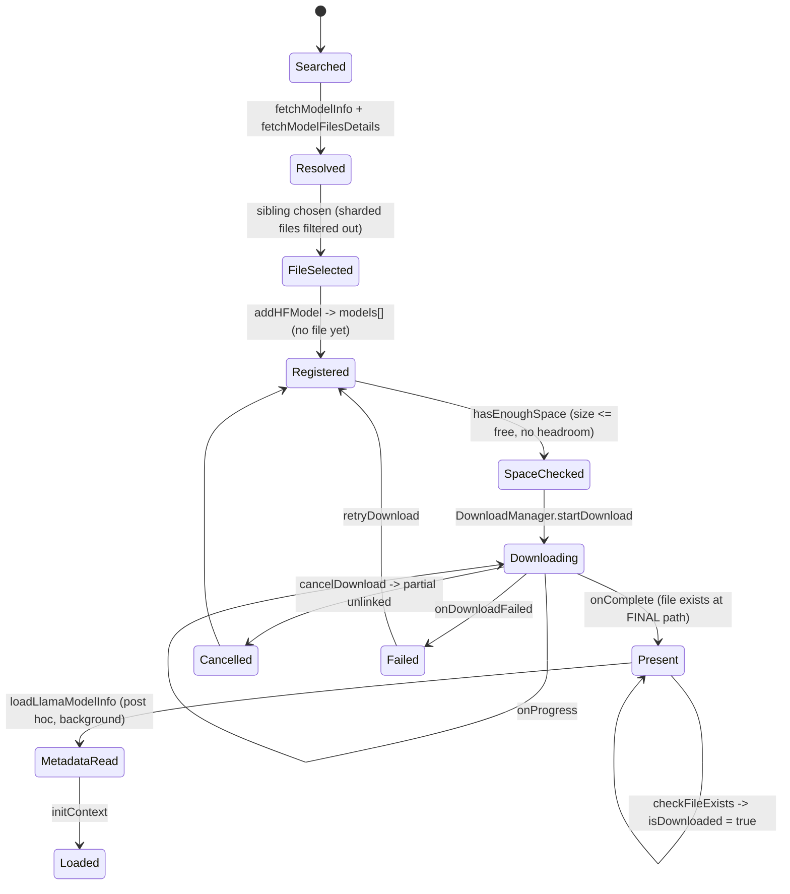
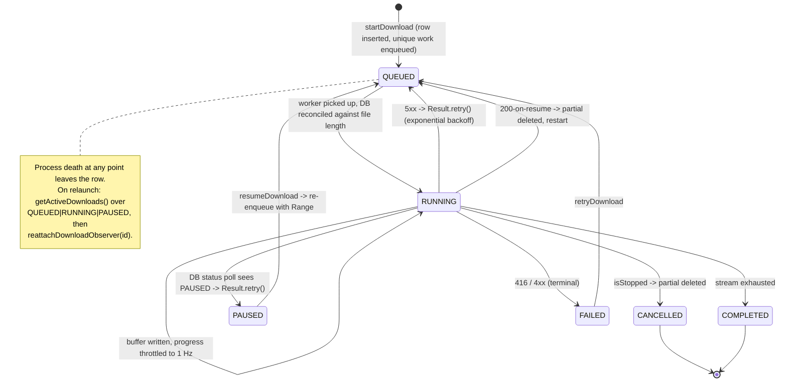
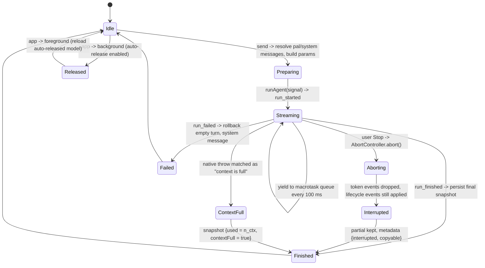

# PocketPal AI — engineering reconnaissance for Skein

**Bead:** `skein-e8ly` (epic `skein-rkrq`) · **Authority:** `docs/research/POCKETPAL_RECON_BRIEF.md` §§1–6, 17, 18, 21, 22, 25, 27–30
**Companion deliverable:** `skein-1m7v` → `docs/design/SKEIN_HUB.md` (brief §§7–16, 19, 20, 23–26). This document supplies that design with evidence; it does not make the design decisions.
**Status:** Research record. Advisory. Nothing here overrides `docs/superpowers/specs/2026-09-19-skein-design.md` §2, `docs/Handoffs/skein-v1-autonomous-completion.md` §3, `docs/design/MODEL_STORE.md`, or the ModelManifest v2 schema.

---

## 0. Provenance

| Field | Value |
| --- | --- |
| Upstream repository | <https://github.com/a-ghorbani/pocketpal-ai> |
| Release tag inspected | `v1.17.3` |
| Exact commit SHA | `fa46438e79229ae15a34f3812318588c27f5041a` |
| Tag commit date | 2026-09-10 18:56:02 +0000 (`chore(release): bump version to 1.17.3`) |
| Default-branch head at clone time (not inspected) | `6cf3944a47a196d2a68b1ba05d2534bd0ec20dd5` (2026-09-17) |
| Inspection date | 2026-09-22 |
| Local clone path | `research/upstream/pocketpal-ai/` — git-ignored (`.gitignore:115` → `research/upstream/`), **never committed**, not a submodule |
| `package.json` version | `1.17.3`; the manifest carries **no** `license` field — the licence is the `LICENSE` file only |
| Source size inspected | 970 TypeScript/TSX files under `src/`, plus the Android native modules under `android/app/src/main/java/com/pocketpalai/` |

### 0.1 Licence

The repository licence file is
[`LICENSE`](https://github.com/a-ghorbani/pocketpal-ai/blob/fa46438e79229ae15a34f3812318588c27f5041a/LICENSE).
Its SPDX identifier is:

```text
MIT
```

The file is the verbatim MIT text. Its first two lines and its attribution clause, quoted exactly:

> MIT License
>
> Copyright (c) 2024 Asghar Ghorbani

> The above copyright notice and this permission notice shall be included in all
> copies or substantial portions of the Software.

**Attribution requirement, stated plainly:** any PocketPal source that Skein adapts into its own tree must carry that copyright notice and the full permission notice. Under `docs/Handoffs/skein-v1-autonomous-completion.md` §3 item 6 `MIT` is on the `foss`-flavour permissive allowlist, so a COPY is licence-compatible with Skein Core *and* with a future Skein Hub — the obstacles to copying are architectural, not legal. **No PocketPal code is copied into the Skein tree in this bead.** The single COPY candidate below is cited by path and licence only.

Third-party licences that ride along with PocketPal's own code are *not* covered by that MIT grant and are called out where they matter (`llama.rn`, `chat-formatter`, `@react-native-firebase/*`, `@supabase/supabase-js`, `@react-native-google-signin/google-signin`) — see §6.

### 0.2 Reproducing this inspection

```bash
git clone https://github.com/a-ghorbani/pocketpal-ai.git research/upstream/pocketpal-ai
git -C research/upstream/pocketpal-ai checkout v1.17.3   # -> fa46438e79229ae15a34f3812318588c27f5041a
git check-ignore -v research/upstream/pocketpal-ai        # must print a .gitignore hit
```

Every citation in this document is a repository path plus a SHA-pinned permalink of the form
`https://github.com/a-ghorbani/pocketpal-ai/blob/fa46438e79229ae15a34f3812318588c27f5041a/<path>#L<n>`.
Line numbers are those of the pinned SHA and will drift on `main`.

---

## 1. Executive summary

PocketPal AI is a React Native / `llama.rn` mobile LLM client with roughly three years of accumulated production bruises around exactly the surface Skein is about to build: acquiring a multi-gigabyte GGUF over a mobile network, deciding whether a device can run it, loading it without an OOM, and streaming from it without the Stop button freezing. **None of its architecture is adoptable.** A large amount of its *behaviour* is.

**What is worth taking.** Five things carry most of the value:

1. **A bounded GGUF header reader** ([`src/utils/ggufHeader.ts`](https://github.com/a-ghorbani/pocketpal-ai/blob/fa46438e79229ae15a34f3812318588c27f5041a/src/utils/ggufHeader.ts)) with explicit, named sanity limits — `MAX_KV_COUNT = 4096`, `MAX_TENSOR_COUNT = 65536`, `MAX_KEY_LENGTH = 4096`, `MAX_ARRAY_COUNT`, `MAX_ARRAY_DEPTH = 4`, a 64 MiB total read budget — and a structural-anomaly-always-throws rule. This is brief §17's checklist ("sane tensor counts; sane metadata lengths") already reduced to constants, and it comes with a twelve-case test suite including truncated-header and non-GGUF-payload fixtures.
2. **A resumable, process-death-surviving Android download worker written in Kotlin under MIT** (`android/app/src/main/java/com/pocketpalai/download/`) — WorkManager + OkHttp + a Room-persisted `DownloadStatus` enum, HTTP `Range` resume, and correct handling of the two failure modes that actually bite: a server that *ignores* the range request (`200` on a resume ⇒ delete and restart) and one that *rejects* it (`416` ⇒ the partial is invalid or upstream changed ⇒ delete and fail). This is the one genuine COPY candidate in the repository and it belongs in Skein **Hub**, never in Core.
3. **A KV-cache memory model and a *learned* memory ceiling.** [`memoryEstimator.ts`](https://github.com/a-ghorbani/pocketpal-ai/blob/fa46438e79229ae15a34f3812318588c27f5041a/src/utils/memoryEstimator.ts) computes weights + KV + compute buffer from GGUF metadata, handles sliding-window attention, and carries a cache-type→bytes-per-element table straight out of llama.cpp. [`useMemoryCheck.ts`](https://github.com/a-ghorbani/pocketpal-ai/blob/fa46438e79229ae15a34f3812318588c27f5041a/src/hooks/useMemoryCheck.ts) then raises the ceiling empirically from the largest load that actually succeeded, falling back to `min(60 % RAM, RAM − 1.2 GB)` on a cold start. Skein has no RAM model at all today.
4. **Two non-obvious llama.cpp operational rules** that would otherwise cost Skein a device wave to discover: on Android, `mmap` ON together with weight repacking roughly **doubles** resident model memory (the mmap'd file and the `CPU_REPACK` buffer coexist), so repackable quantizations (`Q4_0`, `IQ4_NL`) must load with `mmap` OFF; and quantized KV-cache types are unsafe in specific flash-attention × backend combinations. Both are documented with measured overheads in upstream issue [#638](https://github.com/a-ghorbani/pocketpal-ai/issues/638) and implemented in [`memorySettings.ts`](https://github.com/a-ghorbani/pocketpal-ai/blob/fa46438e79229ae15a34f3812318588c27f5041a/src/utils/memorySettings.ts) / [`flashAttnCompatibility.ts`](https://github.com/a-ghorbani/pocketpal-ai/blob/fa46438e79229ae15a34f3812318588c27f5041a/src/utils/flashAttnCompatibility.ts).
5. **A responsive-cancellation discipline for the streaming loop.** [`useChatSession.ts`](https://github.com/a-ghorbani/pocketpal-ai/blob/fa46438e79229ae15a34f3812318588c27f5041a/src/hooks/useChatSession.ts#L648) yields to the macrotask queue every 100 ms *specifically* so a Stop tap is not starved for tens of seconds during a fast stream, coalesces per-token UI writes at ~33 Hz, drops queued token events after an abort while still running lifecycle events, and persists a partially generated turn tagged `{interrupted, copyable}` rather than discarding it.

**What Skein already does better, and must not regress toward.** PocketPal's integrity story is the clearest case. Its "integrity check" ([`src/utils/index.ts:563-638`](https://github.com/a-ghorbani/pocketpal-ai/blob/fa46438e79229ae15a34f3812318588c27f5041a/src/utils/index.ts#L563-L638)) compares *file size within a 0.1 % tolerance*, consults a hash only to rescue a size mismatch, and **returns `isValid: true` when it has nothing to compare against**. A model is marked downloaded on file existence alone ([`ModelStore.checkFileExists`](https://github.com/a-ghorbani/pocketpal-ai/blob/fa46438e79229ae15a34f3812318588c27f5041a/src/store/ModelStore.ts#L1431-L1451)); downloads are written directly to their final path with no `.part` staging; and SHA-256, when computed at all, is computed *after* the fact and never compared to the `lfs.oid` that Hugging Face already publishes. Users have filed this repeatedly — [#163](https://github.com/a-ghorbani/pocketpal-ai/issues/163) (marked downloaded mid-download), [#172](https://github.com/a-ghorbani/pocketpal-ai/issues/172) (corrupted model file), [#627](https://github.com/a-ghorbani/pocketpal-ai/issues/627) (please add checksum validation). Skein's dual-hash load gate (`MODEL_STORE.md` §3), `ManifestBinding`'s uncovered-file refusal, and the `ImmutableModelStore` atomic-promote import are the correct answers to all three, already landed. This reconnaissance therefore **validates** Skein's model-verification design rather than amending it.

**The three highest-leverage findings for the v1 ask path** (`skein-1uw` → `skein-cyq` → `skein-6as`), i.e. the ones that pay off before Hub exists:

- **F-1 · `PP-45` KV-cache memory estimation + learned ceiling.** `skein-cyq` (`ModelManager.import`) has a *disk* free-space check (`size × 1.05`) and no *RAM* check anywhere in the tree; `ContextBudget` bounds tokens, not bytes. Without a RAM model, the first Fold user who raises `n_ctx` past the measured envelope gets a native OOM in the isolated inference process. PocketPal's formula plus its `largestSuccessfulLoad` calibration gives Skein a defensible pre-load gate and an honest "fits / tight / won't fit" badge, and it composes directly with `ThermalGovernor` and the existing `EngineStatus` states.
- **F-2 · `PP-53`/`PP-54` mmap-off-for-repackable-quants and the flash-attention × KV-cache-type matrix.** These are the two settings that turn a working Q4_0-class model into a hard crash or a 2× memory blow-up on Android, and Skein's `InferenceConfig` currently has no rule for either. Landing them as *Automatic* defaults (brief §25) before `skein-7s1`'s on-device validation converts a likely device-lane failure into a one-line constant.
- **F-3 · `PP-63`/`PP-64`/`PP-65` the Stop-responsiveness and interrupted-turn behaviours.** `feature/chat` is still `Placeholder.kt`; the chat loop is being written *now* under `skein-6as`. Landing the 100 ms yield, the post-abort token drop, the ~33 Hz write coalescing and the `{interrupted, copyable}` partial-turn persistence as part of the first implementation costs nothing extra and avoids the exact "Stop does nothing" bug class that PocketPal had to retrofit.

**What must be refused.** React Native, `llama.rn`, MobX, Firebase App Check, Google Sign-In and Supabase are all out by `docs/Handoffs/skein-v1-autonomous-completion.md` §3 items 1–3 and 6. The Qualcomm-specific backend gating (`Adreno` + `i8mm` + `dotprod` ⇒ OpenCL, `HTP*` ⇒ Hexagon) is not merely unwanted but *wrong for Skein's hardware*: the Pixel 9 Pro Fold is Mali-G715 and Skein's measured path is Vulkan. The unsigned device-rules JSON fetched from a public CDN, the plaintext HF token column in `downloads.db`, the fail-open integrity check, and the regex-on-a-native-error-string context-full detection are all refused on security or robustness grounds. Full list in §5.

**Counts.** 76 findings: **COPY 1 · PORT 39 · STUDY 8 · TEST 12 · DEFER 4 · REJECT 12**. Every finding carries exactly one classification and one line on what it eliminates for Skein.

---

## 2. Method and scope

### 2.1 What was read, in what order

Per the brief's instruction that Skein-implication statements be accurate, the Skein tree was read **first**:

| Skein artifact | Why it was read | Bearing on this document |
| --- | --- | --- |
| `docs/design/MODEL_STORE.md` (242 lines) | the immutable store, the two digest gates, the content-trust/origin-trust separation | §7 mapping; the baseline against which PocketPal's integrity story is judged |
| `core/model/src/main/resources/schema/model-manifest.schema.json` (151 lines) | ModelManifest v2: required fields, the plain-file-name rule, the `license` object, `companions[]`, `attestation` | §7.2 field-by-field gap table |
| `core/verify/` (`ModelVerifier`, `PinnedModelFile`, `VerifyBinding`, `ModelVerification`, `ModelFileRole`; 1 064 lines) | what already verifies, cancellably, over a pinned fd | why PocketPal's hashing adds nothing to Core |
| `core/inference/.../models/` (`ImmutableModelStore`, `ModelManifest`, `ManifestBinding`, `WireBindings`; 1 495 lines) | store layout, atomic promote, manifest parse | §7.1 |
| `core/inference/.../ContextBudget.kt`, `.../thermal/` | the only existing runtime-budget logic | establishes that no RAM model exists (F-1) |
| `inference-service/` (`InferenceService.kt` 784 lines, `ChatTemplating.kt`, `LlamaNative.kt` 464 lines, `StopStringMatcher`, `TokenBatcher`, `Utf8Buffer`, `ServiceErrorMapping`) | the isolated engine, its state set, its typed error codes | §§4.8, 4.9, 7.3 |
| `tools/m0-benchmark/` (`run.sh`, `models.yaml`, `lib/`, `tests/`) | the existing measurement harness, its thermal gate and hash pinning | §4.7 — why Skein's benchmark lane is already stricter |
| `docs/Handoffs/skein-fold-m0-hardware-handoff.md` | the measured smoke numbers and their provenance rules | §7.4 |
| `docs/Handoffs/skein-v1-autonomous-completion.md` §3 | the eighteen non-negotiables | §5 REJECT list is derived from these |
| `bd show` on `skein-cyq`, `skein-5oi`, `skein-bxk`, `skein-5hr`, `skein-3v9` | the acceptance criteria this recon must feed, not contradict | §7 and §8 |

PocketPal was then read subsystem by subsystem in the brief's order: acquisition (§6) → GGUF validation (§17) → HF authentication (§18) → chat templates (§21) → download manager (§22) → settings (§25) → benchmarking (§27) → hardware acceleration (§28) → chat loop (§29) → editing (§30), with §§19/20/24 (catalog, device-aware recommendation, import-without-Hub) picked up where PocketPal's code forced them into the same files.

### 2.2 Issue harvesting

Upstream issues were searched with `gh issue list -R a-ghorbani/pocketpal-ai --state all --search <term>` across the terms *download*, *out of memory / OOM / crash load*, *storage / disk / corrupt*, and bodies pulled with `gh issue view`. Sixteen issues are cited by number; the full index is §9.1. Where an issue and the code disagree, the code at `fa46438` wins and the divergence is noted.

### 2.3 Classification rules applied

Per brief §5, one classification per finding, preferring PORT and TEST:

| Class | Meaning here | Bar applied |
| --- | --- | --- |
| **COPY** | adapt the source directly, licence permitting | only where the source is already Kotlin/Android, self-contained, and lands **outside** Core |
| **PORT** | reimplement the behaviour or algorithm natively | the default for anything useful; a formula, a state machine, a constant, a rule |
| **STUDY** | understand, do not adopt | architecture whose shape informs a Skein decision without being imported |
| **TEST** | reproduce the failure case | a test Skein should own, usually because PocketPal's users found the bug first |
| **DEFER** | useful, but after the v1 ask path | correct, not urgent |
| **REJECT** | conflicts with Skein's design | dependency, permission, licence, or a design Skein already does better |

"What it saves Skein" is stated for every finding as elimination of **work**, **uncertainty**, or **risk** — the brief §4 question.

### 2.4 Scope limits — stated, not hidden

- **Nothing was executed.** No `yarn install`, no build, no device run. Every behavioural claim is read from source, a committed test, a committed baseline JSON, or an upstream issue.
- **iOS paths were read only where they explain an Android path** (e.g. the RNFS download path is read because it holds the cancel-vs-failure semantics that the Android path lacks).
- **PalsHub, Talents/tool-calling, TTS, the agent runner, remote/OpenAI-compatible servers, vision capture and the localisation system were surveyed for REJECT purposes only** and not mined for behaviour: they sit outside the brief's named sections, and three of them (PalsHub, remote servers, TTS model downloads) are network features that Skein Core structurally cannot have.
- **Not determined:** see §10.

---

## 3. Classification inventory

76 findings. IDs are stable within this document and are the handles the proposed beads (§8) refer to. Every ID appears exactly once in §3.2 and carries exactly one class.

### 3.1 Summary

| Class | Count | IDs |
| --- | ---: | --- |
| COPY | 1 | PP-26 |
| PORT | 39 | PP-01, PP-02, PP-03, PP-06, PP-07, PP-11, PP-13, PP-18, PP-19, PP-22, PP-23, PP-24, PP-25, PP-27, PP-28, PP-36, PP-38, PP-39, PP-40, PP-41, PP-45, PP-46, PP-49, PP-52, PP-53, PP-58, PP-59, PP-61, PP-63, PP-64, PP-65, PP-66, PP-68, PP-69, PP-70, PP-71, PP-72, PP-73, PP-74 |
| STUDY | 8 | PP-04, PP-05, PP-20, PP-35, PP-37, PP-42, PP-51, PP-62 |
| TEST | 12 | PP-12, PP-14, PP-29, PP-30, PP-31, PP-32, PP-43, PP-48, PP-55, PP-57, PP-60, PP-67 |
| DEFER | 4 | PP-21, PP-47, PP-50, PP-56 |
| REJECT | 12 | PP-08, PP-09, PP-10, PP-15, PP-16, PP-17, PP-33, PP-34, PP-44, PP-54, PP-75, PP-76 |

### 3.2 Full inventory

| ID | Subsystem | Finding | Class | What it eliminates for Skein |
| --- | --- | --- | --- | --- |
| PP-01 | §6 acquisition | HF model search with `Link`-header cursor pagination and a typed `{models, nextLink}` result | PORT | work: the HF search contract for Hub, written once, no guessing at the cursor shape |
| PP-02 | §6 acquisition | Pagination anti-thrash guards: skip a repeat of the same `nextLink`, debounce on <5 results, back off after 3 consecutive small pages | PORT | risk: an infinite-scroll loop that hammers HF and looks like abuse from one device |
| PP-03 | §6 acquisition | GGUF sibling filtering that also **excludes sharded** files (`-00001-of-00003.gguf`) via one regex | PORT | risk: offering a user a shard that can never load standalone |
| PP-04 | §6 acquisition | Strict vs tolerant repo resolution (`resolveHFRepo` throws; `resolveHFModelForDownload(…, fallback)` degrades per-field) | STUDY | uncertainty: shows where partial HF responses must *not* be tolerated |
| PP-05 | §6 acquisition | The whole acquisition path as a *store mutation* sequence rather than a state machine | STUDY | uncertainty: the negative example that justifies Hub's explicit states |
| PP-06 | §6 acquisition | Companion acquisition (mmproj projector, speculative draft) chained off the main download and **non-fatal** on failure | PORT | work: Skein's mmproj companion rule for Gemma 4 E4B, already reasoned through |
| PP-07 | §6 acquisition | `canFitInStorage` computed per candidate file once and shared by every entry path | PORT | risk: two entry paths disagreeing about whether a model fits |
| PP-08 | §6 acquisition | Download URL assembled from a hard-coded `huggingface.co` template | REJECT | risk: hard-coding a single vendor into the model source seam — brief §7 forbids it |
| PP-09 | §6 acquisition | "Add a user-defined download source" and "pluggable model sources" still open upstream ([#874](https://github.com/a-ghorbani/pocketpal-ai/issues/874), [#648](https://github.com/a-ghorbani/pocketpal-ai/issues/648)) | REJECT | risk: confirms retrofitting a source abstraction is expensive — Skein must design `ModelSource` first |
| PP-10 | §17 GGUF | Integrity = file size within 0.1 %, hash only as a rescue, **fails open** when no expectation exists | REJECT | risk: the precise anti-pattern Skein's dual-hash gate exists to refuse |
| PP-11 | §17 GGUF | Bounded GGUF header reader: magic, version 1–3, per-field sanity limits, seek-past-values, throw on any anomaly | PORT | work + risk: brief §17's checklist reduced to five named constants and a total read budget |
| PP-12 | §17 GGUF | Its twelve-case test suite: truncated header, non-GGUF payload, v1/v2 widths, vocab-scale skip, chunk-independence, zero-KV | TEST | work: a ready-made adversarial fixture list for Skein's GGUF pre-checks |
| PP-13 | §17 GGUF | llama.cpp's own metadata reader treated as the authority, with arch-prefixed key lookup and derived head dims | PORT | work: satisfies brief §17's "use llama.cpp's own validation rather than inventing a parser" |
| PP-14 | §17 GGUF | "File exists ⇒ downloaded" with no size or digest gate; upstream [#163](https://github.com/a-ghorbani/pocketpal-ai/issues/163), [#172](https://github.com/a-ghorbani/pocketpal-ai/issues/172), [#627](https://github.com/a-ghorbani/pocketpal-ai/issues/627) | TEST | risk: three user-found bugs Skein can assert against before shipping |
| PP-15 | §17 GGUF | SHA-256 computed *after* acceptance, never compared to HF's published `lfs.oid` | REJECT | risk: hashing that proves nothing; Skein compares against a manifest expectation |
| PP-16 | §17 GGUF | GGUF parsed inside the app process | REJECT | risk: violates spec §2 process isolation — parsing belongs in the isolated service |
| PP-17 | §18 HF auth | HF token persisted in the Room `downloads.db` `authToken` column in cleartext | REJECT | risk: names the exact mistake brief §18 forbids, with the migration that introduced it |
| PP-18 | §18 HF auth | Keychain-backed token with an explicit `useHfToken` opt-out and a `shouldUseToken` gate at every call site | PORT | work: the token lifecycle for Hub, including the "present but disabled" state |
| PP-19 | §18 HF auth | Bearer header host-gated to `https://huggingface.co` as defence in depth, in two independent layers, with tests | PORT | risk: token leakage to a redirected or attacker-supplied host |
| PP-20 | §18 HF auth | 401/403/5xx/timeout → typed `ErrorState {code, service, context, recoverable, severity}` | STUDY | work: the gated-repo error taxonomy Hub's UI needs |
| PP-21 | §18 HF auth | Status code recovered by regex from an error *message* on the non-axios path | DEFER | — (an anti-pattern noted; Skein's typed `ErrorCode` already avoids it) |
| PP-22 | §22 download | Range-resume HTTP semantics: `206` append, `200`-on-resume ⇒ delete and restart, `416` ⇒ partial invalid ⇒ delete and fail, 4xx fatal, 5xx retry | PORT | work + risk: the four HTTP cases that break multi-GB mobile downloads, already enumerated |
| PP-23 | §22 download | Room-persisted `DownloadStatus` (`QUEUED/RUNNING/PAUSED/COMPLETED/FAILED/CANCELLED`) surviving process death, with `getActiveDownloads` + observer re-attach on relaunch | PORT | work: Hub's download state machine and its restart-recovery path |
| PP-24 | §22 download | Worker start reconciles on-disk file length against the persisted byte count before resuming | PORT | risk: a resume that reports the wrong total and never completes |
| PP-25 | §22 download | Cancel is a *distinct outcome*: a cancelled-id marker makes an abort-induced rejection a `DownloadCancelledError`, not a "Download Failed" toast; partial file unlinked | PORT | work: the cancel-vs-failure distinction plus the stale-marker cleanup both platforms need |
| PP-26 | §22 download | The five Kotlin files under `android/.../download/` as the skeleton of Hub's downloader — MIT, cited by path only | COPY | work: a working WorkManager+OkHttp+Room resumable downloader instead of a from-scratch one |
| PP-27 | §22 download | `WorkManager` constraints + exponential backoff + `enqueueUniqueWork` keyed per download | PORT | work: duplicate-download suppression and retry policy, decided |
| PP-28 | §22 download | Pause implemented as a DB status the worker polls each buffer, returning `Result.retry()` | PORT | work: a pause that survives the worker being killed |
| PP-29 | §22 download | Download written straight to its final path — no `.part`, no atomic promote | TEST | risk: the failure Skein's staged `<file>.tmp` + rename already prevents; assert it |
| PP-30 | §22 download | Space check is `size ≤ free` at a single instant, with no headroom | TEST | risk: `skein-cyq`'s `size × 1.05` is the right answer; pin it against this |
| PP-31 | §22 download | The `DownloadManager` test suite (cancel vs failure, later-genuine-failure after a cancel, token host gating on both platforms, sync-with-active) | TEST | work: sixteen named cases worth reproducing in Hub |
| PP-32 | §22 download | Field-reported failures: [#304](https://github.com/a-ghorbani/pocketpal-ai/issues/304) unstable network restarts from 0, [#450](https://github.com/a-ghorbani/pocketpal-ai/issues/450) restart when backgrounded, [#684](https://github.com/a-ghorbani/pocketpal-ai/issues/684) model disappears after app upgrade | TEST | risk: three real-world mobile download failures, pre-discovered |
| PP-33 | §21 templates | Fail-open `return formattedChat \|\| ' '` — a template error yields a single-space prompt | REJECT | risk: silent prompt corruption; Skein fails closed instead |
| PP-34 | §21 templates | Chat template rendered in the app process via a Nunjucks engine (`chat-formatter`) | REJECT | risk: a second template implementation diverging from llama.cpp's |
| PP-35 | §21 templates | Priority chain: explicit model override → GGUF `tokenizer.chat_template` via llama.cpp → bundled family fallback | STUDY | uncertainty: confirms `skein-5oi`'s ordering is the field-proven one |
| PP-36 | §21 templates | Per-family templates kept strictly as *fallbacks*, with the empty-string trick to force the GGUF template | PORT | work: the "minimise hard-coded model knowledge" rule of brief §21, concretely |
| PP-37 | §21 templates | A union stop-token list across model families plus the model's own EOS from GGUF | STUDY | work: a starting stop-string set for `StopStringMatcher` |
| PP-38 | §25 settings | Versioned settings documents with explicit migrations (`completionSettingsVersions`, `contextInitParamsVersions`) | PORT | risk: a persisted setting from an older build silently meaning something else |
| PP-39 | §25 settings | A validation-metadata table: per-parameter `{type, min, max, required, defaultValue}` driving both UI and validation | PORT | work: one source of truth for Skein's Advanced settings |
| PP-40 | §25 settings | Guard against corrupted persisted GGUF metadata (`isValidGGUFMetadata`) before any estimate uses it | PORT | risk: an upgrade-era NaN producing a nonsense memory estimate |
| PP-41 | §25 settings | `mmap` OFF for repackable quantizations (`Q4_0`, `IQ4_NL`) on Android; "smart" collapsed to always-off | PORT | risk: ~100 % model-memory overhead vs ~5 %, per [#638](https://github.com/a-ghorbani/pocketpal-ai/issues/638) |
| PP-42 | §25 settings | Flash-attention × KV-cache-type × backend compatibility matrix | STUDY | risk: the crash class behind [#481](https://github.com/a-ghorbani/pocketpal-ai/issues/481) |
| PP-43 | §25 settings | Every llama.cpp knob exposed without an Automatic/Advanced split | TEST | risk: brief §25's mandate, with a worked example of what not to do |
| PP-44 | §25 settings | Legacy-quantization warning list (`Q4_0_4_8`, `Q4_0_4_4`, `Q4_0_8_8`) | REJECT | — (llama.cpp has since removed these; carrying the list is dead weight) |
| PP-45 | §25/§26 | KV-cache + compute-buffer memory estimator with SWA handling and a cache-type byte table | PORT | **F-1** work + risk: the RAM model Skein does not have |
| PP-46 | §25/§26 | Learned ceiling `largestSuccessfulLoad`, cold-start `min(60 % RAM, RAM − 1.2 GB)`, three-state fit verdict | PORT | **F-1** uncertainty: an empirical, self-correcting load gate |
| PP-47 | §25/§26 | Memory-estimator parity with an out-of-repo Python reference | DEFER | — (useful once Skein has its own estimator to cross-check) |
| PP-48 | §27 bench | 16 KB ELF page-size alignment on Android 15/16 SoCs ([#512](https://github.com/a-ghorbani/pocketpal-ai/issues/512)) | TEST | risk: a `SIGBUS` on load that looks exactly like an OOM |
| PP-49 | §27 bench | Exclusive benchmark mode: a context-operation mutex, last-one-wins `pendingModelId`, every other loader rejected | PORT | work: the warm-swap discipline `skein-2va` needs anyway |
| PP-50 | §27 bench | Per-turn TTFT / tokens-predicted / draft-acceptance metrics persisted with the message | DEFER | — (valuable for `MEASUREMENTS.md` once the chat loop exists) |
| PP-51 | §27 bench | In-app bench delegating to llama.cpp's own `bench(pp, tg, pl, nr)`; no thermal gate; std deviation discarded | STUDY | uncertainty: confirms Skein's `tools/m0-benchmark` is already the stricter harness |
| PP-52 | §27 bench | E2E benchmark matrix + memory-profile specs with **committed per-device baselines** and labelled PSS checkpoints | PORT | work: the artifact shape for `MEASUREMENTS.md` provenance |
| PP-53 | §27 bench | Load-stress spec: N load/unload cycles per model with error detection between cycles | PORT | risk: leak and re-load failures that a single load never shows |
| PP-54 | §27 bench | Benchmark submission to a server behind Firebase App Check, gated on an official store build | REJECT | risk: telemetry + GMS, forbidden by §3 items 2–3 |
| PP-55 | §27 bench | Benchmarking with GPU offload can crash ([#198](https://github.com/a-ghorbani/pocketpal-ai/issues/198)) | TEST | risk: a known crash mode for Skein's own CPU-vs-Vulkan matrix |
| PP-56 | §28 hardware | Chipset / GPU / CPU-feature probe surfaced as structured device info | DEFER | — (Skein's `DeviceProfile` needs this later, not for v1) |
| PP-57 | §28 hardware | Device × quantization crash registry maintained as a living issue ([#107](https://github.com/a-ghorbani/pocketpal-ai/issues/107)) | TEST | uncertainty: evidence that per-device quant incompatibility is real and needs recording |
| PP-58 | §28 hardware | Capability detection returning a typed **reason** for unsupported, not just a boolean | PORT | work: the backend-fallback contract, with diagnosable refusals |
| PP-59 | §28 hardware | Thread heuristic: `cores ≤ 4 ⇒ all`, else `floor(0.8 × cores)` | PORT | work: a defensible default for `InferenceConfig.threads` pending M0 numbers |
| PP-60 | §28 hardware | Multimodal gate: RAM ≥ 5.5 GB **and** ≥ 6 cores, conservative-false on error | TEST | risk: a vision-capable model offered on a device that cannot run it |
| PP-61 | §29 chat loop | Macrotask yield every 100 ms so Stop is not starved during a fast stream | PORT | **F-3** risk: the "Stop does nothing for 30 s" bug class |
| PP-62 | §29 chat loop | Post-abort token events dropped while lifecycle events still run | STUDY | uncertainty: the correct abort semantics for a producer faster than its consumer |
| PP-63 | §29 chat loop | Per-token UI writes coalesced at ~33 Hz | PORT | **F-3** work: the streaming write rate, decided |
| PP-64 | §29 chat loop | Interrupted turn persisted with its partial content and `{interrupted, copyable}`; an empty turn row deleted instead | PORT | **F-3** work: the interrupted-generation contract for `feature/chat` |
| PP-65 | §29 chat loop | Auto-release on background / reload on foreground, distinguishing `inactive→background` from `active→background` | PORT | work: the Android lifecycle rule for unloading a multi-GB model |
| PP-66 | §29 chat loop | Context exhaustion recorded as a typed snapshot `{used, contextFull, isRemote}` that survives into the session | PORT | work: the context-full UX contract, tied to Skein's existing `CONTEXT_FULL` |
| PP-67 | §29 chat loop | …but *detected* by regex over a native error string, with a comment admitting the coupling | TEST | risk: Skein's typed `ErrorCode.CONTEXT_FULL` must be asserted, never string-matched |
| PP-68 | §30 editing | Edit state machine: `enterEditMode` → populate composer → `commitEdit` → truncate inclusive → resend | PORT | work: the inline-edit contract for the chat surface |
| PP-69 | §30 editing | Editing an assistant turn is refused, in exactly one place | PORT | work: the invariant stated once instead of per call site |
| PP-70 | §30 editing | Regenerate = walk back to the nearest user message, truncate, resubmit; "try again with ⟨model⟩" switches model first | PORT | work: regeneration semantics including cross-model retry |
| PP-71 | §30 editing | Truncation invalidates derived state (context-full snapshot, dismissed banners, failure counter) | PORT | risk: stale derived UI state after the context shrinks |
| PP-72 | §24 import | SAF pick → copy into app-private storage → collision dialog (replace / keep both / cancel) → register | PORT | work: the networkless import flow's UX, decided |
| PP-73 | §24 import | Local-model path re-anchoring when the app container path changes across upgrades | PORT | risk: [#684](https://github.com/a-ghorbani/pocketpal-ai/issues/684) — models vanishing after an update |
| PP-74 | §19/§20 catalog | Versioned device-rules document: classifier (SoC→class, RAM bands, CPU-feature heuristic) × tier matrix × per-tier candidates, with a bundled floor and a totality invariant | PORT | work: the entire shape of "Recommended for this device" |
| PP-75 | §19/§20 catalog | Those rules fetched **unsigned** at runtime from a public CDN (`cdn.jsdelivr.net/gh/…@main`) with a 10 s timeout | REJECT | risk: an untrusted third party choosing which model a user is steered to |
| PP-76 | architecture | React Native 0.82 + `llama.rn` + MobX + WatermelonDB; Firebase App Check, Google Sign-In, Supabase; single-process model loading | REJECT | risk: every one of these collides with a §3 non-negotiable — see §5 |

---

## 4. Subsystem findings

Each subsection states what PocketPal does, where, what fails, and what Skein takes. Permalinks are SHA-pinned to `fa46438e79229ae15a34f3812318588c27f5041a`.

### 4.1 Model acquisition — the Hugging Face path (brief §6)

#### 4.1.1 What PocketPal does

| Step | Implementation | Path |
| --- | --- | --- |
| Search | `fetchModels({search, author, filter, sort, direction, limit, full, config, nextPageUrl, authToken})`, `filter` defaulting to `gguf,conversational`, `limit: 10` | [`src/api/hf.ts#L28-L90`](https://github.com/a-ghorbani/pocketpal-ai/blob/fa46438e79229ae15a34f3812318588c27f5041a/src/api/hf.ts#L28-L90) |
| Pagination | the HTTP `Link` header is parsed with `/<([^>]*)>/` and returned as `nextLink`; the client never constructs a cursor itself | [`src/api/hf.ts#L72-L85`](https://github.com/a-ghorbani/pocketpal-ai/blob/fa46438e79229ae15a34f3812318588c27f5041a/src/api/hf.ts#L72-L85) |
| File discovery | `GET /api/models/{id}/tree/main?recursive=true` → `ModelFileDetails[]` with `path`, `size`, `oid`, `lfs` | [`src/api/hf.ts#L98-L122`](https://github.com/a-ghorbani/pocketpal-ai/blob/fa46438e79229ae15a34f3812318588c27f5041a/src/api/hf.ts#L98-L122) |
| GGUF specs | `GET /api/models/{id}?expand[]=gguf` → `bos_token`, `eos_token`, `chat_template`, `architecture`, `total` | [`src/api/hf.ts#L130-L154`](https://github.com/a-ghorbani/pocketpal-ai/blob/fa46438e79229ae15a34f3812318588c27f5041a/src/api/hf.ts#L130-L154) |
| Filtering | `.gguf` only, **sharded files excluded** by `/^(?<prefix>.*?)-(?<shard>\d{5})-of-(?<total>\d{5})\.gguf$/` | [`src/utils/hf.ts#L9-L25`](https://github.com/a-ghorbani/pocketpal-ai/blob/fa46438e79229ae15a34f3812318588c27f5041a/src/utils/hf.ts#L9-L25) |
| URL assembly | every sibling gains `url = urls.modelDownloadFile(modelId, rfilename)` — a hard-coded `huggingface.co/…/resolve/…` template | [`src/utils/hf.ts#L33-L41`](https://github.com/a-ghorbani/pocketpal-ai/blob/fa46438e79229ae15a34f3812318588c27f5041a/src/utils/hf.ts#L33-L41) |
| Storage gate | `enrichSiblingsWithStorage` decorates each candidate with `canFitInStorage`, computed identically for the search path and the deep-link path | [`src/utils/index.ts#L513-L528`](https://github.com/a-ghorbani/pocketpal-ai/blob/fa46438e79229ae15a34f3812318588c27f5041a/src/utils/index.ts#L513-L528) |
| Resolution | `resolveHFRepo` (strict: any fetch failure throws) vs `resolveHFModelForDownload(…, fallback)` (tolerant: per-fetch `.catch`, unmatched filename tolerated) | [`src/utils/hfResolve.ts#L41-L165`](https://github.com/a-ghorbani/pocketpal-ai/blob/fa46438e79229ae15a34f3812318588c27f5041a/src/utils/hfResolve.ts#L41-L165) |
| Registration | `addHFModel(hfModel, modelFile)` → `hfAsModel(…)` pushed into an observable array; multimodal repos also enumerate `mmproj` siblings | [`src/store/ModelStore.ts#L2785`](https://github.com/a-ghorbani/pocketpal-ai/blob/fa46438e79229ae15a34f3812318588c27f5041a/src/store/ModelStore.ts#L2785) |
| Download kick-off | `downloadHFModel` → 200 ms `setTimeout` to let the mmproj entry settle → `checkSpaceAndDownload(newModel.id)` | [`src/store/ModelStore.ts#L2716-L2775`](https://github.com/a-ghorbani/pocketpal-ai/blob/fa46438e79229ae15a34f3812318588c27f5041a/src/store/ModelStore.ts#L2716-L2775) |
| Companions | projector and speculative-draft downloads chained afterwards, each `try/catch`-ed and explicitly **non-fatal** | [`src/store/ModelStore.ts#L1505-L1586`](https://github.com/a-ghorbani/pocketpal-ai/blob/fa46438e79229ae15a34f3812318588c27f5041a/src/store/ModelStore.ts#L1505-L1586) |

Pagination is guarded three ways ([`src/store/HFStore.ts#L252-L271`](https://github.com/a-ghorbani/pocketpal-ai/blob/fa46438e79229ae15a34f3812318588c27f5041a/src/store/HFStore.ts#L252-L271), [`#L340-L395`](https://github.com/a-ghorbani/pocketpal-ai/blob/fa46438e79229ae15a34f3812318588c27f5041a/src/store/HFStore.ts#L340-L395)): the same `nextPageLink` is never fetched twice in a row; fewer than 5 accumulated models plus an attempt inside 2 s is suppressed; three consecutive pages of fewer than 3 results extends the debounce to 5 s. A fresh search resets all three.

#### 4.1.2 The extracted state machine (brief §6 asks for this explicitly)

PocketPal has **no** acquisition state machine. What exists is a sequence of mutations on a single observable `Model` object, with `isDownloaded: boolean`, `progress: number` and a parallel `DownloadManager` job map as the only state. The states below are the ones the code *implies*; naming them is the deliverable, because the gaps are what Skein must not inherit.



Four transitions that Skein's Hub state machine must add, each traceable to a missing PocketPal edge:

1. **`Downloading → Hashing → Verified`** does not exist. `Present` is entered on file existence; there is no digest or length gate between the last byte and "usable". (PP-14, PP-15)
2. **`Present` is not distinguished from `Complete`.** A partial file left by a process death at the final path re-enters `Present` on the next `refreshDownloadStatuses()`. (PP-29)
3. **`Registered` precedes any artifact existing.** A model is in the user-visible list before a byte is downloaded, and `removeModelFromList` only removes it *if not downloaded* — so a half-state is visible. (PP-05)
4. **`Inspecting` has no gate role.** GGUF metadata is read in the background *after* the model is already registered and loadable ([`ModelStore.ts#L1936-L1940`](https://github.com/a-ghorbani/pocketpal-ai/blob/fa46438e79229ae15a34f3812318588c27f5041a/src/store/ModelStore.ts#L1936-L1940)); a failure to read it merely logs a warning. Brief §15 requires the opposite: inspection is a precondition of acceptance.

#### 4.1.3 What Skein takes

`PP-01`, `PP-02`, `PP-03`, `PP-06`, `PP-07` are PORT into Hub's `HuggingFaceSource`. `PP-04` and `PP-05` are STUDY: the strict/tolerant split is a real design question (when may Hub proceed on a partial HF response?), and the missing state machine is the negative example that justifies writing one. `PP-08` is REJECT — Skein's `ModelSource` seam (brief §7) must not bake `huggingface.co` into URL construction the way `urls.modelDownloadFile` does; the upstream project's own open issues [#874](https://github.com/a-ghorbani/pocketpal-ai/issues/874) ("Add a user-defined download source") and [#648](https://github.com/a-ghorbani/pocketpal-ai/issues/648) ("Pluggable model sources — unified search across HF, OCI, and remote registries") are `PP-09`: direct evidence of what retrofitting that seam costs.

### 4.2 GGUF validation and metadata (brief §17, §21)

#### 4.2.1 The bounded header reader — the single most valuable artifact in the repository

[`src/utils/ggufHeader.ts`](https://github.com/a-ghorbani/pocketpal-ai/blob/fa46438e79229ae15a34f3812318588c27f5041a/src/utils/ggufHeader.ts) (345 lines) exists for a narrow purpose — probing a *remote* GGUF for MTP draft layers over HTTP range requests — but its structure is exactly what brief §17 asks for. Its own header comment states the design rule:

> Any structural anomaly throws — the probe maps that to `unknown`, never to a false negative.

The limits, all named constants at [`#L22-L31`](https://github.com/a-ghorbani/pocketpal-ai/blob/fa46438e79229ae15a34f3812318588c27f5041a/src/utils/ggufHeader.ts#L22-L31):

| Constant | Value | Guards against |
| --- | ---: | --- |
| `GGUF_MAGIC` | `0x46554747` (`"GGUF"` LE) | not a GGUF file at all |
| `MAX_KV_COUNT` | 4 096 | a metadata-count field that would drive an unbounded loop |
| `MAX_TENSOR_COUNT` | 65 536 | the same for the tensor directory |
| `MAX_KEY_LENGTH` | 4 096 | an absurd key/tensor-name length allocating unbounded memory |
| `MAX_ARRAY_COUNT` | 33 554 432 | an array length field larger than any real vocab |
| `MAX_ARRAY_DEPTH` | 4 | nested-array recursion |
| `HTTP_TOTAL_MAX` | 64 MiB | a header that never ends |

Version handling is explicit: `version < 1 || version > 3` throws, and v1 uses 32-bit counts/lengths while v2/v3 use 64-bit ([`#L207-L215`](https://github.com/a-ghorbani/pocketpal-ai/blob/fa46438e79229ae15a34f3812318588c27f5041a/src/utils/ggufHeader.ts#L207-L215)). A 64-bit length above `Number.MAX_SAFE_INTEGER` throws rather than silently truncating ([`#L123-L130`](https://github.com/a-ghorbani/pocketpal-ai/blob/fa46438e79229ae15a34f3812318588c27f5041a/src/utils/ggufHeader.ts#L123-L130)). Tensor rank above 8 throws ([`#L334-L337`](https://github.com/a-ghorbani/pocketpal-ai/blob/fa46438e79229ae15a34f3812318588c27f5041a/src/utils/ggufHeader.ts#L334-L337)). The seek-past-values technique — walking a ~10⁵-entry tokenizer vocab with integer reads and no string materialisation ([`#L262-L296`](https://github.com/a-ghorbani/pocketpal-ai/blob/fa46438e79229ae15a34f3812318588c27f5041a/src/utils/ggufHeader.ts#L262-L296)) — matters for Skein too: a Core-side structural pre-check must not allocate a vocab's worth of strings before deciding whether to hand the file to the isolated service.

**`PP-11` (PORT).** These seven constants and the version/rank/length rules are the concrete form of brief §17's "sane tensor counts; sane metadata lengths; valid magic; supported version". Skein should implement them in Kotlin as a *pre-mmap structural pre-check* in the app process (bounded read over the already-pinned descriptor, no mapping, no vocab materialisation), with full parsing still done by llama.cpp **inside** `:inference-service` per spec §2 — which is `PP-16`'s refusal of PocketPal's in-process parse.

**`PP-12` (TEST).** [`src/utils/__tests__/ggufHeader.test.ts`](https://github.com/a-ghorbani/pocketpal-ai/blob/fa46438e79229ae15a34f3812318588c27f5041a/src/utils/__tests__/ggufHeader.test.ts) is a ready-made adversarial fixture list, generated by a synthesiser at [`src/utils/__tests__/ggufFixture.ts`](https://github.com/a-ghorbani/pocketpal-ai/blob/fa46438e79229ae15a34f3812318588c27f5041a/src/utils/__tests__/ggufFixture.ts). The twelve cases worth reproducing:

| Case | Asserts |
| --- | --- |
| positive KV present | the happy path |
| KV absent, tensor-name fallback | converters that write layers without the KV |
| plain model | neither signal, no false positive |
| KV declared *after* a tokenizer-scale vocab | the skip path is exercised at realistic scale |
| KV in any integer width | u8/i8/u16/i16/u32/i32/u64/i64 all decode |
| explicit zero KV | zero is "no capability", and the tensor scan still runs |
| v1 and v2 headers | the 32-bit/64-bit length split |
| tiny chunk size | result is chunking-independent |
| non-GGUF payload | rejected on magic |
| truncated header | rejected, **not misread** |
| no `TextDecoder` global | no hidden runtime dependency |

The truncated-header and non-GGUF cases map directly onto Skein's `ModelVerification` refusal vocabulary and onto `skein-cyq`'s "import without manifest" path, where capabilities are to be derived from `general.architecture` and `clip.*`.

#### 4.2.2 Metadata extraction — llama.cpp as the authority

`fetchAndPersistGGUFMetadata` ([`src/store/ModelStore.ts#L1820-L1934`](https://github.com/a-ghorbani/pocketpal-ai/blob/fa46438e79229ae15a34f3812318588c27f5041a/src/store/ModelStore.ts#L1820-L1934)) calls llama.cpp's own `loadLlamaModelInfo(path)` and then reads **architecture-prefixed** keys:

```text
architecture   := general.architecture            (default 'llama')
n_layers       := <arch>.block_count              (required)
n_embd         := <arch>.embedding_length         (required)
n_head         := <arch>.attention.head_count     (required)
n_head_kv      := <arch>.attention.head_count_kv  -> falls back to n_head
n_vocab        := <arch>.vocab_size -> ARCH_DEFAULT_VOCAB[arch] -> 128000
n_embd_head_k  := <arch>.attention.key_length     -> floor(n_embd / n_head)
n_embd_head_v  := <arch>.attention.value_length   -> floor(n_embd / n_head)
sliding_window := <arch>.attention.sliding_window (optional; SWA models)
context_length := <arch>.context_length
```

If any of the three required fields is missing the function **returns without persisting** rather than persisting a partial record. String-valued numerics are coerced defensively (GGUF readers sometimes hand back strings). The only hard-coded model knowledge is a ten-entry `ARCH_DEFAULT_VOCAB` fallback table used solely when `vocab_size` is absent — which is exactly the posture brief §21 asks for: authoritative metadata first, a minimal compatibility fallback second, no `Qwen → template A` mapping.

**`PP-13` (PORT).** This is the extraction contract for Skein's `ModelManifest` derivation in `skein-cyq` (import without a manifest) and for the memory model in §4.6. It satisfies brief §17's "use llama.cpp's own validation capabilities wherever appropriate rather than inventing an independent incomplete parser" while §4.2.1's bounded reader covers the pre-check that must happen *before* llama.cpp sees the file.

#### 4.2.3 Where PocketPal's integrity story fails — and why it validates Skein's

`checkModelFileIntegrity` ([`src/utils/index.ts#L563-L638`](https://github.com/a-ghorbani/pocketpal-ai/blob/fa46438e79229ae15a34f3812318588c27f5041a/src/utils/index.ts#L563-L638)) is documented in its own header as:

> Checks if a model's file integrity is valid by comparing file size. Hash doesn't seem to be reliable, and expensive.

The logic:

1. If HF `lfs.size` is unknown, fetch it; if it is still unknown, **`return {isValid: true}`** — fail open.
2. Compute `|actual − expected| / expected`. If ≤ 0.001, `isValid: true`.
3. Only if the size differs by more than 0.1 % does it consult a hash — and it calls `updateModelHash(model.id, false)` **without awaiting it**, then compares the *stale* `model.hash` field against `lfs.oid`. On a first check `model.hash` is `undefined`, so the comparison cannot succeed.

`getSHA256Hash` ([`#L552-L561`](https://github.com/a-ghorbani/pocketpal-ai/blob/fa46438e79229ae15a34f3812318588c27f5041a/src/utils/index.ts#L552-L561)) carries a comment pointing at an upstream RNFS hashing bug as the reason hashing is distrusted. `updateModelHash` ([`src/store/ModelStore.ts#L3893-L3910`](https://github.com/a-ghorbani/pocketpal-ai/blob/fa46438e79229ae15a34f3812318588c27f5041a/src/store/ModelStore.ts#L3893-L3910)) only ever *records* a hash; nothing compares it at load time. Meanwhile HF publishes a git-LFS `oid` that **is** the file's SHA-256 and PocketPal fetches it "for integrity checks" ([`#L3864-L3891`](https://github.com/a-ghorbani/pocketpal-ai/blob/fa46438e79229ae15a34f3812318588c27f5041a/src/store/ModelStore.ts#L3864-L3891)) — the expectation exists and is simply not enforced.

Users found all of this:

| Issue | State | What it reports |
| --- | --- | --- |
| [#163](https://github.com/a-ghorbani/pocketpal-ai/issues/163) | closed | "Model incorrectly marked as downloaded during active download" — quotes `checkFileExists` verbatim and names the race |
| [#172](https://github.com/a-ghorbani/pocketpal-ai/issues/172) | closed | "Model file corrupted" |
| [#627](https://github.com/a-ghorbani/pocketpal-ai/issues/627) | open | "add checksum validation to ensure model integrity" — explicitly asks for comparison against the HF hash rather than a local database, "because a local database can be compromised", and asks for the same on the local-import path |

**`PP-10`, `PP-15` (REJECT); `PP-14` (TEST).** Skein already does the right thing on all three counts — `ModelVerifier`'s streamed SHA-256 over the open channel before any mapping, BLAKE3-256 over the `MappedByteBuffer` after it, `HashMismatch` vs `Tampered` as *different* outcomes, and `ManifestBinding` refusing a directory that holds an uncovered file (`MODEL_STORE.md` §§1, 3). The recon's contribution is not a change but three assertions worth owning (§8, bead **B-7**): a truncated artifact must not be acceptable; an artifact whose length matches but whose digest does not must be refused; and an import with *no* expectation must not silently succeed as "valid".

### 4.3 Hugging Face authentication and gated models (brief §18)

#### 4.3.1 What PocketPal does

The token lives in the platform keystore. `HFStore` ([`src/store/HFStore.ts#L15`](https://github.com/a-ghorbani/pocketpal-ai/blob/fa46438e79229ae15a34f3812318588c27f5041a/src/store/HFStore.ts#L15), [`#L59-L119`](https://github.com/a-ghorbani/pocketpal-ai/blob/fa46438e79229ae15a34f3812318588c27f5041a/src/store/HFStore.ts#L59-L119)) stores it under a dedicated service name via `react-native-keychain` (Android Keystore / iOS Keychain), loads it on construction, and exposes:

- `isTokenPresent` — a token exists and is non-blank;
- `useHfToken` — a **persisted user preference**, the only field `makePersistable` writes to ordinary storage ([`#L48-L53`](https://github.com/a-ghorbani/pocketpal-ai/blob/fa46438e79229ae15a34f3812318588c27f5041a/src/store/HFStore.ts#L48-L53)) — the token itself is never in `AsyncStorage`;
- `shouldUseToken = isTokenPresent && useHfToken`, consulted at **every** call site ([`#L166`, `#L208`, `#L305`, `#L370`](https://github.com/a-ghorbani/pocketpal-ai/blob/fa46438e79229ae15a34f3812318588c27f5041a/src/store/HFStore.ts#L166)).

The Bearer header is host-gated twice, independently:

```ts
// src/services/downloads/DownloadManager.ts:34-47
// The HF auth token must never leave huggingface.co. Download URLs are pinned to
// HF at parse time, but this is a defense-in-depth gate so a token can never be
// attached for any other host even if a non-HF URL ever reaches here.
const isHuggingFaceUrl = (url: string | undefined): boolean => {
  if (!url) return false;
  try {
    const parsed = new URL(url);
    return parsed.protocol === 'https:' && parsed.host === 'huggingface.co';
  } catch { return false; }
};
```

([`src/services/downloads/DownloadManager.ts#L34-L47`](https://github.com/a-ghorbani/pocketpal-ai/blob/fa46438e79229ae15a34f3812318588c27f5041a/src/services/downloads/DownloadManager.ts#L34-L47), applied at [`#L266-L269`](https://github.com/a-ghorbani/pocketpal-ai/blob/fa46438e79229ae15a34f3812318588c27f5041a/src/services/downloads/DownloadManager.ts#L266-L269); the second copy guards the device-rules parser at [`src/services/deviceRules/parse.ts#L24-L38`](https://github.com/a-ghorbani/pocketpal-ai/blob/fa46438e79229ae15a34f3812318588c27f5041a/src/services/deviceRules/parse.ts#L24-L38).) Both the exact-host rule and the https-only rule are asserted by four tests in [`DownloadManager.test.ts`](https://github.com/a-ghorbani/pocketpal-ai/blob/fa46438e79229ae15a34f3812318588c27f5041a/src/services/downloads/__tests__/DownloadManager.test.ts#L486-L600) covering both platforms.

Gated/auth errors are mapped to a typed state ([`src/utils/errors.ts#L43-L122`](https://github.com/a-ghorbani/pocketpal-ai/blob/fa46438e79229ae15a34f3812318588c27f5041a/src/utils/errors.ts#L43-L122)):

| Signal | `ErrorState.code` | Note |
| --- | --- | --- |
| HTTP 401 | `authentication` | message differs for `context: 'search'` vs everything else |
| HTTP 403 | `authorization` | the gated-repo case: token valid, access not granted |
| HTTP ≥ 500 | `server` | |
| `ECONNABORTED` / `ETIMEDOUT` | `network` | timeout |
| `ERR_NETWORK` | `network` | |
| message containing `storage`/`space` | `storage` | |

The service is inferred from the request URL when not passed explicitly, so a Hugging Face failure is always labelled as one.

#### 4.3.2 The hole

`DownloadEntity` ([`android/app/src/main/java/com/pocketpalai/download/DownloadEntity.kt#L19`](https://github.com/a-ghorbani/pocketpal-ai/blob/fa46438e79229ae15a34f3812318588c27f5041a/android/app/src/main/java/com/pocketpalai/download/DownloadEntity.kt#L19)) carries:

```kotlin
val authToken: String? = null
```

in a Room table named `downloads` in an **unencrypted** `downloads.db`, added deliberately by `MIGRATION_1_2` ([`DownloadDatabase.kt#L21-L23`](https://github.com/a-ghorbani/pocketpal-ai/blob/fa46438e79229ae15a34f3812318588c27f5041a/android/app/src/main/java/com/pocketpalai/download/DownloadDatabase.kt#L21-L23)). The worker reads it back and attaches it as a Bearer header ([`DownloadWorker.kt#L88-L92`](https://github.com/a-ghorbani/pocketpal-ai/blob/fa46438e79229ae15a34f3812318588c27f5041a/android/app/src/main/java/com/pocketpalai/download/DownloadWorker.kt#L88-L92)). So the keystore discipline at the top of the stack is undone at the bottom: the token is written to a plain SQLite file for the lifetime of the download row, which is never deleted on completion in the paths read here.

**`PP-17` (REJECT).** Brief §18 says HF credentials must not enter "the vault, ordinary plaintext preferences, logs, diagnostics, exports, model manifests, URLs, or the clipboard". A plaintext download-queue database is the same category and is the specific mistake to design out: Hub's persisted download row must carry a *reference* (a keystore alias) or nothing, and the header must be attached at request-construction time from the keystore, never from the row.

**`PP-18`, `PP-19` (PORT).** The three-state token model (absent / present-but-disabled / present-and-enabled) and the two-layer host gate are both directly portable to Hub, and `PP-19` matters more in Skein's topology than in PocketPal's: Hub is the only process with `INTERNET`, so a token leaking to a non-HF host is the one network-side confidentiality failure Hub can actually have.

**`PP-20` (STUDY).** The `ErrorState` taxonomy is the right *shape* for Hub's user-facing errors, but Skein should carry it as a sealed Kotlin hierarchy with the status code preserved rather than as a string `code`. **`PP-21` (DEFER)** notes the anti-pattern in the same file: on the non-axios path the status is recovered by `/(?:Client error:|status:?)\s*(\d{3})/i` over an error *message* ([`errors.ts#L129-L159`](https://github.com/a-ghorbani/pocketpal-ai/blob/fa46438e79229ae15a34f3812318588c27f5041a/src/utils/errors.ts#L129-L159)) — a type-loss that Skein's `ErrorCode` already prevents.

### 4.4 Download manager (brief §22) — the richest vein

Brief §22 says "mine this aggressively". It is the right instruction: this subsystem is the only place in PocketPal where the code is already Kotlin, already Android-native, already persistent across process death, and already MIT-licensed.

#### 4.4.1 The Android implementation

Five files, 950 lines total, under [`android/app/src/main/java/com/pocketpalai/download/`](https://github.com/a-ghorbani/pocketpal-ai/tree/fa46438e79229ae15a34f3812318588c27f5041a/android/app/src/main/java/com/pocketpalai/download):

| File | Lines | Role |
| --- | ---: | --- |
| `DownloadModule.kt` | 518 | the RN bridge: `startDownload`, `pauseDownload`, `resumeDownload`, `retryDownload`, `cancelDownload`, `getActiveDownloads`, `reattachDownloadObserver`, plus `WorkInfo` observers that emit progress/complete/failed/cancelled events |
| `DownloadWorker.kt` | 303 | a `CoroutineWorker` doing the actual OkHttp transfer, with `Range` resume, status-code policy, and pause/cancel polling |
| `DownloadEntity.kt` | 27 | the Room row: `id, url, destination, totalBytes, downloadedBytes, status, priority, networkType, createdAt, error, authToken` |
| `DownloadDao.kt` | 27 | `getAllDownloads(): Flow<…>`, `getDownload`, `insert`, `update`, `delete`, `updateProgress`, `updateStatus` |
| `DownloadDatabase.kt` | 42 | `downloads.db`, schema v2, `MIGRATION_1_2` |

The persisted status enum ([`DownloadEntity.kt#L22-L24`](https://github.com/a-ghorbani/pocketpal-ai/blob/fa46438e79229ae15a34f3812318588c27f5041a/android/app/src/main/java/com/pocketpalai/download/DownloadEntity.kt#L22-L24)):

```kotlin
enum class DownloadStatus { QUEUED, RUNNING, PAUSED, COMPLETED, FAILED, CANCELLED }
enum class NetworkType   { ANY, WIFI }
```

Work is enqueued as `enqueueUniqueWork("download_$downloadId", …)` with a `NetworkType.CONNECTED` constraint and `BackoffPolicy.EXPONENTIAL` from `WorkRequest.MIN_BACKOFF_MILLIS` ([`DownloadWorker.kt#L273-L291`](https://github.com/a-ghorbani/pocketpal-ai/blob/fa46438e79229ae15a34f3812318588c27f5041a/android/app/src/main/java/com/pocketpalai/download/DownloadWorker.kt#L273-L291), [`DownloadModule.kt#L115`](https://github.com/a-ghorbani/pocketpal-ai/blob/fa46438e79229ae15a34f3812318588c27f5041a/android/app/src/main/java/com/pocketpalai/download/DownloadModule.kt#L115)) — so a duplicate request for the same model cannot produce two concurrent transfers, and retries are backed off without any hand-rolled timer.

#### 4.4.2 The HTTP semantics that actually matter

`DownloadWorker.doWork()` is where the multi-gigabyte mobile-download knowledge lives ([`#L38-L263`](https://github.com/a-ghorbani/pocketpal-ai/blob/fa46438e79229ae15a34f3812318588c27f5041a/android/app/src/main/java/com/pocketpalai/download/DownloadWorker.kt#L38-L263)):

| Situation | Handling | Line |
| --- | --- | --- |
| Partial file present | `Range: bytes=<file.length()>-` added to the request | [`#L82-L86`](https://github.com/a-ghorbani/pocketpal-ai/blob/fa46438e79229ae15a34f3812318588c27f5041a/android/app/src/main/java/com/pocketpalai/download/DownloadWorker.kt#L82-L86) |
| Server **ignores** the range (returns `200` while a partial exists) | delete the partial, restart from zero — *the correct answer*, because appending to a partial after a full-body response corrupts the file | [`#L121-L126`](https://github.com/a-ghorbani/pocketpal-ai/blob/fa46438e79229ae15a34f3812318588c27f5041a/android/app/src/main/java/com/pocketpalai/download/DownloadWorker.kt#L121-L126) |
| Server **rejects** the range (`416`) | delete the partial, mark `FAILED` with "the partial download was invalid or the file on server has changed" — the renamed/changed-upstream-artifact case from brief §22 | [`#L129-L144`](https://github.com/a-ghorbani/pocketpal-ai/blob/fa46438e79229ae15a34f3812318588c27f5041a/android/app/src/main/java/com/pocketpalai/download/DownloadWorker.kt#L129-L144) |
| Other 4xx | `FAILED`, `Result.failure()` — **not** retried | [`#L145-L150`](https://github.com/a-ghorbani/pocketpal-ai/blob/fa46438e79229ae15a34f3812318588c27f5041a/android/app/src/main/java/com/pocketpalai/download/DownloadWorker.kt#L145-L150) |
| 5xx | `FAILED` but `Result.retry()` — WorkManager backs off and retries | [`#L151-L156`](https://github.com/a-ghorbani/pocketpal-ai/blob/fa46438e79229ae15a34f3812318588c27f5041a/android/app/src/main/java/com/pocketpalai/download/DownloadWorker.kt#L151-L156) |
| Total size | `206` ⇒ `existing + contentLength`; `200` ⇒ `contentLength`; otherwise `max(contentLength, persisted total)` | [`#L176-L195`](https://github.com/a-ghorbani/pocketpal-ai/blob/fa46438e79229ae15a34f3812318588c27f5041a/android/app/src/main/java/com/pocketpalai/download/DownloadWorker.kt#L176-L195) |
| Append mode | `FileOutputStream(file, append = file.exists() && code == 206)` | [`#L202-L205`](https://github.com/a-ghorbani/pocketpal-ai/blob/fa46438e79229ae15a34f3812318588c27f5041a/android/app/src/main/java/com/pocketpalai/download/DownloadWorker.kt#L202-L205) |
| DB/file drift | at worker start, if `file.length() != download.downloadedBytes`, the DB is corrected from the file before anything else | [`#L64-L76`](https://github.com/a-ghorbani/pocketpal-ai/blob/fa46438e79229ae15a34f3812318588c27f5041a/android/app/src/main/java/com/pocketpalai/download/DownloadWorker.kt#L64-L76) |
| Cancel mid-transfer | `isStopped` checked every buffer; status → `CANCELLED`, partial deleted | [`#L211-L219`](https://github.com/a-ghorbani/pocketpal-ai/blob/fa46438e79229ae15a34f3812318588c27f5041a/android/app/src/main/java/com/pocketpalai/download/DownloadWorker.kt#L211-L219) |
| Pause mid-transfer | the DB row's status is re-read every buffer; `PAUSED` ⇒ `Result.retry()`, leaving the partial in place for a later resume | [`#L221-L225`](https://github.com/a-ghorbani/pocketpal-ai/blob/fa46438e79229ae15a34f3812318588c27f5041a/android/app/src/main/java/com/pocketpalai/download/DownloadWorker.kt#L221-L225) |
| Progress | throttled to `progressInterval` (default 1 000 ms), written to both `setProgress` and the DB | [`#L230-L240`](https://github.com/a-ghorbani/pocketpal-ai/blob/fa46438e79229ae15a34f3812318588c27f5041a/android/app/src/main/java/com/pocketpalai/download/DownloadWorker.kt#L230-L240) |

Restart recovery lives on the JS side but depends entirely on the persisted rows: `syncWithActiveDownloads(models)` ([`DownloadManager.ts#L624-L718`](https://github.com/a-ghorbani/pocketpal-ai/blob/fa46438e79229ae15a34f3812318588c27f5041a/src/services/downloads/DownloadManager.ts#L624-L718)) asks the native module for every row in `QUEUED`/`RUNNING`/`PAUSED` ([`DownloadModule.kt#L158-L196`](https://github.com/a-ghorbani/pocketpal-ai/blob/fa46438e79229ae15a34f3812318588c27f5041a/android/app/src/main/java/com/pocketpalai/download/DownloadModule.kt#L158-L196)), matches each back to a model **by download URL**, rebuilds the in-memory job with progress reconstructed from `model.size × progress%`, and calls `reattachDownloadObserver(id)` to re-subscribe to `WorkInfo` updates.

#### 4.4.3 The extracted state machine, including interrupt states (brief §22 asks for this explicitly)

Persisted states are the six `DownloadStatus` values; the interrupt conditions are distributed across the HTTP policy, the two poll checks, and the JS cancel marker. Drawn together:



Mapped onto brief §22's proposed Hub vocabulary:

| Brief §22 state | PocketPal equivalent | Gap |
| --- | --- | --- |
| Requested | `QUEUED` | — |
| Resolving | (none — resolution happens before the row exists) | Hub needs it as a state so a resolution failure is recoverable |
| CheckingStorage | `hasEnoughSpace` called inline in `startDownload` | not persisted; a restart re-checks nothing |
| Downloading | `RUNNING` | — |
| Downloaded | `COMPLETED` | — |
| **Hashing** | **absent** | the central gap (PP-14/PP-15) |
| **Inspecting** | post-hoc, background, non-blocking | must become a gate (brief §15) |
| **ReadyForTransfer / Transferred** | **absent** | Hub-specific; no analogue exists |
| Paused | `PAUSED` | — |
| Cancelled | `CANCELLED` + the JS `cancelledModelIds` marker | — |
| NetworkLost | folded into WorkManager's `CONNECTED` constraint and 5xx/IO retry | no distinct state; [#304](https://github.com/a-ghorbani/pocketpal-ai/issues/304) suggests that is not enough |
| AuthenticationFailed | 401/403 land in the generic 4xx bucket → `FAILED` | Hub must separate "needs a token" from "will never work" |
| InsufficientStorage | thrown before the row exists | never recoverable-by-retry; Hub should persist it |
| Corrupted | **absent** | consequence of the missing Hashing state |
| Unsupported | **absent** | consequence of Inspecting not being a gate |
| RetryableFailure / FatalFailure | the 5xx-vs-4xx split **is** exactly this distinction | the one piece PocketPal gets right and Hub should copy verbatim in spirit |

#### 4.4.4 Cancel is a distinct outcome, not a failure

`DownloadManager` maintains `cancelledModelIds: Set<string>` ([`DownloadManager.ts#L53`](https://github.com/a-ghorbani/pocketpal-ai/blob/fa46438e79229ae15a34f3812318588c27f5041a/src/services/downloads/DownloadManager.ts#L53)) purely so that an abort-induced promise rejection can be told apart from a real failure and surfaced as `DownloadCancelledError` ([`#L27-L32`](https://github.com/a-ghorbani/pocketpal-ai/blob/fa46438e79229ae15a34f3812318588c27f5041a/src/services/downloads/DownloadManager.ts#L27-L32), consumed at [`#L438-L447`](https://github.com/a-ghorbani/pocketpal-ai/blob/fa46438e79229ae15a34f3812318588c27f5041a/src/services/downloads/DownloadManager.ts#L438-L447)). Two comments record bugs already paid for:

> Cancel may race with a download that already completed; clear any stale marker so it can't suppress a later genuine failure. ([`#L429-L431`](https://github.com/a-ghorbani/pocketpal-ai/blob/fa46438e79229ae15a34f3812318588c27f5041a/src/services/downloads/DownloadManager.ts#L429-L431))

> Android cancel emits no failure event, so nothing consumes the cancelled-id marker — clear it here to avoid leaking entries. ([`#L555-L557`](https://github.com/a-ghorbani/pocketpal-ai/blob/fa46438e79229ae15a34f3812318588c27f5041a/src/services/downloads/DownloadManager.ts#L555-L557))

Cancel also unlinks the partial, tolerating `ENOENT` ([`#L560-L587`](https://github.com/a-ghorbani/pocketpal-ai/blob/fa46438e79229ae15a34f3812318588c27f5041a/src/services/downloads/DownloadManager.ts#L560-L587)), and `checkSpaceAndDownload` swallows `DownloadCancelledError` specifically so a user cancel neither raises an error banner nor chains the companion downloads ([`ModelStore.ts#L1608-L1613`](https://github.com/a-ghorbani/pocketpal-ai/blob/fa46438e79229ae15a34f3812318588c27f5041a/src/store/ModelStore.ts#L1608-L1613)).

**`PP-25` (PORT).** This is the same class of distinction Skein already draws inside `ModelVerifier`, where a cancelled digest pass is `ModelVerification.Cancelled` and deliberately *not* a `HashMismatch` because "a cancelled digest proves nothing about the bytes in either direction" (`MODEL_STORE.md` §"Cancellable"). Hub's downloader should draw it the same way, and the two race fixes above are free.

#### 4.4.5 What is missing, and the field reports that prove it

- **No `.part` staging.** The destination passed to the worker is the final path ([`DownloadManager.ts#L285-L295`](https://github.com/a-ghorbani/pocketpal-ai/blob/fa46438e79229ae15a34f3812318588c27f5041a/src/services/downloads/DownloadManager.ts#L285-L295)); the worker opens that path directly. A process kill leaves a truncated file exactly where a complete one would be, and `refreshDownloadStatuses` then marks it downloaded. **`PP-29` (TEST)** — Skein already stages as `<file>.tmp` and promotes with an atomic rename (`MODEL_STORE.md` §1); the test is to assert that a killed import leaves nothing loadable.
- **No headroom in the space check.** `hasEnoughSpace` is `requiredSpaceBytes <= freeDiskBytes` against `DeviceInfo.getFreeDiskStorage('important')` ([`src/utils/index.ts#L338-L366`](https://github.com/a-ghorbani/pocketpal-ai/blob/fa46438e79229ae15a34f3812318588c27f5041a/src/utils/index.ts#L338-L366)) — no margin, one sample, and for multimodal models it sums the projector via `getVisionModelSizeBreakdown`. **`PP-30` (TEST)** — `skein-cyq`'s `size × 1.05` is the better rule and should be pinned by a test with an injected `freeBytes: () -> Long`, which that bead's acceptance criteria already anticipate.
- **Field reports.** [#304](https://github.com/a-ghorbani/pocketpal-ai/issues/304): on an unstable connection the download "goes to some % and then the download speed drops and the download starts from 0, and again and again" — while *toggling Wi-Fi off* resumes correctly. That is the signature of the `200`-on-resume path firing when a proxy or CDN silently drops the `Range` header, and it is why Hub must record *why* a restart happened rather than silently restarting. [#450](https://github.com/a-ghorbani/pocketpal-ai/issues/450): "Model download restarts when not in foreground". [#684](https://github.com/a-ghorbani/pocketpal-ai/issues/684): after an app upgrade "the model disappeared… the memory was still occupied", i.e. the artifact survived but its recorded path did not (see `PP-73`). **`PP-32` (TEST).**
- **The test suite is worth reproducing.** [`DownloadManager.test.ts`](https://github.com/a-ghorbani/pocketpal-ai/blob/fa46438e79229ae15a34f3812318588c27f5041a/src/services/downloads/__tests__/DownloadManager.test.ts) has sixteen cases; the ones that encode hard-won behaviour are *"does not surface an error when a download is cancelled"*, *"still surfaces an error for a genuine failure"*, *"still surfaces a later genuine failure after the same model was cancelled"*, *"syncs with active downloads"*, and the four token-host-gating cases. **`PP-31` (TEST).**

#### 4.4.6 The COPY candidate

**`PP-26` (COPY).** The five files listed in §4.4.1, at commit `fa46438e79229ae15a34f3812318588c27f5041a`, under
[`LICENSE`](https://github.com/a-ghorbani/pocketpal-ai/blob/fa46438e79229ae15a34f3812318588c27f5041a/LICENSE) — SPDX `MIT`. They are Kotlin, Android-native, self-contained (OkHttp + Room + WorkManager, all already permissive), and implement the one part of this problem that is genuinely fiddly.

Conditions on any future adoption, all of which belong to the Hub bead, not to this one:

1. **Hub only.** Core has no `INTERNET` permission and never will (§3 item 1); this code exists to make network requests.
2. **The `authToken` column is dropped** and the header is built from the keystore at request time (`PP-17`).
3. **A `.part`/staging path and an atomic promote are added** before anything is announced as ready (`PP-29`).
4. **A `Hashing` state is inserted between `COMPLETED` and ready**, with the expectation taken from HF's `lfs.oid` where available (`PP-15`).
5. **The MIT copyright and permission notice are retained** in every adapted file, and the adaptation is recorded in `NOTICE` and picked up by `licenseAudit`.
6. Room and OkHttp must clear `checkDependencyGuards` in the Hub module; neither pulls GMS, but the guard is the authority, not this document.

### 4.5 GGUF metadata and chat templates (brief §21)

#### 4.5.1 The priority chain

`applyChatTemplate(messages, model, context)` ([`src/utils/chat.ts#L190-L250`](https://github.com/a-ghorbani/pocketpal-ai/blob/fa46438e79229ae15a34f3812318588c27f5041a/src/utils/chat.ts#L190-L250)) documents and implements:

1. an explicit per-model override (`model.chatTemplate.chatTemplate`), rendered by the bundled `chat-formatter` (Nunjucks);
2. otherwise, if the loaded context reports `metadata['tokenizer.chat_template']`, **llama.cpp's own** `getFormattedChat(messages)`;
3. otherwise a bundled `default` template.

`getHFDefaultSettings` ([`chat.ts#L365-L390`](https://github.com/a-ghorbani/pocketpal-ai/blob/fa46438e79229ae15a34f3812318588c27f5041a/src/utils/chat.ts#L365-L390)) deliberately sets `chatTemplate: ''` with the comment *"At the moment chatTemplate needs to be nunjucks, not jinja2. So by using empty string we force the use of gguf's chat template"*, and takes `bosToken`/`eosToken` from `hfModel.specs.gguf`, seeding `stop` from the model's own EOS. The per-family registry (`chatML`, `llama3`, `llama32`, `qwen2`, `qwen25`, `gemmaIt`, `phi3`, `danube2/3`, `smolLM`, `smolVLM`, `gemmasutra`) at [`chat.ts#L253-L352`](https://github.com/a-ghorbani/pocketpal-ai/blob/fa46438e79229ae15a34f3812318588c27f5041a/src/utils/chat.ts#L253-L352) exists **only** as fallback and user-override material — which is precisely brief §21's instruction to avoid `Qwen → template A, Gemma → template B` as the primary mechanism.

A union stop list covers eleven markers across families ([`chat.ts#L393-L406`](https://github.com/a-ghorbani/pocketpal-ai/blob/fa46438e79229ae15a34f3812318588c27f5041a/src/utils/chat.ts#L393-L406)), with one entry commented out because `<|end|>` collides with gpt-oss — a concrete reminder that a union list needs per-model suppression.

#### 4.5.2 The failure mode

```ts
  } catch (error) {
    console.error('Error applying chat template:', error); // TODO: handle error
  }
  return formattedChat || ' ';
```

([`chat.ts#L245-L250`](https://github.com/a-ghorbani/pocketpal-ai/blob/fa46438e79229ae15a34f3812318588c27f5041a/src/utils/chat.ts#L245-L250).) A template that throws produces a prompt consisting of a single space. The model then answers something, the user sees a plausible-looking but contextless reply, and nothing anywhere records that the conversation was discarded.

**`PP-33` (REJECT).** Skein's equivalent already fails the other way and does so deliberately: `ChatTemplating.segment` returns a single CONTENT segment covering the whole render when verbatim location fails, so *nothing* is tokenised with `parseSpecial = true` — "a degraded answer is recoverable, a prompt-injection primitive is not" (Skein tree, `inference-service/src/main/kotlin/app/skein/inference/service/ChatTemplating.kt` lines 27–32 and 112–113). The recon's recommendation is narrower than "don't do this": `skein-5oi`'s acceptance criterion already requires a template-absent fallback to ChatML with a warning surfaced in `EngineStatus`; that warning must also fire on a template that *throws*, not only on one that is *absent*.

**`PP-34` (REJECT).** The second template engine is the deeper problem. PocketPal carries `chat-formatter` (Nunjucks) alongside llama.cpp's Jinja implementation, which is why the override path cannot accept a real GGUF `chat_template` and why `getHFDefaultSettings` has to blank the field to escape it. Skein must have exactly one renderer — `llama_chat_apply_template` inside `:inference-service` — as `skein-5oi` specifies.

**`PP-35` (STUDY), `PP-36` (PORT), `PP-37` (STUDY).** The priority ordering confirms `skein-5oi`'s design; the fallback-only posture of the family registry is the rule to port; the union stop list plus per-model EOS is a starting set for `StopStringMatcher` that still needs Skein's own per-model verification.

**`PP-44` (REJECT).** `LEGACY_QUANTIZATION_WARNINGS = ['Q4_0_4_8', 'Q4_0_4_4', 'Q4_0_8_8']` ([`src/utils/modelSettings.ts#L4-L14`](https://github.com/a-ghorbani/pocketpal-ai/blob/fa46438e79229ae15a34f3812318588c27f5041a/src/utils/modelSettings.ts#L4-L14)) warns about quantization types upstream llama.cpp has since removed in favour of runtime repacking. Skein's pinned llama.cpp (`v0.4.1` era, `third_party/llama.cpp`) post-dates that change; carrying the list would be inherited dead weight. The *idea* — a named list of quantizations known to misbehave — survives in `PP-57`.

### 4.6 Model settings, memory and automatic profiles (brief §25, §26)

#### 4.6.1 What PocketPal exposes — and why that is the wrong default

`ContextInitParams` ([`src/utils/types.ts#L695-L740`](https://github.com/a-ghorbani/pocketpal-ai/blob/fa46438e79229ae15a34f3812318588c27f5041a/src/utils/types.ts#L695-L740)) surfaces `n_ctx`, `n_batch`, `n_ubatch`, `n_threads`, `cache_type_k`, `cache_type_v`, `n_gpu_layers`, `use_mlock`, `use_mmap` (`'true' | 'false' | 'smart'`), `devices[]`, `flash_attn_type` (`'auto' | 'on' | 'off'`), `kv_unified`, `n_parallel`, plus a speculative-decoding block with its own draft cache types. `COMPLETION_PARAMS_METADATA` ([`src/utils/modelSettings.ts#L26-L119`](https://github.com/a-ghorbani/pocketpal-ai/blob/fa46438e79229ae15a34f3812318588c27f5041a/src/utils/modelSettings.ts#L26-L119)) adds nineteen sampling parameters, each with `{validation: {type, min, max, required}, defaultValue}` driving both the UI control and `validateCompletionSettings`.

There is no Automatic/Advanced division: every knob is a slider in a sheet. Brief §25 forbids Skein from copying that posture. What *is* worth taking is the shape of the metadata table — one declaration per parameter, consumed by both the renderer and the validator — which is `PP-39` (PORT), and the versioned-document discipline around it.

**`PP-38` (PORT).** `completionSettingsVersions.ts` and `contextInitParamsVersions.ts` (each with a dedicated test suite) carry a `version` string inside the persisted settings document and migrate forward on read. Skein's `ui_prefs`-backed persona/sampling overrides (`skein-5oi`) will face the same problem the first time a default changes meaning; a version field costs nothing now and is unpurchasable later.

**`PP-40` (PORT).** `isValidGGUFMetadata` ([`src/utils/memoryEstimator.ts#L4-L18`](https://github.com/a-ghorbani/pocketpal-ai/blob/fa46438e79229ae15a34f3812318588c27f5041a/src/utils/memoryEstimator.ts#L4-L18)) requires all seven numeric fields to be finite and `> 0` before any estimate trusts them, with the comment "Guards against corrupted metadata persisted by older app versions" — and the estimator's own tests cover NaN, zero and undefined persisted values explicitly. Any Skein field derived from GGUF and persisted needs the same guard.

**`PP-43` (TEST).** The absence of the split is itself the finding: Skein's initial **Automatic** set should be pinned by a test asserting that the user-facing surface contains only what brief §25 allows, so the set cannot quietly grow. §7.3 proposes the initial membership.

#### 4.6.2 The two llama.cpp operational rules worth more than the code around them

**Rule 1 — repackable quantizations must load with `mmap` OFF on Android.**

```ts
// src/utils/memorySettings.ts:5-7
/** Quantization types that are repackable and should use use_mmap=false */
const REPACKABLE_QUANTS = ['Q4_0', 'IQ4_NL'];
```

Detection reads `general.file_type` from llama.cpp's own metadata and accepts either the enum value (`MOSTLY_Q4_0 = 2`, `MOSTLY_IQ4_NL = 25`) or the string form ([`memorySettings.ts#L1-L86`](https://github.com/a-ghorbani/pocketpal-ai/blob/fa46438e79229ae15a34f3812318588c27f5041a/src/utils/memorySettings.ts#L1-L86)). `resolveUseMmap` ([`#L98-L115`](https://github.com/a-ghorbani/pocketpal-ai/blob/fa46438e79229ae15a34f3812318588c27f5041a/src/utils/memorySettings.ts#L98-L115)) has since collapsed the `'smart'` setting to *always off on Android*, with the comment "mmap OFF + repack ON is optimal".

The measurement behind it is in upstream issue [#638](https://github.com/a-ghorbani/pocketpal-ai/issues/638), quoted:

> **Android — mmap ON + repack ON:** The mmap'd file and CPU_REPACK buffer coexist, nearly doubling model memory (~100 % overhead). With mmap OFF, the repack buffer replaces the original — only ~5 % overhead.

The same issue records the iOS mirror-image case (mmap OFF + Metal offload doubles *peak* memory during load, because a CPU malloc and a GPU copy coexist). **`PP-41` (PORT).** For Skein this is a two-line rule in `InferenceConfig` — read `general.file_type`, disable mmap for `Q4_0`/`IQ4_NL` — that removes a ~100 % memory overhead on exactly the quantization family `skein-bxk` is acquiring. It is the cheapest finding in this document by a wide margin.

**Rule 2 — quantized KV cache is not safe in every flash-attention × backend combination.**

[`flashAttnCompatibility.ts`](https://github.com/a-ghorbani/pocketpal-ai/blob/fa46438e79229ae15a34f3812318588c27f5041a/src/utils/flashAttnCompatibility.ts) defines `BackendType = 'metal' | 'opencl' | 'hexagon' | 'cpu' | 'blas'`, infers it from the `devices[]` array ([`#L17-L66`](https://github.com/a-ghorbani/pocketpal-ai/blob/fa46438e79229ae15a34f3812318588c27f5041a/src/utils/flashAttnCompatibility.ts#L17-L66)), and gates cache types with `isCacheTypeVSafe(cacheTypeV, flashAttnType, backend)` ([`#L84`](https://github.com/a-ghorbani/pocketpal-ai/blob/fa46438e79229ae15a34f3812318588c27f5041a/src/utils/flashAttnCompatibility.ts#L84) onward), treating anything that is not `f16`/`f32` as quantized. Field evidence: [#481](https://github.com/a-ghorbani/pocketpal-ai/issues/481) — "app crashing when flash attention is enabled", reproducible in three steps on a Snapdragon device with Qwen3 8B Q4.

**`PP-42` (STUDY), not PORT**, because the specific matrix is expressed in terms of `opencl`/`hexagon` backends Skein does not have. What transfers is the *existence* of the constraint: Skein's Automatic profile must not offer a quantized V cache on Vulkan without a measured cell in `MEASUREMENTS.md` proving it works on Mali-G715, and `tools/m0-benchmark`'s matrix is the place to obtain that cell.

#### 4.6.3 The memory model — the single biggest gap in Skein today

[`src/utils/memoryEstimator.ts`](https://github.com/a-ghorbani/pocketpal-ai/blob/fa46438e79229ae15a34f3812318588c27f5041a/src/utils/memoryEstimator.ts) (129 lines) computes:

```text
bytesPerElement(cache_type):   f32 4.0 | f16 2.0 | bf16 2.0 | q8_0 34/32 | q4_0 18/32
                               q4_1 20/32 | q5_0 22/32 | q5_1 24/32 | default f16
effectiveCtx  = sliding_window ? min(n_ctx, sliding_window) : n_ctx      # SWA (Gemma-class)
keyCache      = n_layers * effectiveCtx * n_embd_head_k * n_head_kv * bytesPerElement(cache_type_k)
valueCache    = n_layers * effectiveCtx * n_embd_head_v * n_head_kv * bytesPerElement(cache_type_v)
computeBuffer = (n_vocab + n_embd) * n_ubatch * 4
total         = (weights + keyCache + valueCache + computeBuffer) * 1.10
                + mmprojSize * 1.10
                + (draftWeights + draftKvCache) * 1.10
# no usable GGUF metadata:
total         = (weights + mmproj + draft) * 1.20
```

([`#L21-L33`](https://github.com/a-ghorbani/pocketpal-ai/blob/fa46438e79229ae15a34f3812318588c27f5041a/src/utils/memoryEstimator.ts#L21-L33), [`#L35-L63`](https://github.com/a-ghorbani/pocketpal-ai/blob/fa46438e79229ae15a34f3812318588c27f5041a/src/utils/memoryEstimator.ts#L35-L63), [`#L65-L75`](https://github.com/a-ghorbani/pocketpal-ai/blob/fa46438e79229ae15a34f3812318588c27f5041a/src/utils/memoryEstimator.ts#L65-L75), [`#L77-L129`](https://github.com/a-ghorbani/pocketpal-ai/blob/fa46438e79229ae15a34f3812318588c27f5041a/src/utils/memoryEstimator.ts#L77-L129).) The KV-cache byte table mirrors llama.cpp's own quantized-cache block sizes; the SWA clamp is what keeps a Gemma-class model's estimate from being several times too large; and a paired speculative draft is charged its own KV cache sized by the **target's** `n_ctx`, because there is no separate draft context.

The ceiling is then *learned*. `hasEnoughMemory` ([`src/hooks/useMemoryCheck.ts#L25-L75`](https://github.com/a-ghorbani/pocketpal-ai/blob/fa46438e79229ae15a34f3812318588c27f5041a/src/hooks/useMemoryCheck.ts#L25-L75)):

```text
ceiling = max(largestSuccessfulLoad, availableMemoryCeiling)          # once calibrated
ceiling = max(min(totalRam * 0.6, totalRam - 1.2e9), 0)               # cold start
verdict = required <= ceiling      ? 'fits'
        : required <= totalRam     ? 'tight'
        :                            'wont_fit'
```

`largestSuccessfulLoad` is raised after **every successful `initContext`** to the estimate for the model that just loaded ([`src/store/ModelStore.ts#L2373-L2394`](https://github.com/a-ghorbani/pocketpal-ai/blob/fa46438e79229ae15a34f3812318588c27f5041a/src/store/ModelStore.ts#L2373-L2394)) and is persisted ([`#L241`](https://github.com/a-ghorbani/pocketpal-ai/blob/fa46438e79229ae15a34f3812318588c27f5041a/src/store/ModelStore.ts#L241), [`#L267`](https://github.com/a-ghorbani/pocketpal-ai/blob/fa46438e79229ae15a34f3812318588c27f5041a/src/store/ModelStore.ts#L267)). The device teaches the app what it can actually do, monotonically, from evidence — which is brief §26's "learn good settings for a device/model pair" in its cheapest possible form.

**`PP-45`, `PP-46` (PORT) — finding F-1.** Skein has *no* RAM model. `ContextBudget` caps tokens (16 K) and truncates history; `ThermalGovernor` backs off on headroom; `ImmutableModelStore` checks disk. Nothing anywhere predicts the resident cost of `weights + KV(n_ctx, cache types) + compute buffer` before `llama_model_load_from_file` is called inside the isolated process, where an OOM surfaces as `ErrorCode.OOM` after the user has already waited through a verify and a load. The estimator needs only fields `PP-13` already extracts, is pure arithmetic, and is trivially unit-testable on the JVM — it belongs in `:core:inference` next to `ContextBudget`, reachable by the app-side `ModelManager` without touching the isolation allowlist. The learned ceiling belongs in the `models`/`ui_prefs` tables alongside `skein-cyq`'s registry.

One deliberate deviation for Skein: PocketPal's fallback ceiling reads *total* RAM. Skein should prefer `ActivityManager.MemoryInfo.availMem` and the app's own `largeHeap`/native budget where those are meaningful, and must record which source it used — §3 item 17, "failures are results", applies to refusals-to-load too.

**`PP-47` (DEFER).** The estimator's comments reference parity with an out-of-repo Python `memory_estimator.py`. Worth knowing such a reference exists once Skein has numbers of its own to cross-check; not worth chasing now.

### 4.7 Benchmarking (brief §27)

#### 4.7.1 In-app benchmarking

`BenchmarkScreen` ([`src/screens/BenchmarkScreen/BenchmarkScreen.tsx`](https://github.com/a-ghorbani/pocketpal-ai/blob/fa46438e79229ae15a34f3812318588c27f5041a/src/screens/BenchmarkScreen/BenchmarkScreen.tsx)) offers two presets ([`#L29-L30`](https://github.com/a-ghorbani/pocketpal-ai/blob/fa46438e79229ae15a34f3812318588c27f5041a/src/screens/BenchmarkScreen/BenchmarkScreen.tsx#L29-L30)):

```ts
{pp: 512, tg: 128, pl: 1, nr: 3, label: 'Default'},
{pp: 128, tg: 32,  pl: 1, nr: 3, label: 'Fast'},
```

and delegates the measurement itself to llama.cpp via `context.bench(pp, tg, pl, nr)` ([`#L166-L171`](https://github.com/a-ghorbani/pocketpal-ai/blob/fa46438e79229ae15a34f3812318588c27f5041a/src/screens/BenchmarkScreen/BenchmarkScreen.tsx#L166-L171)). Peak memory is sampled by a 1 Hz `setInterval` reading device-wide total/used memory and keeping the maximum ([`#L117-L164`](https://github.com/a-ghorbani/pocketpal-ai/blob/fa46438e79229ae15a34f3812318588c27f5041a/src/screens/BenchmarkScreen/BenchmarkScreen.tsx#L117-L164)). The stored `BenchmarkResult` ([`src/utils/types.ts#L787-L811`](https://github.com/a-ghorbani/pocketpal-ai/blob/fa46438e79229ae15a34f3812318588c27f5041a/src/utils/types.ts#L787-L811)) carries `config`, `modelDesc/Size/NParams`, `ppAvg/ppStd/tgAvg/tgStd`, `timestamp`, `oid`, `rfilename`, `peakMemoryUsage`, `wallTimeMs`, `uuid` and the full `initSettings`.

Three weaknesses, stated because Skein must not import them:

- **No thermal gate and no cool-down.** Nothing checks the starting thermal envelope; a second run immediately after a first measures a throttled device.
- **`ppStd` and `tgStd` are hard-coded to `0`** ([`#L184-L186`](https://github.com/a-ghorbani/pocketpal-ai/blob/fa46438e79229ae15a34f3812318588c27f5041a/src/screens/BenchmarkScreen/BenchmarkScreen.tsx#L184-L186)) even though `nr: 3` repeats happen inside `bench` — the dispersion is measured and then discarded.
- **`stopBenchmark` does not work**, per its own comment ([`#L129-L139`](https://github.com/a-ghorbani/pocketpal-ai/blob/fa46438e79229ae15a34f3812318588c27f5041a/src/screens/BenchmarkScreen/BenchmarkScreen.tsx#L129-L139)).

**`PP-51` (STUDY).** Skein's `tools/m0-benchmark` is already the stricter harness on every one of these axes: a loose (≤ 0.90 headroom) or strict (≤ 0.50) thermal gate per mode, ≥ 3 repeats in `--formal`, SHA-256-pinned binaries and artifacts refused on drift, a frozen immutable baseline directory, `--resume` from `.state.json`, and a `formal_m0_candidate: false` flag that makes the Q3_K_M smoke artifact structurally unusable for formal claims (§3 item 16). Nothing in PocketPal's in-app benchmark improves it. The comparison is worth recording precisely so a future agent does not "modernise" the harness toward the weaker design.

**`PP-49` (PORT).** What *is* worth taking from this subsystem is the concurrency discipline around it. `enterBenchmarkMode` ([`src/store/ModelStore.ts#L2123-L2146`](https://github.com/a-ghorbani/pocketpal-ai/blob/fa46438e79229ae15a34f3812318588c27f5041a/src/store/ModelStore.ts#L2123-L2146)) takes exclusive ownership of the native context through a `contextOperationMutex`, releases whatever the rest of the app had loaded, and makes `initContext` **reject synchronously** for the duration ([`#L2164-L2173`](https://github.com/a-ghorbani/pocketpal-ai/blob/fa46438e79229ae15a34f3812318588c27f5041a/src/store/ModelStore.ts#L2164-L2173)) so a racing UI loader cannot silently shadow the matrix's per-cell settings via an "already loaded → skip" path. `initContext` itself documents a two-phase structure — pre-flight checks outside the mutex, release-and-load inside — with a `pendingModelId` "last-one-wins" marker checked at both boundaries ([`#L2148-L2177`](https://github.com/a-ghorbani/pocketpal-ai/blob/fa46438e79229ae15a34f3812318588c27f5041a/src/store/ModelStore.ts#L2148-L2177)). That is exactly the shape `skein-2va` (warm model swap with status transitions) needs, and it arrives with its failure mode already named.

**`PP-55` (TEST).** [#198](https://github.com/a-ghorbani/pocketpal-ai/issues/198): "During benchmarking, the offload model can lead to crashes" — a direct warning for Skein's own CPU-vs-Vulkan × context matrix (`skein-9cg`), where each cell changes `n_gpu_layers`.

**`PP-54` (REJECT).** `submitBenchmark` ([`src/api/benchmark.ts#L22-L45`](https://github.com/a-ghorbani/pocketpal-ai/blob/fa46438e79229ae15a34f3812318588c27f5041a/src/api/benchmark.ts#L22-L45)) posts device info plus results to a server, gated on a Firebase App Check token and refused for non-store builds. Telemetry plus GMS plus a leaderboard: three separate collisions with §3 items 2–3, and brief §27's explicit instruction not to copy the scoring/ranking scheme.

#### 4.7.2 The device-lane harness — the part worth porting

PocketPal's `e2e/` tree is a WebdriverIO/Appium suite with a structure Skein's hardware lane can learn from:

| Artifact | What it is |
| --- | --- |
| [`e2e/specs/benchmark-matrix.spec.ts`](https://github.com/a-ghorbani/pocketpal-ai/blob/fa46438e79229ae15a34f3812318588c27f5041a/e2e/specs/benchmark-matrix.spec.ts) | drives an in-app runner screen over a models × quants × backends × settings-axes matrix |
| [`e2e/helpers/bench-runner.ts`](https://github.com/a-ghorbani/pocketpal-ai/blob/fa46438e79229ae15a34f3812318588c27f5041a/e2e/helpers/bench-runner.ts) | config builder, deep-link launcher, report puller, per-row logcat slicer; `adb` invoked argv-style so "shell-metacharacter injection is structurally impossible" |
| [`e2e/specs/memory-profile.spec.ts`](https://github.com/a-ghorbani/pocketpal-ai/blob/fa46438e79229ae15a34f3812318588c27f5041a/e2e/specs/memory-profile.spec.ts) | labelled memory checkpoints across the app lifecycle |
| [`e2e/specs/load-stress.spec.ts`](https://github.com/a-ghorbani/pocketpal-ai/blob/fa46438e79229ae15a34f3812318588c27f5041a/e2e/specs/load-stress.spec.ts) | N load/unload cycles per model with error detection between cycles and a saved report regardless of outcome |
| [`e2e/baselines/memory/pixel-9-qwen3-1.7b.json`](https://github.com/a-ghorbani/pocketpal-ai/blob/fa46438e79229ae15a34f3812318588c27f5041a/e2e/baselines/memory/pixel-9-qwen3-1.7b.json) | a **committed** baseline: `{version, commit, device, os_version, platform, timestamp, model, checkpoints[]}` |
| [`e2e/baselines/benchmark/`](https://github.com/a-ghorbani/pocketpal-ai/tree/fa46438e79229ae15a34f3812318588c27f5041a/e2e/baselines/benchmark) | per-device benchmark baselines plus `COVERAGE.md` and `SWEEP-PLAN.md` |

The Pixel 9 memory baseline is the most directly comparable artifact to Skein's own device lane. Its checkpoints, each carrying `pss_total`, `native_heap_allocated` and `available_memory`:

| Checkpoint | `pss_total` | `available_memory` |
| --- | ---: | ---: |
| `app_launch` | 236 MB | 3 278 MB |
| `models_screen` | 239 MB | 3 315 MB |
| `chat_screen` | 227 MB | 3 392 MB |
| `model_loaded` | **1 817 MB** | 1 994 MB |
| `chat_active` | **1 898 MB** | 1 907 MB |
| `post_chat_idle` | 1 899 MB | — |

**`PP-52` (PORT).** Two things transfer. First, the **artifact shape**: a committed JSON carrying `version`, the source `commit`, device identity, OS version and a labelled checkpoint list is exactly the provenance discipline `docs/Handoffs/skein-fold-m0-hardware-handoff.md` §14 and `skein-5hr` require, and it is a better fit for `MEASUREMENTS.md`'s "every decision cites the artifact that justifies it" criterion than a free-form log. Second, the **checkpoint labels** — `app_launch`, `models_screen`, `chat_screen`, `model_loaded`, `chat_active`, `post_chat_idle` — map almost one-to-one onto Skein's seven-step loop and give the memory lane a vocabulary it does not have.

Two cautions: these are *device-wide* PSS figures taken through a native module in the app's own process, whereas Skein measures via ADB from the Mac with the model running in an **isolated** process — Skein's numbers must attribute PSS per process, and the harness must not regress to in-app self-measurement. And nothing here is thermally gated; Skein's gate stays.

**`PP-53` (PORT).** The load-stress spec is the missing shape of a Skein test: download once, then run N load → infer → unload cycles, detecting errors between cycles and writing a report whether or not the run passes. A single successful load proves nothing about descriptor leaks, mapping leaks or the `EngineState.UNLOADED → VERIFYING → LOADING → READY` path under repetition — and Skein's `IsolatedSessionGate` and `PinnedModelFile` lifecycle are exactly the kind of machinery that fails on the fifth cycle rather than the first.

### 4.8 Hardware acceleration (brief §28)

#### 4.8.1 What is Qualcomm-shaped and must not come across

`checkGpuSupport()` ([`src/utils/deviceCapabilities.ts#L57-L131`](https://github.com/a-ghorbani/pocketpal-ai/blob/fa46438e79229ae15a34f3812318588c27f5041a/src/utils/deviceCapabilities.ts#L57-L131)) decides Android GPU eligibility as:

```text
isSupported = hasAdreno && hasI8mm && hasDotProd
```

with `reason ∈ {simulator, ios_version, no_adreno, missing_cpu_features, unknown}`. `inferBackendType` ([`src/utils/flashAttnCompatibility.ts#L17-L66`](https://github.com/a-ghorbani/pocketpal-ai/blob/fa46438e79229ae15a34f3812318588c27f5041a/src/utils/flashAttnCompatibility.ts#L17-L66)) maps a device string starting with `HTP` to the Hexagon NPU backend and anything else on Android to `opencl` — with a comment acknowledging that "Mali-G78" would be classified as OpenCL too, which on Skein's hardware is simply wrong. There is also a dedicated `src/utils/hexagonDetection.ts`.

**`PP-34`-adjacent, filed as part of `PP-76` (REJECT).** Skein's target is a Pixel 9 Pro Fold with a Mali-G715, and the measured smoke path is **Vulkan** (`docs/Handoffs/skein-fold-m0-hardware-handoff.md` §9: `ngl 99`, Vulkan, Mali-G715, pp64 23.47 tok/s, tg32 5.61 tok/s — smoke only, never formal, per §3 item 16). An Adreno-gated capability check would report "GPU not supported" on the exact device Skein ships for. Brief §28 anticipated this: "Do NOT import Qualcomm-specific infrastructure simply because it exists."

#### 4.8.2 What generalises

**`PP-58` (PORT).** The *shape* — capability detection returning a typed reason rather than a boolean, with a conservative default on any exception — is right and Skein lacks it. `LlamaBackend`/`InferenceConfig` currently decide backend from configuration; a `BackendCapability { supported: Boolean, reason: Reason, details: … }` returned into `EngineStatus` turns "Vulkan unavailable" from a silent CPU fallback into a diagnosable, loggable, testable outcome, which §3 item 17 ("failures are results") wants anyway. The Skein reason set is different — `NO_VULKAN_DRIVER`, `DRIVER_TOO_OLD`, `EMULATOR`, `SHADER_COMPILE_FAILED`, `UNKNOWN` — but the contract is the same.

**`PP-59` (PORT).** `getRecommendedThreadCount()` ([`src/utils/deviceCapabilities.ts#L188-L196`](https://github.com/a-ghorbani/pocketpal-ai/blob/fa46438e79229ae15a34f3812318588c27f5041a/src/utils/deviceCapabilities.ts#L188-L196)): `cores ≤ 4 ⇒ cores`, else `floor(cores × 0.8)`, with a fallback of 4 when the core count is unknown. Skein's `InferenceConfig` needs a default before `MEASUREMENTS.md` supplies a measured one; this is a defensible placeholder that leaves the little cores for the system. It must be superseded by `skein-9cg`'s measured `threads` row, not compete with it.

**`PP-60` (TEST).** `isHighEndDevice()` ([`#L198-L220`](https://github.com/a-ghorbani/pocketpal-ai/blob/fa46438e79229ae15a34f3812318588c27f5041a/src/utils/deviceCapabilities.ts#L198-L220)) gates multimodal on RAM ≥ 5.5 GB **and** ≥ 6 cores and returns `false` on any error. Skein ships Gemma 4 E4B with an mmproj companion (`skein-bxk`, `skein-m6v`); a gate of this kind, with a conservative-false failure mode, is worth having and worth a test — the Fold passes it comfortably, which is precisely why the *refusal* path needs an explicit test rather than an assumption.

**`PP-48` (TEST) — a build-time risk, not a runtime one.** Issue [#512](https://github.com/a-ghorbani/pocketpal-ai/issues/512) reports immediate crashes loading any model on a Snapdragon 8 Gen 5 / Android 16 device with 24 GB of RAM, and diagnoses it as native libraries built with 4 KB page alignment on a platform enforcing **16 KB** pages, recommending `-Wl,-z,max-page-size=16384`. OOM is ruled out by the RAM figure; the signature is `SIGBUS` at map time. Skein builds `libskein_llama.so` and `libskein_sqlite.so` itself under the NDK and reproducibly, and mmaps the model over a pinned descriptor — the exact operation that faults. The test is a build-artifact assertion (ELF `LOAD` segment alignment ≥ 16 KiB on both `.so` files), cheap to add to the existing `tools/ci` checks, and it protects the reproducible-build lane rather than the app.

**`PP-57` (TEST), `PP-56` (DEFER).** Issue [#107](https://github.com/a-ghorbani/pocketpal-ai/issues/107) is a living registry of device × chipset × quantization crash combinations maintained as a GitHub issue with a table. Skein's analogue is a row in `MEASUREMENTS.md` or a `bd remember` entry per observed incompatibility; the finding here is only that such incompatibilities are real, per-device, and worth recording rather than rediscovering. The structured chipset/GPU/CPU probe that would feed a `DeviceProfile` (brief §20) is deferred behind the v1 ask path.

### 4.9 The chat loop (brief §29)

`feature/chat` in Skein is `Placeholder.kt`. `skein-6as` is writing this loop now, which makes this the most time-sensitive subsection in the document.

#### 4.9.1 The extracted chat-loop state machine



#### 4.9.2 The four behaviours worth porting verbatim in spirit

**`PP-61` — Stop must not be starved.** The loop yields explicitly ([`src/hooks/useChatSession.ts#L648-L660`](https://github.com/a-ghorbani/pocketpal-ai/blob/fa46438e79229ae15a34f3812318588c27f5041a/src/hooks/useChatSession.ts#L648-L660)), with the reason recorded:

> The chunk-cycle would otherwise run entirely via microtask resumption from `queue.next()`, starving the macrotask queue where touch events ride — Stop taps could sit for tens of seconds during long streams. A `setTimeout(_, 0)` yield every `YIELD_INTERVAL_MS` lets touches dispatch.

Skein's translation is not `setTimeout` but the same obligation: the app-side collector of the service's token callbacks must not monopolise the main dispatcher, and a cancel must be able to reach `InferenceService.cancel` promptly. Skein's `TokenBatcher` and the AIDL callback boundary already put a process hop in the path, which helps — but the app-side `Flow` collector and the Compose recomposition it drives are still capable of starving input on a fast model. **The test is the deliverable**: issue a cancel during a high-rate stream and assert bounded latency to `EngineState.READY`.

**`PP-63` — coalesce per-token writes.** `STREAMING_THROTTLE_MS = 30` (`// Coalesce per-token writes into batched UI flushes (~33 Hz)`, [`src/store/ChatSessionStore.ts#L36-L37`](https://github.com/a-ghorbani/pocketpal-ai/blob/fa46438e79229ae15a34f3812318588c27f5041a/src/store/ChatSessionStore.ts#L36-L37)), with a separate `updateMessageStreaming` path ([`#L708-L730`](https://github.com/a-ghorbani/pocketpal-ai/blob/fa46438e79229ae15a34f3812318588c27f5041a/src/store/ChatSessionStore.ts#L708-L730)) distinct from the durable `updateMessage`. Skein already batches on the service side (`TokenBatcher`); the finding is that the *app* side needs its own coalescing before state that drives recomposition, and 30 ms is a field-proven value.

**`PP-62` (STUDY) — abort semantics.** `if (abortRef.current?.signal.aborted && event.type === 'token') continue;` ([`useChatSession.ts#L666-L668`](https://github.com/a-ghorbani/pocketpal-ai/blob/fa46438e79229ae15a34f3812318588c27f5041a/src/hooks/useChatSession.ts#L666-L668)) — queued *token* events are discarded after an abort while lifecycle events are still applied, so the turn still closes cleanly. The comment notes the yield "decouples native production from consumption, so a backlog can grow on fast models". Skein's equivalent question is what to do with callbacks already in flight across the Binder boundary when `cancel` returns; it is a STUDY because the right answer depends on `CallbackDispatcher`'s ordering guarantees rather than on PocketPal's.

**`PP-64` — an interrupted turn is kept, not discarded.** On the error/abort path ([`useChatSession.ts#L775-L830`](https://github.com/a-ghorbani/pocketpal-ai/blob/fa46438e79229ae15a34f3812318588c27f5041a/src/hooks/useChatSession.ts#L775-L830)) the code distinguishes:

- **partial content exists** → keep it, write `metadata: {interrupted: true, copyable: true, completionResult: snapshot}`, and suppress the duplicate "Completion failed" system message;
- **no content at all** → delete the empty turn row from the database and from the in-memory session, so a failed turn leaves no ghost.

That two-branch rule is the contract Skein's chat surface needs, and it interacts with the citation record: a partially generated, interrupted answer must still be attributable, so its `citation-record-v1` handling has to tolerate a truncated turn.

**`PP-66` — context exhaustion is a typed, persisted snapshot.** `CompletionResultSnapshot {used, contextFull, isRemote}` is recorded even when the overflow happened before a single token, and is rehydrated when a session is reopened by scanning for the newest message carrying one ([`ChatSessionStore.ts#L431-L442`](https://github.com/a-ghorbani/pocketpal-ai/blob/fa46438e79229ae15a34f3812318588c27f5041a/src/store/ChatSessionStore.ts#L431-L442)). Skein has `ErrorCode.CONTEXT_FULL` mapped from `LlamaErrorCode.CONTEXT_FULL` already (Skein tree, `inference-service/src/main/kotlin/app/skein/inference/service/InferenceService.kt:468`) and `ContextBudget` to act on it; what it lacks is the persisted user-facing consequence.

#### 4.9.3 The detection anti-pattern

```ts
// LLAMARN-DEP: string-coupled to the native throw in RNLlamaJSI.cpp.
// No typed flag exists yet; a llama.rn reword would silently stop the
// prompt-overflow banner. Re-verify on upgrade; prefer a typed
// CompletionResult flag upstream when available.
const isContextFullError = /context is full/i.test(errorMessage);
```

([`useChatSession.ts#L746-L761`](https://github.com/a-ghorbani/pocketpal-ai/blob/fa46438e79229ae15a34f3812318588c27f5041a/src/hooks/useChatSession.ts#L746-L761).) Two more of the same kind follow for a truncated tool-call-arguments parse and for `failed to create MTP draft context`.

**`PP-67` (TEST).** Skein's JNI layer already returns typed `LlamaErrorCode`s mapped to AIDL `ErrorCode`s, so the coupling does not exist — but it could be *introduced* by an app-side handler that matches on a message string rather than the code. The test is an assertion that the chat surface's context-full branch is driven by `ErrorCode.CONTEXT_FULL` and by nothing else, which also guards `LlamaLogRedactor`'s guarantee that native text never reaches a user surface verbatim.

#### 4.9.4 Lifecycle: release on background, reload on foreground

`handleAppStateChange` ([`src/store/ModelStore.ts#L1140-L1183`](https://github.com/a-ghorbani/pocketpal-ai/blob/fa46438e79229ae15a34f3812318588c27f5041a/src/store/ModelStore.ts#L1140-L1183)) implements a deliberately asymmetric rule:

| Transition | Action |
| --- | --- |
| `active → inactive` | **nothing** (an `inactive` state is often transient — a permission dialog, a notification shade) |
| `inactive → background` | release the context, having first marked `wasAutoReleased` + `lastAutoReleasedModelId` |
| `active → background` (direct) | same release |
| `background/inactive → active` | `checkAndReloadAutoReleasedModel()` reloads the marked model, then clears the flags |

Auto-release can be suppressed by a set of named reasons (`autoReleaseDisabledReasons`) so a long-running operation can hold the model ([`#L1085-L1094`](https://github.com/a-ghorbani/pocketpal-ai/blob/fa46438e79229ae15a34f3812318588c27f5041a/src/store/ModelStore.ts#L1085-L1094)).

**`PP-65` (PORT).** Skein's isolated inference process has a different lifecycle from PocketPal's in-process context — the service can be killed by the platform independently of the app — but the *policy* question is identical and currently unanswered: when the user backgrounds Skein with a 2.5 GB model resident, does it stay? The asymmetric rule (ignore `inactive`, act on `background`, mark-and-restore) plus a named suppression set is the right starting policy, and it composes with `IsolatedSessionGate` (a locked vault must not silently reload a model on resume) and with the vault lock observers' `TEARDOWN` tier.

### 4.10 Message editing and regeneration (brief §30)

Brief §30 is explicit that PocketPal's chat editing is **not** equivalent to Skein's artifact editing. It is, however, a close match for the conversational half of Skein's approve/reject loop, and it is cheap to get wrong.

#### 4.10.1 The extracted editing / regeneration state machine

```mermaid
stateDiagram-v2
    [*] --> Viewing
    Viewing --> Editing: handleEdit(userTextMessage) -> enterEditMode(id)
    Editing --> Viewing: exitEditMode (no change; also on session switch/reset)
    Editing --> Truncated: commitEdit -> removeMessagesFromId(id, inclusive)
    Truncated --> Streaming: resend edited text (+ images)
    Viewing --> Truncated: handleTryAgain(assistant) -> walk back to nearest user msg
    Viewing --> Truncated: handleTryAgain(user) -> remove from that msg inclusive
    Viewing --> SwitchingModel: handleTryAgainWith(modelId) -> selectModel
    SwitchingModel --> Truncated
    Truncated --> Viewing: derived state invalidated
    Streaming --> Viewing
```



#### 4.10.2 The rules

- **Edit is user-messages-only, enforced in exactly one place.** `handleEdit` refuses anything that is not a `text` message authored by the user, with the comment "Edit is intentionally disallowed on `assistant_turn` — this is the single source of truth (no store-level guard)" ([`src/hooks/useMessageActions.ts#L40-L54`](https://github.com/a-ghorbani/pocketpal-ai/blob/fa46438e79229ae15a34f3812318588c27f5041a/src/hooks/useMessageActions.ts#L40-L54)). **`PP-69` (PORT)** — one enforcement point beats three agreeing ones.
- **Entering edit mode does not mutate anything.** `enterEditMode` only verifies the message exists and sets `{isEditMode, editingMessageId}` ([`src/store/ChatSessionStore.ts#L1220-L1238`](https://github.com/a-ghorbani/pocketpal-ai/blob/fa46438e79229ae15a34f3812318588c27f5041a/src/store/ChatSessionStore.ts#L1220-L1238)); the composer is populated separately. Destruction happens only at `commitEdit` ([`#L1250-L1262`](https://github.com/a-ghorbani/pocketpal-ai/blob/fa46438e79229ae15a34f3812318588c27f5041a/src/store/ChatSessionStore.ts#L1250-L1262)), which calls `removeMessagesFromId(editingMessageId, includeMessage = true)` — the edited message **and everything after it** are deleted from the repository, then the session's in-memory list is rebuilt from the database rather than patched in place ([`#L1271-L1310`](https://github.com/a-ghorbani/pocketpal-ai/blob/fa46438e79229ae15a34f3812318588c27f5041a/src/store/ChatSessionStore.ts#L1271-L1310)). **`PP-68` (PORT).**
- **Edit mode is abandoned on every context switch.** `exitEditMode()` is called by `resetActiveSession` and by `setActiveSession` ([`#L372`](https://github.com/a-ghorbani/pocketpal-ai/blob/fa46438e79229ae15a34f3812318588c27f5041a/src/store/ChatSessionStore.ts#L372), [`#L415`](https://github.com/a-ghorbani/pocketpal-ai/blob/fa46438e79229ae15a34f3812318588c27f5041a/src/store/ChatSessionStore.ts#L415)) so an edit cannot leak across sessions.
- **Regeneration is truncate-and-resend, index-based.** For an assistant message, `handleTryAgain` walks *forward* through the reverse-ordered list to find the nearest user `text` message, truncates from it inclusive, and resends with its images ([`useMessageActions.ts#L56-L106`](https://github.com/a-ghorbani/pocketpal-ai/blob/fa46438e79229ae15a34f3812318588c27f5041a/src/hooks/useMessageActions.ts#L56-L106)). The walk-back is index-based and deliberately independent of assistant content, so both the legacy `text` and the newer `assistant_turn` row shapes behave identically. `handleTryAgainWith(modelId, message)` switches the active model first when it differs, then regenerates ([`#L108-L121`](https://github.com/a-ghorbani/pocketpal-ai/blob/fa46438e79229ae15a34f3812318588c27f5041a/src/hooks/useMessageActions.ts#L108-L121)). **`PP-70` (PORT).**
- **Truncation invalidates derived state.** `removeMessagesFromId` clears `lastCompletionResult`, the dismissed-banner set and the consecutive-failure counter, with the reason recorded: "The frozen completion snapshot described the pre-edit conversation; editing/regenerating shortens the context, so the banner state is stale." ([`ChatSessionStore.ts#L1300-L1306`](https://github.com/a-ghorbani/pocketpal-ai/blob/fa46438e79229ae15a34f3812318588c27f5041a/src/store/ChatSessionStore.ts#L1300-L1306).) **`PP-71` (PORT)** — and for Skein the derived state is heavier than a banner: chat-turn citation records, retrieved-chunk provenance and any `documentRevisions` GC bound all reference messages that truncation deletes. Getting the invalidation list right is a correctness requirement, not a cosmetic one.

**A hazard PocketPal does not handle, which Skein must.** Nothing in `commitEdit` or `handleTryAgain` checks whether a generation is currently in flight. `removeMessagesFromId` can therefore delete the very row a streaming write is about to update. PocketPal survives this by luck of UI affordance (the actions are not offered while generating). Skein should make the guard explicit, and `InferenceService`'s `ErrorCode.BUSY` already gives it the vocabulary.

### 4.11 Local import without a network (brief §24)

`ModelsScreen` ([`src/screens/ModelsScreen/ModelsScreen.tsx#L186-L267`](https://github.com/a-ghorbani/pocketpal-ai/blob/fa46438e79229ae15a34f3812318588c27f5041a/src/screens/ModelsScreen/ModelsScreen.tsx#L186-L267)):

1. document picker (`public.data` on iOS, `types.allFiles` on Android — deliberately not a MIME filter, because `.gguf` has no registered type);
2. destination `DocumentDirectoryPath/models/local/<name>`, directory created if absent;
3. if the name is taken, a three-way dialog — **replace** (unlink + drop the old registry row), **keep both** (suffix `_1`, `_2`, … until free), **cancel**;
4. `RNFS.copyFile(uri, permanentPath)` with a spinner, errors surfaced in an alert;
5. `modelStore.addLocalModel(permanentPath)` ([`src/store/ModelStore.ts#L2927-L2977`](https://github.com/a-ghorbani/pocketpal-ai/blob/fa46438e79229ae15a34f3812318588c27f5041a/src/store/ModelStore.ts#L2927-L2977)) — a fresh UUID, size from `stat`, `isDownloaded: true`, local default template, then GGUF metadata read **after** registration.

**`PP-72` (PORT).** The collision dialog is the piece worth taking outright: replace / keep both / cancel, with "keep both" doing the suffix search rather than silently overwriting. Skein's import (`skein-cyq`) keys on a model id and stages into `filesDir/models/<id>/`, so its collision question is different in form but identical in substance, and "silently overwrite" is the wrong answer in both.

**(TEST — covered by `PP-29` and `PP-30`.)** What this flow lacks is instructive: no free-space check before a copy that can be 15 GB; no progress for that copy, only a spinner; no cleanup of a partially written `permanentPath` if the copy throws; and no validation before the model is registered as loadable. Issue [#494](https://github.com/a-ghorbani/pocketpal-ai/issues/494) is a user with a 15 GB GGUF that the picker would not surface at all. Skein's import already streams-and-hashes in one pass with a `Flow<ImportProgress>` and removes the whole `<model-id>` directory on refusal (`MODEL_STORE.md` §1, `skein-cyq`), so this is confirmation rather than instruction — but the free-space-before-copy and delete-partial-on-failure assertions are worth pinning.

**`PP-73` (PORT).** `resolveLocalModelPath` ([`src/store/ModelStore.ts#L1361-L1430`](https://github.com/a-ghorbani/pocketpal-ai/blob/fa46438e79229ae15a34f3812318588c27f5041a/src/store/ModelStore.ts#L1361-L1430)) re-anchors a stored absolute path when the app's container directory changes across an upgrade or reinstall, and `refreshDownloadStatuses` persists every re-anchored path in one write, with `removeInvalidLocalModels` logging loudly before dropping an unrecoverable local model ("Dropping a local model is unrecoverable (there is no download URL to re-fetch from), so make it visible rather than silent"). Issue [#684](https://github.com/a-ghorbani/pocketpal-ai/issues/684) is the failure this defends against: after an update "the model disappeared… the memory was still occupied". Skein stores models under `filesDir` and addresses them by id rather than absolute path, which avoids the iOS-container form of this bug — but the general rule survives: **a model row whose file cannot be found must be reported, never silently dropped**, and `StoredModel`'s `permissionEnforcement`-style honest reporting is the existing precedent.

### 4.12 Curated catalog and device-aware recommendation (brief §19, §20)

PocketPal's answer to "which model should this device run?" is a versioned rules document, and its *shape* is the finding.

`DeviceRules` ([`src/services/deviceRules/types.ts#L87-L102`](https://github.com/a-ghorbani/pocketpal-ai/blob/fa46438e79229ae15a34f3812318588c27f5041a/src/services/deviceRules/types.ts#L87-L102)):

```text
DeviceRules {
  schemaVersion, platform, rulesVersion,
  classifier {
    ramBands[]        : {id, maxBytes|null}            # null = unbounded top band
    tierMatrix[]      : {ramBand, socClass, tier}
    socModelToClass   : Build.SOC_MODEL  -> class      # Android
    hardwareToClass   : Build.HARDWARE   -> class
    cpuHeuristic[]    : {featuresAny|featuresAll|maxFreqMhzMin} -> class
    deviceIdToChip / chipToClass / deviceFamilyFallback          # iOS
  }
  tiers: { low|mid|high|flagship : { models: RuleCandidate[] } }
}
RuleCandidate { model, displayName?, hfRepo, hfFilename, params?, sizeBytes?,
                minRamGb?, multimodal?, mmproj?{hfRepo,hfFilename,sizeBytes},
                draft?{hfRepo,hfFilename,sizeBytes} }
DeviceSignals { ramBytes, machine?, socModel?, hardware?, cpuFeatures?, maxFreqMhz? }
```

`classify(signals, classifier, platform)` ([`src/services/deviceRules/classify.ts#L140-L160`](https://github.com/a-ghorbani/pocketpal-ai/blob/fa46438e79229ae15a34f3812318588c27f5041a/src/services/deviceRules/classify.ts#L140-L160)) is pure, deterministic, I/O-free, and **total**: `socClass × ramBand → tier`, with a hardcoded `'low'` floor so "an unclassifiable device gets the lowest tier so the picker is never empty (totality invariant)". Android lookup tries `Build.SOC_MODEL`, then the same key with a MediaTek vendor suffix stripped (`MT6769V/CZ → MT6769`), then `Build.HARDWARE`, then a CPU-feature heuristic over `i8mm`/`sve2`/`dotprod` plus big-core max frequency ([`#L104-L126`](https://github.com/a-ghorbani/pocketpal-ai/blob/fa46438e79229ae15a34f3812318588c27f5041a/src/services/deviceRules/classify.ts#L104-L126)).

The parse guard ([`src/services/deviceRules/parse.ts#L14-L50`](https://github.com/a-ghorbani/pocketpal-ai/blob/fa46438e79229ae15a34f3812318588c27f5041a/src/services/deviceRules/parse.ts#L14-L50)) is careful in a way Skein will recognise:

> A wire-supplied path part (author, repo, filename) flows into both the derived download URL and the local model path, so reject anything that is not a plain segment (no path separators, no parent-dir traversal).

`isSafePathSegment` rejects `/`, `\`, and exactly `.`/`..` — **the same rule** `ModelManifest.parse` enforces on `file` and every companion name (`MODEL_STORE.md` §1: "refuses any entry whose `file` contains a separator, a `..`, or a NUL"). Two independent projects converging on the identical constraint from the identical threat is worth recording. An invalid candidate is *skipped*, not fatal; an old-schema or empty tier parses to an empty list rather than throwing.

Fallback is layered: `fetchRules` ([`src/services/deviceRules/rules.ts#L11-L45`](https://github.com/a-ghorbani/pocketpal-ai/blob/fa46438e79229ae15a34f3812318588c27f5041a/src/services/deviceRules/rules.ts#L11-L45)) returns `null` — never throws — on a network error, a non-2xx, a parse throw, a platform mismatch, **or a document that parses cleanly but yields zero models across all tiers**, and the app falls back to `src/store/bundledDeviceRules/rules.{android,ios}.json` shipped in the binary.

**`PP-74` (PORT) — the schema, the parse guard and the totality invariant together.** For Skein this is the whole data model of brief §19's "Recommended for this device" and §20's device-aware recommendation, already reduced to a schema, with three properties worth keeping: a bundled floor that makes the feature work with no network at all (which is Skein's *normal* case, not its degraded one); a parse guard that skips bad entries rather than failing the document; and a totality invariant so the picker is never empty.

**`PP-75` (REJECT).** The runtime source is
`https://cdn.jsdelivr.net/gh/a-ghorbani/pocketpal-device-rules@main/rules.<platform>.json` ([`src/services/deviceRules/rulesUrls.ts#L3-L10`](https://github.com/a-ghorbani/pocketpal-ai/blob/fa46438e79229ae15a34f3812318588c27f5041a/src/services/deviceRules/rulesUrls.ts#L3-L10)) — unsigned, pinned to a branch rather than a commit, fetched over a third-party CDN, and directly determining which model a user is steered into downloading and running. Even in Hub this is unacceptable: Skein's curated catalog must be **either** shipped in the APK **or** signed with the same offline-verifiable machinery as `ManifestAttestation` (`skein-zo8`, sigstore against a pinned trust root) and verified before use. The bundled-floor pattern stays; the unsigned network refresh does not.

---

## 5. The REJECT list

Brief §4 asks for "rejected architecture" as an explicit deliverable, and the bead asks for it explicitly again. Everything below is refused, with the authority for the refusal named. Where a refusal is *routed* rather than absolute, the destination is stated — per the guardrail, a pattern that would need `INTERNET`, GMS, telemetry or a non-permissive licence **inside Core** is either rejected outright or routed to the Hub design (`skein-1m7v`).

### 5.1 Stack and dependencies — refused outright

| Rejected | Where it appears | Authority |
| --- | --- | --- |
| **React Native 0.82 / React 19** and the whole RN component and navigation stack | `package.json` dependencies; all of `src/` | brief §3 ("Do not migrate Skein toward React Native"); Skein is Kotlin/Compose |
| **`llama.rn` 0.13.0-rc.3** | `src/store/ModelStore.ts`, `src/hooks/useChatSession.ts`, `src/utils/memorySettings.ts` | brief §3; Skein owns its own thin JNI over `third_party/llama.cpp` (`skein-3aw`, 24-symbol surface) and would lose the segmented-tokenization prompt fence by adopting a third-party binding |
| **MobX / `mobx-persist-store`** as the state substrate | every store under `src/store/` | brief §3; Skein uses Kotlin `Flow` + Compose state, and MobX's implicit reactivity is the source of several PocketPal comments about proxy identity and write amplification |
| **WatermelonDB** for chat persistence | `src/database/`, `src/repositories/` | Skein persists in SQLCipher through its own driver; a second ORM is a second migration story |
| **`@react-native-firebase/app`, `@react-native-firebase/app-check`** | `src/api/benchmark.ts`, `src/api/feedback.ts`, `src/utils/fb.ts` | §3 item 2 (no GMS/Firebase), item 3 (no telemetry); `checkDependencyGuards` would reject it at build time |
| **`@react-native-google-signin/google-signin`** | PalsHub auth | §3 item 2 |
| **`@supabase/supabase-js`** and the PalsHub service layer | `src/services/palshub/` | §3 items 1–3; a hosted backend for sharing "Pals" has no analogue in an offline knowledge system |
| **`chat-formatter` (Nunjucks) as a second template engine** | `src/utils/chat.ts` | `PP-34`; one renderer only — `llama_chat_apply_template` inside the isolated service (`skein-5oi`) |
| **Analytics/Crashlytics** (planned upstream, [#618](https://github.com/a-ghorbani/pocketpal-ai/issues/618)) | — | §3 item 3, zero opt-in surface |
| **Remote/OpenAI-compatible server models** (`src/store/ServerStore.ts`, `src/api/openai.ts`, `src/utils/remoteCaps.ts`) | — | §3 item 1; Core has no `INTERNET`, and "cloud fallback inference" is an explicit v1 non-goal |
| **Web search providers** (`src/services/search/`, `SearchProviderKeySheet`) | — | §3 items 1, 3 |

### 5.2 Hardware- and vendor-specific work — refused as wrong for Skein's target

| Rejected | Why |
| --- | --- |
| **Adreno-gated GPU eligibility** (`hasAdreno && hasI8mm && hasDotProd`) | Skein's device is Mali-G715; this check reports "no GPU" on the exact hardware Skein ships for. Brief §28. |
| **Hexagon/HTP NPU detection and backend inference** (`src/utils/hexagonDetection.ts`, `inferBackendType`'s `HTP` branch) | Qualcomm-specific; brief §28 forbids importing it "simply because it exists" |
| **OpenCL as the Android GPU backend** | Skein's measured path is Vulkan (`libskein_llama.so` builds llama.cpp with Vulkan; hardware handoff §9) |
| **The flash-attention × cache-type matrix's specific backend rows** | expressed in `opencl`/`hexagon`/`metal` terms; the *constraint* is real (`PP-42`, STUDY) but the table is not transferable |
| **`LEGACY_QUANTIZATION_WARNINGS`** (`Q4_0_4_8`, `Q4_0_4_4`, `Q4_0_8_8`) | upstream llama.cpp removed these in favour of runtime repacking; Skein's pin post-dates the change |

### 5.3 Designs Skein already does better — refused to prevent regression

| Rejected | Skein's existing answer |
| --- | --- |
| **Size-tolerance integrity check that fails open** (`checkModelFileIntegrity`) | `ModelVerifier`: streamed SHA-256 pre-mmap over the open channel + BLAKE3-256 post-mmap over the mapped bytes, with `HashMismatch` and `Tampered` as distinct outcomes (`MODEL_STORE.md` §3) |
| **"File exists ⇒ downloaded"** | `ImmutableModelStore`: staged `<file>.tmp`, verified while streaming, atomic rename; a refused import deletes the whole `<model-id>` directory |
| **Post-hoc, uncompared SHA-256** | manifest-declared `sha256`/`blake3`, checked at import *and* on every load, companions included |
| **GGUF parsed in the app process** | parsing and loading stay inside `:inference-service` (`android:isolatedProcess="true"`, §3 item 5); the app-side pre-check is bounded and structural only |
| **Fail-open chat templating** (`return formattedChat \|\| ' '`) | `ChatTemplating.segment`'s fail-closed path: nothing is tokenized with `parseSpecial = true` when content cannot be located verbatim |
| **Context-full detected by regex on a native error string** | typed `LlamaErrorCode` → AIDL `ErrorCode.CONTEXT_FULL`; `LlamaLogRedactor` keeps native text out of user surfaces entirely |
| **Downloads written to their final path with no staging** | staged-then-promoted, as above |
| **Unsigned device rules fetched from a public CDN at runtime** | catalog ships in the APK, or is signed and verified offline against a pinned trust root (`ManifestAttestation`, `skein-zo8`) |
| **HF token persisted in a plaintext SQLite column** | routed to Hub with a keystore-alias-only persistence rule; brief §18 |
| **Benchmark result submission to a server** | `tools/m0-benchmark` writes to the Mac; nothing leaves the device except through the operator |

### 5.4 Routed to Hub rather than rejected

These are useful and network-bound. They belong in `docs/design/SKEIN_HUB.md` (`skein-1m7v`) and **never** in Core:

| Capability | Routing note |
| --- | --- |
| Hugging Face search, pagination, file-tree and GGUF-specs queries (`PP-01`–`PP-04`) | Hub only; Core never learns the HF API exists |
| The resumable download worker and its state machine (`PP-22`–`PP-28`, `PP-26`) | Hub only; Core receives an artifact, not a URL |
| HF token lifecycle and host gating (`PP-18`–`PP-20`) | Hub only; brief §18 — credentials never enter Core |
| Curated-catalog refresh (`PP-74` minus `PP-75`) | Hub may fetch a **signed** catalog; Core consumes a verified one or the bundled floor |
| Upstream `lfs.oid` as a download-time expectation (`PP-15`'s fix) | Hub compares; Core re-hashes independently and trusts neither Hub's hash nor Hub's claim (brief §§10, 16) |

---

## 6. Dependencies and licensing exposure

The MIT grant on PocketPal's own code (§0.1) does not extend to its dependencies. For the one COPY candidate (`PP-26`) the transitive picture matters, so it is recorded here rather than left to a future bead to discover.

| Dependency of the COPY candidate | Licence | Skein `foss` allowlist (§3 item 6) |
| --- | --- | --- |
| `androidx.work` (WorkManager) | Apache-2.0 | allowed |
| `androidx.room` | Apache-2.0 | allowed |
| OkHttp / Okio | Apache-2.0 | allowed |
| Kotlin coroutines | Apache-2.0 | allowed |

No GMS, no Play, no Firebase in that subgraph — the download worker is clean. The same is **not** true of PocketPal as a whole: `@react-native-firebase/*` and `@react-native-google-signin/google-signin` pull Play Services, `@supabase/supabase-js` is a hosted-backend client, and `llama.rn` vendors its own llama.cpp build that would collide with `third_party/llama.cpp`'s pin and with `verifyAmalgamationHashes`.

Two licences to check at adoption time rather than assume (neither is needed for anything recommended here): `llama.rn` (rejected anyway) and `chat-formatter` (rejected anyway).

**Attribution obligation if `PP-26` is ever adopted:** retain the `Copyright (c) 2024 Asghar Ghorbani` notice and the full MIT permission text in each adapted file, add an entry to `NOTICE`, and confirm `licenseAudit` passes on the Hub module. Nothing in this bead creates that obligation, because nothing was copied.

---

## 7. Skein mapping — what already exists, what is genuinely missing

### 7.1 Where PocketPal's concepts land in the Skein tree

| PocketPal concept | Skein counterpart | Status |
| --- | --- | --- |
| `Model` record in an observable array | `Model` + the `models` table; `ModelRegistry` (`skein-cyq`) | registry **open** — the table and types exist, the manager does not |
| `models/local/<name>` flat directory | `filesDir/models/<model-id>/` with `0500`/`0400` modes, one directory per model, manifest-covered files only | **landed** (`ImmutableModelStore`) and materially stronger |
| `checkModelFileIntegrity` (size tolerance) | `ModelVerifier.verifyForLoad` — dual-hash, cancellable, over a pinned fd | **landed**; PocketPal adds nothing |
| `getSHA256Hash` after the fact | manifest `sha256` + `blake3`, checked at import and every load | **landed** |
| `fetchAndPersistGGUFMetadata` | `ModelManifest` fields + `skein-cyq`'s "derive capabilities from GGUF when no manifest" | partially open; `PP-13` supplies the extraction contract |
| `ggufHeader.ts` bounded probe | **nothing** | **missing** — `PP-11` |
| `getModelMemoryRequirement` | **nothing** (`ContextBudget` is tokens, not bytes) | **missing** — `PP-45`, finding F-1 |
| `largestSuccessfulLoad` calibration | **nothing** | **missing** — `PP-46` |
| `hasEnoughSpace` | `skein-cyq`'s `size × 1.05` free-space check with an injectable `freeBytes` | designed, not landed; Skein's rule is better |
| `DownloadManager` + `DownloadWorker` | **nothing** (Core has no `INTERNET`) | **missing by design**; belongs to Hub (`skein-1m7v`) |
| HF search / token / gated repos | **nothing** | **missing by design**; Hub |
| `applyChatTemplate` priority chain | `skein-5oi`: `llama_chat_apply_template` with the GGUF template, ChatML fallback, warning in `EngineStatus` | designed, not landed; ordering confirmed by `PP-35` |
| `stops` union list | `StopStringMatcher` (landed) + per-model stop set | matcher landed; the set is open |
| `ContextInitParams` | `InferenceConfig` | landed; the Automatic/Advanced split is open (`PP-43`) |
| `enterBenchmarkMode` + context mutex | `IsolatedSessionGate` + `EngineState`; `skein-2va` warm swap | gate landed; the swap discipline is open — `PP-49` |
| `BenchmarkScreen` + `submitBenchmark` | `tools/m0-benchmark` (thermal-gated, hash-pinned, `--formal`) | landed and stricter; submission rejected |
| `e2e/baselines/*.json` | `tools/m0-benchmark/output/baseline/` (frozen, §3 item 10) | landed; the labelled-checkpoint shape is the gap — `PP-52` |
| `useChatSession` streaming loop | `InferenceService` streaming + `TokenBatcher`; `feature/chat` | service landed; **the app-side loop does not exist** — F-3 |
| `enterEditMode`/`commitEdit` | **nothing** | **missing**; `skein-6as`/`skein-ps0` slice B territory |
| `handleAppStateChange` auto-release | **nothing** | **missing** — `PP-65` |
| `deviceRules` tier matrix | **nothing** | **missing**; brief §§19–20, Hub-adjacent — `PP-74` |

### 7.2 ModelManifest v2 versus what PocketPal proves a manifest needs

Brief §8 lists fields a manifest "should eventually support". Checked against `core/model/src/main/resources/schema/model-manifest.schema.json` and against what PocketPal actually consumes at runtime:

| Brief §8 field | ModelManifest v2 | Evidence from PocketPal that it is needed |
| --- | --- | --- |
| Skein model id | `id` (required, single-path-segment pattern) | — |
| Display name | `name` (required) | `RuleCandidate.displayName` |
| Source / repository / revision | `source.url`, `source.revision` (provenance only) | `hfModel.id`, `hfModelFile.rfilename`, `modelInfo.sha` |
| Artifact filename | `file` (required, plain name) | — |
| SHA-256 | `sha256` (required) | HF `lfs.oid`; [#627](https://github.com/a-ghorbani/pocketpal-ai/issues/627) |
| File size | `size_bytes` (required) | HF `lfs.size`; the whole size-tolerance check |
| Capabilities | `capabilities[]` (required) | `supportsMultimodal`, `modelType` |
| Context capability | `context_length` (optional, default 16384) | `<arch>.context_length` |
| Licence | `license.spdx` (required) + `url`, `notes` | absent in PocketPal — a real gap on its side |
| **Model architecture** | *not a field* — derived at import | `general.architecture` drives every metadata lookup |
| **Parameter count** | *not a field* | `general.size_label` → `params`; used for display and rough sizing |
| **Quantization** | *not a field* | `general.file_type` — **required** by the mmap rule (`PP-41`) |
| **Tokenizer metadata / chat template** | companions carry `tokenizer`, `tokenizer_config`; the template itself is read from GGUF | the GGUF template is authoritative (`PP-35`) |
| **Runtime engine / preferred settings** | *not a field* | `initSettings` recorded per benchmark result |
| **Installed location / timestamp** | store-side, in the `models` table (deliberately not in the manifest) | — |
| **Compatibility status / benchmark results** | *not a field* | `BenchmarkResult`, `largestSuccessfulLoad` |

The three genuinely load-bearing absences are **architecture**, **quantization** and a **runtime-profile** slot. Brief §8 also says "Do not overengineer the schema before required. Design the seam correctly first." — so the recommendation is deliberately narrow and is **not** a schema change in this bead:

- *architecture* and *quantization* are already derivable from GGUF at import time and should be **columns in the `models` table**, not manifest fields, because they are facts about the artifact that Core derives for itself rather than claims a manifest may make. This keeps the untrusted-input rule (brief §15) intact: an Internet-supplied manifest must never be able to assert "this is Q4_K_M" and thereby change how Core maps the file.
- a *runtime profile* (threads, batch, mmap, flash-attn, KV types, backend, measured tok/s) is a **separate document keyed by (model id, device fingerprint)**, per brief §26, and must not ride in the artifact manifest at all — it is device-local measurement, not artifact provenance, and `MEASUREMENTS.md`/`skein-5hr` is its authority.

### 7.3 The Automatic settings set this recon supports

Brief §25 requires a split. Based on `PP-41`, `PP-42`, `PP-45`, `PP-46` and `PP-59`, the initial **Automatic** set — chosen by Skein, not shown as knobs — is defensible as:

| Setting | Automatic rule | Source |
| --- | --- | --- |
| `use_mmap` | `false` when `general.file_type ∈ {MOSTLY_Q4_0 (2), MOSTLY_IQ4_NL (25)}` on Android, else `true` | `PP-41`, [#638](https://github.com/a-ghorbani/pocketpal-ai/issues/638) |
| `n_threads` | `cores ≤ 4 ? cores : floor(cores × 0.8)` until `MEASUREMENTS.md` supplies a measured value | `PP-59` |
| `cache_type_k` / `cache_type_v` | `f16` only, until a measured Vulkan cell exists | `PP-42` |
| `flash_attn` | off until measured | `PP-42`, [#481](https://github.com/a-ghorbani/pocketpal-ai/issues/481) |
| `n_gpu_layers` / backend | from the `MEASUREMENTS.md` decision row per model | `skein-5hr` |
| `n_ctx` | `min(model context_length, 16384)` — the existing `ContextBudget` cap — further clamped so the estimated total fits the learned ceiling | `PP-45`, `PP-46` |
| `use_mlock` | off (a 2.5 GB `mlock` on a phone is hostile to the rest of the system) | judgement; no PocketPal evidence either way |

Everything else stays internal until a user need and a measurement justify exposing it. **Advanced** is then a deliberate, versioned override document (`PP-38`) rather than "every llama.cpp knob".

### 7.4 What this recon does *not* change

- **No measured number moves.** The Q3_K_M smoke figures (pp64 23.47 tok/s, tg32 5.61 tok/s, pp512 6.49 tok/s, tg128 5.61 tok/s, Vulkan/Mali-G715, `ngl 99`) remain smoke-only and must not be promoted into `MEASUREMENTS.md` (§3 item 16, `skein-5hr`'s note). PocketPal's Pixel 9 PSS baseline in §4.7.2 is *its* device and *its* model; it is cited as an artifact shape, never as a Skein number.
- **No schema change.** ModelManifest v2 is untouched by this document; §7.2's recommendations are table columns and a separate profile document, and both belong to `skein-1m7v`/`skein-cyq` to decide.
- **No weakening of §3.** Every routed capability lands in Hub; every Core-side recommendation is offline, permissive-licensed and isolation-compatible.

---

## 8. Proposed bead list

**These are proposals. This agent filed none of them** — per the bead's terms, the coordinator decides what becomes work. Each entry gives a title, one paragraph of scope, the classification it derives from, a tier, and its position relative to the v1 ask path (`skein-1uw` → `skein-cyq` → `skein-6as`). Nothing here blocks the ask path unless marked **on-path**; the epic's ordering rule (implementation lands behind the ask path unless a finding unblocks it) is respected.

### 8.1 On-path — land with or before the beads they touch

**B-1 · Model memory estimator and learned load ceiling** — PORT (`PP-45`, `PP-46`) · tier:sonnet · with `skein-cyq`
Add a pure-JVM memory model to `:core:inference` beside `ContextBudget`: `estimateResidentBytes(manifest, ggufMetadata, config, companions)` computing `weights + KV(n_layers, effectiveCtx, n_embd_head_k/v, n_head_kv, cache types) + (n_vocab + n_embd) × n_ubatch × 4`, with the sliding-window clamp for SWA models, a cache-type→bytes table mirroring llama.cpp's block sizes, a 1.10 runtime factor with metadata and 1.20 without, and additive terms for an mmproj companion. Persist a monotonically raised `largest_successful_load` alongside the registry and use `max(learned, availableMemoryCeiling)` as the gate, falling back on a cold start to a documented heuristic over `ActivityManager.MemoryInfo` (Skein prefers available memory to total; record which source was used). Return a three-state verdict — fits / tight / won't fit — that `ModelManager` consults **before** dispatching a load to the isolated service. All arithmetic, all JVM-testable; guard every GGUF-derived input with a finite-and-positive check before trusting it (`PP-40`). This is the highest-leverage finding in the document: Skein has no RAM model at all today, and an OOM inside the isolated process is the worst possible place to discover one is needed.

**B-2 · Automatic runtime settings: the mmap rule, thread default and conservative KV** — PORT (`PP-41`, `PP-59`, `PP-42`) · tier:sonnet · with `skein-cyq`/`skein-7s1`
Establish brief §25's Automatic/Advanced split as a principle with a deliberately small Automatic set (the table in §7.3), and land the two rules that matter now: `use_mmap = false` when the GGUF's `general.file_type` is `MOSTLY_Q4_0 (2)` or `MOSTLY_IQ4_NL (25)` on Android — worth roughly 95 percentage points of model-memory overhead per upstream [#638](https://github.com/a-ghorbani/pocketpal-ai/issues/638) — and `n_threads = cores ≤ 4 ? cores : floor(cores × 0.8)` as an interim default that `MEASUREMENTS.md` supersedes. Keep `cache_type_k/v` at `f16` and flash attention off until a measured Vulkan cell exists, because the combination is a known crash class ([#481](https://github.com/a-ghorbani/pocketpal-ai/issues/481)). Pin the Automatic membership with a test so the set cannot silently grow into "every llama.cpp knob" (`PP-43`).

**B-3 · Chat-loop responsiveness and the interrupted-turn contract** — PORT (`PP-61`, `PP-63`, `PP-64`, `PP-66`, `PP-67`) · tier:sonnet · **inside** `skein-6as`
While the ask surface is being written, land four behaviours rather than retrofitting them: bounded cancel latency (the collector of the service's token callbacks must yield often enough that a Stop reaches `InferenceService.cancel` promptly, asserted by a test that cancels during a high-rate stream); app-side coalescing of streamed token writes at roughly 30 ms before any state that drives recomposition; the two-branch interrupt rule — a turn with partial content is persisted with an `interrupted` marker and stays copyable, a turn with no content is deleted so no ghost row survives; and a persisted, typed context-exhaustion result driven by `ErrorCode.CONTEXT_FULL` and by nothing else, with a test forbidding any message-string match. The interrupted-turn branch must be reconciled with `citation-record-v1` so a truncated answer remains attributable.

**B-4 · Message editing and regeneration state machine** — PORT (`PP-68`–`PP-71`) · tier:sonnet · after `skein-6as`
Implement edit/regenerate as: entering edit mode mutates nothing; committing truncates the edited message **and everything after it** in one repository operation and then rebuilds the in-memory list from the database rather than patching it; editing is refused for assistant turns in exactly one place; regeneration walks back to the nearest user message, truncates inclusively and resends, with a "retry with ⟨model⟩" variant that switches the active model first; and truncation explicitly invalidates every piece of derived state — the context-exhaustion snapshot, dismissed banners, failure counters, and, unlike PocketPal, the chat-turn citation records and retrieved-chunk provenance that reference the deleted messages. Add the guard PocketPal lacks: truncation while a generation is in flight must be refused (`ErrorCode.BUSY` already supplies the vocabulary) rather than racing a streaming write against a row deletion.

**B-5 · Bounded GGUF structural pre-check before the isolated load** — PORT (`PP-11`, `PP-16`) · tier:sonnet · with `skein-cyq`
Implement a Kotlin reader that answers "is this plausibly a GGUF we can load?" from a bounded prefix of the already-pinned descriptor, without mapping the file and without materialising the tokenizer vocabulary: magic `0x46554747`; version in 1–3 with the v1 32-bit / v2–v3 64-bit length split; `kvCount ≤ 4096`; `tensorCount ≤ 65536`; key and tensor-name lengths ≤ 4096; array counts and nesting depth bounded; tensor rank ≤ 8; a total read budget; any 64-bit length beyond the safe integer range a refusal; every structural anomaly a typed refusal rather than a best guess. It must extract only what Core legitimately derives for itself — `general.architecture`, `general.file_type`, `general.size_label`, `<arch>.*` shape fields — leaving all real parsing and loading to llama.cpp inside `:inference-service` per spec §2. Feeds `skein-cyq`'s "import without a manifest" path, B-1's estimator and B-2's mmap rule.

**B-6 · Adversarial GGUF fixtures for the pre-check** — TEST (`PP-12`) · tier:haiku · immediately after B-5
Build a synthesiser that emits GGUF headers on demand and assert the twelve cases upstream already pays for: a truncated header is *refused*, not misread; a non-GGUF payload is refused on magic; v1 and v2 length widths both parse; a KV declared after a tokenizer-scale array is still found without materialising it; every integer width decodes; an explicit zero is "absent", not "unknown"; results are independent of read-chunk size. Cheap, mechanical, and it is the difference between a pre-check that hardens the import path and one that merely decorates it.

**B-7 · Import and load integrity assertions from PocketPal's field failures** — TEST (`PP-14`, `PP-29`, `PP-30`) · tier:sonnet · with `skein-cyq`
Three assertions Skein's design already satisfies and should keep satisfying: a truncated artifact must never be acceptable (simulate a killed import and assert nothing loadable remains — PocketPal's [#163](https://github.com/a-ghorbani/pocketpal-ai/issues/163) and [#172](https://github.com/a-ghorbani/pocketpal-ai/issues/172)); an artifact whose length matches its manifest but whose digest does not must be refused, closing the "size is close enough" reasoning that produced upstream's fail-open check; and an import with no digest expectation at all must not silently register as verified — it must record that no expectation existed, which is what `skein-cyq`'s `license.spdx = "UNKNOWN"` precedent already does for licensing. Add the free-space assertion with an injected `freeBytes: () -> Long` proving the `size × 1.05` headroom is applied before any write, and assert a failed copy leaves no partial file.

**B-8 · 16 KiB ELF page-alignment check on the shipped native libraries** — TEST (`PP-48`) · tier:haiku · anytime, cheap
Add a CI assertion that every `LOAD` segment in `libskein_llama.so` and `libskein_sqlite.so` is aligned to at least 16384 bytes, alongside the existing `jni-symbols.sh` / `sqlite-jni-symbols.sh` checks, and confirm the NDK link flags produce it. Upstream [#512](https://github.com/a-ghorbani/pocketpal-ai/issues/512) reports immediate crashes loading *any* model on an Android 16 device with 24 GB of RAM, diagnosed as 4 KiB-aligned libraries on a 16 KiB-page platform — a `SIGBUS` at map time that looks exactly like an OOM and would be misdiagnosed for days. Skein mmaps models over a pinned descriptor, which is precisely the operation that faults, and it builds both libraries itself and reproducibly, so this is a one-line guard protecting the whole device lane.

### 8.2 Behind the ask path — M2

**B-9 · Model lifecycle across background and foreground** — PORT (`PP-65`) · tier:sonnet
Decide and implement what happens to a resident multi-gigabyte model when the user leaves the app. The field-proven policy is asymmetric: do nothing on a transient `inactive` transition (a permission dialog, the notification shade), release on a genuine background transition after recording which model was released, and restore it on return to the foreground — with a named suppression set so a long-running operation can hold the model. For Skein the shape differs because the model lives in an isolated process the platform may kill independently, and the policy must compose with `IsolatedSessionGate` (a locked vault must never silently reload a model on resume) and with the `TEARDOWN` lock-observer tier.

**B-10 · Warm model swap: exclusive context ownership and last-one-wins** — PORT (`PP-49`) · tier:sonnet · folds into `skein-2va`
Give model loading a two-phase structure — pre-flight checks (memory verdict from B-1, settings resolution from B-2, digest gates) outside the lock, release-and-load inside it — with a `pendingModelId` marker checked at both boundaries so a user tapping three models in quick succession converges on one load rather than deadlocking or leaking, and an explicit exclusive mode that makes any concurrent loader fail fast instead of silently winning through an "already loaded → skip" path. Upstream needed exactly this to stop its benchmark matrix being shadowed by a background UI load, and Skein's benchmark and validation lanes will hit the same race.

**B-11 · Device-lane load/unload cycle stress test** — TEST (`PP-53`) · tier:sonnet + hardware-runner
Add a device-lane spec that downloads or imports once, then runs N load → short inference → unload cycles per model, detecting errors between cycles and writing a report whether or not the run passes (§3 item 17). A single successful load proves nothing about descriptor leaks, mapping leaks, or the `UNLOADED → VERIFYING → LOADING → READY → UNLOADED` path under repetition, and Skein's `PinnedModelFile` dup/close discipline and `IsolatedSessionGate` are exactly the kind of machinery that fails on the fifth cycle. Must run through the dedicated hardware-runner (§3 item 9).

**B-12 · Labelled memory checkpoints and committed device baselines** — PORT (`PP-52`) · tier:sonnet · feeds `skein-5hr`
Extend `tools/m0-benchmark` to emit a baseline document carrying `{version, source commit, device, os_version, platform, timestamp, model, checkpoints[]}` with per-process PSS at named lifecycle points — `app_launch`, `unlocked`, `model_loaded`, `generating`, `post_generation_idle`, `unloaded` — attributing memory to the app, the inference process and the embedder process separately, since Skein's model does not live in the app's process. Keep the thermal gate and the frozen-baseline rule (§3 items 10, 16). This gives `MEASUREMENTS.md` the artifact shape its "every decision cites the artifact that justifies it" criterion wants, and gives B-1's estimator something to be validated against.

**B-13 · Settings versioning and a single validation-metadata table** — PORT (`PP-38`, `PP-39`) · tier:sonnet
Give the persisted inference/sampling settings an explicit schema version with forward migrations, and declare each exposed parameter once as `{type, min, max, required, default}` consumed by both the UI and the validator. Cheap now, unpurchasable after the first shipped default changes meaning — which is exactly the situation `skein-5oi`'s per-model sampling defaults plus persona overrides will create.

**B-14 · Local-model missing-file reporting rule** — PORT (`PP-73`) · tier:haiku
Make "a registered model whose file cannot be found" a reported, user-visible, logged outcome rather than a silent row drop, and settle whether Skein re-anchors or refuses when a stored location no longer resolves. Upstream's [#684](https://github.com/a-ghorbani/pocketpal-ai/issues/684) — "the model disappeared… the memory was still occupied" — is what silence looks like from the outside. Skein addresses models by id under `filesDir`, which avoids the container-path form of the bug, but the reporting rule stands on its own and matches `StoredModel.permissionEnforcement`'s existing honesty-over-assumption precedent.

**B-15 · Multimodal device-capability gate** — TEST (`PP-60`) · tier:haiku
Gate vision-capable models on a RAM-and-core threshold that fails conservatively when the probe errors, and test the **refusal** path explicitly rather than only the acceptance path — the Fold passes any reasonable threshold, so the refusal is the branch that will never be exercised by hand. Pairs with `skein-m6v` (Gemma 4 E4B vision via mmproj) and with B-1's memory verdict, which should dominate a static threshold once it exists.

### 8.3 Hub — behind `skein-1m7v`'s design, not before it

**B-16 · Hub download engine adopted from the PocketPal Kotlin worker** — COPY (`PP-26`, with `PP-22`–`PP-28`) · tier:sonnet
Once `docs/design/SKEIN_HUB.md` fixes the topology, stand up Hub's downloader from the MIT-licensed Kotlin worker cited in §4.4.6, subject to the six conditions listed there: Hub-only; no token column (keystore alias plus request-time header construction); `.part` staging with an atomic promote; a `Hashing` state between complete and ready, with HF's `lfs.oid` as the expectation where available; the MIT copyright and permission notice retained in every adapted file plus a `NOTICE` entry and a green `licenseAudit`; and `checkDependencyGuards` clearing WorkManager, Room and OkHttp in the Hub module. The HTTP policy to preserve verbatim in spirit: `206` appends, a `200` on a resume means the server ignored the range so delete and restart, `416` means the partial is invalid or upstream changed so delete and fail, 4xx is fatal, 5xx is retryable with backoff, and the on-disk length is reconciled against the persisted byte count before every resume.

**B-17 · Hub Hugging Face source: search, resolution, token lifecycle** — PORT (`PP-01`–`PP-04`, `PP-06`, `PP-07`, `PP-18`–`PP-20`) · tier:sonnet
Implement `HuggingFaceSource` behind the `ModelSource` seam: cursor pagination driven by the server's `Link` header rather than a client-constructed cursor, with the three anti-thrash guards (no repeat of the same cursor, a debounce on tiny result sets, a longer backoff after consecutive tiny pages); GGUF filtering that also excludes sharded artifacts; a per-candidate storage verdict computed once and shared by every entry path; companion (projector, draft) acquisition chained as explicitly non-fatal side downloads; a three-state token model (absent / present-but-disabled / present-and-enabled) with the secret in the keystore and only the preference persisted; the Bearer header gated to `https://huggingface.co` in two independent layers with tests on both; and a typed error taxonomy separating "needs a token" (401) from "access not granted" (403) from "will never work". Nothing from this bead may appear in Core.

**B-18 · Curated catalog and device-tier recommendation schema** — PORT (`PP-74`, refusing `PP-75`) · tier:opus (design) then tier:sonnet
Define Skein's "Recommended for this device" data model on the proven shape: a versioned document carrying a classifier (SoC-model and hardware lookups with a CPU-feature-plus-frequency heuristic as the last resort, RAM bands, and a `socClass × ramBand → tier` matrix) and a per-tier candidate list whose entries carry repo, filename, size, minimum RAM and optional projector/draft references. Keep three properties: a **bundled floor** shipped in the APK so the feature works with no network at all — Skein's normal case, not its degraded one; a parse guard that skips an invalid candidate rather than failing the document, and that rejects any wire-supplied path segment containing a separator, `..` or NUL (the same rule `ModelManifest.parse` already enforces); and a totality invariant so an unclassifiable device gets the lowest tier and the picker is never empty. Refuse upstream's delivery mechanism outright: a runtime refresh, if it exists at all, must be signed and verified offline against a pinned trust root (`ManifestAttestation`, `skein-zo8`), never an unsigned branch-pinned file from a public CDN.

---

## 9. Appendices

### 9.1 Upstream issue index

Every issue cited in this document, with the finding it supports. State as observed on 2026-09-22.

| Issue | State | Title | Supports |
| --- | --- | --- | --- |
| [#107](https://github.com/a-ghorbani/pocketpal-ai/issues/107) | open | Android Crashes: Known Device/Quantization Incompatibilities | `PP-57` |
| [#163](https://github.com/a-ghorbani/pocketpal-ai/issues/163) | closed | Model incorrectly marked as downloaded during active download | `PP-14`, B-7 |
| [#172](https://github.com/a-ghorbani/pocketpal-ai/issues/172) | closed | Model file corrupted | `PP-14`, B-7 |
| [#198](https://github.com/a-ghorbani/pocketpal-ai/issues/198) | open | During benchmarking, the offload model can lead to crashes | `PP-55` |
| [#304](https://github.com/a-ghorbani/pocketpal-ai/issues/304) | open | Unable to download a model with unstable network (restarts from 0) | `PP-32`, B-16 |
| [#450](https://github.com/a-ghorbani/pocketpal-ai/issues/450) | open | Model download restarts when not in foreground | `PP-32` |
| [#481](https://github.com/a-ghorbani/pocketpal-ai/issues/481) | open | App crashing when flash attention is enabled | `PP-42`, B-2 |
| [#494](https://github.com/a-ghorbani/pocketpal-ai/issues/494) | open | Cannot import .gguf file from "Add local Model" | §4.11 |
| [#512](https://github.com/a-ghorbani/pocketpal-ai/issues/512) | open | Crash on Load: Snapdragon 8 Gen 5 / Android 16 (16 KB page size) | `PP-48`, B-8 |
| [#618](https://github.com/a-ghorbani/pocketpal-ai/issues/618) | open | Implement Analytics and Crashlytics for core news flows | §5.1 |
| [#627](https://github.com/a-ghorbani/pocketpal-ai/issues/627) | open | add checksum validation to ensure model integrity | `PP-14`, `PP-15`, B-7 |
| [#638](https://github.com/a-ghorbani/pocketpal-ai/issues/638) | open | warn users about risky mmap/repack setting combinations | `PP-41`, B-2 |
| [#648](https://github.com/a-ghorbani/pocketpal-ai/issues/648) | open | Pluggable model sources — unified search across HF, OCI, remote registries | `PP-09` |
| [#684](https://github.com/a-ghorbani/pocketpal-ai/issues/684) | open | The problem of model disappearance (after app upgrade) | `PP-32`, `PP-73`, B-14 |
| [#874](https://github.com/a-ghorbani/pocketpal-ai/issues/874) | open | Add a user-defined download source | `PP-09` |

Issue text is upstream user-supplied content and is quoted, not endorsed; the diagnosis in [#512](https://github.com/a-ghorbani/pocketpal-ai/issues/512) in particular is a reporter's hypothesis, which is why B-8 is framed as a cheap build assertion rather than as a confirmed Skein defect.

### 9.2 Upstream tests worth reproducing

| Suite | Cases of interest | Finding |
| --- | --- | --- |
| [`src/utils/__tests__/ggufHeader.test.ts`](https://github.com/a-ghorbani/pocketpal-ai/blob/fa46438e79229ae15a34f3812318588c27f5041a/src/utils/__tests__/ggufHeader.test.ts) | truncated header refused not misread; non-GGUF rejected on magic; v1/v2 widths; vocab-scale skip; chunk-independence; all integer widths; explicit zero | `PP-12` → B-6 |
| [`src/services/downloads/__tests__/DownloadManager.test.ts`](https://github.com/a-ghorbani/pocketpal-ai/blob/fa46438e79229ae15a34f3812318588c27f5041a/src/services/downloads/__tests__/DownloadManager.test.ts) | cancel is not an error; a genuine failure still surfaces; a later genuine failure after a cancel still surfaces; sync with active downloads; token attached only for `huggingface.co`, on both platforms | `PP-31` → B-16 |
| [`src/utils/__tests__/memoryEstimator.test.ts`](https://github.com/a-ghorbani/pocketpal-ai/blob/fa46438e79229ae15a34f3812318588c27f5041a/src/utils/__tests__/memoryEstimator.test.ts) | fallback on absent/NaN/zero/undefined metadata; projector and draft sizes additive not max; draft KV charged separately; unchanged without a draft | `PP-40`, `PP-45` → B-1 |
| [`src/utils/__tests__/flashAttnCompatibility.test.ts`](https://github.com/a-ghorbani/pocketpal-ai/blob/fa46438e79229ae15a34f3812318588c27f5041a/src/utils/__tests__/flashAttnCompatibility.test.ts) | cache-type safety per backend and flash-attn mode | `PP-42` → B-2 (shape only) |
| [`src/services/deviceRules/__tests__/`](https://github.com/a-ghorbani/pocketpal-ai/tree/fa46438e79229ae15a34f3812318588c27f5041a/src/services/deviceRules/__tests__) | classification totality; unsafe path segments skipped; malformed document yields the bundled floor | `PP-74` → B-18 |
| [`e2e/specs/load-stress.spec.ts`](https://github.com/a-ghorbani/pocketpal-ai/blob/fa46438e79229ae15a34f3812318588c27f5041a/e2e/specs/load-stress.spec.ts) | N load/unload cycles, error detection between cycles, report saved regardless of outcome | `PP-53` → B-11 |
| [`e2e/specs/memory-profile.spec.ts`](https://github.com/a-ghorbani/pocketpal-ai/blob/fa46438e79229ae15a34f3812318588c27f5041a/e2e/specs/memory-profile.spec.ts) + [`e2e/baselines/memory/`](https://github.com/a-ghorbani/pocketpal-ai/tree/fa46438e79229ae15a34f3812318588c27f5041a/e2e/baselines/memory) | labelled lifecycle checkpoints, committed per-device baselines | `PP-52` → B-12 |

### 9.3 File index — everything cited, by subsystem

| Subsystem | Paths (relative to the pinned SHA) |
| --- | --- |
| HF API and resolution | `src/api/hf.ts`, `src/utils/hf.ts`, `src/utils/hfResolve.ts`, `src/utils/hfUserAgent.ts`, `src/store/HFStore.ts` |
| GGUF | `src/utils/ggufHeader.ts`, `src/utils/__tests__/ggufHeader.test.ts`, `src/utils/__tests__/ggufFixture.ts`, `src/store/ModelStore.ts` (`fetchAndPersistGGUFMetadata`) |
| Integrity | `src/utils/index.ts` (`getSHA256Hash`, `checkModelFileIntegrity`, `hasEnoughSpace`, `enrichSiblingsWithStorage`), `src/store/ModelStore.ts` (`checkFileExists`, `updateModelHash`, `fetchAndUpdateModelFileDetails`) |
| Downloads | `src/services/downloads/{DownloadManager.ts,types.ts,index.ts}`, `src/services/downloads/__tests__/DownloadManager.test.ts`, `android/app/src/main/java/com/pocketpalai/download/{DownloadModule,DownloadWorker,DownloadEntity,DownloadDao,DownloadDatabase,ProgressResponseBody,DownloadPackage}.kt` |
| Errors | `src/utils/errors.ts` |
| Templates | `src/utils/chat.ts`, `src/utils/modelSettings.ts` |
| Settings and memory | `src/utils/memoryEstimator.ts`, `src/utils/memorySettings.ts`, `src/utils/memoryProfile.ts`, `src/utils/flashAttnCompatibility.ts`, `src/utils/completionSettingsVersions.ts`, `src/utils/contextInitParamsVersions.ts`, `src/hooks/useMemoryCheck.ts`, `src/hooks/useStorageCheck.ts` |
| Hardware | `src/utils/deviceCapabilities.ts`, `src/utils/deviceSelection.ts`, `src/utils/hexagonDetection.ts`, `src/specs/NativeHardwareInfo` |
| Chat loop and editing | `src/hooks/useChatSession.ts`, `src/hooks/useMessageActions.ts`, `src/store/ChatSessionStore.ts`, `src/services/agent/` |
| Lifecycle and loading | `src/store/ModelStore.ts` (`handleAppStateChange`, `initContext`, `enterBenchmarkMode`, `releaseContext`, `addLocalModel`, `resolveLocalModelPath`) |
| Import | `src/screens/ModelsScreen/ModelsScreen.tsx`, `src/screens/ModelsScreen/FABGroup/FABGroup.tsx` |
| Benchmark | `src/screens/BenchmarkScreen/BenchmarkScreen.tsx`, `src/store/BenchmarkStore.ts`, `src/api/benchmark.ts`, `e2e/specs/`, `e2e/helpers/bench-runner.ts`, `e2e/baselines/` |
| Catalog | `src/services/deviceRules/{types,classify,parse,rules,rulesUrls,signals}.ts`, `src/store/bundledDeviceRules/rules.{android,ios}.json` |
| Licence and manifest | `LICENSE`, `package.json` |

---

## 10. What could not be determined

Stated rather than glossed, per §3 item 17's spirit.

1. **Whether the 16 KiB page-alignment risk (`PP-48`) actually applies to Skein's current build.** It is an upstream reporter's hypothesis about *their* binaries, and this agent did not build or inspect `libskein_llama.so` (that would have required running Gradle's native build and is outside a docs-only bead). B-8 is therefore scoped as "add the assertion", not "fix the defect" — the assertion will answer the question.
2. **The real numeric thresholds behind the mmap/repack overhead.** [#638](https://github.com/a-ghorbani/pocketpal-ai/issues/638) states "~100 %" versus "~5 %" without publishing the measurement method or the device. The *direction* is corroborated by llama.cpp's repacking design and by upstream's decision to collapse the `'smart'` setting to always-off on Android, but Skein should treat the magnitudes as indicative and measure its own on the Fold (B-2 plus `skein-9cg`).
3. **Whether PocketPal's `downloads.db` rows are ever deleted after completion.** `DownloadDao` exposes `deleteDownload`, but no call site was found in the paths read (`DownloadModule.kt` cancel/complete handlers and `DownloadManager.ts`). If rows persist, the plaintext `authToken` persists with them; if they are cleaned up elsewhere, the exposure window is shorter. Either way `PP-17`'s recommendation (never store the secret at all) is unaffected, so this was not pursued further.
4. **The exact behaviour of `llama.rn`'s `context.bench()`** — whether it warms up, how it constructs its prompt, and whether it discards a first repeat. PocketPal delegates entirely and this agent did not read the `llama.rn` package (it is a rejected dependency and not vendored in this repository). The claim in §4.7.1 is therefore limited to what PocketPal itself does: no thermal gate, no cool-down, dispersion discarded at the call site.
5. **Whether any of the sixteen cited issues were fixed after `v1.17.3`.** State was read on 2026-09-22 from the issue tracker, but the inspected tree is the tag, not `main` (which was nine commits and seven days ahead at clone time). An issue marked open may have been fixed on `main`; a finding derived from code at the tag remains accurate for the tag.
6. **iOS-side behaviour is not authoritative here.** Several behaviours (background download continuation, the RNFS cancel-vs-failure promise semantics) are platform-specific and were read only for the rule they encode, not to characterise iOS.

---

## 11. Record

| | |
| --- | --- |
| Inspected | `a-ghorbani/pocketpal-ai` at tag `v1.17.3`, commit `fa46438e79229ae15a34f3812318588c27f5041a` |
| Licence | SPDX `MIT` — [`LICENSE`](https://github.com/a-ghorbani/pocketpal-ai/blob/fa46438e79229ae15a34f3812318588c27f5041a/LICENSE), `Copyright (c) 2024 Asghar Ghorbani` |
| Inspection date | 2026-09-22 |
| Findings | 76 · COPY 1 · PORT 39 · STUDY 8 · TEST 12 · DEFER 4 · REJECT 12 |
| Code copied into the Skein tree | **none** — the single COPY candidate is cited by path and licence only (§4.4.6) |
| Clone location | `research/upstream/pocketpal-ai/` — git-ignored, uncommitted, not a submodule |
| Beads filed | **none** — §8 is a proposal for the coordinator |
| Skein artifacts changed | this document only |

