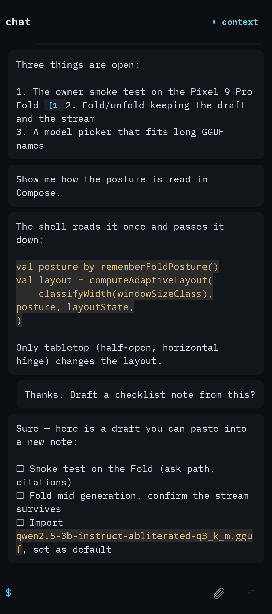

# Skein — Design System

**Bead:** `skein-xtov.14` · **Epic:** `skein-xtov` (UX overhaul) · **Authority:** `docs/research/SKEIN_UI_UX_OVERHAUL_PROMPT.md` §1–3, §36, §40, §44–47, §51, §54
**Status:** Proposed — for owner review. Nothing here is implemented. It amends spec `docs/superpowers/specs/2026-09-19-skein-design.md` §8.1 exactly where the IA's decision **D4** already does (monospace only for machine text). Everything else in §8.1 (terminal/editor character, dark-default with light, restrained cyan/violet accent, no gradients or drop shadows) is kept and made concrete.
**Serves:** `docs/ux/INFORMATION_ARCHITECTURE.md` (the keystone: its surfaces and its product-language glossary §3.1).
**Siblings (written in parallel, referenced by name only):** `ADAPTIVE_LAYOUT_SPEC.md` (window classes, panes, navigation containers), `CHAT_UX_SPEC.md` (chat behaviour), `KNOWLEDGE_UX_SPEC.md`, `OBJECT_LIFECYCLE_SPEC.md`, `UX_TEST_PLAN.md`, `MAC_UX_LAB_PLAN.md`. Where this document says *how a thing looks*, those say *how it behaves*.
**Evidence used:** `docs/ux/audit/AUDIT_*.md` (§7–9 of each: hierarchy, responsive text, accessibility), `docs/ux/audit/DEVICE_BEFORE_PASS.md`, JVM captures in `ux-baselines/before/**`, device captures in `ux-baselines/device-before/**`, `docs/ux/research/pocketpal-screens/*.png`, `POCKETPAL.md` (A1, A2, N1–N14), `LOBECHAT.md` (L1, L10, L13), `ZED.md` (Z4, Z11, Z14), `NOWINANDROID.md`, `ANDROID_ADAPTIVE_SAMPLES.md` §5.2, the brand mark `docs/branding/skein-icon-app-logo.png`, and the current theme under `feature/shell/src/main/kotlin/app/skein/feature/shell/theme/`.
**Measured, not assumed:** every contrast ratio below is computed by `docs/ux/tools/contrast.py` (stdlib Python, the same WCAG formula as `WcagContrast.kt`); every font size in KB was measured by subsetting the real upstream files with fontTools 4.66; every Material 3 API named as stable was checked against the cached `material3-android-1.4.0.aar` (opt-in markers read with `javap`). The method is in Appendix A.

---

## 0. The system in one screen

| | Today | Proposed |
|---|---|---|
| Typefaces | IBM Plex Mono for **everything** (4 static files, 549 KB) | **Skein Sans** (IBM Plex Sans 3.201, subset, variable 400–600 + italic) for all UI and prose; **Skein Mono** (IBM Plex Mono 2.3, subset, regular) only for code, paths, ids, commands, logs, model technical details and shortcut hints. **251 KB on disk, 113 KB compressed** — less than half of today, with a whole second family added |
| Colour | 23 of Material's 48 roles set (from 13 colours); the rest fall back to **baseline purple** (the lavender filter chips, the purple-grey badges, the error banner) | All 48 `ColorScheme` roles mapped, plus Skein roles for success, warning, code, citation, activity, reasoning, user message, focus and graph. Graphite neutrals with one restrained cyan thread; violet only marks AI-made things |
| Contrast | Body pairs AAA; **8 measured failures** elsewhere (black titles on the dark pane 1.09:1, white status-bar icons on light 1.08:1, control outlines 1.5–2.0:1, light primary text 3.82–4.23:1) | **108 threshold pairs measured (54 per theme), all pass** (text ≥ 4.5:1, UI ≥ 3:1); the tool fails the build if one regresses |
| Shape | 4 dp on every corner | A scale 4 · 8 · 12 · 16 · 20 · full, chosen by element size |
| Depth | "No shadows" by test, but Material components still draw their own (Snackbar 6 dp, menu 3 dp, hovered buttons 1 dp) | Tone + 1 dp hairline only; shadow and tonal elevation are 0 everywhere, enforced |
| Icons | Colour emoji (📄 💬 📎 🤖) mixed with Unicode glyphs (≡ ◐ ▤ ✦ ◈ ⚹ ⧉ ⏎ ■) | One set: **Material Symbols Outlined** (Apache-2.0), bundled as ~50 vector drawables (≈ 40 KB, estimated) |
| Messages | User and assistant are identical cards; code has per-line highlight boxes; a dark code block inside the light theme; the citation chip clips to `[1` | User in a tinted bubble, assistant unboxed on the page; code in a single recessed well with copy and horizontal scroll; citation markers sized from their text |
| Motion | Only Material defaults; a graph simulation with no reduced-motion path | Four durations, three curves, a "what animates" table, reduced motion honoured, and **no ambient animation** — no glow, no shimmer, no pulsing dot, no indeterminate bar during minute-long prefill |
| Copy | `$ search or /command`, `No tabs open — back to timeline`, bead ids, "Coming in v1.1" | The IA glossary as law; one error pattern; one destructive pattern |


*Before, Fold outer screen (JVM capture): user and assistant turns are indistinguishable, the code block is a stack of ragged per-line boxes, and the citation chip reads `[1`.*

---

## 1. Principles

These are the tie-breakers. Each one is testable (§14).

1. **Calm under capability density.** At rest, one region shows at most one accent-coloured element. Metadata is quieter than content (smaller, `onSurfaceVariant`). Level 2 affordances are present but quiet: one ＋, one context chip, one ⌕ (IA §3.6).
2. **One clear next action.** Every state has exactly one filled (primary) control. Everything else is tonal, text or icon. Destructive actions are never the most prominent control (today the Models screen's filled **Delete** is, `AUDIT_CHAT_MODELS_SETTINGS.md` §11).
3. **Skein's terminal character lives in the accents, not the body.** It shows up in four places only: monospace for text that *is* machine text; 1 dp hairlines instead of shadows (the logo is a skein of fine filaments); the activity block, which reads like a quiet log with tabular timings flush right; and a steady (non-blinking) caret while an answer streams. Prose, titles, navigation and controls use a legible proportional face (IA D4, prompt §36).
4. **Structure by tone and hairline.** Surfaces separate by a step in the neutral ramp plus, where needed, a 1 dp line. No drop shadows, no gradients, no glow (spec §8.1).
5. **Colour carries meaning, never alone.** Cyan = interactive or live. Violet = made by AI. Red = destructive or failed. Green/amber = success/warning. Every colour signal is paired with an icon or words.
6. **Legible first.** 16 sp body text, nothing below 12 sp, a measured reading width (≤ 79 characters), and every screen survives 200 % font scale on the Fold's outer display.
7. **Truthful state.** Every indicator maps to a real state. Progress is determinate when the source reports it; otherwise an honest elapsed timer. Nothing animates to look busy.
8. **One product, folded or unfolded.** Tokens never change with the device; only layout does (`ADAPTIVE_LAYOUT_SPEC.md`).
9. **Touch, keyboard, pointer and TalkBack are equal inputs.** 48 dp targets, a visible focus ring, hover states for a mouse, labels for every icon.
10. **Product language.** The IA glossary (§3.1) is the vocabulary; §11 here is its style guide.

---

## 2. Brand and character

**What the mark says.** `docs/branding/skein-icon-app-logo.png` is fully achromatic: dozens of fine white strands wound into a single cloud-like skein, lit on black. No hue at all. Three decisions follow from it:

| From the mark | Decision |
|---|---|
| Achromatic, white on black | Neutrals are near-grey graphite (OKLCH chroma 0.007), not the blue-tinted slate used today. Colour is rare, so it means something. |
| Many fine strands, one form | 1 dp hairlines are the structural device (pane edges, code wells, the reasoning lane, chip outlines). Weight comes from type and tone, not from boxes. |
| Quiet light, no colour glow | The single accent (cyan, kept from spec §8.1 for continuity) is *desaturated*: today's `#5FD3F3` (OKLCH C 0.113) becomes `#7ACCE0` (C 0.085) in dark and `#0D6880` in light. It reads as a thread of light, not a neon sign. |

**What Skein must not look like** (checked in review): a glowing blue reasoning card (PocketPal N2); a wall of identical rounded cards with soft grey shadows; emoji as icons; ALL-CAPS tracked labels; one radius on every element; gradient washes; monospace paragraphs.

**Brand mark in the UI.** The raster logo (1.2 MB, owner's mark, not Apache-2.0 — `docs/branding/NOTICE`) must not ship as a UI image. If the owner provides a vector mark, it may appear once: 40 dp, `onSurfaceVariant`, above the landing headline "What are you working on?" (open question Q4).

---

## 3. Typography

### 3.1 Typefaces

| Role | Face | Source and licence | Bundled as | Size (measured) |
|---|---|---|---|---|
| **UI and prose** — navigation, titles, messages, notes, controls, numbers | **Skein Sans** = IBM Plex Sans **3.201** (Google Fonts build of `IBM/plex`), variable, `wdth` pinned to 100, `wght` kept 400–600 | SIL OFL 1.1, © IBM Corp., Reserved Font Name "Plex" | `res/font/skein_sans.ttf` (roman, variable) | 128.8 KB on disk / 58.1 KB deflated |
| **UI italic** — Markdown emphasis in messages and notes | Skein Sans Italic = IBM Plex Sans Italic 3.201, static instance `wght` 400 | same | `res/font/skein_sans_italic.ttf` | 85.9 KB / 36.8 KB |
| **Machine text** — code, file paths, ids, hashes, commands and slash syntax, logs, model technical details, keyboard-shortcut hints | **Skein Mono** = IBM Plex Mono **2.3** Regular (the exact file the repo bundles today) | same | `res/font/skein_mono.ttf` | 36.6 KB / 18.1 KB |
| **Total** | | | 3 files replace today's 4 `ibm_plex_mono_*.ttf` | **251.3 KB / 113.0 KB** (today: 548.6 KB / 234.5 KB) |

Subset for all three: Basic Latin, Latin-1 Supplement, Latin Extended-A and -B, Latin Extended Additional (Vietnamese), General Punctuation, € ₹ ™, − ≈ ≠ ≤ ≥, the arrows U+2190–2199; OpenType features `kern liga ccmp locl mark mkmk lnum frac sups subs zero`; TrueType hinting removed (no visible effect at the Fold's 330–390 dpi; re-adding it costs +14 KB Sans, +25 KB Mono if a device check ever shows soft stems). Text in other scripts (Greek, Cyrillic, CJK, Arabic, Devanagari, emoji inside user content) falls back to the platform's Noto fonts automatically — no glyph goes missing. Adding Greek + Cyrillic to Skein Sans costs +128 KB (option, not default).

**Why Plex Sans.** It is the proportional member of the superfamily Skein already ships, so the change reads as *the same voice speaking normally* rather than a rebrand. The two faces share their vertical metrics exactly (measured: 1000 UPM, x-height 516, cap height 698, ascent 1025, descent −275), so an inline `code span` sits on the same baseline and x-height as the prose around it and line boxes never jump. Its figures are **tabular by default** (all ten digits measured at 600 units), so the activity block's live `0:22` timer and right-aligned durations never jitter — no `tnum` feature needed (Plex Sans has none). Its engineered, slightly technical detailing (the squared curves of the IBM Plex design) carries the research/terminal lineage into a face that is comfortable for long answers.

**Alternatives measured and rejected.**

| Candidate | Subset size (same ranges) | Why not |
|---|---|---|
| System Roboto / Noto (`FontFamily.Default`) | 0 KB | Zero cost and fine legibility, but no identity: Skein would look like the Settings app. Kept as the automatic fallback for scripts outside the subset. |
| Atkinson Hyperlegible Next (OFL, variable) | 64.5 KB | Excellent character disambiguation and the smallest file; the strongest alternative. Rejected because its metrics don't match Plex Mono (inline code would sit off-size) and it drops the Plex lineage the spec names. Owner question Q1. |
| Inter (OFL, variable, `opsz` 14) | 200.4 KB | The default everyone reaches for; larger; no link to Skein's existing voice. |

**Licence compliance (OFL §3, Reserved Font Name).** IBM Plex's OFL declares the Reserved Font Name "Plex". Subsetting and instancing produce a *Modified Version*, which may not use a reserved name. So the shipped files are **renamed inside their `name` table** to "Skein Sans" and "Skein Mono" (one fontTools call), and `NOTICE` records: *"Skein Sans and Skein Mono are modified (subset, instanced) versions of IBM Plex Sans 3.201 and IBM Plex Mono 2.3, © IBM Corp., SIL OFL 1.1, Reserved Font Name 'Plex'; renamed as §3 requires."* The OFL text already ships at `feature/shell/src/main/assets/fonts/OFL.txt` (identical text for all Plex families). Today's files are unmodified Plex Mono and need no rename; the new ones do.

**Bundling rules.** Fonts live in `res/font` and are loaded with `Font(R.font.…)` — never `GoogleFont`/downloadable fonts, never a Play-services font provider (GrapheneOS, offline, privacy). The subsetting script and the pinned upstream SHA-256s are committed with the fonts so the bytes are reproducible (`reproducible-builds.yml`); the Gradle build itself runs no Python.

**Implementation note (verify first).** Skein Sans is a variable font; Compose selects weights with `Font(R.font.skein_sans, weight = FontWeight(n), variationSettings = FontVariation.Settings(FontVariation.weight(n)))` for n ∈ {400, 500, 600} (API 26+; minSdk is 30). The typography bead's first step is to confirm that Robolectric native graphics (the Roborazzi renderer) honours the `wght` axis. If it doesn't, ship three static instances instead (≈ 3 × 86 KB) so JVM screenshots stay truthful.

### 3.2 Type scale (Material 3 roles, all Skein Sans)

Sizes in sp. **Line heights are applied as `em` ratios** (the value in brackets) so that Android 14+'s non-linear font scaling can never make a line box shorter than its glyphs (§3.5). Tracking in sp.

| Role | Size | Line height | Weight | Tracking | Used for |
|---|---:|---|---:|---:|---|
| displayLarge | 45 | 52 (1.156) | 400 | −0.25 | Reserved (not used in v1) |
| displayMedium | 36 | 44 (1.222) | 400 | 0 | Reserved |
| displaySmall | 32 | 40 (1.25) | 500 | 0 | Reserved (onboarding, if ever) |
| headlineLarge | 28 | 36 (1.286) | 500 | 0 | Note title in the editor, Medium+ |
| headlineMedium | 24 | 32 (1.333) | 500 | 0 | Empty-state headline, Medium+; note title, Compact |
| headlineSmall | 22 | 28 (1.273) | 500 | 0 | Empty-state headline, Compact; vault setup/unlock title |
| titleLarge | 20 | 28 (1.4) | 600 | 0 | Destination top-bar titles (Knowledge, Models, Settings); dialog titles |
| titleMedium | 17 | 24 (1.412) | 600 | 0 | Chat top-bar title; sheet titles; card titles |
| titleSmall | 14 | 20 (1.429) | 600 | 0.1 | Group and section headers ("Today", "Privacy & security"), palette section headers |
| bodyLarge | 16 | 24 (1.5) | 400 | 0 | Messages, note body, list-row titles, composer text, menu items |
| bodyMedium | 14 | 20 (1.429) | 400 | 0.1 | Row previews, dialog body, activity step labels, table cells |
| bodySmall | 13 | 18 (1.385) | 400 | 0.1 | Top-bar subtitle (model), metadata, supporting text, activity summary |
| labelLarge | 14 | 20 (1.429) | 600 | 0.1 | Buttons, chips, segmented buttons |
| labelMedium | 13 | 18 (1.385) | 500 | 0.2 | Rail labels, author label ("Skein"), badges |
| labelSmall | 12 | 16 (1.333) | 500 | 0.3 | Timestamps, counters, graph labels, legend |

Bold inside prose (`**strong**`) is weight **600**, not 700 (Skein Sans stops at 600; 700 would be synthesised and looks smeared). Italic uses the true italic face.

### 3.3 Monospace roles (Skein extension, all Skein Mono 400)

| Style | Size | Line height | Used for |
|---|---:|---|---|
| `codeBlock` | 13 | 20 (1.538) | Code blocks in messages and notes; logs. 13 sp at 0.6 em advance gives 49 columns on a 443 dp outer screen and 59 at 524 dp; longer lines scroll horizontally (§10.17). |
| `codeInline` | 0.9 em of the surrounding style | inherits | Inline `code` in prose. 0.9 em because at equal size the mono's wider set looks larger than Plex Sans (checked in the specimen, Appendix A). |
| `monoBody` | 14 | 20 (1.429) | Model details values (file name, format, quantization, hash, backend), file paths in file info, slash syntax shown in palette descriptions |
| `monoLabel` | 12 | 16 (1.333) | Ids and hashes (with middle ellipsis), keyboard-shortcut keycaps, code-block language label |

**Not monospace** (decided here, closing POCKETPAL A1's open point): durations, token counts and rates. They are numbers, not identifiers, and Skein Sans figures are already tabular. Mono appears only where the *content* is machine text.

### 3.4 Typographic rules

- **Sentence case everywhere.** No ALL CAPS labels, no title case on buttons.
- **Minimum size 12 sp.** Nothing smaller, including badges, legends and graph labels (today's 11 sp `labelSmall` is removed).
- **Reading width ≤ 576 dp** for prose (§4.3): about 79 characters of 16 sp Skein Sans.
- **Truncation.** Titles end-ellipsise (1 line in rows, 2 lines in headers and dialogs). File names, ids and hashes use `TextOverflow.MiddleEllipsis` (available in the pinned Compose BOM, `POCKETPAL.md` W20) so both the family and the variant stay visible. Message bodies and note bodies never truncate. Stored titles never contain a baked-in "…" (`POCKETPAL.md` N9).
- **Numbers.** Always numerals ("3 sources"). Figures are tabular by default; don't enable proportional figures.
- **Emphasis hierarchy** uses size and weight first, then `onSurfaceVariant`. Never colour alone, never underline for emphasis (underline means link).

### 3.5 Font scale up to 200 %

Android 14+ scales text non-linearly up to 200 % (large text grows less than small text). The rules:

1. **All text in `sp`; line heights as `em`** (the ratios in §3.2). If the platform maps a font size and an sp line height through the non-linear curve independently, the line box ends up relatively tighter at large scales. At 200 %, 22 sp maps to ≈ 35 and 28 sp to ≈ 37, so a two-line title would get ≈ 1.07× and clip descenders. `em` makes the ratio fixed by construction, whatever the platform does.
2. **No fixed heights on anything that holds text.** Use `heightIn(min = …)`. Today's fixed 36 dp tab strip and "Recent ▾" row clip at large scale (`AUDIT_SHELL.md` §8); `SkeinTokens.commandBarHeight`'s own KDoc records the same bug.
3. **Icons do not scale** (24 dp stays 24 dp); their touch targets stay 48 dp.
4. **The top app bar grows.** `expandedHeight = max(64.dp, (title line + subtitle line in dp) + 16.dp)`, computed from the scaled line heights (§10.1). Material's fixed 64 dp would clip the two-line title block at ≥ 150 %.
5. **Single-line rows become taller, not truncated vertically.** Row titles keep one line with end ellipsis; the row height follows.
6. **Buttons may wrap to two centred lines** rather than ellipsise their verb.
7. **Chip rows scroll horizontally.** Chip labels never ellipsise.
8. **Dialogs scroll their body**; actions stay visible.
9. **Test:** the fold-outer (443 dp) and phone (360 dp) captures at 200 % must show no vertically clipped text (`TextLayoutResult.didOverflowHeight == false` on every text node, §14).

---

## 4. Space, layout and grid

### 4.1 Spacing scale (dp)

`space2` 2 · `space4` 4 · `space8` 8 · `space12` 12 · `space16` 16 · `space20` 20 · `space24` 24 · `space32` 32 · `space40` 40 · `space48` 48 · `space64` 64

Rhythm: **4 dp baseline, 8 dp steps.** Inline gaps (icon ↔ label) 8; between related items 8; between groups 16; between sections 24; screen-level separation 32. Named tokens say the number so there is nothing to look up.

### 4.2 Window classes and grid

Skein does not use a column grid inside content. The macro grid is **panes** (from the IA), and inside a pane content aligns to one reading column plus a 4 dp baseline. Window-class *decisions* (which pane shows when) belong to `ADAPTIVE_LAYOUT_SPEC.md`; the *measurements* are here and are consistent with IA §3.4 and `ANDROID_ADAPTIVE_SAMPLES.md` §5.2.

| | **Compact** (phones 360–411; Fold outer 443 dp stock, ≈ 524 dp at 330 dpi) | **Compact height** (< 600 dp tall; outer landscape) | **Medium** (600–839) | **Expanded** (840–1199; Fold inner 852 dp stock, 1006–1043 dp at 330 dpi) | **Large** (≥ 1200) |
|---|---|---|---|---|---|
| Navigation | Modal drawer, width `min(320, window − 56)` | Modal drawer | Navigation rail 80 | Navigation rail 80 | Expanded rail or permanent drawer 280 |
| Panes | 1 | 1 | 1 | 2: list **320** + detail (≈ 450 at 852 dp stock; ≈ 605 at 1006) | 3: list 320 + detail + supporting 360 |
| Extra pane (context inspector, Connections) | Bottom sheet | Side sheet 360 | Side sheet 360 | Replaces the list pane, **320** wide | Third pane, 360 |
| Horizontal gutter | 16 | 16 + side insets | 24 | List pane 12 (rows are inset pills) · detail 24 | 24 |
| Reading column | window − 32 | ≤ 576, centred | ≤ 576, centred | ≤ 576, centred in the detail pane | ≤ 576 |
| Top app bar | 64 (grows with font scale) | 56 | 64 | 64 per pane | 64 |
| Pane separation | — | — | — | 1 dp `outlineVariant` divider, no spacer (set the adaptive directive's partition spacer to 0); list pane on `surfaceContainerLow`, detail on `surface` | same |
| Dialog width | 280 … window − 48 | 280 … 560 | 280 … 560 | 280 … 560 | 280 … 560 |
| Bottom sheet | full width | → side sheet | max 640, centred | (panes instead) | (panes instead) |
| Command palette | Full screen | Full screen | Overlay, max 560 | Overlay, max 640, top at 15 % of height | Overlay, max 640 |

**Minimum widths inside panes** (from `ANDROID_ADAPTIVE_SAMPLES.md` §5.2): the chat column and the composer need ≥ 360 dp. Below that, one pane regardless of class.

**Alignment lines inside a row:** leading icon at 16 dp from the row edge; text at 56 dp when a leading 24 dp icon is present (16 + 24 + 16), else at 16; trailing icon button's centre 24 dp from the edge.

### 4.3 Reading width (measured)

Measured on Skein Sans: mean advance 0.456 em over English prose, so 7.29 dp per character at 16 sp.

| Column | Characters at 16 sp | Where it occurs |
|---:|---:|---|
| 328 dp | 45 | 360 dp phone |
| 411 dp | 56 | Fold outer, stock density (443 − 32) |
| 492 dp | 67 | Fold outer at 330 dpi (524 − 32) |
| **576 dp** | **79** | **Cap for prose (this system)** |
| 720 dp | 99 | IA / adaptive research's "~720 dp" — too wide for prose (§18) |

### 4.4 Component sizes

| Token | dp | Notes |
|---|---:|---|
| `touchTarget` | 48 | Minimum for every interactive element (§7.1) |
| `iconStandard` / `iconDense` / `iconInline` | 24 / 20 / 16 | Inline = activity status marks, chip icons use 18 (Material) |
| `buttonHeight` | 40 visual, 48 touch | Grows with font scale |
| `chipHeight` | 32 visual, 48 touch | |
| `rowOneLine` / `rowTwoLine` / `rowThreeLine` | 56 / 72 / 88 | Material list rows |
| `rowDrawerHistory` / `rowPaneConversation` | 48 / 64 | Denser rows for chat history (§10.2) |
| `topBar` | 64 | Minimum; grows (§3.5) |
| `composerMin` | 56 | Grows to 6 lines, then scrolls |
| `rail` / `listPane` / `extraPane` | 80 / 320 / 320 (360 on Large) | IA §3.4 |
| `drawerMax` | 320 | and ≤ window − 56 |
| `sheetMaxWidth` / `paletteMaxWidth` / `dialogMaxWidth` | 640 / 640 / 560 | |
| `readingMax` | 576 | §4.3 |
| `hairline` / `focusRing` / `focusRingGap` | 1 / 2 / 2 | |
| `statusDot` | 8 | Always paired with text |

---

## 5. Shape, surfaces, elevation and borders

### 5.1 Corner radius

Radius follows element size (about a quarter to a third of the height of a small control) — never one radius everywhere.

| Token | dp | Elements |
|---|---:|---|
| `radiusNone` | 0 | Panes, top bars, full-screen surfaces, rail, table cells |
| `radiusXs` | 4 | Inline code, citation markers, keycaps, tooltips, graph label plates, progress bar ends (2 at 4 dp tall) |
| `radiusSm` | 8 | Chips, menus, code blocks, tables, snackbars, the reasoning lane |
| `radiusMd` | 12 | Buttons, segmented buttons, text and search fields, cards and notices, selected-row indicators (drawer, list pane, palette) |
| `radiusLg` | 16 | User message bubble (top-end corner 4 — the corner nearest its author) |
| `radiusXl` | 20 | Composer, dialogs, bottom-sheet top corners, palette overlay, drawer end corners |
| `radiusFull` | 50 % | Send/Stop button, status dots, rail active indicator, switches |

Material `Shapes` (1.4.0 has eight slots): `extraSmall` 4 · `small` 8 · `medium` 12 · `large` 16 · `largeIncreased` 20 · `extraLarge` 20 · `extraLargeIncreased` 24 · `extraExtraLarge` 28. Several Material components ignore or undershoot `Shapes` (buttons, drawer items and segmented buttons default to pills; text fields and menus to 4 dp), so Skein's wrappers pass the shape explicitly: buttons, fields, segmented ends and drawer/list indicators `medium` (12), menus `small` (8).

### 5.2 Surfaces (tonal levels)

Elevation is expressed only by choosing a surface role. The ramp is perceptually even (OKLCH lightness steps of ≈ 0.03 in dark, ≈ 0.02 in light). "Higher" means lighter in dark and darker in light.

| Level | Role | Dark | Light | Used by |
|---|---|---|---|---|
| Recessed | `surfaceContainerLowest` (dark) / `surfaceContainer` (light) | `#070A0C` | `#EBEEF0` | Code-block well (below the page in both themes) |
| 0 — page | `surface` (= `background`) | `#0D1012` | `#F8FAFC` | Screens, detail pane, assistant messages, rail |
| 1 | `surfaceContainerLow` | `#131719` | `#F1F4F6` | List pane, drawer sheet, bottom and side sheets, reasoning lane, notice cards |
| 2 | `surfaceContainer` | `#1A1D20` | `#EBEEF0` | Menus, top bar when content scrolls under it |
| 3 | `surfaceContainerHigh` | `#212527` | `#E4E8EB` | Composer, dialogs, palette overlay, search fields |
| 4 | `surfaceContainerHighest` | `#2A2D30` | `#DDE1E5` | Inline code (dark), table header, progress track, switch track (off) |
| Tinted | `secondaryContainer` | `#2A343B` | `#D7E1E8` | User message bubble, selected row / destination, tonal buttons |

### 5.3 Elevation: tone plus hairline, never shadow

- `shadowElevation = 0.dp` and `tonalElevation = 0.dp` on every Material component. `surfaceTint` is mapped to `surface`, so an accidental tonal elevation paints nothing.
- **Floating layers** (menus, tooltips, the palette overlay, side sheets) get their level's container colour plus a **1 dp `outlineVariant` border**. Modal layers also get a scrim.
- **Scrim:** `#000000` at **32 %** (light) and **48 %** (dark). Material's default 32 % is too faint over an already-dark page, so pass `scrimColor` explicitly.
- **Components that draw shadows themselves** (verified against 1.4.0): `Snackbar` hard-codes its elevation (no parameter), so Skein ships `SkeinSnackbar` (§10.13). `DropdownMenu` and `PlainTooltip` take `shadowElevation` (set 0). Filled and tonal buttons raise a 1 dp shadow on hover (pass `elevation = null`). `ElevatedButton`, `ElevatedCard`, `ElevatedAssistChip`/`ElevatedFilterChip` and `FloatingActionButton` are not used at all.
- The top app bar's scrolled state is `surfaceContainer` plus a 1 dp `outlineVariant` bottom line. With the colour step alone (≈ 1.2:1) the edge disappears.

### 5.4 Borders and dividers

| Line | Width | Colour | Where |
|---|---:|---|---|
| Hairline divider | 1 | `outlineVariant` | Pane edges, group separators, scrolled top bar, code-block and table borders, chip outlines, floating-layer borders |
| Control boundary | 1 | `outline` (≥ 3:1) | Text fields (unfocused), outlined buttons, unchecked checkboxes, switch outline |
| Focus | 2 (+ 2 gap) | `focusRing` | Keyboard focus (§7.3); focused text fields use 2 dp `primary` in every input mode |
| Block-quote bar | 3 | `outline` | Markdown quotes |

Rows are separated by space, not lines. Dividers appear only between *groups*.

---

## 6. Colour

### 6.1 Decisions

- **Accent:** restrained cyan. Dark `primary #7ACCE0`, light `primary #0D6880`. It marks what you can act on and what is live (focus, selection, progress, the running step, Send/Stop, links). It is not used for section headers or decoration. Today's cyan section headers ("Appearance", "Security") become `onSurfaceVariant`.
- **Neutrals:** graphite. OKLCH hue 240 at chroma 0.007 (dark) / 0.003–0.01 (light): a hint of cool, but read as grey, like the mark.
- **Secondary:** a cool neutral (`#2A343B` / `#D7E1E8` containers). It carries selection and the user's own messages without using the accent, so a screen at rest stays calm. Material uses `secondaryContainer` for the navigation indicator by default, which is exactly the restraint wanted.
- **Tertiary (violet):** kept from spec §8.1 but narrowed to one meaning, *made by AI*: the "AI output" kind in Knowledge and Graph. This fixes today's graph, which paints AI output in the **error** red (`AUDIT_KNOWLEDGE.md` §10). Violet is not used for the reasoning lane, which is muted neutral (`POCKETPAL.md` N2).
- **Status:** error (red), success (green), warning (amber). Info is **not** a separate hue; it aliases the accent.
- **Dynamic colour: off, with no setting** (§12).

### 6.2 Palette

Values are the single source of truth in `docs/ux/tools/contrast.py` (`TOKENS`). The Wave 2 theme mirrors them byte for byte.

| Role | Dark | Light | Notes |
|---|---|---|---|
| `surfaceContainerLowest` | `#070A0C` | `#FFFFFF` | |
| `surface` = `background` | `#0D1012` | `#F8FAFC` | Dark `surfaceDim` = surface; light `surfaceBright` = surface |
| `surfaceContainerLow` | `#131719` | `#F1F4F6` | |
| `surfaceContainer` | `#1A1D20` | `#EBEEF0` | |
| `surfaceContainerHigh` | `#212527` | `#E4E8EB` | |
| `surfaceContainerHighest` | `#2A2D30` | `#DDE1E5` | also legacy `surfaceVariant` |
| `surfaceBright` / `surfaceDim` | `#323639` / `#0D1012` | `#F8FAFC` / `#D7DBDF` | |
| `outlineVariant` | `#363A3D` | `#CED3D7` | Decorative lines only |
| `outline` | `#7B8186` | `#72787D` | Control boundaries (≥ 3:1) |
| `onSurfaceVariant` | `#B0B7BC` | `#4D5459` | Secondary text, icons |
| `onSurface` = `onBackground` | `#E4E8EB` | `#171B1F` | Primary text |
| `inverseSurface` / `inverseOnSurface` / `inversePrimary` | `#DDE1E5` / `#171B1F` / `#0D6880` | `#2A2D30` / `#EEF1F3` / `#7ACCE0` | Snackbar |
| `primary` / `onPrimary` | `#7ACCE0` / `#012630` | `#0D6880` / `#FFFFFF` | Accent |
| `primaryContainer` / `onPrimaryContainer` | `#113B47` / `#C4E9F2` | `#D1ECF3` / `#003444` | Citation marker, accent-tonal |
| `secondary` / `onSecondary` | `#ACBAC3` / `#172026` | `#505D65` / `#FFFFFF` | |
| `secondaryContainer` / `onSecondaryContainer` | `#2A343B` / `#DFE8ED` | `#D7E1E8` / `#1B2328` | Selection, user message, tonal buttons |
| `tertiary` / `onTertiary` | `#BEB0EC` / `#261D42` | `#61489B` / `#FFFFFF` | Made by AI |
| `tertiaryContainer` / `onTertiaryContainer` | `#37304C` / `#E2DDF7` | `#E9E4FE` / `#38255F` | |
| `error` / `onError` | `#F29891` / `#420F0D` | `#B72D29` / `#FFFFFF` | Destructive, failed |
| `errorContainer` / `onErrorContainer` | `#542523` / `#FBD8D4` | `#FFE1DE` / `#6B1E1B` | |
| `success` / `onSuccess` | `#85CE9E` / `#0C2B17` | `#246E3A` / `#FFFFFF` | Skein role |
| `successContainer` / `onSuccessContainer` | `#1C3A27` / `#CDEAD6` | `#D8F2DC` / `#163F21` | Skein role |
| `warning` / `onWarning` | `#E9C67D` / `#2E2206` | `#875814` / `#FFFFFF` | Skein role |
| `warningContainer` / `onWarningContainer` | `#403419` / `#F1E3C7` | `#FBE9C6` / `#54360B` | Skein role |
| `scrim` | `#000000` @ 48 % | `#000000` @ 32 % | Alpha applied at use |

### 6.3 Semantic tokens (Skein roles)

Only success and warning add new colours. Everything else is a named alias, so component code reads as intent (`colors.codeBlockContainer`) rather than a role that happens to look right.

| Token | Dark / light value | Purpose |
|---|---|---|
| `destructive`, `onDestructive`, `destructiveContainer` | = `error`, `onError`, `errorContainer` | Delete and other irreversible actions |
| `success…`, `warning…` | §6.2 | Model ready, import done; "running out of room", disk space |
| `info…` | = `primary…` | Informational notices (no separate hue) |
| `disabledContent` / `disabledContainer` | `onSurface` @ 38 % / @ 12 % | Material convention; exempt from contrast, must carry a reason (§7.2) |
| `selectionBackground` / `selectionHandle` | `primary` @ 30 % / `primary` | `TextSelectionColors` |
| `focusRing` | = `primary` | §7.3 |
| `link` | = `primary`, underlined | Links and wikilinks |
| `codeBlockContainer` | `surfaceContainerLowest` / `surfaceContainer` | Recessed well in both themes |
| `codeBlockBorder`, `onCodeBlock`, `codeBlockLabel` | `outlineVariant`, `onSurface`, `onSurfaceVariant` | |
| `codeInlineContainer`, `onCodeInline` | `surfaceContainerHighest` / `surfaceContainerHigh`, `onSurface` | |
| `citationContainer`, `onCitation` | = `primaryContainer`, `onPrimaryContainer` | Inline source markers |
| `activityText`, `activityRunning`, `activityDone`, `activityFailed` | `onSurfaceVariant`, `primary`, `onSurfaceVariant`, `error` | Activity block |
| `reasoningContainer`, `reasoningBorder`, `onReasoning` | `surfaceContainerLow`, `outlineVariant`, `onSurfaceVariant` | Model's reasoning lane |
| `userMessageContainer`, `onUserMessage` | = `secondaryContainer`, `onSecondaryContainer` | |
| `graphNote`, `graphChat`, `graphFile`, `graphAiOutput`, `graphTag`, `graphEdge` | `primary`, `secondary`, `onSurfaceVariant`, `tertiary`, `outline`, `outline` | Always paired with a distinct shape (§10.26) |
| `graphLabelPlate` | `surface` @ 90 % | Behind node labels |

### 6.4 Material 3 `ColorScheme` → Skein mapping (all 48 roles)

Today `SkeinColors` sets 23 of the 48 roles. Every other role silently keeps Material's **baseline purple**: the lavender "Notes · Chats · Files" chips in the light captures, the purple-grey chips and the "Backlinks 3" badge in dark (`secondaryContainer` unmapped), and the chat error banner (`errorContainer` unmapped). Rule: **every role is set explicitly in both schemes**, and a test fails if any role equals Material's baseline value (§14).

| Material role(s) | Skein token |
|---|---|
| `primary`, `onPrimary`, `primaryContainer`, `onPrimaryContainer`, `inversePrimary` | Accent family (§6.2) |
| `secondary`, `onSecondary`, `secondaryContainer`, `onSecondaryContainer` | Cool neutral family |
| `tertiary`, `onTertiary`, `tertiaryContainer`, `onTertiaryContainer` | Violet, "made by AI" |
| `background`, `onBackground` | = `surface`, `onSurface` |
| `surface`, `onSurface`, `onSurfaceVariant`, `inverseSurface`, `inverseOnSurface` | Neutral ramp |
| `surfaceVariant` (legacy) | = `surfaceContainerHighest` |
| `surfaceTint` | = `surface` (neutralises tonal elevation) |
| `surfaceBright`, `surfaceDim`, `surfaceContainerLowest…Highest` | §5.2 |
| `error`, `onError`, `errorContainer`, `onErrorContainer` | Destructive family |
| `outline`, `outlineVariant` | Separate values (today both are the same colour, so dividers are as loud as control borders) |
| `scrim` | `#000000` |
| `primaryFixed`, `primaryFixedDim`, `onPrimaryFixed`, `onPrimaryFixedVariant` | `#D1ECF3`, `#7ACCE0`, `#003444`, `#113B47` — identical in both themes, as Material defines "fixed" |
| `secondaryFixed…` | `#D7E1E8`, `#ACBAC3`, `#1B2328`, `#2A343B` |
| `tertiaryFixed…` | `#E9E4FE`, `#BEB0EC`, `#38255F`, `#37304C` |

Skein-only roles (success, warning, the aliases in §6.3) live in an immutable `SkeinExtendedColors` provided by `LocalSkeinColors` beside `MaterialTheme`. `SkeinEditorColors` / `LocalSkeinEditorColors` fold into it: the editor gets a real `Surface` (§6.7), so it no longer needs its own colour pair.

### 6.5 Contrast — measured

Thresholds: **text 4.5:1** (WCAG 1.4.3 AA, body), **UI 3:1** (WCAG 1.4.11: component boundaries, focus rings, icons, graph marks). Large-text 3:1 is never relied on; every text pair meets 4.5:1. "info" rows are measured but exempt (disabled content, decoration). A background written `base+token@α` is the colour actually drawn (a state layer or selection composited over its base). Regenerate with `python3 docs/ux/tools/contrast.py --before`; it exits non-zero if any pair fails.

#### Dark theme

| Foreground | Background | Hex (fg / bg) | Ratio | Needs | Result | Used for |
|---|---|---|---:|---|---|---|
| `onSurface` | `surface` | #E4E8EB / #0D1012 | 15.49 | text 4.5 | pass | Message and note body, titles |
| `onSurface` | `surfaceContainerLowest` | #E4E8EB / #070A0C | 16.11 | text 4.5 | pass | Text on the lowest container |
| `onSurface` | `surfaceContainerLow` | #E4E8EB / #131719 | 14.64 | text 4.5 | pass | Drawer, sheets, list pane, reasoning lane |
| `onSurface` | `surfaceContainer` | #E4E8EB / #1A1D20 | 13.74 | text 4.5 | pass | Menus |
| `onSurface` | `surfaceContainerHigh` | #E4E8EB / #212527 | 12.54 | text 4.5 | pass | Composer text, dialogs |
| `onSurface` | `surfaceContainerHighest` | #E4E8EB / #2A2D30 | 11.24 | text 4.5 | pass | Inline code, table header |
| `onSurfaceVariant` | `surface` | #B0B7BC / #0D1012 | 9.41 | text 4.5 | pass | Metadata, subtitles, activity steps |
| `onSurfaceVariant` | `surfaceContainerLow` | #B0B7BC / #131719 | 8.89 | text 4.5 | pass | History previews in drawer/list pane |
| `onSurfaceVariant` | `surfaceContainer` | #B0B7BC / #1A1D20 | 8.34 | text 4.5 | pass | Menu supporting text |
| `onSurfaceVariant` | `surfaceContainerHigh` | #B0B7BC / #212527 | 7.61 | text 4.5 | pass | Composer placeholder, dialog body |
| `onSurfaceVariant` | `surfaceContainerHighest` | #B0B7BC / #2A2D30 | 6.82 | text 4.5 | pass | Muted text on the highest container |
| `primary` | `surface` | #7ACCE0 / #0D1012 | 10.49 | text 4.5 | pass | Text buttons, links, selected-row accents |
| `primary` | `surfaceContainerLow` | #7ACCE0 / #131719 | 9.91 | text 4.5 | pass | Links in sheets and list pane |
| `primary` | `surfaceContainerHigh` | #7ACCE0 / #212527 | 8.49 | text 4.5 | pass | Text buttons in dialogs |
| `primary` | `surfaceContainerHighest` | #7ACCE0 / #2A2D30 | 7.61 | text 4.5 | pass | Links on the highest container |
| `primary` | `userMessageContainer` | #7ACCE0 / #2A343B | 6.98 | text 4.5 | pass | Links inside a user message |
| `onPrimary` | `primary` | #012630 / #7ACCE0 | 8.74 | text 4.5 | pass | Filled button label, Send/Stop icon |
| `onPrimaryContainer` | `primaryContainer` | #C4E9F2 / #113B47 | 9.36 | text 4.5 | pass | Citation marker, accent tonal button |
| `onSecondaryContainer` | `secondaryContainer` | #DFE8ED / #2A343B | 10.23 | text 4.5 | pass | User message, selected nav item, tonal button |
| `onSurfaceVariant` | `secondaryContainer` | #B0B7BC / #2A343B | 6.26 | text 4.5 | pass | Metadata inside a selected row |
| `tertiary` | `surface` | #BEB0EC / #0D1012 | 9.65 | text 4.5 | pass | “AI output” label |
| `onTertiaryContainer` | `tertiaryContainer` | #E2DDF7 / #37304C | 9.42 | text 4.5 | pass | AI-output badge |
| `error` | `surface` | #F29891 / #0D1012 | 8.80 | text 4.5 | pass | Inline error text, field error |
| `error` | `surfaceContainer` | #F29891 / #1A1D20 | 7.80 | text 4.5 | pass | “Delete” menu item |
| `error` | `surfaceContainerHigh` | #F29891 / #212527 | 7.12 | text 4.5 | pass | “Delete” dialog button |
| `onError` | `error` | #420F0D / #F29891 | 7.41 | text 4.5 | pass | Filled destructive button |
| `onErrorContainer` | `errorContainer` | #FBD8D4 / #542523 | 9.53 | text 4.5 | pass | Error card / banner |
| `success` | `surface` | #85CE9E / #0D1012 | 10.29 | text 4.5 | pass | Success text (“Ready”) |
| `onSuccessContainer` | `successContainer` | #CDEAD6 / #1C3A27 | 9.70 | text 4.5 | pass | Success card |
| `warning` | `surface` | #E9C67D / #0D1012 | 11.67 | text 4.5 | pass | Warning text (“Running out of room”) |
| `onWarningContainer` | `warningContainer` | #F1E3C7 / #403419 | 9.61 | text 4.5 | pass | Warning card |
| `inverseOnSurface` | `inverseSurface` | #171B1F / #DDE1E5 | 13.17 | text 4.5 | pass | Snackbar message |
| `inversePrimary` | `inverseSurface` | #0D6880 / #DDE1E5 | 4.83 | text 4.5 | pass | Snackbar action (Undo) |
| `onSurface` | `codeBlockContainer` | #E4E8EB / #070A0C | 16.11 | text 4.5 | pass | Code block text |
| `onSurfaceVariant` | `codeBlockContainer` | #B0B7BC / #070A0C | 9.78 | text 4.5 | pass | Code block language label |
| `onSurface` | `codeInlineContainer` | #E4E8EB / #2A2D30 | 11.24 | text 4.5 | pass | Inline code |
| `onSurfaceVariant` | `reasoningContainer` | #B0B7BC / #131719 | 8.89 | text 4.5 | pass | Model's reasoning lane |
| `onSurface` | `surface+primary@0.30` | #E4E8EB / #2E4850 | 7.89 | text 4.5 | pass | Text under selection highlight |
| `onSurface` | `surface+onSurface@0.08` | #E4E8EB / #1E2123 | 13.14 | text 4.5 | pass | Hovered row |
| `onSurface` | `surfaceContainerLow+onSurface@0.10` | #E4E8EB / #282C2E | 11.44 | text 4.5 | pass | Pressed / focused row in drawer |
| `onSecondaryContainer` | `secondaryContainer+onSecondaryContainer@0.10` | #DFE8ED / #3C464D | 7.77 | text 4.5 | pass | Pressed selected row |
| `outline` | `surface` | #7B8186 / #0D1012 | 4.84 | UI 3.0 | pass | Text-field border, unchecked box, switch outline |
| `outline` | `surfaceContainerHigh` | #7B8186 / #212527 | 3.92 | UI 3.0 | pass | Field border inside a dialog |
| `focusRing` | `surface` | #7ACCE0 / #0D1012 | 10.49 | UI 3.0 | pass | Keyboard focus ring |
| `focusRing` | `surfaceContainerLow` | #7ACCE0 / #131719 | 9.91 | UI 3.0 | pass | Focus ring in drawer / list pane |
| `focusRing` | `surfaceContainerHigh` | #7ACCE0 / #212527 | 8.49 | UI 3.0 | pass | Focus ring in dialogs / composer |
| `primary` | `surfaceContainerHigh` | #7ACCE0 / #212527 | 8.49 | UI 3.0 | pass | Send button against the composer |
| `primary` | `surfaceContainerHighest` | #7ACCE0 / #2A2D30 | 7.61 | UI 3.0 | pass | Progress indicator against its track |
| `primary` | `surface` | #7ACCE0 / #0D1012 | 10.49 | UI 3.0 | pass | Running-step dot, switch on, graph note node |
| `secondary` | `surface` | #ACBAC3 / #0D1012 | 9.61 | UI 3.0 | pass | Graph chat node |
| `tertiary` | `surface` | #BEB0EC / #0D1012 | 9.65 | UI 3.0 | pass | Graph AI-output node |
| `onSurfaceVariant` | `surface` | #B0B7BC / #0D1012 | 9.41 | UI 3.0 | pass | Graph file node, icons |
| `outline` | `surface` | #7B8186 / #0D1012 | 4.84 | UI 3.0 | pass | Graph edges and tag nodes |
| `error` | `surface` | #F29891 / #0D1012 | 8.80 | UI 3.0 | pass | Error icon |
| `onSurface@0.38` | `surface` | #5F6264 / #0D1012 | 3.11 | info | — | Disabled text (exempt; must carry a reason) |
| `outlineVariant` | `surface` | #363A3D / #0D1012 | 1.66 | info | — | Dividers (decorative) |
| `userMessageContainer` | `surface` | #2A343B / #0D1012 | 1.50 | info | — | User-message edge (grouping, not a control) |

#### Light theme

| Foreground | Background | Hex (fg / bg) | Ratio | Needs | Result | Used for |
|---|---|---|---:|---|---|---|
| `onSurface` | `surface` | #171B1F / #F8FAFC | 16.55 | text 4.5 | pass | Message and note body, titles |
| `onSurface` | `surfaceContainerLowest` | #171B1F / #FFFFFF | 17.31 | text 4.5 | pass | Text on the lowest container |
| `onSurface` | `surfaceContainerLow` | #171B1F / #F1F4F6 | 15.67 | text 4.5 | pass | Drawer, sheets, list pane, reasoning lane |
| `onSurface` | `surfaceContainer` | #171B1F / #EBEEF0 | 14.86 | text 4.5 | pass | Menus |
| `onSurface` | `surfaceContainerHigh` | #171B1F / #E4E8EB | 14.05 | text 4.5 | pass | Composer text, dialogs |
| `onSurface` | `surfaceContainerHighest` | #171B1F / #DDE1E5 | 13.17 | text 4.5 | pass | Inline code, table header |
| `onSurfaceVariant` | `surface` | #4D5459 / #F8FAFC | 7.36 | text 4.5 | pass | Metadata, subtitles, activity steps |
| `onSurfaceVariant` | `surfaceContainerLow` | #4D5459 / #F1F4F6 | 6.97 | text 4.5 | pass | History previews in drawer/list pane |
| `onSurfaceVariant` | `surfaceContainer` | #4D5459 / #EBEEF0 | 6.61 | text 4.5 | pass | Menu supporting text |
| `onSurfaceVariant` | `surfaceContainerHigh` | #4D5459 / #E4E8EB | 6.25 | text 4.5 | pass | Composer placeholder, dialog body |
| `onSurfaceVariant` | `surfaceContainerHighest` | #4D5459 / #DDE1E5 | 5.86 | text 4.5 | pass | Muted text on the highest container |
| `primary` | `surface` | #0D6880 / #F8FAFC | 6.07 | text 4.5 | pass | Text buttons, links, selected-row accents |
| `primary` | `surfaceContainerLow` | #0D6880 / #F1F4F6 | 5.75 | text 4.5 | pass | Links in sheets and list pane |
| `primary` | `surfaceContainerHigh` | #0D6880 / #E4E8EB | 5.15 | text 4.5 | pass | Text buttons in dialogs |
| `primary` | `surfaceContainerHighest` | #0D6880 / #DDE1E5 | 4.83 | text 4.5 | pass | Links on the highest container |
| `primary` | `userMessageContainer` | #0D6880 / #D7E1E8 | 4.78 | text 4.5 | pass | Links inside a user message |
| `onPrimary` | `primary` | #FFFFFF / #0D6880 | 6.35 | text 4.5 | pass | Filled button label, Send/Stop icon |
| `onPrimaryContainer` | `primaryContainer` | #003444 / #D1ECF3 | 10.80 | text 4.5 | pass | Citation marker, accent tonal button |
| `onSecondaryContainer` | `secondaryContainer` | #1B2328 / #D7E1E8 | 12.01 | text 4.5 | pass | User message, selected nav item, tonal button |
| `onSurfaceVariant` | `secondaryContainer` | #4D5459 / #D7E1E8 | 5.80 | text 4.5 | pass | Metadata inside a selected row |
| `tertiary` | `surface` | #61489B / #F8FAFC | 6.90 | text 4.5 | pass | “AI output” label |
| `onTertiaryContainer` | `tertiaryContainer` | #38255F / #E9E4FE | 10.63 | text 4.5 | pass | AI-output badge |
| `error` | `surface` | #B72D29 / #F8FAFC | 5.87 | text 4.5 | pass | Inline error text, field error |
| `error` | `surfaceContainer` | #B72D29 / #EBEEF0 | 5.27 | text 4.5 | pass | “Delete” menu item |
| `error` | `surfaceContainerHigh` | #B72D29 / #E4E8EB | 4.98 | text 4.5 | pass | “Delete” dialog button |
| `onError` | `error` | #FFFFFF / #B72D29 | 6.14 | text 4.5 | pass | Filled destructive button |
| `onErrorContainer` | `errorContainer` | #6B1E1B / #FFE1DE | 9.35 | text 4.5 | pass | Error card / banner |
| `success` | `surface` | #246E3A / #F8FAFC | 5.96 | text 4.5 | pass | Success text (“Ready”) |
| `onSuccessContainer` | `successContainer` | #163F21 / #D8F2DC | 9.99 | text 4.5 | pass | Success card |
| `warning` | `surface` | #875814 / #F8FAFC | 5.84 | text 4.5 | pass | Warning text (“Running out of room”) |
| `onWarningContainer` | `warningContainer` | #54360B / #FBE9C6 | 9.20 | text 4.5 | pass | Warning card |
| `inverseOnSurface` | `inverseSurface` | #EEF1F3 / #2A2D30 | 12.21 | text 4.5 | pass | Snackbar message |
| `inversePrimary` | `inverseSurface` | #7ACCE0 / #2A2D30 | 7.61 | text 4.5 | pass | Snackbar action (Undo) |
| `onSurface` | `codeBlockContainer` | #171B1F / #EBEEF0 | 14.86 | text 4.5 | pass | Code block text |
| `onSurfaceVariant` | `codeBlockContainer` | #4D5459 / #EBEEF0 | 6.61 | text 4.5 | pass | Code block language label |
| `onSurface` | `codeInlineContainer` | #171B1F / #E4E8EB | 14.05 | text 4.5 | pass | Inline code |
| `onSurfaceVariant` | `reasoningContainer` | #4D5459 / #F1F4F6 | 6.97 | text 4.5 | pass | Model's reasoning lane |
| `onSurface` | `surface+primary@0.30` | #171B1F / #B2CED7 | 10.47 | text 4.5 | pass | Text under selection highlight |
| `onSurface` | `surface+onSurface@0.08` | #171B1F / #E6E8EA | 14.09 | text 4.5 | pass | Hovered row |
| `onSurface` | `surfaceContainerLow+onSurface@0.10` | #171B1F / #DBDEE0 | 12.81 | text 4.5 | pass | Pressed / focused row in drawer |
| `onSecondaryContainer` | `secondaryContainer+onSecondaryContainer@0.10` | #1B2328 / #C4CED5 | 9.97 | text 4.5 | pass | Pressed selected row |
| `outline` | `surface` | #72787D / #F8FAFC | 4.27 | UI 3.0 | pass | Text-field border, unchecked box, switch outline |
| `outline` | `surfaceContainerHigh` | #72787D / #E4E8EB | 3.63 | UI 3.0 | pass | Field border inside a dialog |
| `focusRing` | `surface` | #0D6880 / #F8FAFC | 6.07 | UI 3.0 | pass | Keyboard focus ring |
| `focusRing` | `surfaceContainerLow` | #0D6880 / #F1F4F6 | 5.75 | UI 3.0 | pass | Focus ring in drawer / list pane |
| `focusRing` | `surfaceContainerHigh` | #0D6880 / #E4E8EB | 5.15 | UI 3.0 | pass | Focus ring in dialogs / composer |
| `primary` | `surfaceContainerHigh` | #0D6880 / #E4E8EB | 5.15 | UI 3.0 | pass | Send button against the composer |
| `primary` | `surfaceContainerHighest` | #0D6880 / #DDE1E5 | 4.83 | UI 3.0 | pass | Progress indicator against its track |
| `primary` | `surface` | #0D6880 / #F8FAFC | 6.07 | UI 3.0 | pass | Running-step dot, switch on, graph note node |
| `secondary` | `surface` | #505D65 / #F8FAFC | 6.49 | UI 3.0 | pass | Graph chat node |
| `tertiary` | `surface` | #61489B / #F8FAFC | 6.90 | UI 3.0 | pass | Graph AI-output node |
| `onSurfaceVariant` | `surface` | #4D5459 / #F8FAFC | 7.36 | UI 3.0 | pass | Graph file node, icons |
| `outline` | `surface` | #72787D / #F8FAFC | 4.27 | UI 3.0 | pass | Graph edges and tag nodes |
| `error` | `surface` | #B72D29 / #F8FAFC | 5.87 | UI 3.0 | pass | Error icon |
| `onSurface@0.38` | `surface` | #A2A5A8 / #F8FAFC | 2.37 | info | — | Disabled text (exempt; must carry a reason) |
| `outlineVariant` | `surface` | #CED3D7 / #F8FAFC | 1.44 | info | — | Dividers (decorative) |
| `userMessageContainer` | `surface` | #D7E1E8 / #F8FAFC | 1.27 | info | — | User-message edge (grouping, not a control) |

#### Today's theme — measured problems

| Foreground | Background | Theme | Ratio | Needs | Result | Where |
|---|---|---|---:|---|---|---|
| #000000 | #0B0E11 | dark | 1.09 | text 4.5 | **FAIL** | Timeline titles in the Expanded pane: no Surface, so Text falls back to black (fold-inner/shell-landing-dark.png) |
| #FFFFFF | #F4F6F8 | light | 1.08 | UI 3.0 | **FAIL** | Status-bar icons drawn white on the light theme (device 01-settings.png) |
| #3A4552 | #0B0E11 | dark | 1.98 | UI 3.0 | **FAIL** | OUTLINE used as control border (theme option, switch-off track) |
| #3A4552 | #1B2029 | dark | 1.68 | UI 3.0 | **FAIL** | OUTLINE on SURFACE_VARIANT |
| #C3CBD3 | #F4F6F8 | light | 1.51 | UI 3.0 | **FAIL** | OUTLINE used as control border |
| #C3CBD3 | #FFFFFF | light | 1.64 | UI 3.0 | **FAIL** | OUTLINE on white surface |
| #0E7FA3 | #F4F6F8 | light | 4.23 | text 4.5 | **FAIL** | PRIMARY text on BACKGROUND: “Close”, “Set default”, Settings section headers |
| #0E7FA3 | #E7EBEF | light | 3.82 | text 4.5 | **FAIL** | PRIMARY text on SURFACE_VARIANT |
| #D7BA7D | #2B2B2B | light | 7.56 | text 4.5 | pass | Code span: passes, but a dark block inside the light theme (MarkdownStyle hard-codes it) |

0 failing pair(s) in the proposed palette.

**What changed to fix today's failures** (bottom table):

| Problem (evidence) | Fix |
|---|---|
| Timeline titles near-black on the dark Expanded pane, 1.09:1 (`ux-baselines/before/fold-inner/shell-landing-dark.png`). Cause: `TimelineRow`'s title `Text` sets no colour and the pane host provides no `Surface`, so `LocalContentColor` falls back to black — the same class of bug as `skein-jit3` in the editor. | The content-colour rule (§6.7): every pane and overlay root is a `Surface` with `contentColor`. |
| White status-bar icons on the light theme, 1.08:1 (`ux-baselines/device-before/inner-landscape/01-settings.png`) | The system-bar rule (§6.6). |
| Control outlines 1.51–1.98:1 (theme options, switch-off track, field borders) | `outline` is now a real control colour (4.84 / 4.27 on the page); decorative lines move to `outlineVariant`. |
| Light `primary` text 3.82–4.23:1 on the page and on `surfaceVariant` ("Close", "Set default", section headers) | `#0D6880`: ≥ 4.78:1 on every container it can sit on, including the user bubble. |
| Dark code block inside the light theme (`MarkdownStyle` hard-codes `#2B2B2B`/`#D7BA7D`) | Code colours come from the theme (§10.17, §13). |

### 6.6 System bars

**Rule: status- and navigation-bar icons are dark when the resolved Skein theme is light, and light when it is dark.** "Resolved" means after the user's System/Light/Dark override, never the device's night mode alone.

- `enableEdgeToEdge(statusBarStyle = SystemBarStyle.auto(TRANSPARENT, TRANSPARENT) { resolvedDark }, navigationBarStyle = …same…)`, where the `detectDarkMode` lambda returns the same boolean `SkeinTheme` uses.
- Re-apply on every `ON_RESUME` and after the vault gate returns (the device pass saw the keyguard and a relock in the same session, `DEVICE_BEFORE_PASS.md` row 10), not only when the mode changes.
- The launch theme becomes DayNight (`values/` light, `values-night/` dark, `android:windowBackground` = `surface`, `windowLightStatusBar`/`windowLightNavigationBar` set per qualifier). Today's `@android:style/Theme.Material.NoActionBar` is a *dark* platform theme applied to a light UI: it gives a black flash at launch in light mode and a wrong default whenever the decor re-initialises.
- `isNavigationBarContrastEnforced = false` where the composer owns the bottom edge (3-button navigation otherwise draws a translucent scrim over it).
- The device result (white icons while the Light option was selected) is **observed, root cause unconfirmed**: `MainActivity.edgeToEdgeStyleFor` already maps LIGHT to `SystemBarStyle.light`. So the bead starts by reproducing on the Fold, and the acceptance check is instrumented (§14), not visual inspection.

### 6.7 Content colour

**Rule: every screen, pane, sheet and overlay root is a `Surface` (or `Scaffold`) that sets both `color` and `contentColor`.** Bare `Box`/`Column` roots on the window background are forbidden. `Text` without an explicit colour then inherits a correct `LocalContentColor` in both themes. Fixes the illegible timeline titles now and prevents the class. (`skein-jit3` fixed one instance by giving the editor its own colours; this rule makes that unnecessary.)

---

## 7. Interaction states, touch and focus

### 7.1 Touch targets

- **48 × 48 dp minimum** for every interactive element (Material `minimumInteractiveComponentSize`). Today's failures to fix: citation chip ≈ 32 × 18, theme options ≈ 34 dp tall, context-panel rows ≈ 46, frontmatter chip ≈ 20, backlinks header ≈ 40, `[[` rows ≈ 36, tab × ≈ 12, split divider 4, rail cells 40 (audits §9–13).
- Visual size may be smaller (chips 32, icon-button state layer 40) as long as the touch area is 48.
- **Inline exception:** citation markers and links inside running text are exempt under WCAG 2.5.8's inline rule. They still get a ≥ 24 dp line box, and Compose's hit testing already expands small pointer-input nodes towards `ViewConfiguration.minimumTouchTargetSize` when nothing overlaps. Every inline target also has a 48 dp equivalent (the answer's "3 sources" chip; the note's Connections).
- Adjacent targets can abut when each is 48 dp. Destructive targets never sit next to their confirming opposite without 8 dp of space.

### 7.2 States

Material state layers, drawn in the content colour of the element (`onSurface` on surfaces, `onSecondaryContainer` on selected rows, `onPrimary` on filled buttons).

| State | Treatment |
|---|---|
| **Hover** (mouse, touchpad, stylus hover only) | 8 % state layer. Tooltip after 500 ms on icon buttons, then instant on neighbours. |
| **Focus** (keyboard) | 10 % state layer **plus** the focus ring (§7.3) |
| **Pressed** | 10 % ripple (Material). No scale transform: ripple is Android's press idiom. |
| **Dragged** | 16 % state layer |
| **Selected / activated** (current destination, current chat, selected chip or segment) | Container `secondaryContainer`, content `onSecondaryContainer`, label weight 600, icon switches to its **filled** variant, semantics `selected = true`. Never colour alone. |
| **Disabled** | Content `onSurface` @ 38 %, container @ 12 %, no state layers. **Must explain itself** when the reason isn't obvious (supporting text, tooltip or `stateDescription`: "Choose a model first"). If a control can't work in this context at all, **hide it** instead (prompt §2: no dead controls). |
| **Error** | `error` 2 dp border (fields) plus an error icon and supporting text |
| **Loading** (a button whose action is running) | Leading icon becomes an 18 dp circular indicator; label becomes the "-ing…" form ("Importing…"); button disabled until done |

### 7.3 Focus indicators

- **Ring:** 2 dp stroke in `focusRing`, drawn **outside** the component with a 2 dp gap (so it stays visible on a filled `primary` button), following the component's shape (radius + 4). Measured ≥ 4.78:1 against every surface and container in the palette, 3:1 required (§6.5).
- **Shown only in keyboard input mode** (`LocalInputModeManager.current.inputMode == InputMode.Keyboard`). Touch users never see it; TalkBack draws its own.
- **Text fields** show focus as a 2 dp `primary` outline in every input mode. The composer shows the caret only, plus the ring in keyboard mode.
- **Order:** top bar → content → composer. Drawer: New chat → search → destinations → history. Dialogs start on the *safe* action (Cancel in destructive dialogs).
- **Shortcut hints** (keycaps, tooltip suffixes such as "Search · Ctrl+K") appear only while a hardware keyboard is attached (`Configuration.keyboard != KEYBOARD_NOKEYS` and not hidden). The outer screen never shows them.

---

## 8. Motion

### 8.1 Tokens

| Token | Value | Use |
|---|---|---|
| `durationInstant` | 0 ms | Anything invoked from the keyboard (palette open/close, list selection by arrow keys) |
| `durationShort` | 100 ms | Colour and state-layer changes, icon crossfade (Send ↔ Stop), tooltips |
| `durationMedium` | 200 ms | Expand/collapse (activity block, reasoning lane, disclosure rows), chevron rotation, chip selection, exits of long enters |
| `durationLong` | 300 ms | Enter of Skein-animated sheets/overlays (Material components keep their own) |
| `easingStandard` | `CubicBezierEasing(0.2f, 0f, 0f, 1f)` | On-screen changes (expand, collapse, move) |
| `easingEnter` | `CubicBezierEasing(0.05f, 0.7f, 0.1f, 1f)` | Elements entering |
| `easingExit` | `CubicBezierEasing(0.3f, 0f, 0.8f, 0.15f)` | Elements leaving (short durations only) |
| `easingLinear` | `LinearEasing` | Determinate progress value changes |

Exits run at about two thirds of the enter duration. No bounce anywhere: if Skein uses a spring, `dampingRatio = 1f`. Material components (drawer, bottom sheet, dialog, menu, adaptive panes) keep Material's own motion. `MotionScheme.standard()` is internal in 1.4.0, so Skein doesn't pass a custom scheme.

### 8.2 What animates

| Element | Animation | Reduced motion |
|---|---|---|
| Drawer, bottom sheet, dialog, menu | Material default (sheets follow the finger) | Snap (Material honours the system scale) |
| Pane changes on Expanded (list ↔ inspector) | Material adaptive pane motion, ≤ 300 ms | Snap |
| Activity block and reasoning lane expand/collapse | `animateContentSize` 200 ms `easingStandard` + chevron rotate 90° | Instant |
| Send ↔ Stop | Icon crossfade 100 ms; container colour constant | Instant |
| Streaming answer | **None.** Text appends; a steady `primary` bar caret (2 dp × line height) after the last glyph; removed when done. Never per-token fades. | same |
| New messages | **None.** The list grows; auto-follow jumps (not smooth-scrolls) while pinned to the bottom; a "Latest" button appears when scrolled up | same |
| Running activity step | Static filled dot + an elapsed timer ticking at 1 Hz (text change, not animation) | same |
| Determinate progress | Value animates 200 ms linear | Instant |
| Command palette | From keyboard: none. From touch: fade 100 ms | None |
| Snackbar | Material `SnackbarHost`'s own fade + scale around `SkeinSnackbar` | Snap |
| Hover / pressed | State-layer fade 100 ms; Material ripple | Ripple remains (feedback, not motion) |
| Graph layout | Force simulation may settle on screen for ≤ 1.5 s, then stops | Computed to convergence off-screen, drawn once, settled |
| Fold / unfold | No transition animation; state is preserved (`ADAPTIVE_LAYOUT_SPEC.md`) | — |

### 8.3 Reduced motion

- Android's *Remove animations* sets the animator duration scale to 0. Compose's `MotionDurationScale` applies it to every `animate*`/`Animatable`/`tween`, so **never bypass it** (no hand-rolled `withFrameNanos` loops for UI motion).
- `LocalReducedMotion` (true when the scale is 0) covers the non-animation-API cases: graph simulation, auto-scroll smoothness, the streaming caret (removed entirely).
- With reduced motion, keep colour and opacity changes that explain state. Remove movement.

### 8.4 Battery and heat (the Fold is already busy running the model)

- **No ambient animation.** No `rememberInfiniteTransition` except Material's circular indicator for operations expected to take under ~5 s. Forbidden: glowing or animated reasoning cards (explicitly **not** PocketPal's blue glow, `POCKETPAL.md` N2), pulsing dots, shimmer skeletons, animated gradients, blinking carets.
- **No indeterminate linear bar for long waits.** Model start and prefill can last minutes; an indeterminate bar there redraws at 120 Hz for minutes while the CPU is saturated by inference. Use a label with a 1 Hz elapsed timer, and a determinate bar once the source reports progress (§10.22).
- While an answer streams, the only per-frame work is text growth (coalesced by the chat layer, `CHAT_UX_SPEC.md`) and the 1 Hz timer.

---

## 9. Iconography

### 9.1 Set, licence, bundling

- **Material Symbols Outlined** (Google, **Apache-2.0**), style fixed at **weight 400, grade 0, optical size 24, fill 0**. The **fill 1** variant is used only for the selected destination (drawer, rail) and toggled icon buttons.
- **Bundled as vector drawables** (`res/drawable/ic_<name>.xml`, generated from the SVGs), about 50 files, ≈ 40 KB (estimate; measure when generated). **Not** the `material-icons-extended` artifact (frozen, several MB before shrinking) and **not** the Material Symbols variable font (megabytes, and a downloadable-font path).
- `NOTICE` gains an entry: *Material Symbols — Apache-2.0 — © Google LLC — vector drawables under `core/designsystem/src/main/res/drawable/`*.
- Accessed through one object, `SkeinIcons.Chat`, `SkeinIcons.Send`, … so a swap or a redraw touches one file.

### 9.2 Rules

- Sizes: 24 dp standard, 20 dp in dense rows and chips (18 inside Material chips), 16 dp for activity status marks.
- Colour: `onSurfaceVariant` by default; `onSurface` when the icon *is* the label (no text beside it in a toolbar); `primary` only for the active/primary control; `error` for destructive items.
- **No emoji and no Unicode glyphs as UI icons.** They render in colour (emoji) or not at all: the specimen showed `▾`/`▸` as missing-glyph boxes in Skein Sans. Emoji inside *user content* are fine.
- Every icon-only control has a `contentDescription` in "verb + object" form; decorative icons beside a text label have `contentDescription = null`.
- One concept, one icon, everywhere. Today "AI output" is `✧` in the timeline, `🤖` in search and red in the graph (`AUDIT_KNOWLEDGE.md` §8).

### 9.3 Concept → icon

| Concept | Material Symbol | Replaces today's |
|---|---|---|
| Open navigation (drawer) | `menu` | `≡` |
| Back / close | `arrow_back` / `close` | `✕`, `×` |
| New chat | `edit_square` | `/chat`, `💬 New chat` |
| Chat (destination; a chat item) | `chat_bubble` (fill 1 when selected) | `💬`, `◐` Timeline |
| Knowledge (destination) | `library_books` | `▤` Notes |
| Note | `article` | `📄` |
| New note | `note_add` | `📄 New note` |
| File (imported) / PDF / image | `draft` / `picture_as_pdf` / `image` | `📎` |
| Import file | `file_open` | `/import model` |
| AI output (kind) | `auto_awesome`, tinted `tertiary` | `✧`, `🤖`, red node |
| Graph (destination) / Connections | `hub` | `✦` |
| Model (destination; a model) | `memory` | chip `● ⏸` |
| Persona | `person` | `◈` |
| Settings | `settings` | `⚹` (also reused for context) |
| Search / command palette | `search` | `$` |
| More options | `more_vert` | long-press only |
| Attach (composer ＋) | `add` | `📎` |
| Attach a file / a note (in the attach sheet) | `attach_file` / `article` | |
| Send | `arrow_upward` (in a filled circle) | `⏎` |
| Stop answer | `stop` (filled square, in the same circle) | `■` |
| Retry / regenerate | `refresh` | — |
| Copy | `content_copy` (→ `check` for 2 s after copying) | — |
| Context (chip, inspector) | `layers` | `⚹ context`, IA sketch `📝` |
| Sources | `format_quote` | `[N]` chip |
| Activity: done / running / failed / stopped | `check` / static 8 dp dot (not an icon) / `error` / `stop` | `thinking…` |
| Expand / collapse | `chevron_right` (rotates to down) | `▸`, `▾` |
| Delete | `delete` | — |
| Rename | `edit` | — |
| Open (from graph node, source) | `arrow_forward` | `↗` |
| Share / export | `share` | `↗` |
| Pin (if lifecycle adds it) | `keep` | — |
| Lock Skein | `lock` | — |
| Keyboard shortcuts | `keyboard` | — |
| Link / broken link | `link` / `link_off` | — |
| Warning / info / success | `warning` / `info` / `check_circle` | `!` |
| Jump to latest | `arrow_downward` | — |

---

## 10. Components

Each entry: **anatomy**, **spec** (tokens), **states**, **build on** (Material 3 1.4.0; opt-ins noted). Behaviour (when something appears, what a tap does) is owned by the sibling spec named in brackets.

### 10.1 Top app bar with title and subtitle  *(IA §5.2; `CHAT_UX_SPEC.md`)*

```text
┌───────────────────────────────────────────────┐
│ [☰]  Skein UX redesign                 [⌕][⋮] │  64 dp min
│      Qwen 2.5 3B · Local ▾                    │
└───────────────────────────────────────────────┘
```

- **Build on:** `TopAppBar(title, subtitle, …, titleHorizontalAlignment, expandedHeight, …)`, the stable 1.4.0 overload with a subtitle slot. Colours: container `surface`, scrolled `surfaceContainer` + 1 dp `outlineVariant` bottom line.
- **Title:** `titleMedium` (chat) or `titleLarge` (destinations), `onSurface`, 1 line, end ellipsis. Semantics `heading()`.
- **Subtitle (chat only):** `bodySmall` `onSurfaceVariant`, laid out as `[friendly model name, weight 1, ellipsis][" · Local"][▾ 18 dp]`, so the location never truncates before the name does. States:

| Model state | Subtitle |
|---|---|
| Ready | `Qwen 2.5 3B · Local ▾` |
| Not loaded (loads on first send) | `Qwen 2.5 3B · Loads when you send ▾` |
| Starting | `Qwen 2.5 3B · Starting… 42%` (percent only when reported) |
| Couldn't start | `Qwen 2.5 3B · Couldn't start` in `error`, with `error` icon 16 |
| No model | `No model · Choose one ▾` |

- **Tap target:** the whole title block (title + subtitle) is one button, ≥ 48 dp tall, opening the model & persona sheet. Content description: "Model: Qwen 2.5 3B, local. Change model or persona." One target, one action; rename lives in ⋮.
- **Height:** `expandedHeight = max(64.dp, scaledTitleLineHeight + scaledSubtitleLineHeight + 16.dp)` (§3.5).
- **Navigation icon:** `menu` on Compact (opens the drawer); none when a rail is present; `arrow_back` on pushed detail routes.
- **Actions:** at most two icon buttons plus ⋮. On chat: ⌕ (palette), ⋮ (Rename chat…, Delete chat…).

### 10.2 Navigation drawer and chat-history rows (Compact)  *(IA §3.4; `ADAPTIVE_LAYOUT_SPEC.md`)*

```text
┌──────────────────────────────┐
│ (+) New chat                 │ 56  drawer item, icon + label in primary
│ ┌──────────────────────────┐ │
│ │ ⌕ Search or run a command│ │ 48  field-look, opens the palette
│ └──────────────────────────┘ │
│ (o) Chat          ◀ selected │ 56  NavigationDrawerItem ×5
│ (o) Knowledge                │
│ (o) Graph · Models · Settings│
│ ──────────────────────────── │ 1 dp outlineVariant
│ Today                        │ 40  titleSmall onSurfaceVariant
│ ▌Skein UX redesign        ⋮▐ │ 48  selected: secondaryContainer, 12 dp radius
│  RAG architecture            │ 48
│ Yesterday                    │
│  Mycology research           │
└──────────────────────────────┘
((+), (o) stand for §9.3's Material Symbols)
```

- **Build on:** `ModalNavigationDrawer` + `ModalDrawerSheet` (container `surfaceContainerLow`, end corners 20, `drawerTonalElevation = 0`, scrim per §5.3). Destinations: `NavigationDrawerItem` (Material fixes these at a 56 dp minimum), label `bodyLarge` 500, selected 600 with fill-1 icon, indicator `secondaryContainer` with 12 dp radius.
- **New chat** is the first row: `edit_square` icon and label in `primary`, weight 600. It is the drawer's one accent.
- **Search row** looks like a field (`surfaceContainerHigh`, radius 12, 48 dp, `search` icon, placeholder `onSurfaceVariant`) but is a button: it opens the palette.
- **History rows** (custom, `Surface(onClick)`): **48 dp**, 12 dp horizontal inset, 16 dp text padding, title `bodyLarge` `onSurface`, 1 line, end ellipsis. No preview and no timestamp (the group header dates it). The selected row (current chat) uses `secondaryContainer`, weight 600, and shows a trailing ⋮ (48 dp). Other rows reveal ⋮ on hover/focus. Long-press on any row opens the same menu anchored to the row. TalkBack custom actions "Rename", "Delete" on every row (§18 item 2).
- **Group headers:** `titleSmall` `onSurfaceVariant`, 40 dp, not sticky. Bucket names belong to `CHAT_UX_SPEC.md` / `OBJECT_LIFECYCLE_SPEC.md`.
- **Width:** `min(320, window − 56)`.

### 10.3 Navigation rail and the conversations list pane (Medium / Expanded)

- **Rail — build on:** `NavigationRail` (80 dp, container `surface`, 1 dp `outlineVariant` end border). `WideNavigationRail` is stable in 1.4.0 and is the upgrade for Large windows. Header: **New chat** as a `FilledTonalIconButton` 56 × 56, radius 16, with the tooltip "New chat · Ctrl+N" when a keyboard is attached. Items: Chat, Knowledge, Graph, Models; Settings anchored to the bottom. Labels always shown (`labelMedium`). Active indicator: Material pill in `secondaryContainer` with a fill-1 icon.
- **Conversations pane rows** (`rowPaneConversation`, 64 dp, pane on `surfaceContainerLow`):

```text
┌ 12 ┬───────────────────────────────────────┬───────┐
│    │ Skein UX redesign                 2h  │       │  title bodyLarge 500 · time labelSmall
│    │ The shell reads the posture once…     │  [⋮]  │  preview bodySmall onSurfaceVariant
└────┴───────────────────────────────────────┴───────┘
```

  Title 1 line; preview 1 line of the latest message as plain text (never `user:`/`assistant:` prefixes, `AUDIT_SHELL.md` §7); relative time `labelSmall` `onSurfaceVariant` trailing the title. Selected: `secondaryContainer`, radius 12, 12 dp inset. ⋮ replaces the time on the selected, hovered or focused row (`POCKETPAL.md` N7).
- **Pane search field** at the top of the list: "Search chats", same style as the drawer's search row, but it filters in place.

### 10.4 Composer  *(IA §3.5; `CHAT_UX_SPEC.md`)*

```text
 [layers 2 notes · Knowledge on]                    ← context chip, only when something is attached / Knowledge on
┌───────────────────────────────────────────────┐
│ (＋)  Ask Skein…                          (↑) │   56 dp min · surfaceContainerHigh · radius 20
└───────────────────────────────────────────────┘
```

- **Container:** `surfaceContainerHigh`, radius 20, no border, reading-column width, 8 dp from the bottom inset. Grows with the text to 6 lines, then scrolls inside. Icons stay bottom-aligned.
- **＋ Attach:** standard icon button 48, `add`, `onSurfaceVariant`, content description "Attach". Opens the attach sheet (`attach_file` "A file", `article` "A note"; `[[` stays a power path).
- **Field:** `bodyLarge` `onSurface`, placeholder "Ask Skein…" `onSurfaceVariant`, caret `primary`. It keeps whatever secure-input flags the current field has (no personalised IME learning); this section only restyles it.
- **Send / Stop slot** (one control, glyph changes, position never moves — `ZED.md` Z11):

| State | Visual | Content description | Notes |
|---|---|---|---|
| Empty | 40 dp circle `disabledContainer`, `arrow_upward` `disabledContent` | "Send" | Disabled, no reason needed (empty) |
| Ready | circle `primary`, `arrow_upward` `onPrimary` | "Send" (tooltip "Send · Enter" with keyboard) | The screen's one filled control |
| Preparing (context retrieval before the first token) | circle `primary`, 20 dp circular indicator `onPrimary` | "Preparing" | Short; the activity block says what |
| Answering | circle `primary`, `stop` `onPrimary` | "Stop answer" (tooltip "Stop · Esc") | |
| Stopping | circle `disabledContainer`, `stop` `disabledContent` | "Stopping" | Until the service acknowledges (`POCKETPAL.md` W5) |
| No model | disabled, like Empty | "Send — choose a model first" | An inline card offers "Choose a model" (IA §3.7) |

- **Context chip** (§10.7): above the composer, leading edge aligned, 8 dp gap. Hidden when nothing is attached and Knowledge is off. At ≥ 75 % context use it switches to the warning style, "Running low on room" (`LOBECHAT.md` L1).

### 10.5 Buttons

Build on Material `Button`, `FilledTonalButton`, `OutlinedButton`, `TextButton`, always with `shape = shapes.medium` (12) and `elevation = null` (no hover shadow). Height 40, touch 48, horizontal padding 24 (16 with an 18 dp leading icon, 8 dp gap), label `labelLarge`, may wrap to 2 lines at large font scale.

| Kind | Container / content | Use | Limit |
|---|---|---|---|
| Filled | `primary` / `onPrimary` | The one primary action of a state (empty-state primary, "Choose a model") | ≤ 1 per view |
| Tonal | `secondaryContainer` / `onSecondaryContainer` | Secondary emphasis ("Import file" next to "New note") | |
| Outlined | transparent, 1 dp `outline` / `onSurface` | Alternatives in a row of equals | |
| Text | transparent / `primary` | Dialog actions, low emphasis, "Try again" under a failed answer | |
| Destructive text | transparent / `error` | The confirm in a destructive dialog; destructive menu items | Never the primary control on a screen |
| Destructive filled | `error` / `onError` | Only for an irreversible action inside a *second* confirmation (e.g. "Erase Skein" after typing a phrase) | Rare by design |

States per §7.2. A destructive action is **never** a filled primary-coloured button (today's Models row).

### 10.6 Icon buttons

Build on `IconButton`, `FilledIconButton`, `FilledTonalIconButton`, `IconToggleButton` (40 dp state layer, 48 touch, icon 24). Standard: `onSurfaceVariant`. Filled: Send/Stop only. Tonal: rail New chat. Toggle selected: fill-1 icon + `secondaryContainer`. Every icon button has a content description (§11.4) and a tooltip on hover or long-press giving the label and, with a keyboard, the shortcut. `TooltipBox`/`PlainTooltip` still need `@ExperimentalMaterial3Api` in 1.4.0; wrap them once in `SkeinTooltip` with `shadowElevation = 0` and a 1 dp `outlineVariant` border.

### 10.7 Chips

32 dp visual, 48 touch, radius 8, label `labelLarge`, icon 18. Labels never ellipsise; rows scroll horizontally with `contentPadding` so the last chip scrolls fully into view.

| Chip | Build on | Unselected | Selected / active | Use |
|---|---|---|---|---|
| **Filter** | `FilterChip` | 1 dp `outlineVariant`, `onSurfaceVariant` | `secondaryContainer`, `onSecondaryContainer`, leading `check` | Knowledge scope "All · Notes · Files · AI outputs" — **single-select**, "All" first and selected by default (today all four look selected, `AUDIT_SHELL.md` §7) |
| **Context** | `AssistChip` | 1 dp `outlineVariant`, `layers` icon, `onSurfaceVariant` | Warning: `warningContainer` / `onWarningContainer`, `warning` icon | Above the composer; opens the context inspector |
| **Sources** | `AssistChip` | 1 dp `outlineVariant`, `format_quote`, "3 sources", trailing `chevron_right` | — | Answer footer; opens the inspector at this answer's sources |
| **Input** (attached item in a draft) | `InputChip` | `surfaceContainerHigh`, kind icon, title (max 200 dp, end ellipsis), trailing `close` with its own 48 dp target | — | Items attached to the message being written (`CHAT_UX_SPEC.md`) |

### 10.8 Cards and inline notices

Cards are for **notices and self-contained panels only**. No card grids, no cards around list rows, no cards around messages.

- **Notice:** `surfaceContainerLow`, 1 dp `outlineVariant`, radius 12, padding 16. Leading icon 24, title `titleSmall` `onSurface`, body `bodyMedium` `onSurfaceVariant`, trailing or bottom `TextButton`. Tone variants use containers: info (neutral card, `info` icon in `primary`), warning (`warningContainer`/`onWarningContainer`), error (`errorContainer`/`onErrorContainer`), success (`successContainer`).
- **Build on:** `Card` / `OutlinedCard` with `CardDefaults.cardElevation(0.dp)`. Never `ElevatedCard`.

### 10.9 Lists and rows with ⋮

- **Build on:** `ListItem` (container transparent on its list surface). Leading icon 24 `onSurfaceVariant` (optional), headline `bodyLarge` `onSurface`, supporting `bodyMedium`/`bodySmall` `onSurfaceVariant`, trailing metadata `labelSmall` or a ⋮ `IconButton` (48).
- **Heights:** 56 / 72 / 88 (one to three lines); drawer history 48, conversations pane 64 (§4.4).
- **Separation:** space and group headers, not dividers between rows.
- **Actions:** ⋮ opens the row menu (§10.12). Long-press opens the same menu. Every ⋮ action is also an accessibility custom action. `onLongClickLabel` is set so TalkBack announces the gesture ("Double-tap and hold for options").
- **Settings rows:** the whole row toggles its `Switch` (semantics `toggleable`, labelled by the row title — today's switches are unlabelled). Value rows put the value `bodyMedium` `onSurfaceVariant` trailing and let it **wrap below the label on Compact** instead of squeezing the label into one character per line (`ux-baselines/before/fold-outer/settings-dark.png`, "Notifications"). Section headers are `titleSmall` `onSurfaceVariant`, not accent-coloured.
- **Segmented control** (Appearance "System · Light · Dark"): `SingleChoiceSegmentedButtonRow` (stable in 1.4.0), 40 visual / 48 touch, radius 12 on the outer ends, selected `secondaryContainer` + `check`. Replaces today's hand-rolled ≈ 34 dp row.

### 10.10 Bottom sheets and side sheets

- **Bottom sheet** (Compact): `ModalBottomSheet` (still `@ExperimentalMaterial3Api` in 1.4.0; wrap once as `SkeinBottomSheet`). Container `surfaceContainerLow`, top radius 20, `tonalElevation = 0`, `sheetMaxWidth` 640, drag handle 32 × 4 `onSurfaceVariant` @ 40 %, scrim per §5.3. Content padding 16 plus navigation-bar insets. Title `titleMedium` at 16/16. Short choice sheets (model & persona, attach) use `skipPartiallyExpanded = true`. Tall sheets (context inspector) open half and expand. A sheet that can reach full height adds a `close` icon button (TalkBack users can't drag).
- **Side sheet** (Compact height, Medium): no Material component exists in Compose, so it is an adaptive levitated pane (`ADAPTIVE_LAYOUT_SPEC.md`). Width 360 (≤ window − 56), `surfaceContainerLow`, 1 dp `outlineVariant` start edge, scrim when modal, same header anatomy as the bottom sheet.
- On Expanded the same content is a **pane**, not a sheet (IA §3.3). The visual rules (container, header, padding) are identical, so a fold changes the frame, not the content.

### 10.11 Dialogs, including the destructive confirmation

- **Build on:** `AlertDialog` (stable). Container `surfaceContainerHigh`, radius 20, `tonalElevation = 0`, width 280 … 560 (Compact: window − 48), padding 24. Title `titleLarge` `onSurface` (up to 2 lines, then ellipsis; wraps at large scale), body `bodyMedium` `onSurfaceVariant` (scrolls if long), actions right-aligned text buttons 8 dp apart, dismissive left of confirming. No hero icons.
- **Destructive confirmation** (prompt §29):

```text
┌──────────────────────────────────────────────┐
│ Delete “Skein UX redesign”?                  │  titleLarge; the object's own name, curly quotes
│                                              │
│ This removes the conversation and its        │  one consequence sentence:
│ messages from Skein. Notes you saved from it │  what is lost, what is kept,
│ are kept.                                    │  and "you can undo" only if true
│                                              │
│                          Cancel     Delete   │  Cancel = TextButton primary · Delete = TextButton error
└──────────────────────────────────────────────┘
```

  Initial keyboard focus on **Cancel**. Enter never confirms a delete. Esc, Back and a scrim tap cancel. No "Don't ask again". The consequence line is written by `OBJECT_LIFECYCLE_SPEC.md` (it knows what deletion removes). After confirming: the dialog closes, the row leaves the list (Compose `animateItem` fade; no slide), and a snackbar confirms (§10.13).
- **Rename:** title "Rename chat" / "Rename note". `OutlinedTextField` prefilled with the current title, all text selected, label "Name". Save (text, `primary`) disabled while the field is blank or unchanged; a blank field shows "Name can't be empty" in `error`. Cancel.

### 10.12 Menus

- **Build on:** `DropdownMenu` with `containerColor = surfaceContainer`, `shape = shapes.small` (8), `tonalElevation = 0`, `shadowElevation = 0`, `border = 1 dp outlineVariant`. Items `DropdownMenuItem`: 48 dp, leading icon 24 `onSurfaceVariant`, text `bodyLarge` `onSurface`, trailing shortcut keycaps (keyboard attached only), min width 200.
- **Order:** frequent first; groups separated by a 1 dp `outlineVariant` divider with 8 dp padding; **destructive items last**, after a divider, icon and text in `error`.
- **Labels:** a verb, plus the object when the menu could be misread (header ⋮: "Rename chat…", "Delete chat…"; a row's ⋮: "Rename…", "Delete…"). A trailing "…" means the item asks for something before acting (a dialog or sheet) (`ZED.md` Z14). Unavailable items are hidden, not disabled.

### 10.13 Snackbars

- **`SkeinSnackbar`**: a small Skein composable used via `SnackbarHost(hostState) { SkeinSnackbar(it) }`. Material's `Snackbar` hard-codes a shadow with no parameter in 1.4.0. It keeps Material's anatomy on a `Surface` with `shadowElevation = 0`: container `inverseSurface`, text `bodyMedium` `inverseOnSurface`, action `labelLarge` `inversePrimary`, radius 8, min height 48, max width 560, 16 dp from the composer or bottom inset.
- **Copy:** past tense of the action's own verb, the object's name, no period: "Deleted “Skein UX redesign”" · **Undo** (only when `OBJECT_LIFECYCLE_SPEC.md` provides an undo window). "Copied" is not a snackbar (the copy icon turns into a check for 2 s; Android 13+ already shows a system clipboard confirmation).
- **Duration:** 4 s without an action, 10 s with one, indefinite only for an error that needs the action. Announced politely. Never stacked (a new one replaces the old).

### 10.14 Status indicators (model ready / loading / error)

An 8 dp dot plus words, never the dot alone. Dots don't animate.

| State | Dot | Words (Models row) | Header subtitle (§10.1) |
|---|---|---|---|
| Ready | `success` | "Ready" `success` | `· Local` |
| Not loaded | none | "Loads when you send" `onSurfaceVariant` | `· Loads when you send` |
| Starting / loading | `primary` | "Starting… 42%" + determinate bar when reported | `· Starting… 42%` |
| Importing | `primary` | "Getting ready · 42%" + bar | — |
| Couldn't start / couldn't import | `error` + `error` icon | "Couldn't start" + **Details** (text button) | `· Couldn't start` in `error` |
| Default model | — | "Default" label `labelMedium` in a `secondaryContainer` badge (radius 4) | — |

State changes are announced through a polite live region: once per change, never per percent (at most every 25 %).

### 10.15 Message layout  *(`CHAT_UX_SPEC.md` owns behaviour)*

```text
                         ┌───────────────────────────────┐
                         │ Explain how the fold posture  │  user: secondaryContainer · radius 16 (top-end 4)
                         │ reaches the layout.           │  max min(85 % column, 480 dp) · right-aligned
                         └───────────────────────────────┘
                                                           16 dp
Skein                                                      author label · labelMedium onSurfaceVariant · heading()
▸ Worked for 8.1s · 3 sources                              activity summary (§10.19)
The shell reads the posture once and passes it down¹.      assistant: no container · full column · bodyLarge
┌ kotlin ──────────────────────────────────── copy ┐
│ val posture by rememberFoldPosture()             │       code well (§10.17)
└──────────────────────────────────────────────────┘
[3 sources ›]  [copy]  [retry]  [⋮]                       footer: latest answer, or hover/focus on older ones
                                                           32 dp before the next exchange
```

- **User and assistant differ by shape, not only colour.** The user's words are boxed (`userMessageContainer`, `onUserMessage`, padding 16 × 10, right-aligned). The assistant's answer is unboxed on the page, left-aligned, full reading-column width (`POCKETPAL.md` A2: "only the user's words are boxed"). Today both are identical `surface` cards.
- **Author labels:** the assistant turn has a visible label, "Skein" (or the persona's name when it isn't the default), `labelMedium` `onSurfaceVariant`, with `heading()` semantics so TalkBack users can jump answer to answer. The user bubble has no visible label (the bubble is the label) but is announced "You said: …" (§18 item 3).
- **Spacing:** user → its answer 16 dp; answer → next user message 32 dp (the rhythm groups exchanges); paragraph 12; block elements (code, table, list, quote) 16 above and below; footer 8 below the answer.
- **Width:** reading column ≤ 576 dp; on Compact, window − 32.
- **Streaming:** the steady caret (§8.2). "Latest" (tonal, `arrow_downward` + label, bottom-centre above the composer) appears when the user has scrolled up while an answer streams.
- **Footer** (48 dp targets): Sources chip, Copy (`content_copy`), Retry (`refresh`, last answer only), ⋮. It is always visible on the latest answer. On older answers it appears on hover, focus or tap-and-hold, so a long chat stays calm.
- **Timestamps** are not shown per message (Level 2: in the inspector and the message's ⋮ › Details).
- **Interrupted / failed:** the partial text stays. The activity summary says "Stopped after 42s" or "Couldn't finish · Ran out of room", and a `TextButton` "Try again" sits under the answer. Never an empty bubble.

### 10.16 Markdown rendering

| Element | Spec |
|---|---|
| Paragraph | `bodyLarge`, 12 dp apart |
| Headings in **messages** | H1 20/28 600 · H2 18/26 600 · H3–H6 16/24 600 (H4–H6 in `onSurfaceVariant`); 20 dp above H1/H2, 16 above H3+, 8 below. Messages are conversational, so headings stay modest. |
| Headings in **notes** | H1 `headlineMedium`-size 24/32 · H2 20/28 · H3 18/26 · H4–H6 16/24, all 600. Replaces today's 1.8× multiplier (≈ 28.8 sp H1 over a 16 sp title field, `AUDIT_KNOWLEDGE.md` §8). |
| Emphasis | true italic; **strong** = 600; ~~strike~~ |
| Lists | Markers **drawn, not typed** (font-independent): level 1 filled 6 dp circle, level 2 hollow 6 dp circle (1.5 dp stroke), level 3+ filled 5 dp square, all `onSurfaceVariant`. Ordered: tabular numbers right-aligned in a marker column sized to the widest number (`9.` and `10.` align). Indent per level 20 dp (Compact) / 24 (Medium+), **capped at level 4** (deeper items keep the level-4 indent). **Hanging indent:** wrapped lines align with the item text, not the marker. 4 dp between items. Recognises tab and 2–4-space indentation (today only ≤ 3 spaces, `AUDIT_KNOWLEDGE.md` §9). |
| Task lists | `check_box` / `check_box_outline_blank` 20 dp in the marker column, `onSurfaceVariant`; checked items stay fully readable (no strike-through) |
| Tables | A horizontally scrollable block, never soft-wrapped: outer 1 dp `outlineVariant` border, radius 8; header row `surfaceContainerHigh`, `bodyMedium` 600; cells `bodyMedium`, padding 12 × 8, row dividers 1 dp `outlineVariant`; column width fits content, min 64, max 280 dp (wraps inside); right-align numeric columns and honour GFM alignment. When wider than the column: a 2 dp `outline` scroll thumb under the table while it overflows (no fade, which would be a gradient). |
| Block quotes | 3 dp `outline` bar, 12 dp gap, `bodyLarge` `onSurfaceVariant`, **not italic** |
| Horizontal rule | 1 dp `outlineVariant`, 16 dp above and below |
| Links | `primary`, underlined. Wikilinks render the title without brackets, same style. Broken wikilink: `onSurfaceVariant` + trailing `link_off` 16 dp, announced "Missing note: …". |
| Inline code | `codeInline` on `codeInlineContainer`, radius 4, 2 dp horizontal outset, drawn as rounded rects behind the span's line boxes (`TextLayoutResult.getPathForRange` in `drawBehind`), not with `SpanStyle.background` |
| Images (not rendered in v1) | Input-chip-styled placeholder: `image` icon + alt text |

### 10.17 Code blocks

```text
┌ kotlin                                     [copy] ┐  header 48 dp: monoLabel onSurfaceVariant · Copy
│ val posture by rememberFoldPosture()              │  codeBlock 13/20 onSurface
│ val layout = computeAdaptiveLayout(               │  horizontal scroll, no wrap
│     classifyWidth(windowSizeClass), posture, …    │
└───────────────────────────────────────────────────┘  well: codeBlockContainer · 1 dp outlineVariant · radius 8
```

- **One background for the whole block**, drawn by the container. Never `SpanStyle.background` per line: that is today's ragged per-line boxes (`ux-baselines/before/fold-outer/chat-long*.png`).
- **Colours from the theme:** a recessed well in both themes (§5.2). The light theme gets a light well (today it gets `#2B2B2B`).
- **Monochrome.** No syntax highlighting in v1: code reads as terminal text, and a highlighter is out of scope. If highlighting is added later it uses ≤ 4 token colours derived from the palette and passes §6.5.
- **Header:** language (`monoLabel`, lower case as written, omitted if none) and a Copy icon button (48); after copying, the icon becomes `check` for 2 s with the description "Copied".
- **Body:** `codeBlock`, padding 12 × 12, `horizontalScroll`, text selectable. Blocks over 30 lines on Compact collapse to 20 with a "Show all 64 lines" text button.
- Inside a user bubble, a code block uses the same well (on the bubble) and the same rules.

### 10.18 Citations and source chips

- **Inline marker:** the number in `labelSmall` 600 tabular, `onCitation` on `citationContainer`, radius 4, 4 dp horizontal padding, **width measured from its text** in `em` (e.g. `Placeholder(width = (0.6 × digits + 0.5).em, height = 1.25.em, …)`). It scales with font size and can never clip `[1`. Baseline-aligned, not superscript. Groups render as adjacent markers 2 dp apart ("1" "2"); three or more consecutive collapse to "1–3".
- **Interaction:** tap opens the source at its passage (pushed on the back stack, IA §3.8); long-press opens a peek sheet (title, kind icon, excerpt, "Open"). Semantics `Role.Button`, description "Source 1: Fold launch plan".
- **Answer footer:** one Sources chip, "3 sources ›" (§10.7), opening the context inspector at this answer's sources. Individual sources are listed there and in the expanded activity block as **source rows** (48 dp): number marker, kind icon 20, title `bodyMedium` (1 line), `chevron_right`.
- Citation numbers inside code blocks are shown as text; they are not markers (today a `[N]` inside code splits the block).

### 10.19 Activity block  *(behaviour and states: `CHAT_UX_SPEC.md`; design basis `POCKETPAL.md` A1)*

This is Skein's one memorable element: the local machine's work made visible, as a calm log.

```text
Running                                         Collapsed (done)                 Expanded (tap the summary)
Working · 0:22                                  ▸ Worked for 8.1s · 3 sources    ▾ Worked for 8.1s · 3 sources
✓  Searched your knowledge          0.4s                                         ✓  Started model                3.4s
    Found 7 passages in 3 notes                                                  ✓  Searched your knowledge      0.4s
●  Reading your message · 43%       0:21                                             7 passages · 3 notes
   ▬▬▬▬▬▬▭▭▭▭▭▭                                                                  ✓  Read your message            4.1s
○  Writing answer                                                                ✓  Wrote answer                 0.2s
                                                                                     212 tokens · 11.7 tok/s
                                                                                 Sources
                                                                                   1  Fold launch plan        ›
                                                                                 Model's reasoning            ▸
```

- **No container.** The block sits on the page (the reasoning lane is the only boxed part).
- **Header (running):** "Working · 0:22", `labelLarge` `onSurface`, timer tabular, 1 Hz.
- **Step rows:** a 16 dp status column (`check` `activityDone` · static 8 dp dot `activityRunning` · hollow 8 dp circle `outline` for pending · `error` `activityFailed` · `stop` for stopped), 8 dp gap, label `bodyMedium` `onSurface` (running) or `onSurfaceVariant` (done), trailing duration `labelMedium` tabular `onSurfaceVariant`, flush right. An optional detail line `bodySmall` `onSurfaceVariant` is indented to the label. 8 dp between steps. Steps are not interactive (no 48 dp requirement).
- **Progress inside a step:** a 4 dp determinate bar under the label (track `surfaceContainerHighest`, indicator `primary`), only when the source reports it. Otherwise the elapsed timer alone (§8.4).
- **Collapsed summary:** one 48 dp row, `chevron_right` 18 dp rotating 90° when expanded, text `bodySmall` `onSurfaceVariant`, `Role.Button` with `stateDescription` "Collapsed"/"Expanded", description "Worked for 8.1 seconds, 3 sources. Show activity." Omitted when the turn took < 3 s, used no sources, had no reasoning and finished normally (`POCKETPAL.md` A1 calm rule).
- **Numbers:** durations "0.4s", "1m 12s"; live timers "0:22"; token counts and rates appear only in the expanded view (Level 2), in Skein Sans (§3.3).
- **Reasoning lane** (only when the engine classifies tokens as reasoning): `reasoningContainer`, 1 dp `reasoningBorder`, radius 8. Header row 40 dp: "Model's reasoning" `labelLarge` `onSurfaceVariant` + chevron. Body `bodyMedium` `onReasoning`, a bottom-anchored auto-following window of 6 lines (Compact) / 8 (Medium+), scrollable and selectable, hard-clipped under a 1 dp divider (no fade: that would be a gradient). No glow, no accent fill, no animation beyond expand/collapse.
- **Spacing:** 4 dp below the author label, 12 dp above the answer text.
- **Accessibility:** a polite live region announces each step change once (never per token).
- **States to render** (the 13 of `POCKETPAL.md` A1): queued · starting model · searching · reading (elapsed 0:05 and 3:40) · reading with % · thinking + reasoning · writing · stopping · stopped · failed (out of room) · completed collapsed · completed expanded · reasoning-only exhaustion.

### 10.20 Empty states

**Template:** headline + one line + one primary action + up to four secondary actions (+ an optional Recent list). No illustrations. Left-aligned text in a column ≤ 480 dp. On Compact it sits in the upper third of the free space, not dead centre; on Medium+ the column is centred.

| Part | Spec |
|---|---|
| Headline | `headlineSmall` (Compact) / `headlineMedium` (Medium+), `onSurface`, a question or a plain statement |
| One line | `bodyLarge` `onSurfaceVariant`, ≤ 2 lines, says what to do |
| Primary | a filled button, **or** the composer (chat landing) |
| Secondary | 48 dp rows with a leading icon, `bodyLarge`, no chevrons (or tonal buttons when there are ≤ 2) |
| Recent | `titleSmall` header "Recent" + up to 5 rows (chats and notes, by kind icon) |

| Where | Headline | One line | Primary | Secondary |
|---|---|---|---|---|
| Chat landing (IA §3.7) | What are you working on? | Ask Skein, search your knowledge, or pick up something recent. | Composer "Ask Skein…" | New note · Import file · Search knowledge · Choose a model |
| No model (inline notice above the composer) | Choose a model to start | Skein runs models on this device. Add one to send messages. | Choose a model | — |
| Conversations pane, no chats | No chats yet | Your conversations appear here. | New chat | — |
| Knowledge, empty | Your knowledge starts here | Write a note or import a file. Skein can use them when you ask. | New note | Import file |
| Knowledge search, no results | No notes or files match “fold” | Try other words, or ask Skein. | Ask Skein about “fold” | Clear search |
| Graph, empty | Your graph grows as you link notes | Link notes with [[ ]] and they appear here. | New note | Open Knowledge |
| Models, none | Add a model to start | Choose a model file you've downloaded. Skein keeps it on this device. | Choose a file… | — |
| Context inspector, nothing attached | Nothing attached | Add notes or files with ＋, or turn on Knowledge to let Skein search. | — | Turn on Knowledge |
| Palette, no results | No commands or items match “q” | — | (fallback rows) Ask Skein “q” | Search knowledge for “q” |
| Detail pane, nothing selected (Expanded Knowledge) | Select a note or file | Or start something new. | New note | Import file |

### 10.21 Error states

| Kind | When | Presentation |
|---|---|---|
| **Field** | Input invalid (blank rename) | Supporting text in `error` + `error` icon under the field; confirm disabled |
| **Item** | One object failed (a file import, a model load) | In the row: `error` dot + icon + "Couldn't import" + **Details** / **Try again** text buttons |
| **Turn** | An answer failed or stopped | Activity summary "Couldn't finish · Ran out of room"; the partial text kept; "Try again" under the answer |
| **Transient** | A background action failed and can be retried | `SkeinSnackbar` with the action ("Couldn't export “Fold launch plan”" · Try again) |
| **Blocking** | A screen can't work at all | In-pane full state: `error` icon 24, headline, one line, primary action, and a **Details** disclosure that reveals the technical reason in `monoBody`, selectable and copyable (for bug reports). Never a bare spinner, never a raw exception. |
| **Gate** | Unlock/recovery | The vault-gate screens, restyled: "Couldn't unlock Skein" / "Your fingerprint or screen lock didn't match." / Try again · Recover Skein (replaces device row 10's bare "Authentication failed. / Try again") |

Copy pattern: §11.4.

### 10.22 Loading and progress

1. **Determinate whenever the source reports progress:** model import %, model load %, prefill tokens processed ("Reading your message · 43%", phase 2 of `POCKETPAL.md` A1), indexing "Preparing 12 of 40 for search…".
2. **Unknown and expected under ~5 s:** a 20 dp `CircularProgressIndicator` inline, shown only after 300 ms (no flash for fast operations), never full-screen.
3. **Unknown and possibly long** (model start, prefill before the progress seam lands): the step label plus a 1 Hz elapsed timer. No indeterminate linear bar (§8.4).
4. **No skeletons or shimmer.** Local lists appear when ready; if a list isn't ready after 300 ms, show a static "Loading chats…" line in `onSurfaceVariant`.
5. **Bar:** `LinearProgressIndicator`, 4 dp, track `surfaceContainerHighest`, indicator `primary` (≥ 4.83:1 against the track), label above it in `bodySmall` with the tabular percentage.
6. **Copy:** "-ing…" while running ("Starting…", "Reading your message", "Preparing for search…"); past tense with the duration when done ("Read your message · 1m 12s").
7. **Announcements:** polite, at start, completion and at most every 25 %.

### 10.23 Command palette rows  *(IA §3.3; palette behaviour in `CHAT_UX_SPEC.md` / Wave 10)*

```text
┌─────────────────────────────────────────────────────────┐
│ ⌕  Search or run a command                        [Esc] │  56 dp field · surfaceContainerHigh
├─────────────────────────────────────────────────────────┤
│ Recent                                                  │  titleSmall onSurfaceVariant · 36 dp
│ ▌(+) New chat                              [Ctrl][N]  ▐ │  selected (keyboard): secondaryContainer
│  (o) New note                        [Ctrl][Shift][N]   │
│  (o) Import file                                        │
│      Add a PDF, image or text file to Knowledge         │  description bodySmall onSurfaceVariant
└─────────────────────────────────────────────────────────┘
```

- **Row:** 56 dp with a description, 48 without. Icon 24 `onSurfaceVariant` (commands have their own icon; objects use their kind icon). Title `bodyLarge` `onSurface` with matched characters in 600. Description `bodySmall` `onSurfaceVariant`, 1 line; slash syntax in descriptions is `monoBody` (`/new note`). Trailing **keycaps** (keyboard attached only): `monoLabel` in a 1 dp `outlineVariant` box, radius 4, padding 4 × 2, 4 dp apart, right-aligned (`ZED.md` Z4).
- **Selected row** (arrow keys / hover): `secondaryContainer`, radius 12, 8 dp inset. Tap or Enter **runs** the row (today a tap only fills the field, `DEVICE_BEFORE_PASS.md` row 05b).
- **Groups:** Recent · Commands · Chats · Notes · Files · Models, headers `titleSmall` `onSurfaceVariant`. Fallback rows at the end for free text: "Ask Skein “q”" (`chat_bubble`), "Search knowledge for “q”" (`search`).
- **Container:** Compact full screen (`surface`). Expanded: an overlay ≤ 640 dp wide, `surfaceContainerHigh`, radius 20, 1 dp `outlineVariant`, scrim, top at 15 % of the window height. Opens instantly from the keyboard (§8.1).

### 10.24 Text and search fields

- **Text fields:** `OutlinedTextField` with `shape = shapes.medium` (Material defaults fields to 4 dp), radius 12, unfocused border `outline` (≥ 3:1), focused 2 dp `primary`, label `bodySmall`, supporting/error text `bodySmall`. Secure inputs keep `SecureTextField` behaviour; this restyles only.
- **Search fields** (drawer, list pane, palette): filled, `surfaceContainerHigh`, radius 12, 48 dp (56 in the palette), leading `search`, trailing `close` when not empty. Built on `TextField`/`BasicTextField`. Material's `SearchBar` is still experimental and brings its own expanding layout; not used.

### 10.25 Model presentation rows (Models destination)

A row, not a card: title = friendly name (`bodyLarge` 500), supporting = "Q4 · 1.9 GB · Local" (`bodySmall` `onSurfaceVariant`), status per §10.14, trailing ⋮ (Set as default · Details · Delete…). The file name and hash appear only in **Model details**, in `monoBody` with middle ellipsis and a Copy action. No filled buttons in rows (today: a filled **Delete**, and a vertically wrapping "default" label in `models.png`).

### 10.26 Graph marks  *(behaviour: `KNOWLEDGE_UX_SPEC.md`)*

| Kind | Colour | Shape (never colour alone) | Radius |
|---|---|---|---|
| Note | `graphNote` (`primary`) | filled circle | 10 dp (centre node 16 + 2 dp `focusRing` ring with 2 dp gap) |
| Chat | `graphChat` (`secondary`) | filled rounded square (radius 3) | 9 |
| File | `graphFile` (`onSurfaceVariant`) | hollow square, 2 dp stroke | 9 |
| AI output | `graphAiOutput` (`tertiary`) | filled circle with 2 dp `surface` inner ring | 10 |
| Tag / entity | `graphTag` (`outline`) | hollow diamond, 1.5 dp stroke | 8 |

Edges: 1.5 dp `graphEdge` (`outline`; ≥ 3:1). Weight maps to 1–3 dp, never to near-black 4 dp lines (`graph.png` today). Labels: `labelSmall` `onSurface` on a `graphLabelPlate` (`surface` @ 90 %, radius 4, padding 4 × 2) so edges never cross the text (today they do); label width capped at 160 dp with end ellipsis. Only the selected node and its neighbours are labelled once there are more than 12 nodes. Selected node: 2 dp `focusRing` ring. Legend: a list with the same shapes, `labelMedium`. Every node is also reachable through an accessible list alternative (`KNOWLEDGE_UX_SPEC.md`).

---

## 11. Copy style

### 11.1 Voice

Calm, direct, specific, local. Skein talks about the user's work in the user's words. The interface never says "I" or "we"; the assistant is named "Skein" (or the persona). No exclamation marks, no "Oops", no "Sorry", no jokes in errors. Offline and local are stated as plain facts ("Skein keeps it on this device"), never as warnings.

### 11.2 Capitalisation, punctuation, numbers

- **Sentence case** for titles, buttons, menu items, chips, headers and tabs. Proper nouns keep their case (Skein, Qwen 2.5 3B, GrapheneOS).
- **Destination names are capitalised when they name the destination** ("Open Knowledge", "Settings › Appearance") and lower-case as ordinary words ("search your knowledge").
- **No trailing period** on labels, buttons, chips, snackbars and one-line notices. Full sentences in bodies end with a period.
- **"…"** (one character) marks in-progress states ("Starting…") and menu items that ask for more before acting ("Rename…").
- **Curly quotes** “ ” around user-named objects. **Middle dot** " · " separates metadata; at most three segments.
- **Numerals** always ("1 source", "3 sources" via plural resources). Durations "0.4s", "8.1s", "1m 12s"; live "0:22". Sizes "1.9 GB". Percentages via `NumberFormat.getPercentInstance(locale)` ("43%" in en-US, "43 %" in fr/de).

### 11.3 Glossary

The IA glossary (§3.1) is binding. Additions for component copy:

| Don't show (Level 1) | Say | Notes |
|---|---|---|
| prompt | message ("Reading your message") | "prompt" is acceptable in Level 2 technical views |
| inference, generation, completion | answer ("Stop answer", "Wrote answer") | |
| context window, tokens, n_ctx | room ("Running low on room") | Token counts only in the inspector / expanded activity |
| retrieval, RAG, top-k | "Searching your knowledge", "Found 7 passages in 3 notes" | |
| session | chat | |
| document | note / file (by kind) | |
| vault | Skein ("Skein is locked") | IA §3.1 |
| GGUF, quantization, file slug | model name + "Local"; details in Model details | IA §3.1 |
| AI (as a noun) | "Skein" for the assistant; "AI output" for the note kind | |
| error codes, exception names | a Details disclosure (mono, copyable) | |

**Canonical terms** (one word per concept, no synonyms): Chat, Note, File, Knowledge, Model, Persona, Source, Passage, Context (Level 2), Graph, Connections.

### 11.4 Patterns

- **Errors:** *what happened* + *why, in product words, if known* + *what to do*. Headline starts with "Couldn't …". Examples:
  - "Couldn't finish the answer. The model ran out of room. Start a new chat, or try again with a shorter message."
  - "Couldn't import “notes.pdf”. The file is password-protected." · Choose another file
  - "Couldn't start Qwen 2.5 3B. There isn't enough free memory. Close other apps and try again." · Try again
- **Destructive:** title "Delete “{name}”?" · one consequence sentence (what is lost, what is kept, whether undo exists) · Cancel / Delete. The confirm button repeats the verb ("Delete", not "OK" or "Yes"); the snackbar uses its past tense ("Deleted").
- **Buttons:** a verb that says exactly what happens ("Choose a model", "Import file", "Try again"). One action keeps one name through the flow.
- **Progress:** "-ing…" while running, past tense + duration when done.
- **Empty:** §10.20 template. Always a next step.
- **Accessibility labels:** "verb + object" ("Attach", "Send", "Stop answer", "More options for “Skein UX redesign”", "Open navigation"). State via `stateDescription` ("Selected", "Expanded"). Never the name of a glyph ("left half black circle Timeline", `AUDIT_SHELL.md` §9).

### 11.5 Never show

Bead ids (`skein-bxk`), version promises ("Coming in v1.1"), "not implemented", enum names (`NOTES`), internal ids or hashes outside Model details / Details, stack traces, `user:` / `assistant:` role prefixes, file slugs as model names, slash syntax as the primary way to do something, and "No tabs open — back to timeline".

---

## 12. Theme parity and dynamic colour

**Parity rules**

1. Every token has a dark and a light value; components never branch on the theme except through tokens.
2. The same contrast floors in both themes (the tool checks both; §6.5).
3. The same relationships in both themes: the code well is below the page; containers step away from the page; selection is the tinted neutral; the accent is the only chromatic interactive colour.
4. No hard-coded colours outside the theme (today `MarkdownStyle` hard-codes seven). A guard fails the build (§14).
5. Every component state is captured in both themes (§15).
6. System bars and the launch window follow the resolved theme (§6.6).
7. **Default mode stays "System"** (spec §8.1: "follows system, override in Settings"; current `SkeinThemeMode.SYSTEM`). Dark remains the design reference ("dark-default"): designs are reviewed in dark first. Owner question Q3.

**Dynamic colour: off, and no setting for it.** Reasons:
- **Identity:** the palette is derived from the mark (achromatic + one restrained thread). A wallpaper-derived scheme would replace it with whatever the wallpaper is.
- **Guaranteed contrast for Skein's own roles:** code wells, citations, success/warning, reasoning and graph kinds are not generated by Material's dynamic schemes. They were measured against *these* surfaces, not unknown ones.
- **Predictable screenshots:** Roborazzi baselines and the owner's device must render the same colours.
- **Stable safety colours:** destructive and locked states must look the same every day.

A future "Match wallpaper" option could live under Settings › Appearance if users ask. Not in v1 (no speculative settings).

---

## 13. Mapping onto code

### 13.1 Where it lives — recommendation: a new `:core:designsystem` module

Today the theme sits in `feature/shell/.../theme/**`, so `:feature:chat`, `:feature:editor`, `:feature:graph` and `:feature:settings` depend on the **shell** just to get colours and type. That is the dependency cycle `NOWINANDROID.md` flags. (`:feature:models` and `:feature:timeline` use only `MaterialTheme`; `:app` imports the theme directly.) **Recommend** extracting `:core:designsystem` (Now in Android's pattern: theme, tokens, icons and Skein wrappers of Material components; no domain models) and having features depend on it instead of the shell. Components that know domain types (activity block, message row, model row) stay in their feature modules and are built *from* design-system parts. Not created by this bead.

### 13.2 What changes

| File (today) | Change |
|---|---|
| `feature/shell/.../theme/SkeinColorHex.kt` | New values (§6.2, mirroring `contrast.py`); all roles; success/warning; old constant names kept `@Deprecated` for one wave |
| `.../theme/SkeinColors.kt` | All 48 `ColorScheme` roles in both schemes; `SkeinExtendedColors` + `LocalSkeinColors`; `SkeinEditorColors` folded in (alias for one wave) |
| `.../theme/SkeinTypography.kt` | `SkeinSans` / `SkeinMono` families; the §3.2 scale with `em` line heights; `SkeinMonoStyles` (`codeBlock`, `codeInline`, `monoBody`, `monoLabel`) via a composition local. `PlexMonoFontFamily` removed. |
| `.../theme/SkeinTokens.kt` | Adds spacing (§4.1), sizes (§4.4), layout (§4.2), motion (§8.1). Deprecates timeline-era fields (`railWidth` 40, `timelineShare`, `tabHeight`, `commandBarHeight`, `glyphs`), deleted in Wave 3 with their only users |
| `.../theme/SkeinTheme.kt` | 8-slot `Shapes` (§5.1); provides `LocalSkeinColors`, mono styles, `TextSelectionColors`, `LocalReducedMotion`; exposes the resolved `isDark` |
| `.../theme/ThemeGallery.kt` | Becomes the component gallery (moved to a debug/test source set; the Roborazzi target for §15) |
| `.../theme/WcagContrast.kt` | Unchanged |
| `feature/shell/src/test/.../SkeinColorContrastTest.kt` | Table-driven: the exact `PAIRS` and thresholds of `contrast.py`, both themes, plus "no role equals Material baseline" |
| `.../SkeinTypographyTest.kt` | M3 roles resolve to `SkeinSans`; mono styles to `SkeinMono`; no role is monospace |
| `.../NoShadowOrGradientTest.kt` | Extended into the design-system guard (§14) |
| `feature/shell/src/main/res/font/ibm_plex_mono_*.ttf` (4) | Replaced by `skein_sans.ttf`, `skein_sans_italic.ttf`, `skein_mono.ttf` in `core/designsystem/src/main/res/font/` (the OFL text moves with them) |
| `NOTICE` (Bundled Fonts) | Skein Sans/Mono derived from IBM Plex, OFL-1.1, RFN renaming; add Material Symbols (Apache-2.0) |
| `core/markdown/.../render/MarkdownStyle.kt` | Default colours become `Color.Unspecified`; `rememberSkeinMarkdownStyle()` in the design system builds it from tokens; markers become drawn (§10.16) |
| `feature/settings/.../AppearanceControls.kt` | `SingleChoiceSegmentedButtonRow` (§10.9) |
| `app/.../MainActivity.kt` (`edgeToEdgeStyleFor`) | `SystemBarStyle.auto(…) { resolvedDark }`, re-applied on resume and after the vault gate (§6.6) |
| `app/src/main/AndroidManifest.xml` (`Theme.Material.NoActionBar`) | `@style/Theme.Skein.Launch`, DayNight via `values/` + `values-night/` |
| Pane hosts (`AdaptivePaneHost` etc., until Wave 3 deletes them) | Root `Surface` with `contentColor` (§6.7) |

### 13.3 What is added

`SkeinIcons` + ~50 vector drawables; `SkeinSnackbar`; `SkeinBottomSheet` / `SkeinTooltip` (the single opt-in points for the two experimental Material APIs); `SkeinTopAppBar` (subtitle + font-scale height); `SkeinDestructiveDialog`, `SkeinRenameDialog`; `SkeinListRow` (⋮, long-press and accessibility actions); `SkeinSectionHeader`; `SkeinEmptyState`; `SkeinNotice`; `SkeinStatus` (dot + words); `SkeinPendingIndicator` (the 20 dp circular indicator with its 300 ms show delay, the only allowed infinite animation); `SkeinSearchField`; chips (`SkeinFilterChipRow`, `SkeinContextChip`, `SkeinSourcesChip`); `Modifier.skeinFocusRing()`; `SkeinKeycaps`; `SkeinCodeBlock`, `SkeinTable`, the drawn list markers, and the citation marker (Markdown renderer); the font subsetting script with pinned upstream hashes.

### 13.4 Migration order (Wave 2 lands without breaking current screens)

Each step is a green build, and today's screens keep working. Roborazzi `before` baselines are re-recorded per step as an intentional diff, reviewed by eye.

1. **Extract** `:core:designsystem`. Move the package and leave `typealias`/forwarding declarations in `app.skein.feature.shell.theme` for one wave, so no feature import breaks. (Mechanical, no visual change.)
2. **Colour v2.** New hex values and all 48 roles; extended colours; deprecated old names map to new values. Screens re-colour, layout unchanged. Contrast test goes table-driven. *Fixes the baseline-purple leak.*
3. **Content colour and system bars.** Surfaces at pane roots, DayNight launch theme, bar appearance from the resolved theme. *Fixes 1.09:1 titles and white status icons.*
4. **Typography.** Fonts and scale. The largest visual diff; `em` line heights; 200 % captures on fold-outer.
5. **Shapes, spacing, sizes, motion tokens.** Old tokens deprecated, not removed.
6. **Guards** (§14). They land early so nothing regresses while components are built.
7. **Icons** (the set + `SkeinIcons`). Swap glyph and emoji icons **only on surfaces that survive Wave 3** (drawer items, chat bottom bar, note header, graph close). The rest die with the old shell.
8. **Components** (§13.3) and the **gallery** with baselines (§15). Screens adopt them in their own waves (3 shell, 4 chat, 6 knowledge, 9 models/settings, 10 palette).
9. **Markdown tokens** now (colours out of `core:markdown`); **block renderers** (code wells, tables, drawn lists, citation markers) with Wave 4 chat.

---

## 14. Acceptance criteria

All automated unless marked *device* or *review*.

1. **Contrast.** `python3 docs/ux/tools/contrast.py` exits 0, and `SkeinColorContrastTest` asserts the same 57 pairs × 2 themes (54 with thresholds, 3 informational): text ≥ 4.5:1, UI ≥ 3:1.
2. **No baseline leak.** Every one of the 48 `ColorScheme` roles in both schemes differs from Material's `lightColorScheme()`/`darkColorScheme()` default (fixed roles excepted where equal by design).
3. **Content colour.** Every pane, sheet and overlay host renders a probe `Text` in the dark theme with a `LocalContentColor` other than `Color.Black`/`Color.Unspecified`. The fold-inner dark gallery capture shows no text under 4.5:1 (*review*).
4. **System bars** (*device*, instrumented): `WindowInsetsControllerCompat.isAppearanceLightStatusBars == !resolvedDark` (and the same for navigation bars) after cold start, after switching System/Light/Dark, after returning from keyguard/unlock, and after toggling "Block screenshots".
5. **Touch targets.** Roborazzi's accessibility check (ATF `TouchTargetSize`) passes on every gallery capture, and a semantics test finds no clickable node under 48 × 48 dp except inline text links and citation markers.
6. **Font scale.** At 2.0 on fold-outer (443 dp) and phone (360 dp), every text node reports `didOverflowHeight == false` (via `GetTextLayoutResult`) on: chat long, chat header with a long title and a long model name, drawer, settings, models, dialogs, palette.
7. **Typography.** All 15 M3 roles resolve to `SkeinSans`; only the four mono styles resolve to `SkeinMono`; no text below 12 sp in the gallery.
8. **Fonts are local.** No `GoogleFont`, no font-provider certificate arrays, no `downloadable_fonts` resources. The three font files are ≤ 300 KB on disk in total, and their `name` tables contain no "Plex" (OFL RFN).
9. **No shadows, no gradients.** The guard fails on `Modifier.shadow`, any `Brush.*Gradient`, `Elevated*` components, `FloatingActionButton`, direct `Snackbar(` outside `SkeinSnackbar`, and non-zero literal `shadowElevation`/`tonalElevation` in feature modules.
10. **No hard-coded colours** outside the theme package (`Color(0x…)` literals), including `core:markdown`.
11. **No emoji or legacy glyph icons** in production UI strings (`📄 💬 📎 🤖 ✧ ✦ ⚹ ≡ ◐ ▤ ◈ ◂ ▸ ▾ ⧉ ● ⏸ ◌ ⏎ ■ ↗`, plus the `$` prompt as a standalone label), and no string matching `skein-[a-z0-9]{3,}` or "Coming in v" in resources or Composable string literals.
12. **No ambient animation.** `rememberInfiniteTransition` and indeterminate `LinearProgressIndicator` appear only on an allow-list (Material's circular indicator in `SkeinPendingIndicator`).
13. **Reduced motion.** With the animator scale at 0, activity expand/collapse completes in 0 frames and the graph renders settled on first draw.
14. **Mono discipline** (*review* against §3.3): in the gallery and the chat-long capture, monospace appears only in code, ids, paths, commands, logs, model details and keycaps.
15. **User vs assistant** (*review*): in chat-long captures a reader can tell every user turn from every assistant turn without reading the text.
16. **Selected state** is exposed in semantics (`selected = true`) for the current destination, current chat, filter chips and segments.
17. **Destructive dialogs** start focus on Cancel; Enter doesn't confirm; the confirm label is the verb.

---

## 15. Screenshot states (component gallery for Roborazzi)

**Matrix.** Every state in **light and dark**. Layout-sensitive components at **phone 360, fold-outer (443 stock) and fold-inner (1006 at 330 dpi)**. Text-heavy components also at **font 2.0** on fold-outer and phone. Interactive components also in **keyboard-focus** state. Rows and the composer also once in **RTL**. Qualifiers come from `docs/ux/research/ROBORAZZI_SPIKE.md` §5; the full test matrix is `UX_TEST_PLAN.md`'s.

| Component | States |
|---|---|
| Tokens | Colour swatches with their contrast labels; type scale (UI + mono); spacing and radius rulers; icon sheet (all §9.3 icons, fill 0/1) |
| Top app bar | chat: ready · not loaded · starting 42 % · couldn't start · no model; long title + long model name at 443 dp; font 2.0; scrolled |
| Drawer | open with 3 groups; selected row with ⋮; empty history; font 2.0 |
| Rail + conversations pane | each destination selected; selected / hovered (⋮) / focused rows; long titles |
| Composer | empty · typing (1 line) · 6 lines · ready · preparing · answering (Stop) · stopping · no model · with context chip · context chip warning · keyboard focus |
| Buttons | filled, tonal, outlined, text, destructive text, destructive filled × enabled, focused, disabled, loading |
| Icon buttons | standard, filled (Send), tonal, toggle on/off × enabled, focused, disabled; tooltip with shortcut |
| Chips | filter row (All selected, Notes selected, overflowing); context normal/warning; sources; input with remove |
| Notices | info, warning, error, success |
| Lists | 1/2/3-line rows; row with ⋮; settings switch row on/off; value row wrapping on Compact; section header |
| Segmented | System / Light / Dark each selected; focused |
| Sheets | model & persona sheet; attach sheet; context inspector (half, full) |
| Dialogs | Delete chat (short and very long name); Rename (valid, blank error); font 2.0 |
| Menus | row menu with destructive last; header menu with shortcut keycaps |
| Snackbar | with Undo; without action; error with action |
| Status | model rows: ready, loads on send, starting 42 %, importing, couldn't start, default badge |
| Messages | short exchange; long answer (headings, nested list to level 5, wide table scrolled, quote, task list, inline code, citations 1 / 10 / 1–3); user bubble with code; streaming with caret; stopped; failed + Try again; footer on latest vs older |
| Code block | short; long lines scrolled; 40 lines collapsed; copied state; inside a user bubble |
| Activity block | the 13 states of §10.19 |
| Empty states | all 10 of §10.20 |
| Errors | field, item, turn, snackbar, blocking with Details open, unlock failure |
| Loading | determinate model load; prefill 43 %; elapsed only 0:05 and 3:40; short circular |
| Palette | empty with Recent; results with matches + keycaps; no results with fallback rows; Compact full screen vs Expanded overlay |
| Graph | light/dark; > 12 nodes (label rule); selected node; legend |
| Before/after pairs | PocketPal same-scene: drawer open over a chat; mid-generation (`POCKETPAL.md` Mac UX-lab note) |

---

## 16. Backend asks

**None new.** The design system consumes two seams that are already identified and owned elsewhere:
- **Determinate prefill progress** ("Reading your message · 43%") needs the phase-2 prefill-progress callback in `POCKETPAL.md` A1 ("separate seam bead for the inference owners"). Until it lands, §10.22 rule 3 (label + elapsed timer) applies. No visual change is blocked.
- **Friendly model names** ("Qwen 2.5 3B") come from the model-identity work referenced in IA §3.1 / `JAN.md` §6.1. The design system only lays them out.

---

## 17. Implementation beads

Size: **S** ≤ 1 day · **M** 2–4 days · **L** 1–2 weeks.

| # | Title | Scope | Size | Wave | Depends on |
|---|---|---|---|---|---|
| DS1 | Extract `:core:designsystem` | New module; move `theme/**`; forwarding typealiases in the shell for one wave; switch feature deps; move theme tests | S | 2 | — |
| DS2 | Colour tokens v2 and full `ColorScheme` mapping | §6.2–6.4 values; all 48 roles both themes; `SkeinExtendedColors`; table-driven contrast test mirroring `contrast.py`; baseline-leak test | M | 2 | DS1 |
| DS3 | Content colour and system bars | Surface at every pane/overlay root; DayNight launch theme; bar appearance from resolved theme, re-applied on resume/unlock; device repro + instrumented check (§14.4) | S | 2 | DS2 |
| DS4 | Skein Sans and Skein Mono | Subsetting + RFN-rename script with pinned upstream SHA-256; swap `res/font`; RNG variable-axis spike (fallback: static instances); §3.2 scale with `em` line heights; mono styles; `NOTICE`; typography tests | M | 2 | DS1 |
| DS5 | Shape, spacing, size and motion tokens | 8-slot `Shapes`; spacing/size/layout/motion objects; `LocalReducedMotion`; deprecate timeline-era tokens | S | 2 | DS1 |
| DS6 | Icon set | ~50 Material Symbols vector drawables (fill 0 + selected fill 1); `SkeinIcons`; `NOTICE`; replace emoji/glyphs on surfaces that survive Wave 3 | M | 2 (adoption 3–10) | DS1 |
| DS7 | Shadow-free overlays | `SkeinSnackbar`; menu/sheet/dialog/tooltip defaults (elevation 0, borders, scrims); button `elevation = null`; `SkeinDestructiveDialog`, `SkeinRenameDialog` | M | 2 | DS2, DS5 |
| DS8 | Structural components | `SkeinTopAppBar` (subtitle, font-scale height); `SkeinListRow` (⋮, long-press, a11y actions); section header; `SkeinEmptyState`; `SkeinNotice`; `SkeinStatus`; `SkeinSearchField`; segmented control; rebuild AppearanceControls | L | 2 | DS2, DS4, DS5, DS6 |
| DS9 | Interaction primitives | `skeinFocusRing` (keyboard mode only); keycaps + hardware-keyboard gating; chips (filter, context, sources, input); tooltip wrapper | M | 2 | DS2, DS5, DS6 |
| DS10 | Markdown tokens | `rememberSkeinMarkdownStyle()` from tokens; remove hard-coded colours from `core:markdown`; inline-code rounded background; em-sized citation marker | S | 2 | DS2, DS4 |
| DS11 | Markdown block renderers | `SkeinCodeBlock` (well, header, copy, h-scroll, collapse); tables (h-scroll + thumb); quotes; drawn list markers with hanging indent; task-list icons | L | 4 | DS10 |
| DS12 | Activity block visuals | §10.19 on top of `CHAT_UX_SPEC.md`'s state model; reasoning lane; the 13 states in the gallery | M | 4 | DS8, DS9 |
| DS13 | Component gallery and baselines | Gallery screens for §15 (light/dark, three sizes, font 2.0, focus, RTL), ATF checks on; grows with each wave | M | 2 (ongoing) | DS7, DS8, DS9 |
| DS14 | Design-system guards | §14 items 8–12 as JVM source/resource scans extending `NoShadowOrGradientTest` | S | 2 | DS2 |
| DS15 | Graph visual tokens | §10.26 kinds (colour + shape), edges, label plates, label density rule, selected ring, reduced-motion settle | S | 8 | DS2 |
| DS16 | Copy pass | Strings to §11 and the IA glossary; remove bead ids and version promises (with Wave 2.5 "hide the dead") | S | 2.5 | — |

---

## 18. Issues with the IA

The IA is adopted as written except for these points. Each is small; none changes its structure.

1. **Reading width on Medium (IA §3.4: "max readable width ~720 dp").** Measured: 720 dp is ≈ 99 characters per line at 16 sp. This system caps prose at **576 dp** (≈ 79 characters) on every window class. Code blocks and tables stay within the same column and scroll horizontally. (`ANDROID_ADAPTIVE_SAMPLES.md` §5.2 has the same 720 figure; same fix.)
2. **"Each [drawer] row titled and with ⋮" (IA §3.4).** A ⋮ on every history row adds a column of identical icons to the calmest surface. Proposed: ⋮ is always visible on the **selected** row, and on other rows on hover or keyboard focus. Long-press opens the same menu everywhere, and every row has TalkBack actions "Rename" and "Delete" (`POCKETPAL.md` N7). Discoverability is kept through the selected row and the chat header's ⋮. If the owner prefers IA's literal version, §10.2 needs only the always-visible flag.
3. **Author labels ("You" / "Skein" in the §5.2 sketch).** Proposed: a visible label on assistant turns only ("Skein" or the persona's name). The user bubble is its own label. Both are announced to TalkBack.
4. **Sketch glyphs.** The IA's wireframes use emoji and glyphs (📝 on the context chip, 💬 📚 ✦ ▦ ⚙ in the rail). They are placeholders; the icons are §9.3's (`layers`, `chat_bubble`, `library_books`, `hub`, `memory`, `settings`).
5. **Extra-pane width on Expanded (IA §8 open question 2).** This system sizes the replacing extra pane at **320 dp** (= the list pane), so at the stock 852 dp the chat keeps ≈ 450 dp (852 − 80 rail − 320 − dividers), above the 420 dp keep-width rule (`LOBECHAT.md` L10). A 360 dp pane would leave ≈ 410 dp, below it. The final choice stays with the Wave 7 screenshots, as the IA says.

---

## 19. Open questions for the owner

| # | Question | Default if unanswered |
|---|---|---|
| Q1 | UI typeface: **IBM Plex Sans** (as "Skein Sans"; continuity with Plex Mono, matched metrics) vs **Atkinson Hyperlegible Next** (65 KB, maximum character legibility, breaks the metric match)? | Plex Sans |
| Q2 | Accent: the desaturated cyan (`#7ACCE0` dark / `#0D6880` light), with violet kept only for "made by AI"? | Yes |
| Q3 | Default theme for new installs: keep **System** (as coded), or force **Dark** (spec §8.1 "dark-default")? | System |
| Q4 | Is there (or will there be) a **vector** version of the Skein mark for the landing state and the launcher? The raster must not ship in the UI. | No mark in the UI |
| Q5 | Include **Greek and Cyrillic** in Skein Sans (+128 KB), or let the platform's Noto render them? | Platform fallback |
| Q6 | Dynamic colour stays off with no setting (§12)? | Off |

---

## Appendix A — How the numbers were measured

- **Contrast:** `docs/ux/tools/contrast.py` (committed with this document). WCAG 2.x relative luminance, identical to `WcagContrast.kt`. `--before` prints today's failures. The palette was tuned in OKLCH (perceptually even lightness steps), then fixed as hex; the hex values are the source of truth.
- **Fonts:** upstream TTFs from the `google/fonts` OFL tree (IBM Plex Sans variable 3.201, IBM Plex Mono 2.3 — the latter byte-identical to the repo's `ibm_plex_mono_regular.ttf`). Instanced (`fontTools.varLib.instancer`), subset (`fontTools.subset`, ranges and features in §3.1, hinting removed), measured on disk and deflated at zlib level 9 as an APK-size proxy. Vertical metrics and digit advances read from `OS/2`, `hhea` and `hmtx`. Characters per line: mean advance of Skein Sans over an English prose sample (0.456 em).
- **Material 3 1.4.0 APIs:** read from the Gradle-cached `material3-android-1.4.0.aar` with `javap -v`, checking each overload for `ExperimentalMaterial3Api`/`ExperimentalMaterial3ExpressiveApi` markers. Stable: `TopAppBar` with subtitle, `SingleChoiceSegmentedButtonRow`, `WideNavigationRail`, `NavigationRail`, `ModalNavigationDrawer`, `NavigationDrawerItem`, `ListItem`, `MaterialTheme(…, motionScheme, …)`. Opt-in: `ModalBottomSheet`, `TooltipBox`, `SearchBar`. `MotionScheme.standard()`/`expressive()` are internal. `Snackbar` exposes no elevation parameter; `DropdownMenu` and `PlainTooltip` expose `shadowElevation`. `ColorScheme` has 48 roles; `Shapes` has 8 slots.
- **Specimen:** a fold-outer chat (header, user bubble, activity summary, prose with inline code and a citation, code well, sources chip, running activity with determinate progress, context chip, composer with Stop) was rasterised in both themes with the subset fonts and these tokens to check hierarchy and restraint before writing. That is where the 0.9 em inline-code size came from, and the finding that `▾`/`▸` are missing glyphs. Scratch only, not committed.

## Appendix B — Prompt §36 checklist → section

| §36 item | Section | §36 item | Section |
|---|---|---|---|
| typography, type scale | §3 | navigation items | §10.2, §10.3 |
| spacing, layout grid | §4 | composer | §10.4 |
| corner radius, surfaces, borders, elevation | §5 | buttons, icon buttons | §10.5, §10.6 |
| semantic colours, accent, dark, light | §6 | sheets, dialogs, menus | §10.10–10.12 |
| destructive, success, warning, disabled | §6.3, §7.2, §10.11 | status indicators, chips, cards | §10.14, §10.7, §10.8 |
| touch target minimums | §7.1 | message layout, code blocks, citations | §10.15, §10.17, §10.18 |
| monospace only for machine text | §3.1, §3.3 | activity blocks, empty states, errors, loading | §10.19–10.22 |
