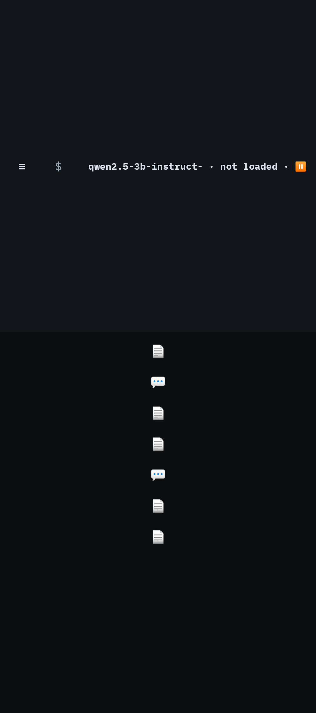

# Skein — Information Architecture

**Bead:** `skein-xtov.13` · **Epic:** `skein-xtov` (UX overhaul) · **Authority:** `docs/research/SKEIN_UI_UX_OVERHAUL_PROMPT.md` §3, §20–23, §33–35, §42
**Status:** Proposed — for owner review. Nothing here is implemented. §9 lists the decisions that need the owner's sign-off because they amend the canonical UI spec (`docs/superpowers/specs/2026-09-19-skein-design.md` §8).
**Evidence:** `docs/ux/UX_AUDIT.md` and the per-area audits under `docs/ux/audit/`; reference studies under `docs/ux/research/`; screenshots in `ux-baselines/before/` (JVM) and `ux-baselines/device-before/` (Fold).

---

## 0. The decision in one screen

> **Five destinations, one navigation system per window size, every object opened by what it is.**

| | Today | Proposed |
|---|---|---|
| Primary destinations | Timeline · Notes · Graph · Personas · Settings (3 of 5 are placeholders; all 5 dead while a tab is open) | **Chat · Knowledge · Graph · Models · Settings** — all real |
| Navigation systems | 11 overlapping (drawer, timeline pane, timeline rail landing, icon rail, tab strip, "Recent ▾", command-bar search, `/` palette, split, overlays, in-content links) | **Compact:** modal drawer. **Medium/Expanded:** navigation rail. Plus one command palette and in-content links. That's it. |
| How documents open | Everything opens in the note editor, chats included | **By kind:** a chat opens the chat, a note the editor, a file the viewer |
| Open-document model | Cursor-style preview/pinned tabs, split view | **List–detail with a back stack**; recents replace tabs; "side by side" returns only where there is room for it (≥ 1200 dp) |
| Search & commands | A persistent `$ search or /command` bar that is also the model chip | **Command palette** ("Search or run a command") opened from ⌕, the drawer, `/` in the composer, or Ctrl+K |
| Model identity | Filename or id in a top-bar chip (`qwen2.5-3b-instruct-abliterated-q3-k-m-2c5f9a121ae6 · ●`) | Chat header subtitle **`Qwen 2.5 3B · Local`**, tappable → model & persona sheet |
| Landing | Outer: a floating command bar over a column of glyphs. Inner: timeline + "No tabs open — back to timeline" | **"What are you working on?"** — a composer, four starting actions, and recent work |
| Level 2 depth | Exposed first (timeline, personas, slash syntax, tabs, split) | **Discovered:** attach knowledge → inspect context → commands → graph → projects (later) |


*Today, Fold outer screen (JVM capture): the command bar floats mid-screen above a column of unlabeled glyphs — the "orphaned rail" §22 forbids.*

---

## 1. Current information architecture (summary)

The detailed inventory, the full current navigation graph and every defect are in `docs/ux/audit/AUDIT_SHELL.md` §2–§5 (with `AUDIT_CHAT_MODELS_SETTINGS.md` §1 and `AUDIT_KNOWLEDGE.md` §1). In short:

1. **Two layers that ignore each other.** A *destination* layer (modal drawer: Timeline · Notes · Graph · Personas · Settings) and a *document* layer (Cursor-style tabs, split view, overlays). An open tab silently wins over any destination, so the drawer does nothing once a tab is open — while still highlighting the tapped item (`TabHost.kt:83-87`, locked in by `SkeinAppTest`).
2. **The timeline is the de-facto home**, appearing in five forms (drawer item, 30 % pane, full-screen glyph rail on narrow screens, a dead rail glyph, dead `TimelineDestination`). It mixes chats and knowledge, and opens both as notes.
3. **Chats are not first-class.** The only way to get a chat surface is to type `/chat`; every chat is titled "Chat"; reopening one from anywhere lands in the note editor with no composer; nothing can be renamed on purpose or deleted.
4. **Creation and search live only in typed syntax** (`/new note`, `/chat`, `/models`, `/import model`); no visible New chat / New note exists in production.
5. **No Back handling anywhere**; on the outer display the first tap traps the user in a tab ("Recent ▾" cannot close).
6. **Nothing survives a fold** (no `configChanges`, no ViewModel, plain `remember` for drafts/overlays/generation), and a vault lock resets the whole shell.

Of the 11 navigation paradigms, 4 are fully dead (icon rail, 3 drawer destinations), 3 duplicate each other (timeline ×5, graph ×3, settings ×2), and 2 are implementation concepts leaking into the product (preview/pinned tabs, slash parser).

---

## 2. Principles applied (from prompt §2, sharpened by the audit)

1. **Product objects, not storage kinds.** The user sees *chats*, *notes*, *files*, *models*, *personas*. They never see *documents*, *tabs*, *timeline*, *vault ids*, *GGUF*, *chunks* or *embeddings* unless they open an explicitly technical view.
2. **Open by kind.** Every navigation to an object dispatches on its kind. There is exactly one screen per kind.
3. **One navigation system per window size.** Drawer where a rail won't fit, rail where it will — never both, never a drawer *and* a timeline *and* tabs.
4. **Panes are destinations.** Secondary surfaces (context inspector, connections, node detail) are back-stack entries, so the same state becomes a pane on the inner screen and a sheet on the outer screen with no reset (`ANDROID_ADAPTIVE_SAMPLES.md` §5.1).
5. **Every visible control works.** A destination appears only when its screen exists. Nothing reads "Coming in v1.1" or names a bead.
6. **Level 1 needs no Level 2 vocabulary.** Chatting, switching chats, attaching a note and managing chats must be possible without meeting the words persona, context, graph, slash, model file or quantization.
7. **Navigation state is ids, not content.** The back stack holds object ids only, so it can survive a fold, a process death *and* a vault lock without keeping plaintext outside the vault (§6.3).

---

## 3. Proposed IA

### 3.1 The objects a user meets, and their names

| Object (user-facing) | Storage today | Level | Primary home | Opens in |
|---|---|---|---|---|
| **Chat** | `documents` kind `chat` + `messages` rows | 1 | Chat | Chat screen |
| **Note** | `documents` kind `note` | 1–2 | Knowledge | Note editor |
| **File** (PDF, image, text you imported) | `documents` kind `note` + `attachment` pair | 2 | Knowledge | File viewer (with its extracted text) |
| **AI output** saved as a note | `documents` kind `note`/`ai_output` | 2 | Knowledge | Note editor |
| **Model** | model store + registry | 1 (name) / 2 (details) | Models | Model details |
| **Persona** | `personas` | 2 | Chat's model & persona sheet; managed in Settings › Personas | Persona editor |
| **Source** (a cited passage) | retrieval result / citation | 2 | Inside a chat answer | Its note/file, scrolled to the passage |
| **Connection** (link, backlink, related) | `edges`, wikilinks | 2 | A note's Connections; the Graph | Graph node detail |

**Product-language glossary** (the design system's copy rules inherit this):

| Never shown to users | Say instead |
|---|---|
| Timeline | Recent |
| Tab, preview tab, pin, split | — (concept removed; "Open beside" on ≥ 1200 dp only) |
| Vault, envelope, key invalidated | "Skein is locked", "Unlock Skein", "Recover Skein" |
| `$ search or /command` | "Search or run a command" |
| GGUF filename, model id, hash, quantization | Friendly name ("Qwen 2.5 3B") + "Local"; details only in Model details |
| Retrieved context, score 0.83, recalled by: vector | Sources, "Used 3 notes", "Relevant passage" |
| Ingest, indexing, chunks, embeddings | "Preparing for search…", "Searchable" |
| Backlinks (Level 1) | "Linked from" (inside Connections; "Backlinks" is fine in Level 2 copy) |
| DestinationPlaceholder text, bead ids, version promises | — (never; hide the entry instead) |

### 3.2 Primary destinations

| # | Destination | What it is | Why primary |
|---|---|---|---|
| 1 | **Chat** | Conversation history + the active conversation. The default landing. | Level 1 — the front door. |
| 2 | **Knowledge** | Every note and file in one list–detail home: search, filter (Notes · Files · AI outputs), New note, Import file, Rename, Delete; the selected item with its Connections. | Replaces Timeline, Notes, the glyph rail and the "Files" filter. Notes and files are the same underlying object (`AUDIT_KNOWLEDGE.md` §12). |
| 3 | **Graph** | The local graph explorer: a canvas centred on a note (default: the most recently opened one; re-centre via search), with selected-node detail. | Skein's differentiator ("a workspace knowledge graph"). It is *functional* today as a 2-hop local graph, so it can be a real destination — **on one condition:** the Graph item appears only once it is wired as described here (no placeholder), and an empty vault shows a purposeful empty state ("Your graph grows as you link notes with [[ ]]"). A global graph (spec §8.6, v2) later slots in here without IA change. |
| 4 | **Models** | On device · Available · (later) External providers. The active model, import, set default, details. | Local models are central to Skein's identity (Jan). First-run and "switch model" need a home. |
| 5 | **Settings** | Appearance · Privacy & security · Personas · Knowledge & search · About; *Advanced* collapsed at the bottom. | Standard. |

**Not primary:** Personas (a chat parameter; managed in Settings › Personas), Skills / commands / workflows (the command palette; contextual chips in the composer), Repositories / Projects (future — see §8), Timeline (retired), Files (inside Knowledge), Notes (inside Knowledge).

### 3.3 Secondary surfaces (reached from a destination, never from the root)

| Surface | Reached from | Compact (outer screen) | Expanded (inner screen) |
|---|---|---|---|
| **Context inspector** — what this chat is using: model & persona, attached notes/files, sources used by the last answer, context usage, activity | Context chip above the composer; "Sources" on an answer; Ctrl+Shift+I | Bottom sheet | Extra pane (replaces the conversation list while open) |
| **Activity block** — per assistant turn: live steps, then "▸ Worked for 8.1s · 3 sources" | Inline in every answer | Inline, collapsible | Inline, collapsible |
| **Model sheet** — "who answers next": model list, "Model details" link; a persona row appears only once personas exist | Tap the chat header subtitle | Bottom sheet | Anchored menu/side sheet |
| **Attach knowledge** picker | ＋ in the composer; `[[` inline | Full-screen picker | Anchored sheet |
| **Connections** — Linked from, Links to, local graph, properties | A note's ✦ / "Connections"; a file's info | Bottom sheet or route | Extra pane beside the note |
| **Node detail** | Selecting a node in Graph | Bottom sheet | Supporting pane beside the canvas |
| **Command palette** — "Search or run a command" (also where chats are searched on Compact) | ⌕ in Medium+ top bars; the drawer's ⌕ field; `/` at the start of the composer; Ctrl+K | Full-screen | Centred overlay (max 640 dp) |
| **Rename / Delete** | ⋮ on a chat or note (row or header), long-press on a row, palette | Dialog | Dialog |
| **Model details** (filename, format, quantization, size, context, backend, hash, licence) | Models › a model › Details; model & persona sheet | Route | Detail pane |

### 3.4 Navigation containers per window class

The geometry is measured, not assumed (`docs/ux/audit/DEVICE_BEFORE_PASS.md`): the inner screen is **Expanded** at stock density (~852 dp) and at the owner's 330 dpi (~1006–1043 dp); the outer is **Compact** (443 dp stock, ~524 dp at 330). Layout is always a function of the measured window, never of a device model or density. Rules and wireframes: `docs/ux/ADAPTIVE_LAYOUT_SPEC.md`.

| Window | Navigation container | Content panes | Chat | Knowledge | Graph |
|---|---|---|---|---|---|
| **Compact** (Fold outer, phones, split-screen halves) | **Modal drawer** from ☰ in the top bar. No bottom bar (it would fight the composer and the keyboard). | 1 | Conversation, full-width composer | List → full-screen item | Canvas; node detail as a sheet |
| **Compact height** (outer landscape; any window < 600 dp tall) | Modal drawer | 1 | as Compact | as Compact | as Compact |
| **Medium** (larger Display size on the inner screen, tablets portrait) | **Navigation rail** (collapsed) | 1 (Knowledge may use 2 — prototype) | as Compact, prose capped at 576 dp (~79 characters), centred | List → item | Canvas + side sheet |
| **Expanded** (Fold inner, any orientation) | **Navigation rail** (80 dp) | 2 | **Conversations \| Chat** | **Knowledge list \| Item** | **Canvas \| Selected node** |
| **Large** (≥ 1200 dp: tablets landscape, desktop windows) | Expanded rail or permanent drawer | 3 | Conversations \| Chat \| Context | List \| Item \| Connections | Canvas \| Node \| Related |

Three columns never appear on the Fold (§23 "additional panes only when they add value"): at 1043 dp a third pane would leave the chat narrower than the outer screen. On Expanded the context inspector / Connections is an **extra pane that takes the list's place** while open; Back restores the list.

**What the drawer (Compact) contains, top to bottom** — PocketPal's restraint with Skein's depth:
`[✎ New chat]` · `⌕ Search or run a command` · Chat · Knowledge · Graph · Models · Settings · — · **Chats**, grouped *Today / Yesterday / Previous 7 days / Previous 30 days / then by month*, each row titled and with ⋮ (Rename · Delete).

**What the rail (Expanded) contains:** `✎` New chat (top) · Chat · Knowledge · Graph · Models · Settings (bottom). The chat history lives in the Conversations list pane, not in the rail.

### 3.5 Where every concept lives

| Concept (prompt §3) | Level | Where | How the user finds it |
|---|---|---|---|
| Start a chat | 1 | Chat | Landing composer; ✎ in drawer/rail; Ctrl+N |
| Switch chats | 1 | Chat | Drawer history (Compact); Conversations pane (Expanded); palette |
| Rename / delete / search chats | 1 | Chat | ⋮ on row or header; long-press; search field atop the list |
| Stop / retry | 1 | Chat | Send button becomes Stop while answering; Retry/Regenerate on the latest answer (older turns need branching — later) |
| Attach knowledge | 1→2 | Chat composer | ＋ → "Add a note or file"; `[[` inline |
| Inspect context | 2 | Context inspector | Context chip above the composer ("2 notes · Knowledge on"); "3 sources" on an answer |
| Activity / reasoning | 1 (summary) / 2 (detail) | Activity block | Inline; tap to expand |
| Notes, files | 2 | Knowledge | Drawer/rail; "New note", "Import file"; citations |
| Citations | 2 | Chat → the cited note/file | Tap a source → the note/file opens at the passage, pushed on the back stack; Back returns to the same chat and scroll position |
| Graph | 2 | Graph; a note's Connections | Drawer/rail; ✦ on a note |
| Personas | 2 | Model & persona sheet; Settings › Personas | Tap the header subtitle |
| Models (friendly) | 1 | Chat header | Always visible as "Qwen 2.5 3B · Local" |
| Models (technical) | 2 | Models › Details | Models destination |
| Commands / skills / workflows | 2 | Command palette; `/` in composer | ⌕, Ctrl+K, `/` |
| Keyboard shortcuts | 2 | Palette › "Keyboard shortcuts"; Ctrl+/ | Discoverable in the palette rows (each shows its shortcut) |
| Repositories / projects | future | Knowledge › Collections → a later "Projects" destination | §8 |
| External (cloud) providers | future | Models › External providers (hidden until built) | §8 |
| Lock Skein, security | 1 | Settings › Privacy & security; palette "Lock Skein" | |

### 3.6 The progressive-disclosure ladder (prompt §3)

| Step | What the user does | What they newly meet | Where it appears first |
|---|---|---|---|
| **Ask Skein** | Types in the composer | Chat, history, rename/delete | Landing |
| **Attach Knowledge** | ＋ → pick a note/file; or `[[` | Notes, files, the context chip | The composer's ＋ |
| **Inspect Context** | Taps the context chip or "3 sources" | Sources, context usage, activity detail, persona | The chip / the answer footer |
| **Use a command / skill** | `/` in the composer, or ⌕ | The command palette | The composer's first character; the ⌕ |
| **Explore Graph** | ✦ on a note, or Graph in the drawer | Connections, the local graph | A note's header; the drawer/rail |
| **Open Project / Repository** | (later) | Projects | A future destination (§8) |

Nothing on the Level 1 path requires a Level 2 word. Level 2 affordances are *present but quiet*: one ＋, one chip, one ⌕, one ✦.

### 3.7 Start state and empty states

- **First launch after unlock, no chats:** the Chat destination's empty state — "What are you working on?", the composer ("Ask Skein…"), four actions (*New note · Import file · Search knowledge · Choose a model*), nothing else. If no model is ready: the composer stays usable for drafting and a single inline card says "Choose a model to start" (→ Models).
- **Returning:** restore the last destination and object (the back stack, §6.3). On Expanded with nothing selected, the detail pane shows the same "What are you working on?" state plus **Recent** (chats and notes) — never "No tabs open".
- Every empty state answers "what should I do next?" (prompt §33); copy lives in the design system.

### 3.8 Back and cross-links

- **System Back always does one thing:** close the topmost sheet/palette/dialog → pop the back stack → (at a destination root) go to Chat → (at Chat root) leave the app. `navigation-event` back handling per `ANDROID_SKILLS_ASSESSMENT.md`.
- **Cross-links** push onto the back stack and dispatch by kind: a citation in a chat → the note/file at the passage, Back returns to the same chat scroll position; a wikilink → the note; a graph node → *select* first (detail), "Open" second; a note's "Ask about this" → a new chat with the note attached.

---

## 4. What is retained, changed, removed

| Current paradigm / screen | Verdict | Replacement / reason |
|---|---|---|
| Persistent top command bar (`$ search or /command` + model chip) | **Change** | Per-destination top app bars; search/commands move to the palette; the model moves to the chat header subtitle. Frees the outer screen's top bar (the chip crushes the field to ~0 dp today, `AUDIT_SHELL.md` P0-12). |
| `/` slash palette (4 raw commands) | **Change** | Command palette with icons, descriptions, shortcuts, ranking, recents (`CONTINUE.md` §Proposed palette). Slash syntax still works as a power path. Tapping a row *runs* it. |
| Hamburger modal drawer | **Keep (Compact only)** | Real destinations + New chat + chat history. On Medium/Expanded it becomes the rail. |
| Timeline (pane, rail landing, destination) | **Remove** | Chats → Chat history; notes/files → Knowledge (sorted by Recent); "Recent" in the palette's empty state. The persona filter becomes a Knowledge filter (Level 2). |
| Shell icon rail (40 dp, all dead) | **Remove** | Material navigation rail on Medium/Expanded. |
| Tabs (preview/pinned, strip, "Recent ▾") | **Remove** | List–detail + back stack. Open-work switching via Recent in the palette and Ctrl+Tab (MRU). The tab data model is not migrated. |
| Split view (⧉) | **Remove in v1** | "Open beside" returns only at ≥ 1200 dp as the third pane. The Fold never had room for it without squeezing. |
| Full-screen overlays (graph, models) | **Change** | They become destinations (Graph, Models) with real Back. |
| Drawer › Personas (placeholder) | **Remove** | Persona is chosen in the chat's model & persona sheet; managed in Settings › Personas once `skein-3iw` lands (hidden until then). |
| Drawer › Notes (placeholder) | **Change** | Knowledge. |
| Drawer › Graph (placeholder) | **Change** | Graph destination (real). |
| Note tab ✦ graph overlay | **Change** | The note's Connections (extra pane / sheet) with "Open in Graph". |
| Chat `⚹ context` toggle + inline panel | **Change** | Context chip → context inspector (sheet / extra pane). |
| Chat bottom bar `$ · 📎 · ⏎` | **Change** | Composer: ＋ (attach) · text · Send/Stop; `/` and `[[` stay as power paths. |
| Import status row (floats over the composer) | **Change** | Progress lives in Models and a transient snackbar; never over the composer. |
| Settings › "Available once … (skein-bxk)", "Coming in v1.1" | **Remove** | Hidden until real (principle 5). |
| Vault gate screens (setup, unlock, reset, restore, recovery) | **Keep, restyle** | Product language ("Unlock Skein"); the recovery screen gets its missing action. |

---

## 5. Navigation diagrams

### 5.1 Proposed navigation graph

```mermaid
flowchart TD
  Launch([Launch]) --> Gate{Skein locked?}
  Gate -->|first run| Setup[Set up Skein]
  Gate -->|locked| Unlock[Unlock Skein]
  Setup --> Home
  Unlock --> Restore[Restore last back stack\nids only]
  Restore --> Home

  subgraph Nav["Drawer (Compact) / Rail (Medium+)"]
    NewChat[✎ New chat]
    Search[⌕ Search or run a command]
    D1[Chat]
    D2[Knowledge]
    D3[Graph]
    D4[Models]
    D5[Settings]
  end

  Home["Chat — 'What are you working on?'"] --- Nav
  D1 --> ChatList["Conversations\n(grouped, searchable, ⋮ rename/delete)"] --> Chat["Chat\nheader: title · Qwen 2.5 3B · Local"]
  NewChat --> Chat
  Chat -->|context chip / sources| Inspector["Context inspector\nsheet ▸ Compact · extra pane ▸ Expanded"]
  Chat -->|header subtitle| ModelSheet["Model & persona sheet"]
  Chat -->|＋ / [[| Attach["Attach knowledge picker"]
  Chat -->|tap source| Item
  D2 --> KList["Knowledge list\nsearch · Notes/Files · New · Import"] --> Item{"open by kind"}
  Item -->|note| Note["Note editor"]
  Item -->|file| File["File viewer"]
  Item -->|chat| Chat
  Note -->|✦ Connections| Conn["Connections\nextra pane ▸ Expanded · sheet ▸ Compact"]
  Conn -->|Open in Graph| Graph
  D3 --> Graph["Graph canvas\ncentred on a note"] -->|select node| Node["Node detail\nsupporting pane / sheet"] -->|Open| Item
  D4 --> Models["Models\nOn device · Available"] --> ModelDetails["Model details (technical)"]
  ModelSheet --> ModelDetails
  D5 --> Settings["Settings\nAppearance · Privacy & security · Personas · Knowledge & search · About · Advanced"]
  Search --> Palette["Command palette"] -->|result| Item
  Palette -->|command| Commands["New chat · New note · Import · Switch model · …"]
```

### 5.2 Layout sketches (details and every destination in `ADAPTIVE_LAYOUT_SPEC.md`)

**Fold outer (Compact) — Chat**
```text
┌─────────────────────────────┐
│ ☰  Skein UX redesign    ✎ ⋮ │
│    Qwen 2.5 3B · Local ▾    │
├─────────────────────────────┤
│ You                         │
│ Explain this architecture.  │
│                             │
│ Skein                       │
│ ▸ Worked for 6.2s · 3 sources│
│ The architecture…           │
│                             │
├─────────────────────────────┤
│ 📝 2 notes · Knowledge on   │
│ ＋  Ask Skein…          ↑   │
└─────────────────────────────┘
```

**Fold inner (Expanded, portrait ~1006 dp at 330 dpi) — Chat**
```text
┌──┬──────────────────┬─────────────────────────────────────────┐
│✎ │ ⌕ Search chats   │ Skein UX redesign                  ⋮    │
│  │ Today            │ Qwen 2.5 3B · Local ▾                   │
│💬│ ▌Skein UX redes… │─────────────────────────────────────────│
│📚│  RAG architecture│ You                                     │
│✦ │ Yesterday        │ Explain this architecture.              │
│▦ │  Mycology resear…│                                         │
│  │ This week        │ Skein                                   │
│  │  Continue repo … │ ▸ Worked for 6.2s · 3 sources           │
│  │                  │ The architecture…                       │
│⚙ │                  │─────────────────────────────────────────│
│  │                  │ 📝 2 notes · Knowledge on               │
│  │                  │ ＋  Ask Skein…                      ↑   │
└──┴──────────────────┴─────────────────────────────────────────┘
 rail  Conversations 320 dp        Chat (≈ 600 dp at 330 dpi)
```
Opening the context inspector on Expanded: `rail | Chat | Context` (the list yields its place); Back restores `rail | Conversations | Chat`.

---

## 6. Migration reasoning

### 6.1 Why this shape

- **It removes whole classes of defects instead of patching them.** The dead drawer items, dead rail, tab trap, "open everything as a note", overlay loss on fold and the destination/tab conflict all come from having two uncoordinated navigation layers. One back stack of typed keys, dispatched by object kind, deletes the conflict (`AUDIT_SHELL.md` §3.2).
- **It makes the Fold transition a re-layout, not a reset.** When secondary surfaces are back-stack entries, Material's pane scaffolds decide per window whether an entry is a pane or a sheet; the stack itself never changes on fold/unfold (`ANDROID_ADAPTIVE_SAMPLES.md` §5.4).
- **It gives Level 1 a PocketPal-simple path** (drawer → chat → composer; `POCKETPAL.md` A3) while keeping Continue/Zed-style depth one gesture away (palette, context inspector, Connections; `CONTINUE.md`, `ZED.md`).
- **It follows the object model that already exists.** Notes and files are one kind of row; chats are another; the graph is local to a note (`AUDIT_KNOWLEDGE.md` §12, `LIFECYCLE_FINDINGS.md` §1). The IA mirrors storage instead of fighting it — so no storage refactor is needed for the IA itself.

### 6.2 What it costs

- **Navigation rewrite** (Wave 3): replacing `SkeinApp`'s slot switch, `TabsState`, `AdaptivePaneHost`, `SplitCoordinator`, `NavState` and the timeline shell wiring with Navigation 3 + adaptive scene strategies (`ANDROID_ADAPTIVE_SAMPLES.md` §4.2, prototype first) and `NavigationSuiteScaffold`. `MainActivity`'s 1,037 lines of wiring shrink into per-destination entry providers.
- **Feature modules keep their screens.** `ChatScreen`, `NoteTab`/`SkeinEditor`, `GraphScreen`, `ModelsScreen`, `SettingsScreen` are re-hosted, then redesigned in their own waves. Timeline code (`feature/timeline`) is mostly retired; its list/formatting pieces seed the Knowledge list and chat history.
- **Tests that lock in current behaviour must change** (e.g. `SkeinAppTest` "an open tab still wins over a non-TIMELINE destination", "No tabs open — back to timeline"). They are specifications of the defects.

### 6.3 Security posture of navigation state (needs review)

The back stack is saved (`rememberNavBackStack`, `SavedStateHandle`) so it survives recreation and process death. It must hold **ids only** (chat id, note id, graph focus id, which pane is open) — never titles, drafts or message text — because the saved-state Bundle is held by `system_server` outside the vault. Keeping the id-only stack **across a vault lock** (and re-resolving after unlock) is what fixes "a lock resets the whole shell" (`AUDIT_SHELL.md` P0-11). Drafts need an owner decision: in-memory only (lost on process death), or an encrypted draft row in the vault (`ANDROID_ADAPTIVE_SAMPLES.md` §5.6 row 5). Recommended: **encrypted draft row**, written on pause.

### 6.4 Order of change (full plan in `UX_MIGRATION_PLAN.md`)

Wave 2 design system → Wave 3 navigation shell (this IA, with today's screens re-hosted) → Wave 4 chat → Wave 5 chat lifecycle → Wave 6 Knowledge & notes → Wave 7 context inspector → Wave 8 graph → Wave 9 models & settings → Wave 10 palette & keyboard → Wave 11 baselines & accessibility. P0 dead controls that survive until their wave are hidden immediately (a small Wave 2.5 "hide the dead" change) so no visible control is dead while the rest proceeds.

---

## 7. Room for what comes later (so it can be added without redesign)

| Future capability | Where it slots in | What the IA reserves now |
|---|---|---|
| **Projects / repositories** | A sixth destination "Projects" (Files \| Active work \| Context, prompt §21) *or* Knowledge › Collections | Knowledge list supports a "Collection" facet; the rail has room for one more item |
| **External / frontier compute** | Models › External providers; the model & persona sheet lists providers under "Local" models; the header secondary label becomes the provider name instead of "Local" | "Local" is a *label*, not an assumption: the chat header renders `name · where` |
| **Skills, tools, workflows** | Palette commands and composer chips; an activity-block step ("Running skill…"); Settings › Skills for management | Palette command registry with scopes; activity step types |
| **Global graph** | The Graph destination's default view | The destination already exists |
| **Local API / desktop tooling** | Settings › Advanced › Local access (never in Level 1) | Nothing now (`JAN.md` §6.4) |
| **Split / side by side** | Large windows' third pane; "Open beside" | Back-stack keys are pane-agnostic |

---

## 8. Open questions (non-blocking; answered in the specs)

1. Knowledge on Medium: one pane or two? → prototype in Wave 6 (`ADAPTIVE_LAYOUT_SPEC.md`).
2. Context inspector on Expanded: replace the list (Material default) or a 360 dp side sheet that keeps the list? → decide from screenshots in Wave 7.
3. Does "Recent" deserve a slot in the rail? → no for v1 (palette empty state + Knowledge sort), revisit after usage.

---

## 8a. Revisions after spec review (2026-09-26)

`CHAT_UX_SPEC.md` §23 proposed six refinements; all are adopted above: ✎ New chat (not ⌕) in the Compact chat header, with the palette reached from the drawer's ⌕ field and `/`; date groups *Today · Yesterday · Previous 7 days · Previous 30 days · by month*; regenerate only the latest answer in v1; the header's model label means "answers next" until per-chat models exist; a Model sheet (persona row only once personas exist); chat search on Compact through the palette's *Chats* section.

`DESIGN_SYSTEM.md` §18 proposed five more; all adopted: prose width capped at **576 dp** on every window class (720 dp was ~99 characters per line); in chat history the ⋮ is visible on the selected row and on hover/focus, with long-press and TalkBack actions everywhere (no column of identical icons); a visible author label on assistant turns only; the emoji in this document's sketches are placeholders for the design system's icon set; the Expanded extra pane (context inspector / Connections) is **320 dp**, keeping the chat ≥ 420 dp at stock density.

## 9. Decisions needing owner sign-off (they amend spec §8)

| # | Spec today | Proposed | Why |
|---|---|---|---|
| **D1** | §8.2 Persistent command bar at the top (search + slash + model status) | Per-destination top bars; a command palette; model in the chat header | The bar crushes the outer screen (P0-12), conflates three jobs, and exposes slash syntax as the primary UX |
| **D2** | §8.2 Hamburger: Timeline · Notes · Graph · Personas · Settings; dual-pane timeline 30 % / tabs 70 % | Chat · Knowledge · Graph · Models · Settings; drawer on Compact, rail on Medium+; list–detail panes | Three of five are placeholders; timeline duplicates everything; Fold transitions reset state |
| **D3** | §8.3 Cursor-style preview tabs, split view, "Recent ▾" on phones | Removed in v1; back stack + Recent + Ctrl+Tab; side-by-side only ≥ 1200 dp | Tabs are the second navigation layer that breaks the first; the outer-screen tab trap is P0 |
| **D4** | §8.1 Monospace primary type everywhere | Legible UI typeface for messages, titles, controls; monospace for code, paths, ids, commands, logs, model technical details | Prompt §36; readability at the outer screen's width and at large font scales |
| **D5** | §8.4 Context panel toggle `⚹ context`; bottom bar `$ · [[ · / · 📎 · ⏎` | Context chip + inspector; composer `＋ · text · Send/Stop` with `/` and `[[` as power paths | Product language; one clear next action |
| **D6** | §8.6 Graph opened from ✦ as a view of one note | Graph is also a primary destination (centred on the most recent note) | Owner framing: "a workspace knowledge graph"; the local graph already works |
| **D7** | (new) | Navigation back stack survives a vault lock as ids only; drafts stored as encrypted vault rows | Fixes "lock resets the shell" without plaintext outside the vault — **security review requested** |
| **D8** | (new) | Navigation 3 + material3-adaptive scene strategies replace the hand-rolled shell (prototype gate first) | Official adaptive path; state preserved per entry |
