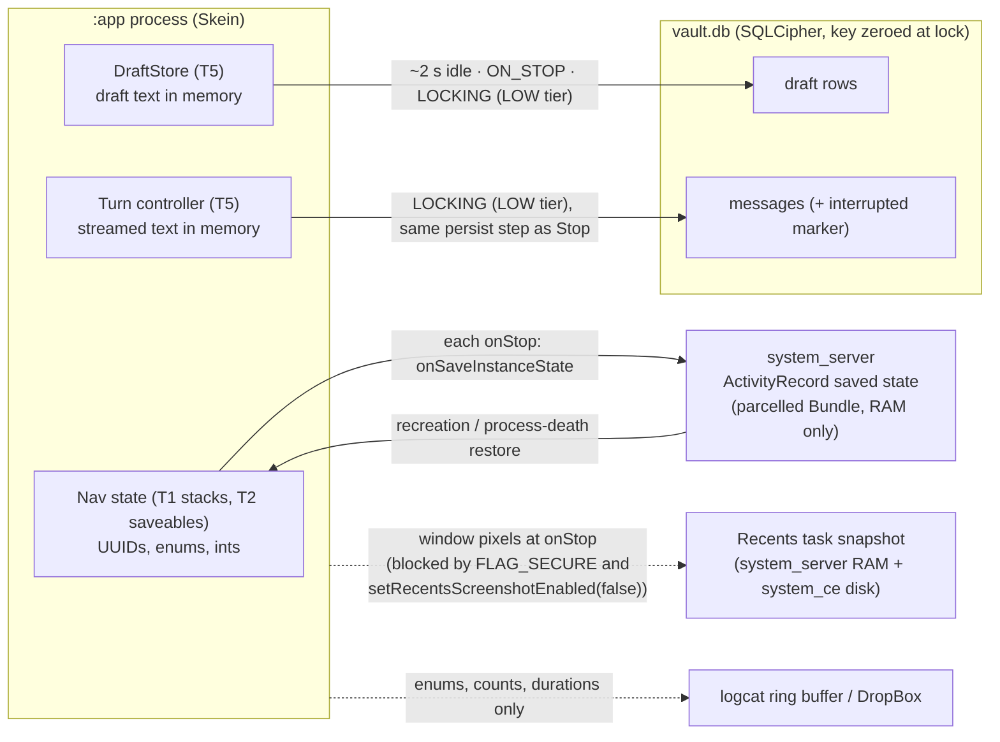

# Security review: D7, keeping place, drafts and partial answers across a lock

**Bead:** `skein-xtov.24.1` (SEC-D7) · **Epic:** `skein-xtov` · **Gate:** UX Wave 3 entry ("D7 security review done", `UX_MIGRATION_PLAN.md` §4)
**Decision under review:** IA D7 with A-b, A-c and A-d, accepted by the owner on 2026-09-26 (`UX_MIGRATION_PLAN.md` §2.0, `INFORMATION_ARCHITECTURE.md` §6.3, `ADAPTIVE_LAYOUT_SPEC.md` §7, §13.7, §14.2–14.4)
**Verdict:** **APPROVED WITH CONDITIONS** (§8). The conditions are the MUSTs in §5. None of them blocks the start of Wave 3. Each one blocks the bead that owns it from closing.

---

## 0. Summary

The owner approved three mechanisms: (1) a navigation back stack of ids only, saved in the Activity's saved state; (2) composer drafts as encrypted vault rows; (3) a lock ending a live answer through the Stop path, so the partial answer is kept with an interrupted marker. Under the conditions below, none of them puts user-authored text or model output outside the vault. Measured against `main` today, D7 **reduces** what leaves the vault:

- Today's saved-state Bundle already holds **tab titles, document ids and the typed command-bar text** (`TabsState.Saver`, `feature/shell/…/tabs/TabsState.kt:151-181`; `NavState.Saver`, `nav/NavState.kt:73-83`). D7's ids-only stack removes both leaks.
- Today a lock drops the partial answer **by accident**: the collector is scoped to the composition, and the persist block never runs (`SendPipeline.kt:242-297`). Generation is cancelled from the TEARDOWN tier (`VaultBootstrap.kt:246` → `ModelServices.onLocking`), so if a persist did run, it would race `session.close()`.

This review found gaps that the mechanism as written would ship with:

1. **Some "ids" are text.** A graph node id can be `tag:<tag text>` or `title:<lowercased link title>` (`feature/graph/…/GraphModels.kt:41-70`). A model id is the filename slug plus a hash prefix (`ModelManager.deriveId`, `core/inference/…/ModelManager.kt:623-631`). An imported note keeps any non-blank frontmatter `id:` as its document id, with no format check (`ImportServiceImpl.kt:260,290`; `VaultRepositoryImpl.resolveDocumentId`, `:910`). "Ids only" therefore has to mean **canonical UUIDs, enforced by type** (M1, M2).
2. **A lock-time write can race the vault close.** `UnlockManager` gives HIGH and LOW observers one shared **500 ms** window (`DEFAULT_OBSERVER_BUDGET_MILLIS`, `UnlockManager.kt:679`; the design doc still says 2000 ms). When that window expires it cancels the coroutine, but it cannot interrupt a blocking SQLite `step()` that is already running. TEARDOWN then closes the pool without taking the repository's writer lock (`VaultLifecycle.close`, `:348-368`; `ConnectionPool.closeAll`, `:92-101`). Draft rows and the partial answer add two writers inside exactly this window (M7, M8, M10).
3. **The literal Stop path is not bounded.** During prefill, a cancel is noticed only between 512-token chunks, which takes "several seconds" on the Fold (`CHAT_UX_SPEC.md` §9.8). The lock path must persist what is visible at that moment and must not wait on the engine (M10).
4. **Clearing driven by composition happens late.** Compose pauses the window recomposer while the Activity is stopped, and a screen-off lock nearly always lands then. Anything cleared only "when `NavDisplay` leaves composition" therefore stays in memory until the user comes back (M12).
5. **Recents thumbnails.** `FLAG_SECURE` is a user toggle, and the owner's watcher sessions turn it off. With it off, the Recents card shows the last screen from before the lock. That card persists while Skein is locked and can serve as the starting window after process death. `setRecentsScreenshotEnabled(false)` closes this regardless of the toggle (M5).

---

## 1. Scope, sources and threat model

**Read for this review:** `UX_MIGRATION_PLAN.md` §2; `INFORMATION_ARCHITECTURE.md` §2.7, §3.7, §6.3, §8b, §9 (D7); `ADAPTIVE_LAYOUT_SPEC.md` §4.8, §7 (7.1–7.7), §8 (8.2, 8.3, 8.7, 8.9), §9.2–9.4, §11, §12, §13.7, §14; `CHAT_UX_SPEC.md` §7.3, §7.7, §9.8–9.11, §10, §27, §28; `OBJECT_LIFECYCLE_SPEC.md` §3.1–3.7, §4.2 (C1), §10; `UX_TEST_PLAN.md` §8, §9; `docs/design/LOCK_POLICY_INDEXING.md` (all); `docs/design/export-plaintext-lifetime.md`; `docs/PRIVACY.md` §1, §6, §7; design spec §2 and §9; `docs/BACKUP_EXCLUSIONS.md`; `SECURITY.md`. There is no `THREAT_MODEL.md` in the tree; spec §9 is authoritative until M3.

**Code read:** `core/vault/…/session/{UnlockManager,LockObserver,LockPolicy,LockReason,UnlockState}.kt`; `app/…/vault/{VaultBootstrap,VaultSession,DeviceVaultOpener,LockPolicyObserver,GatePhase}.kt`; `app/…/MainActivity.kt` (gate, `FLAG_SECURE`, task description); `app/…/system/{SecurityPrefs,AndroidSkeinLogSink}.kt`; `app/…/models/ModelServices.kt`; `app/…/ingest/IngestScheduler.kt`; `feature/chat/…/{SendPipeline,ChatViewModel,ChatTurnState}.kt`; `feature/editor/…/notetab/NoteTab.kt`; `feature/shell/…/{tabs/TabsState,nav/NavState}.kt`; `feature/graph/…/GraphModels.kt`; `core/vault/…/{repository/VaultRepositoryImpl,lifecycle/{VaultLifecycle,ConnectionPool},db/SkeinSQLiteConnection,id/Uuid7,transfer/ImportServiceImpl,export/ExportServiceImpl,provider/ProviderIds}.kt`; `core/inference/…/models/ModelManager.kt`; the manifest and both backup rule files.

**Adversaries (spec §9) that matter for D7:**

| Adversary | Relevant to D7? | How |
|---|---|---|
| Physical attacker with the **device** unlocked and **Skein** locked (screen-off or idle lock fired) | **Yes, primary** | Opens Recents, opens Skein, reads logcat, `dumpsys` and DropBox over `adb` if USB debugging is on (it is on the owner's Fold), and on a debuggable build can dump the heap or attach a debugger |
| Co-installed malicious app | Yes | Sends explicit intents to the exported `MainActivity`; cannot read another app's saved state, logs or Recents |
| Backup exfiltration (Seedvault D2D) | Checked; no exposure | Saved instance state is not app data, and drafts live in `vault.db`, which is excluded (`data_extraction_rules.xml`) |
| Malicious note content or prompt injection | Minor | Partial answers are untrusted model output that is now persisted at lock. Imported files choose their own document ids |
| Third-party keyboard | Unchanged | The composer already exposes typed text to the IME. Restoring a draft hands it to the IME again as surrounding text |
| Rooted or compromised OS; forensic extraction of an unlocked, cooperating device | **Out of scope** (spec §9, `PRIVACY.md` §7) | Still the only realistic reader of `system_server` memory, so what the Bundle holds is kept minimal as defence in depth |

**Rating scales.** Likelihood: *Rare · Unlikely · Possible · Likely* (without the mitigation). Impact: *Low* (metadata; privileged reader) · *Medium* (loss of user-authored text; a crash; metadata an in-scope attacker can read) · *High* (plaintext content outside the vault, or content on screen while Skein is locked).

---

## 2. Ground truth: what the code does today

| # | Fact | Where | Why it matters for D7 |
|---|---|---|---|
| G1 | Lock order: `Locking` → HIGH tier, then LOW tier, both under **one shared** `withTimeoutOrNull(500 ms)` → TEARDOWN under a **fresh** 500 ms window → `keyProvider.lock()` (zeroes the key) → `Locked` → `onLocked`. Observers within a tier run concurrently. Every observer is handed the full `budgetMillis`, not what is left of it. | `UnlockManager.kt:310-353, 543-633, 679` | Drafts and the partial answer have to fit into LOW's share of 500 ms. `LOCK_POLICY_INDEXING.md` §4 says 2000 ms. |
| G2 | Registered today: HIGH = `IngestScheduler` (cancels WorkManager work) and `ExportStageCoordinator`. LOW = the editor's `FlushBeforeLock` (per open note tab). TEARDOWN = `VaultBootstrap.LockHandler` (fails the provider closed → `models.onLocking` → drops the session reference → `session.close()`). | `IngestScheduler.kt:184`, `ExportStageCoordinator.kt:119`, `NoteTab.kt:281-295`, `VaultBootstrap.kt:217-252` | The partial answer must be persisted in LOW. Generation is cancelled in TEARDOWN today, which is too late for a persist. |
| G3 | `session.close()` → `lifecycle.close()` runs a TRUNCATE checkpoint and then `ConnectionPool.closeAll()`. **Neither takes the repository's `writerMutex`.** `writeTx` holds `writerMutex` across `BEGIN IMMEDIATE … COMMIT` on `Dispatchers.IO`. A cancelled coroutine does not interrupt a blocking native `step()`. `SkeinSQLiteConnection.closed` is a plain `var`. SQLite runs serialised (`SQLITE_THREADSAFE=1`) with `sqlite3_close_v2`. | `VaultLifecycle.kt:348-368`, `ConnectionPool.kt:92-101`, `VaultRepositoryImpl.kt:773-791`, `SkeinSQLiteConnection.kt:17-30`, `native/sqlite/CMakeLists.txt:457`, `skein_jni.c:97,111` | A write that overran the budget can still be running when the pool closes. SQLite keeps the database consistent, but whether the partial answer is saved becomes a race. A late `prepare` can reach a closed handle. |
| G4 | The Stop path: `engine.cancel()` → `Token.Done(CANCELLED)` → the parser flushes → one `appendMessage(ASSISTANT, text + INTERRUPTED_MARKER, citations)`. The marker is an HTML-comment suffix inside the message text. A blank turn is never persisted. | `SendPipeline.kt:82-85, 242-297` | This is the "same transaction path" the lock must reuse. Because the marker sits inside the text, it can be spoofed. |
| G5 | The chat's collector runs on a composition scope (`ChatViewModel`'s `scope` comes from `rememberCoroutineScope`). Leaving composition cancels it, and the persist never runs. | `ChatViewModel.kt:196-242`, `MainActivity.kt:396` | Explains why partial answers are lost today; C1 fixes it. |
| G6 | Document ids are UUIDv7: 48 bits of **millisecond creation time**, then random bits. Message and persona ids are the same. **Exception:** `importProse` keeps any non-blank frontmatter `id` when nothing collides, and `createDocument` accepts any string. | `Uuid7.kt:7-11`, `ImportServiceImpl.kt:260-290`, `VaultRepositoryImpl.kt:139-158, 910-914` | Every UUIDv7 id reveals when its object was created. An imported id can be free text. |
| G7 | Graph node ids take four shapes: a document id, `entity:<n>`, **`tag:<text>`** and **`title:<lowercased title>`**. | `GraphModels.kt:41-70`, `EdgeUpserter.kt:198` | A naive `GraphNodeKey(nodeId: String)` puts tags and link titles into the Bundle. |
| G8 | Model ids are `slug(displayName)-<sha prefix>`, where the display name comes from the filename. | `ModelManager.kt:623-631` | This is ask B9's premise. A `ModelDetailsKey(modelId)` would carry the filename. |
| G9 | Ids already travel in exports: the frontmatter `id`, the vault zip's `.skein/manifest.json` (mapping id → file name, and the file name comes from the title), `attachments/<id>.<ext>`, and DocumentsProvider URIs `note:<id>` / `att:<id>`. | `ExportServiceImpl.kt:94-117, 183-194`, `ProviderIds.kt:29-30` | An id in the Bundle can be joined to a title through an export. |
| G10 | `FLAG_SECURE` is on by default, set synchronously before the first frame, and **user-toggleable** (Settings › Security). The task description is stubbed to the app name. `setRecentsScreenshotEnabled` is not called. | `MainActivity.kt:250-276, 874-880`, `SecurityPrefs.kt:35-44, 166` | With the toggle off, the Recents snapshot shows content (X1). |
| G11 | Notifications are `VISIBILITY_SECRET` with counts-only text. Deep-link intents carry only allowlisted paths and are ignored today. | `notify/Channels.kt`, `IndexingNotifier.kt`, `ADAPTIVE_LAYOUT_SPEC.md` §8.7 | D7 must not add a notification or an intent that carries an id. |
| G12 | `SkeinLog` is the only log path. The Android sink sanitises throwables, and release builds strip `d`/`i`. Repository exception messages embed ids (`"no document with id=$id"`, `"not a chat document: $chatDocId"`). | `AndroidSkeinLogSink.kt`, `VaultRepositoryImpl.kt:353, 826` | An uncaught exception on the restore path would record an id in logcat's crash buffer and in DropBox. |
| G13 | `SQLITE_SECURE_DELETE` is compiled in, so freed B-tree cells are zeroed. The lock runs a TRUNCATE WAL checkpoint. | `OBJECT_LIFECYCLE_SPEC.md` §3.7, `CMakeLists.txt:450`, `VaultLifecycle.kt:358` | Old draft versions survive only as ciphertext in WAL frames, and only until the next lock. |
| G14 | The editor also flushes from `onDispose` and `ON_STOP` onto a process-lived `flushScope`, so such a write can run after `onLocking` has returned. | `NoteTab.kt:140-151, 274` | A pattern the draft store must **not** copy (M7). |
| G15 | `data_extraction_rules.xml` excludes the database domain and `vault.db*`, with `root/.` as a fail-safe. Saved instance state is not a file under the app's data directory. | `DataExtractionRulesTest`, `BACKUP_EXCLUSIONS.md` | Drafts and the saved stack cannot leave through backup. |

---

## 3. Assets and data flows

### 3.1 Assets

| Asset | Sensitivity | Where D7 touches it |
|---|---|---|
| Composer draft text, caret, pending `[[` attachment ids | **High.** Unsent, user-authored, often more candid than what is sent | Mechanism 2 |
| Partial model answer and its citations (excerpts of notes) | **High.** Content derived from the vault | Mechanism 3 |
| Chat, note, file, Space and message **titles and bodies** | High | Must never reach mechanism 1 |
| Object ids (UUIDv7) | **Low–Medium.** They encode creation times and can be joined to exports | Mechanism 1 |
| Navigation facts (which object is open, which pane, scroll anchors, caret offsets, expanded blocks) | Low. Behavioural metadata | Mechanism 1 (T1 and T2) |
| Model identity (filename slug) | Low–Medium ("abliterated" and similar) | Mechanism 1, `ModelDetailsKey` |
| The master key's lifetime | **Critical.** Non-negotiable per `LOCK_POLICY_INDEXING.md` §3.3 | Mechanisms 2 and 3 run inside LOCKING |

### 3.2 Data-flow overview



### 3.3 Mechanism 1: the ids-only navigation state

| | Detail |
|---|---|
| **Bytes that leave the vault** | The whole Activity saved-state Bundle, not just the back stacks. **T1:** the top-level destination (enum), one serialised `NavBackStack` per destination (key class serial names, field names, UUID strings, enums), and the current Space id. **T2**, through the hoisted `SaveableStateHolder`: transcript anchor (message id + pixel offset + a "following" flag), the set of expanded activity blocks (message ids), `LazyListState` index and offset, editor caret and selection (ints), graph zoom and pan (floats), dragged pane widths, Knowledge filter (enum). **Framework entries:** view hierarchy state, `SavedStateRegistry` entries (including any `SavedStateHandle`), and `FragmentManager` state (the `BiometricPrompt` fragment's constant prompt strings). |
| **What the bytes disclose** | Which objects were open and in which pane. Each UUIDv7's creation time, to the millisecond (chat, note, Space, anchored message, expanded messages). Lower bounds on counts and sizes (a list index; a caret offset as a note length). The chat → cited-note relationship (`ChatSourceKey`). Once joined to an export (G9): the titles and contents of those objects. |
| **Where it lives** | Skein's heap (`SnapshotStateList`s above `VaultGate`). At every `onStop` (API 28+: after `onStop`) it crosses Binder into `system_server`'s activity record, **parcelled**, in RAM. It is not written to disk: no `persistableMode`, no `PersistableBundle`. After process death, a copy returns to the new process's heap **while the vault is still locked**. |
| **Who can read it** | Skein itself. `system_server` (the system uid). Root, a kernel exploit, or a forensic memory image (out of scope). **Not** other apps (no API returns another app's saved state). **Not** backup, D2D or Seedvault (it is not app data). Over `adb` without root, `dumpsys activity` should print only metadata and the parcel size; this needs device verification (S5). A debuggable build (the owner's watcher sessions) exposes Skein's own heap to `am dumpheap` and JDWP. |
| **How long** | Until the next `onSaveInstanceState` replaces it, the task leaves Recents, a force-stop, or a reboot, and in practice also an app update. It **survives the vault lock and app process death by design**, for as long as the task sits in Recents, which can be days. A deleted id can linger until the next `onStop` (N6). |

### 3.4 Mechanism 2: encrypted draft rows

| | Detail |
|---|---|
| **Bytes that leave the vault** | **None by design.** Plaintext lives in T5 memory while unlocked. The row is a SQLCipher page. Old versions persist as ciphertext in WAL frames until the TRUNCATE checkpoint at lock, and freed cells are zeroed (G13). The only side effect visible outside the vault: `vault.db-wal` grows and its mtime changes about every 2 s while the user types. That is app-private and visible to root only. |
| **What could leak on a bad implementation** | A saveable `TextFieldState` or `rememberSaveable` string going into the Bundle. A "safe" fallback write to DataStore, SharedPreferences or `cacheDir` when the vault is locked or a write fails. A log line or an exception message carrying the text. A dispose-driven write that lands after the lock (G14). A draft that FTS, embeddings, the graph, export, the DocumentsProvider, retrieval or palette search can see. |
| **Who can read it** | A key holder with the vault open. The IME, as it can for any typed text. |
| **How long** | Until the message is sent (deleted atomically with the send, M9), the chat is deleted (cascade), or the draft is cleared. |

### 3.5 Mechanism 3: the partial answer at lock

| | Detail |
|---|---|
| **Bytes that leave the vault** | **None.** It is one more `messages` row. What changes is **how much** model output the vault holds after a lock: previously 0, now what streamed before the lock. Once the chat is anchored at the new message after unlock, that message's id can also enter T2. |
| **Transient exposure** | The streamed text sits in `:app`'s heap, as it already does. The KV cache in the isolated `:inference` process is zeroed on unload (`LOCK_POLICY_INDEXING.md` §4.5; unchanged). |
| **Who can read it / how long** | A key holder. It stays until the message or chat is deleted. At the next unlock it is indexed like any chat message (existing behaviour). |

### 3.6 Cross-cutting surfaces

| Surface | Today | With D7 | Required |
|---|---|---|---|
| Recents thumbnail and task snapshot | Blank with `FLAG_SECURE`. **Shows content when the user turns it off.** Captured at `onStop`, before a screen-off or background lock completes, and never refreshed while locked in the background. Kept by the system (RAM, plus on disk in system-owned credential-encrypted storage) and can be used as the starting window when returning to the task | Same risk. "Reopen where I was" makes the stale card look intentional | M5 |
| Task description | App name only (`MainActivity.kt:254-263`) | A temptation to show "Skein — ‹chat title›" | M5 |
| Window and accessibility title; launcher shortcuts | Not set | A temptation to set `Activity.title` per screen for TalkBack, or to publish "recent chat" shortcuts | M5 |
| Notifications | `VISIBILITY_SECRET`, counts only | No new notification. An "answer interrupted" notice MUST NOT be posted | M5 |
| Logs / DropBox | Sanitised messages; ids in some exception messages | Restore, sanitise, draft and turn-end paths add new log and crash sites | M13 |
| Accessibility tree / `uiautomator` | Exposes on-screen text even under `FLAG_SECURE` (malicious accessibility services are out of scope, `PRIVACY.md` §7) | The AL-17 watcher dumps the composer text to the Mac | S6 |
| IME | Sees typed text | Sees the restored draft as surrounding text when focused | S10 |

---

## 4. Threats

**Mechanism 1: navigation state outside the vault**

| ID | Threat | L | I | Mitigations | Residual |
|---|---|---|---|---|---|
| N1 | Text enters the Bundle through a key or T2 field: a title, a search query, a filename, a tag, a heading slug in `anchorId`. It is a regression waiting to happen, because today's shell already does it (`TabsState`, `NavState`) | Likely | High | M1, M3 | Low |
| N2 | **A foreign id is text.** An imported Markdown note with `id: project-falcon-acquisition` (Obsidian-style ids; Wave 6 bulk folder import) becomes its document id and flows into `NoteKey`. Vault-zip and Space imports inherit the same problem | Possible | High | M2 | Low |
| N3 | **Graph tag and title nodes.** `GraphNodeKey(nodeId)` holding `tag:divorce` or `title:letter to my lawyer` | Likely (the natural implementation) | High | M1 | Low |
| N4 | Model details key carries a filename slug and hash prefix (G8) | Likely | Low–Medium (the slug already names the model's directory on disk, and the default model id is in `ui_prefs`) | M1 (opaque id via B9; not saved until then) | Low |
| N5 | UUIDv7 creation times plus "what was open" persist in `system_server` RAM across the lock and process death | Certain | Low (the reader must be privileged, which is out of scope) | Accepted, R1; S4 caps the volume | Low, accepted |
| N6 | Correlation: a Bundle id joined to an export or a provider URI yields the object's title and content (G9). Export file names derive from titles, and the zip manifest maps id → file name | Unlikely (needs a privileged Bundle read **and** the export) | Low–Medium | Accepted, R2. Ids are stable public identifiers by design (spec §2 principle 8) | Low, accepted |
| N7 | A deleted id in a restored stack: the Bundle was saved before a delete that committed while in the background (for example R-1 "Stop and delete" finishing after `onStop`); an id reused by re-importing an export. The deleted id stays in `system_server` until the next `onStop` | Possible | Low | M4 (sanitise + gone state) | Low; the stale id is R6 |
| N8 | **Content shown before unlock.** After process death the shell, drawer history, Space switcher or top-bar title composes from restored state; or the starting window is the Recents snapshot (X1) | Possible | High | M4, M5 | Low |
| N9 | Navigation state seeded from a crafted Intent sent to the exported `MainActivity` (ids, actions, a crafted Parcelable) | Unlikely | Medium | M4 (saved state only; deep links stay allowlisted, §8.7) | Low |
| N10 | A decode failure on restore turns into a crash loop on every launch, and the crash message (with an id) lands in DropBox | Possible | Medium | M4 (total decode), M13 | Low |
| N11 | Titles in OS-held metadata: window or accessibility title, task description, dynamic shortcuts (readable through system dumps and launcher storage without root) | Possible | Medium | M5 | Low |
| N12 | The Bundle grows until `TransactionTooLargeException` at `onStop` (an unbounded set of expanded message ids) | Unlikely | Low | S4 | Low |
| N13 | A vault reset or erase leaves the previous vault's ids in navigation state | Rare | Low | M4 | Low |

**Mechanism 2: encrypted draft rows**

| ID | Threat | L | I | Mitigations | Residual |
|---|---|---|---|---|---|
| D1 | Draft plaintext escapes to a non-vault store: the Bundle (saveable text APIs), DataStore or SharedPreferences "for safety", a temp file, a log, an exception message | Possible | High | M3, M6, M13 | Low |
| D2 | **A draft write races key teardown.** The LOW window expires with a draft transaction mid-`step()`; TEARDOWN closes the pool under it (G3); or a write is attempted after `keyProvider.lock()`. Outcomes: the draft is lost, a native call reaches a closed handle, or a connection outlives the lock (invariant I3) | Possible | Medium | M7, M8 | Low |
| D3 | **Budget exhaustion.** Editor flush, drafts, the partial answer and HIGH observers share 500 ms. The easy fix, raising the budget, is a key-lifetime extension (`LOCK_POLICY_INDEXING.md` §1.3, §3.3) | Possible | Medium | M7 (one batched transaction), M10 (engine-independent), condition C3 | Low |
| D4 | A late write driven by composition or lifecycle (the dispose or `ON_STOP` pattern of G14) lands after LOCKED, or in the next session's epoch | Possible | Low–Medium | M7 | Low |
| D5 | **Draft resurrection.** A late upsert for a chat the user just deleted creates an orphan row, so unsent text survives a confirmed delete. "New" drafts accumulate with no owner | Possible | Medium ("delete means gone", `OBJECT_LIFECYCLE_SPEC.md` §3.2) | M9 | Low |
| D6 | Drafts reach derived data: FTS or embeddings, the graph, the export zip, the DocumentsProvider, retrieval into another chat or Space, palette search | Possible | Medium | M9 | Low |
| D7a | The "new chat" draft is shared across Spaces, so Space A's unsent text shows on Space B's landing | Possible | Low | M9 | Low |
| D8 | Residue: earlier draft versions as ciphertext in WAL frames until the lock checkpoint | Certain | Low (needs the vault key and a raw storage image) | Accepted, R3 | Low, accepted |
| D9 | In-memory drafts (and T3/T4 plaintext) stay resident while Skein is locked in the background, because cleanup waits for a paused composition | Likely (the natural implementation) | Low–Medium (a memory image of the app process; on debuggable builds, `am dumpheap`) | M12 | Low |

**Mechanism 3: the partial answer at lock**

| ID | Threat | L | I | Mitigations | Residual |
|---|---|---|---|---|---|
| P1 | The user expected "lock" to stop and discard everything, and finds the partial answer kept | Likely (a behaviour change) | Low (the text was already on screen and stays in the vault; the owner chose this) | M10 (only the visible text), S2 (honest "Stopped when Skein locked") | Low, accepted (R4) |
| P2 | **An unbounded Stop path.** The lock waits for `Token.Done`, but prefill notices a cancel only between 512-token chunks (seconds). The budget expires, the persist runs concurrently with `session.close()` (and today's cancel is issued from TEARDOWN, G2), or someone raises the budget | Likely (if implemented literally) | Medium–High | M8, M10 | Low |
| P3 | Tokens generated after the lock intent, which the user never saw, are persisted | Likely | Low | M10 (freeze at `Locking`) | Low |
| P4 | A lock during "Stop and delete" (R-1) persists a partial answer into the chat being deleted. The delete never runs, and the chat survives the lock with more content | Possible | Medium | M11, S9 | Low |
| P5 | Queued turns (C1's cross-chat queue) lose the user's message at lock if the USER row is only written when the turn starts | Possible | Medium (loss of user-authored text) | M11 | Low |
| P6 | A failed persist is retried from memory after unlock, which carries plaintext across the lock | Possible | Medium | M6, M12 | Low |
| P7 | Marker spoofing: model output that ends with `INTERRUPTED_MARKER` renders as "Stopped" with Try again. Untrusted output is persisted and later retrieved (the same as for completed answers) | Unlikely | Low | S2 | Low |
| P8 | Drift in the design of record: `LOCK_POLICY_INDEXING.md` §4.5 still says "Discarded", and the documented 2000 ms budget differs from the code's 500 ms | Likely | Low | Condition C3 | Low |

**Cross-cutting**

| ID | Threat | L | I | Mitigations | Residual |
|---|---|---|---|---|---|
| X1 | **The Recents snapshot with `FLAG_SECURE` off** shows the pre-lock screen in Recents while Skein is locked, and can be the starting window after process death | Possible (watcher sessions; accessibility users) | High | M5 | Low on API 33+; R5 on API 30–32 |
| X2 | Content stays visible during a foreground LOCKING window (up to about 0.5 s for HIGH/LOW, plus TEARDOWN) for idle and "Lock now" locks | Likely | Low | S1 | Low, accepted (R7) |
| X3 | Ids or text in logs, or in exception messages persisted by DropBox and bugreports (readable over `adb` on an unlocked phone) | Possible | Medium | M13, S8 | Low |
| X4 | A debuggable build on the owner's real vault: heap dumps and JDWP expose residual plaintext and restored ids; the watcher's `uiautomator` dump writes the real draft to the Mac | Possible | Medium | S6 | Owner's call |
| X5 | B8's "no idle lock mid-generation" extends the key's lifetime for as long as a generation runs, with no cap | Possible | Medium | M14 | Low |

---

## 5. Required mitigations

MUSTs are conditions of approval. SHOULDs are strongly recommended; skipping one needs a note on its bead. The "bead" column names the bead whose close is blocked.

### 5.1 MUST

| ID | Requirement | Bead |
|---|---|---|
| **M1** | **Keys are typed ids, not strings.** Every field of every `SkeinKey`, and every value saved in T2, is one of: a `SkeinId` (a value class holding a lowercase canonical RFC 9562 UUID, validated at construction), an enum, a `Boolean`, or a bounded number. No `String`, `CharSequence` or collection of strings. In particular: (a) `GraphNodeKey.nodeId` is a document `SkeinId` or a typed `EntityNodeId(Long)`. A selection of a `tag:` or `title:` node is kept in memory only (T4) and is not saved; after a lock or process death its detail closes. (b) `ModelDetailsKey.modelId` is an opaque registry id (ask B9). Until B9 lands, `ModelDetailsKey` is left out of the saved stack and restores to `ModelsHomeKey`. (c) `anchorId` is a numeric locator (byte offset or chunk ordinal, as in citation records), never a heading slug or text. (d) Knowledge filters are enums; a future tag or collection filter is keyed by UUID. (e) `ShareInboxKey.requestToken` is a random UUIDv4. (f) `focusMessageId` and the transcript anchor are message `SkeinId`s. | AL-06 (keys); AL-10 (T2 in chat); B9 (E4) |
| **M2** | **Foreign ids never become saved state.** (a) The navigator cannot build a saveable key from an id that fails `SkeinId` validation. The object still opens, but its entry is marked transient (kept out of the saved stack; it restores to its destination root). (b) **Import normalisation (E2 ask):** before Wave 6 bulk import ships, `importText`, the folder import and the Skein-zip or Space import re-mint any frontmatter or manifest `id` that is not a canonical UUID as a new UUIDv7. The original value may be kept inside the vault as a `source_id` frontmatter key. | AL-06; E2 import (KN-6.8 / Wave 6) |
| **M3** | **Bundle privacy is enforced mechanically, deny by default.** (a) The `BundlePrivacyTest` in §7 runs in CI: it round-trips the Parcel, walks the Bundle recursively, and fails on any string leaf or key that is not on an allowlist (canonical UUIDs, Skein enum constant names, `SkeinKey` serial names, known framework keys and constant framework strings). It also fails if any seeded sentinel appears. It must be red against today's `TabsState` and `NavState` before it goes green. (b) A static guard, following the existing `RawTextFieldTest` / `NoRawLogging` pattern, bans the text-saving APIs in feature and core modules: `rememberTextFieldState`, `rememberSaveable` with `TextFieldState.Saver`, `TextFieldValue.Saver` or `EditorState.Saver`, `rememberSaveable { mutableStateOf("…") }`, and `SavedStateHandle` string or `CharSequence` values. (c) ViewModels in T3 and T4 do not use `SavedStateHandle`. | AL-15 (test and guard); AL-08 (T3/T4) |
| **M4** | **Nothing before unlock; restore is total and sanitised.** (a) While the gate phase is not `Open`, nothing below `VaultGate` composes (no shell, rail, drawer history, Space switcher or top bar) and no repository is queried. The gate's copy is constant; no destination, Space or object hint. (b) Navigation state is decoded **only** from `savedInstanceState`, never from Intent extras or data. Deep links stay allowlisted paths with no ids (§8.7). (c) Decoding is total: an unknown class, a malformed payload or an invalid id drops that entry, and an empty result falls back to the root stacks. It never throws. (d) After unlock and after a process-death restore, the navigator sanitises through B8 `kindsOf(ids)` (content-free, never throws) **before the first entry renders**: unresolvable or kind-changed ids are dropped silently, and draft keys are kept (`OBJECT_LIFECYCLE_SPEC.md` §3.5). The gone state stays as a backstop. (e) A vault reset or erase clears every stack and the hoisted `SaveableStateHolder`. | AL-08 (gate, wiring, reset); AL-06 (decode, sanitise rules); AL-14 (intents) |
| **M5** | **No content in OS-held surfaces; no Recents screenshots.** (a) On API 33+, `MainActivity.onCreate` calls `setRecentsScreenshotEnabled(false)` unconditionally, independent of the `FLAG_SECURE` setting. `FLAG_SECURE` stays default-on and applied before the first frame. (b) The task description stays the app name. `Activity`/window titles and accessibility pane titles are at most destination names ("Chat", "Knowledge"), never object titles or ids. No dynamic or pinned shortcuts or app actions carry titles or ids. (c) D7 posts no notification. Any future notification, and any `PendingIntent`, carries no title, text or id. | AL-08 |
| **M6** | **Draft text lives in two places only**: T5 memory while unlocked, and the encrypted row. Never the Bundle, DataStore or SharedPreferences, files or cache, logs, exception messages, notifications or the clipboard. **Fail closed:** when a write fails or is refused, the draft is dropped from memory at `onLocked`. There is no fallback store and no retry from memory after unlock. The same rule covers a partial answer whose persist fails. | AL-10; C1 |
| **M7** | **Draft write admission and the lock flush.** (a) A draft write is admitted only while `UnlockState` is `Unlocked`, or when it is issued by the DraftStore's own `LockObserver.onLocking` for the current epoch. A debounce, `ON_STOP` or dispose-triggered write that arrives after `Locking` began is dropped, not queued. (b) The DraftStore is a **LOW**-tier observer registered for the session's lifetime (by the session or the B4 hook, never by a composable), so it runs after the HIGH observers and before TEARDOWN. (c) It flushes every dirty draft in **one** transaction inside `withTimeoutOrNull`, and it is cancellation-safe (the transaction commits or rolls back). (d) At `onLocked` it clears all in-memory drafts; no draft crosses an epoch. (e) It logs a count and a duration only. | AL-10; B4 (E3.I3b) |
| **M8** | **The writer is quiesced before the pool closes.** TEARDOWN takes the repository's writer lock (bounded by its own window) and then refuses new transactions, before `lifecycle.close()` runs. No draft or partial-answer transaction may be open when the pool closes or after `keyProvider.lock()`. This needs a small E2 addition (for example `VaultRepositoryImpl.quiesce()`). If the lock cannot be taken in time, the existing `FORCE_TIMEOUT` path applies and the key is never held longer. | AL-08; B4 (E3.I3b) with E2 |
| **M9** | **Properties of the draft row** (schema per B3/P4; these properties are required). (a) A draft of an existing chat has a foreign key to `documents(id)` `ON DELETE CASCADE`, so a late upsert for a deleted chat fails and creates nothing (writes never resurrect). (b) A new-chat draft is keyed by its draft key **and the Space id**. (c) The draft is deleted in the **same transaction** as the send's USER `appendMessage` (and `createDocument` on a first send). (d) Drafts are never in `documents`, and never ingested, indexed, embedded, graphed, exported, exposed by the DocumentsProvider, retrieved or searched. (e) A draft write does not bump `documents.updated_at` and does not emit a `Documents` change event, so it cannot trigger ingest or reorder Recent. | AL-10; B3 (E2) |
| **M10** | **Ending a turn at lock is frozen, shared and bounded.** (a) **Freeze:** on its first observation of `Locking` (a HIGH-tier observer, or a synchronous state hook), the turn controller stops accepting and rendering tokens. The snapshot is exactly the text and citations visible at that moment. (b) **Same persist step as Stop:** the persist block is extracted from `SendPipeline` into one function (one `writeTx` `appendMessage` with `INTERRUPTED_MARKER` and `CitationRecords.fromStream`) that both user Stop and the lock call. There is no second writer. (c) **Bounded and independent of the engine:** the lock path calls `engine.cancel()` but waits for `Token.Done` for at most a fixed sub-budget (≤ 150 ms). It then persists the snapshot, or nothing if it is blank (no ghost row). It persists from the **LOW** tier before TEARDOWN, and it never holds the writer lock while it waits on the engine. (d) If the budget expires, the answer is dropped, and after unlock the chat shows `No answer was saved.` · **Try again**. The lock path never extends LOCKING or the key's lifetime. | C1 (with AL-08 for tier placement) |
| **M11** | **Edge cases of ending a turn.** (a) A chat whose delete is pending (R-1 "Stop and delete") gets **no** partial answer persisted at lock. (b) A queued turn's user message is never lost: it is persisted as the USER row when it is queued, or moved into that chat's draft row during LOCKING. | C1 |
| **M12** | **Clearing is driven by the lock, not by composition.** The session `ViewModelStore` clear (every entry `ViewModel` gets `onCleared`), the shell's session holders (T4), DraftStore memory and turn-controller state are all cleared by the lock sequence (`onLocked` or the B4 session-closed callback). They must not wait for `NavDisplay` to leave composition: Compose pauses the window recomposer while the Activity is stopped, which is when screen-off locks happen. | AL-08; AL-10; C1 |
| **M13** | **No ids or text in logs or exceptions.** The navigation, restore, sanitise, draft, turn-end and lock paths log enums, counts and durations only. They never log UUIDs, titles or text. No exception thrown or rethrown on these paths carries an id or text in its message, because an uncaught crash is persisted by DropBox and appears in bugreports. The debug watcher markers are counters (`ADAPTIVE_LAYOUT_SPEC.md` §9.4). | All D7 beads; enforced by AL-15 |
| **M14** | **B8 is bounded.** An active generation may defer **only** the `IDLE_TIMEOUT` lock, and only up to a hard cap (the turn's own maximum, and never more than the idle ceiling of 60 minutes past the last real input). `SCREEN_OFF_POLICY`, `BACKGROUND_POLICY`, `USER_REQUESTED` and `KEY_INVALIDATED` are never deferred. | E3 (B8); prerequisite for C1's "no idle lock mid-generation" |

### 5.2 SHOULD

| ID | Recommendation | Bead |
|---|---|---|
| S1 | **Cover at `Locking`.** From the first frame of `Locking`, draw the gate over the shell without disposing the shell (disposing it would trigger the dispose-driven editor flush, G14). This closes X2. | AL-08 |
| S2 | **Record the outcome out of band.** With B5, store `stopped_by = user \| lock` in `turn_meta`. The footer reads "Stopped when Skein locked" for a lock. When persisting an answer that finished normally, strip a trailing `INTERRUPTED_MARKER` so the model cannot spoof the stopped state. | C1 → C2, C11 |
| S3 | Make the composer read-only from `Locking` until unlock, so no keystroke lands after the snapshot. Write draft rows only when the text changed. | AL-10 |
| S4 | Bound T2: at most 64 expanded message ids, and a saved Bundle under 64 KB (asserted in `BundlePrivacyTest`). The test also flags any `Long` in the epoch-millisecond range (2000–2100) as a suspected timestamp. | AL-15 |
| S5 | **OS-side checks.** On the device, `adb shell dumpsys activity activities` and a bugreport contain no sentinel (AL-17). On a rooted emulator image, dump `system_server`'s heap and search it for UTF-16 sentinels (AL-16). | AL-16, AL-17 |
| S6 | **Watcher hygiene.** Run D7 device journeys on a fixture vault (UT-16 `.ux` application id) or with sentinel drafts. The owner's daily vault should not run on a debuggable build. When real content is on screen, the checker compares a hash of the composer text rather than storing the text. | UT-16, AL-17 |
| S7 | The E3.I3b registry passes each observer a **deadline**, not a duration, so a sub-budget can be derived from the time actually left. `SkeinSQLiteConnection.closed` becomes `@Volatile` (or atomic). | E3.I3b; E2 |
| S8 | Repository exception messages drop ids (`"no document with id=…"`, `"not a chat document: …"`); log the id's kind at most. | E2 |
| S9 | After unlock, re-offer a delete that a lock interrupted ("Skein locked before this chat was deleted." · Delete). | C1 / L4 |
| S10 | The rebuilt composer keeps spec §9's `textNoSuggestions` and no personalised learning, now that drafts are restored into it. | C7 |
| S11 | `PRIVACY.md` §1 gains two rows: "Navigation state: ids only, held by Android while Skein's task is in Recents, never titles or text" and "Composer drafts: encrypted vault rows". The Settings copy for "Allow screenshots" warns that on Android 12 and earlier, Recents can then show Skein's content. | Docs owner with AL-08 |

### 5.3 Considered and not required for v1

| Option | Why not |
|---|---|
| Opaque handles in the Bundle, resolved through the vault (a random token per object, mapped in a vault table) | It would remove N5 and N6 entirely, but it costs a vault write on navigation and a second identity scheme. The readers it defends against (root, a `system_server` memory image) are out of scope, and ids already appear in exports and provider URIs. Revisit if `THREAT_MODEL.md` (M3) brings memory forensics after first unlock into scope. |
| Encrypting the navigation blob with a Keystore key not bound to authentication | Helps only against an attacker with a memory image but no Keystore access; with root, the key is usable as the app's uid anyway. The added complexity is not justified in v1. |
| Discarding the partial answer on `USER_REQUESTED` locks | The owner decided that every lock keeps it. M10's freeze already limits the kept text to what was on screen. |
| A time-to-live on drafts | The user expects drafts to survive. Retention is bounded by send, delete and clear (M9). |

---

## 6. The lock sequence with D7 (normative ordering)

This extends `LOCK_POLICY_INDEXING.md` §5.4 and `ADAPTIVE_LAYOUT_SPEC.md` §7.7. `W` is `UnlockManager.observerBudgetMillis` (500 ms in code today).

```text
Unlocked
 └─ lock(reason) → state := Locking(reason)            [S1: gate cover drawn; S3: composer read-only]
    HIGH  ─┐ shared window W
      TurnController.freeze()      stop rendering tokens; snapshot visible text + citations;
                                   engine.cancel() (non-blocking)                      (M10a)
      IngestScheduler.cancel()     (existing)
      ExportStageCoordinator       (existing)
    LOW   ─┘ (same window W; observers concurrent; writes serialise on writerMutex)
      Editor FlushBeforeLock       (existing, E7.I4)
      DraftStore.flush()           one transaction, all dirty drafts                   (M7)
      TurnController.persist()     wait ≤150 ms for Done, then the Stop persist step
                                   with the snapshot; skipped for chats pending delete  (M10, M11)
    TEARDOWN  fresh window W
      repository.quiesce()         take writerMutex, refuse new transactions           (M8)
      models.onLocking()           push onSessionLocking, unload, push onSessionLocked (existing)
      session.close()              checkpoint TRUNCATE, closeAll                       (existing)
    keyProvider.lock()             key zeroed
    state := Locked
    onLocked:  session ViewModelStore.clear(); shell session holders cleared;
               DraftStore memory cleared; turn state cleared (not via composition)     (M12)
Unlock → bringUp → sanitise(kindsOf) → NavDisplay composes → drafts read from rows     (M4)
```

**Budget rule.** D7's writes must fit inside the existing window. A device check (AL-17) measures LOCKING over 20 locks, taken mid-stream with dirty drafts: p95 must stay below `W`, and there must be no `FORCE_TIMEOUT`. If `W` must grow, that is an explicit E3 decision recorded in `LOCK_POLICY_INDEXING.md`, and it may never exceed that document's 2000 ms ceiling. A partial answer that does not fit is dropped (M10d); the budget is not stretched to save it.

---

## 7. Test obligations

Each Wave 3/4 bead includes these tests. "Existing name" means the test is already specified in `UX_TEST_PLAN.md` or `ADAPTIVE_LAYOUT_SPEC.md` and is tightened here.

**AL-06 — `:core:navigation` keys and Navigator**

| Test | Asserts | Covers |
|---|---|---|
| `SkeinKeyFieldTypesTest` | Reflection over `SkeinKey`'s sealed subclasses: every constructor parameter is a `SkeinId`, `EntityNodeId`, enum, `Boolean` or number. No `String` anywhere | M1 |
| `SkeinIdValidationTest` | Accepts UUIDv7 and v4. Rejects uppercase, braces, whitespace, `tag:…`, `title:…`, `project-falcon-notes`, a 1 MB string, and the model slug form | M1, M2 |
| `NonCanonicalIdIsNeverSavedTest` | Opening a document whose id is `project-falcon-notes` works, but the saved stack has no entry for it and restores to the root | M2 |
| `GraphTagAndTitleNodesNotSavedTest` | Selecting a `tag:` or `title:` node leaves no trace in the serialised stack; after restore, the node detail is closed | M1a |
| `KeyDecodeIsTotalTest` | An unknown serial name, a truncated payload or an invalid id drops that entry; an all-invalid stack becomes the root. Nothing throws | M4c |
| `NavigatorSanitiseTest` (extends §8.3 rule 7) | A deleted id is dropped silently and a kind change is dropped; draft keys are kept; a deleted graph focus re-centres. Uses `kindsOf` only, and no exception message contains an id | M4d, M13 |

**AL-08 — `NavDisplay` host, session store, lock and unlock sequence**

| Test | Asserts | Covers |
|---|---|---|
| `GateComposesNothingBeforeUnlockTest` | Process-death restore with a Bundle that names fixture ids: before unlock, the semantics tree holds only gate nodes, the repository and `kindsOf` get zero calls, and no fixture title, Space name or destination label appears | M4a |
| `NavStateNeverReadFromIntentTest` | Launching with extras or data that mimic a serialised stack, or carry an id, changes nothing and leaks nothing into the stack (shared with AL-14's deep-link tests) | M4b |
| `LockSequenceOrderingTest` | With a fake registry and `ScriptedVaultKeyProvider`: turn frozen → draft and partial-answer transactions committed → `quiesce` → close → key zeroed → `onLocked`. No repository write starts after TEARDOWN begins | M7, M8, M10 |
| `TeardownQuiescesWriterTest` | A transaction still running when TEARDOWN starts completes or rolls back before `closeAll`. A write submitted after the quiesce fails fast and writes nothing | M8 |
| `SessionStoreClearedWhileStoppedTest` | Lock while the Activity is STOPPED (recomposer paused): every entry `ViewModel` gets `onCleared` and the T4 holders are empty before `Locked` is observed, without any recomposition | M12 |
| `NoContentInOsSurfacesTest` | After opening fixture objects: `Activity.title`, the window's accessibility title and `TaskDescription` hold no fixture title or id; `ShortcutManager` has no dynamic shortcuts; no notification was posted | M5b, M5c |
| `RecentsScreenshotDisabledTest` | On API 33+ (Robolectric shadow): `setRecentsScreenshotEnabled(false)` is applied with `FLAG_SECURE` on **and** with it off | M5a |
| `VaultResetClearsNavStateTest` | After `VaultReset`, the stacks are at their roots and the `SaveableStateHolder` is empty | M4e |
| `CoverFromLockingTest` (SHOULD) | The first frame after `Locking` shows the cover, and the shell is not disposed until TEARDOWN | S1 |

**AL-10 — Retained chat state, DraftStore and the B3 row**

| Test | Asserts | Covers |
|---|---|---|
| `DraftRowLifecycleTest` | A row is written after 2 s idle, at `ON_STOP` and at LOCKING, and equals the in-memory draft. A send deletes it in the same transaction as the USER append (fault injection between the two leaves both or neither) | M7, M9c |
| `DraftFlushTimeoutFailsClosedTest` | A repository that stalls past `W`: the lock completes on schedule (`FORCE_TIMEOUT`), no draft row exists, nothing is created under `filesDir`, `cacheDir`, `shared_prefs` or `datastore`, the draft string is absent from logs and the Bundle, and memory is cleared at `onLocked` | M6, M7 |
| `DraftWriteAfterLockRefusedTest` | A debounce or `ON_STOP` write that fires after `Locking` or `Locked` is dropped; nothing is written after unlock from stale memory; a new epoch starts empty | M7a, M7d |
| `DraftCascadeOnChatDeleteTest` | Deleting the chat removes its draft row. A late upsert for the deleted id fails its foreign-key check and creates no row | M9a |
| `DraftsInvisibleToDerivedDataTest` | With a sentinel draft: FTS, vector search, `exportVaultZip`, the DocumentsProvider listing, retrieval and palette search return no sentinel; `documents.updated_at` is unchanged; no `Documents` change event fires | M9d, M9e |
| `NewChatDraftPerSpaceTest` | A new-chat draft typed in Space A is absent from Space B's landing and comes back in A | M9b |
| `DraftSurvivesDestinationSwitchTest`, `ReturnFromBackgroundTest` (existing names) | As in `UX_TEST_PLAN.md`, plus: the restored draft comes from the row and never from the Bundle | M6 |

**AL-15 — Fold tests A–G and the supporting JVM suite**

| Test | Asserts | Covers |
|---|---|---|
| `BundlePrivacyTest` (existing name, strengthened) | Seeds sentinels in **every** text surface (composer, rename, both searches, palette, attach search, editor) **and** in fixture titles, bodies, message text, a model display name, a Space name and an imported note with frontmatter `id: sentinel-…`. Captures `onSaveInstanceState` at steady state, after lock, after unlock and sanitise, and after a process-death restore. Round-trips it through a `Parcel` with the app classloader and walks it recursively (nested `Bundle`s, `Parcelable` fields, arrays, `SparseArray`s, lists). Fails on any sentinel, any string outside the allowlist, a size of 64 KB or more (S4), or an epoch-range `Long` (S4). Red against today's `TabsState`/`NavState` first | M3a, M1, M2 |
| `SaveableTextGuard` (static, build task) | Fails the build on the banned APIs in M3b outside an explicit allowlist | M3b |
| `BackStackSurvivesVaultLockTest` (existing name, extended) | The stacks and T2 survive a lock and unlock, every entry `ViewModel` got `onCleared`, drafts return from the fake row, and deleted ids are sanitised | M4, M12 |
| `NoIdsOrTextInLogsTest` | Captures the `SkeinLog` sink across lock, unlock, restore, sanitise, draft flush, lock mid-turn and a forced restore failure: no UUID pattern and no fixture text | M13 |
| Fold Tests A3, B3 (process death) and C3, C4 (lock and process death mid-stream) | As specified in `ADAPTIVE_LAYOUT_SPEC.md` §9.2, with the Bundle scan above run on every captured Bundle | M3, M10 |

**C1 — the session-scoped turn controller**

| Test | Asserts | Covers |
|---|---|---|
| `PartialAnswerSurvivesCompositionExitTest` variant 5 (existing name, tightened) | Lock mid-stream leaves exactly one assistant row whose text equals **the text visible at `Locking`** followed by `INTERRUPTED_MARKER`, with the same citations. After unlock the chat shows it with Try again | M10a, M10b |
| `LockFreezesTurnTest` | Tokens the engine emits after `Locking` are neither rendered nor persisted | M10a |
| `LockPersistMatchesStopTest` | For the same scripted stream and cut point, user Stop and the lock produce byte-identical rows through the same function | M10b |
| `LockTurnEndIsBoundedTest` | With an engine that never acknowledges a cancel (stuck in prefill), the controller returns within its sub-budget, the lock completes within `W`, and the key zeroes on schedule | M10c, M10d |
| `LockDuringPrefillLeavesNoRowTest` | A lock before any text leaves no assistant row; after unlock the chat shows `No answer was saved.` · **Try again** | M10c |
| `LockDuringStopAndDeleteTest` | A lock during "Stop and delete" persists no partial answer into that chat | M11a |
| `QueuedMessageSurvivesLockTest` | A queued turn's user text is a USER row or the chat's draft after unlock, and never lost | M11b |
| `PartialPersistFailureFailsClosedTest` | When the persist throws (pool closed), nothing is retried from memory after unlock, and the turn state is cleared at `onLocked` | M6, M12 |
| `InterruptedMarkerSpoofTest` (SHOULD) | A normal answer that ends with the marker text is not shown as stopped | S2 |

**Owned elsewhere, but required by this review**

| Test | Bead | Covers |
|---|---|---|
| `ImportRemintsNonUuidIdsTest`: frontmatter `id: project-falcon-notes` → the new document has a canonical UUIDv7 id and keeps `source_id`; a canonical UUID id without a collision is kept | E2 import, before Wave 6 bulk import (KN-6.8) | M2b |
| `ModelIdIsOpaqueTest`: the registry exposes an id that contains no part of the filename | E4 (B9) | M1b |
| `IdleDeferralDuringGenerationIsBoundedTest`: an idle lock is deferred only up to the cap; screen-off, background, user-requested and key-invalidated locks fire immediately mid-generation | E3 (B8) | M14 |
| `WriterQuiesceTest` (repository level): `quiesce()` waits for an open `writeTx`, then rejects new ones | E2 with B4 | M8 |
| Device: p95 LOCKING below `W` and no `FORCE_TIMEOUT` over 20 mid-stream locks with dirty drafts; `dumpsys activity activities` and a bugreport free of sentinels; the Recents card shows no content with `FLAG_SECURE` off | AL-17 | §6 budget rule, S5, M5a |
| Emulator: `system_server` heap scan for UTF-16 sentinels (rooted image) | AL-16 | S5 |

---

## 8. Verdict

**APPROVED WITH CONDITIONS.**

The three mechanisms are sound in principle. They keep every piece of user-authored text and model output inside the SQLCipher vault. The one thing that leaves the vault, the navigation state held by `system_server`, is reduced to typed UUIDs, enums and numbers, and only privileged readers that spec §9 puts out of scope can read it. Compared with `main`, D7 removes an existing leak of titles and typed text into the Bundle.

**Conditions:**

- **C1: the MUSTs M1–M14 (§5.1)** land in the beads named there. Each bead's close requires the tests in §7 for the MUSTs it owns.
- **C2: routed asks land before the features that depend on them.**
  - B9 (an opaque model id) before `ModelDetailsKey` is saved (M1b).
  - The E2 id re-minting on import before Wave 6 bulk import (M2b).
  - B3/P4 (the draft table with the foreign key and cascade) and B4 (session hooks, plus `quiesce()`) before AL-10 and AL-08 close.
  - B8 is bounded (M14) before C1 relies on it.
- **C3: the design of record is amended in the implementing PRs** (not in this review, which only adds this file):
  - `LOCK_POLICY_INDEXING.md`: the §4.5 row "`ChatViewModel`'s in-flight partial assistant output buffer: Discarded" becomes "Persisted through the Stop persist step within the LOCKING budget (frozen at `Locking`); dropped if it does not fit". Reconcile §4.3 and §4.4's 2000 ms with the code's 500 ms. Update §5.4's sequence to §6 above. (Bead C1.)
  - `ADAPTIVE_LAYOUT_SPEC.md`:
    - §7.2: "vault row ids" becomes "canonical UUIDs (`SkeinId`)"; add "no graph `tag:`/`title:` node ids, no model slugs, `anchorId` numeric".
    - §7.7: add the tier placement and `quiesce`.
    - §9.3: point to the strengthened `BundlePrivacyTest`.
    - (Bead AL-08.)
  - `CHAT_UX_SPEC.md`:
    - §9.11: the partial answer is persisted within the budget.
    - §27 B8: add the cap.
    - (Bead C1.)
  - `PRIVACY.md` §1: S11.
- **C4: the owner accepts these residual risks.**
  - R1: UUIDv7 creation times and "what was open" are held in `system_server` memory for as long as the task is in Recents.
  - R2: an id can be correlated with exports and provider URIs.
  - R3: old draft versions stay as ciphertext in the WAL until the next lock.
  - R4: the partial answer is kept after a lock.
  - R5: on API 30–32 with `FLAG_SECURE` off, Recents can show content.
  - R6: a deleted id lingers in the saved Bundle until the next `onStop`.
  - R7: content stays visible for up to about 1 s during a foreground lock if S1 is skipped.

Wave 3 may start. AL-06, AL-08, AL-10 and AL-15 and C1 carry these conditions into their scopes. The Wave 3 exit (AL-17) additionally runs the §6 budget check on the Fold.

---

## Appendix: evidence index

| Claim | Evidence |
|---|---|
| Shared HIGH/LOW window, fresh TEARDOWN window, 500 ms default, full budget passed to each observer | `core/vault/…/session/UnlockManager.kt:310-353, 543-633, 679` |
| Tier semantics; TEARDOWN is "the vault close and nothing else" | `core/vault/…/session/LockObserver.kt:53-104` |
| Generation is cancelled from TEARDOWN; the session reference is dropped, then closed | `app/…/vault/VaultBootstrap.kt:217-252`; `app/…/models/ModelServices.kt:143-164` |
| Close does not take the writer lock; `closeAll`; the `closed` flag; serialised SQLite; `close_v2` | `VaultLifecycle.kt:348-368`; `ConnectionPool.kt:92-101`; `SkeinSQLiteConnection.kt:17-30`; `native/sqlite/CMakeLists.txt:457`; `native/sqlite/androidx-jni/skein_jni.c:97,111` |
| `writeTx` holds `writerMutex` across the transaction on IO | `VaultRepositoryImpl.kt:773-791` |
| Stop persist block and in-band marker; composition-scoped collector | `feature/chat/…/SendPipeline.kt:82-85, 242-297`; `ChatViewModel.kt:196-242`; `MainActivity.kt:396` |
| Today's Bundle leaks (tab titles and ids, command text) | `feature/shell/…/tabs/TabsState.kt:151-181`; `feature/shell/…/nav/NavState.kt:73-83` |
| UUIDv7 layout (timestamp in the top 48 bits) | `core/vault/…/id/Uuid7.kt:1-23` |
| Foreign ids accepted on import; no id format check on create | `core/vault/…/transfer/ImportServiceImpl.kt:260-290`; `VaultRepositoryImpl.kt:139-158, 910-914`; `ProviderIds.kt:86-90` ("rather than pinning a UUID regex") |
| Graph node ids embed tag and title text | `feature/graph/…/GraphModels.kt:41-70`; `core/vault/…/extract/EdgeUpserter.kt:198` |
| Model id = filename slug + hash prefix | `core/inference/…/models/ModelManager.kt:623-631` |
| Ids in exports and provider URIs; zip file names from titles | `core/vault/…/export/ExportServiceImpl.kt:94-117, 183-194`; `ProviderIds.kt:29-30` |
| `FLAG_SECURE` default and toggle; task description stub | `app/…/MainActivity.kt:250-276, 874-880`; `app/…/system/SecurityPrefs.kt:35-44, 166` |
| Editor dispose and `ON_STOP` flush on a process scope; LOW `FlushBeforeLock` | `feature/editor/…/notetab/NoteTab.kt:140-153, 274-295` |
| Ingest refuses to enqueue unless `Unlocked` | `app/…/ingest/IngestScheduler.kt:184, 225-232` |
| Exception messages with ids | `VaultRepositoryImpl.kt:353, 826` |
| `SQLITE_SECURE_DELETE`; checkpoint at lock | `native/sqlite/CMakeLists.txt:450`; `VaultLifecycle.kt:358`; `OBJECT_LIFECYCLE_SPEC.md` §3.7 |
| Prefill cancel granularity (512-token chunks, seconds) | `CHAT_UX_SPEC.md` §9.8 |
| Backup excludes the vault; saved state is not app data | `app/src/main/res/xml/data_extraction_rules.xml`; `docs/BACKUP_EXCLUSIONS.md` |
| Watcher runs on the owner's real vault with `FLAG_SECURE` off | `ADAPTIVE_LAYOUT_SPEC.md` §9.4; `UX_TEST_PLAN.md` "Rules" under the fold-watch section, UT-16 |
