# Skein UX audit (consolidated, Wave 0)

**Bead:** `skein-xtov.12` (epic `skein-xtov`) · **Brief:** `docs/research/SKEIN_UI_UX_OVERHAUL_PROMPT.md` §4, §18–19, §43–47, §49 · **Tree:** `main` at `009cbb6` (code audits), device pass and JVM captures 2026-09-26
**Companions:** [`UX_INTERACTION_MATRIX.md`](UX_INTERACTION_MATRIX.md) (every control, 143 rows) · [`REFERENCE_REPO_STUDY.md`](REFERENCE_REPO_STUDY.md) · [`ANDROID_SKILLS_ASSESSMENT.md`](ANDROID_SKILLS_ASSESSMENT.md)

## Summary (read this first)

**Verdict.** The ask path works in code: import a model, start a chat, stream an answer, stop it, tap a citation. Almost everything around that path is broken or hidden. A new user on the closed Fold sees a command bar whose input field has been crushed to nothing by a model filename, above a column of untitled emoji. On the open Fold they see a timeline of rows all titled "Chat" beside a grey sentence, "No tabs open — back to timeline". There is no visible way to start a chat, and no way to reopen, rename or delete one. Folding the phone, switching tabs, tapping a citation or waiting for the vault to lock silently throws away the draft, the answer being generated, and open panels.

**Counts after deduplication:** **16 P0 · 49 P1 · 19 P2** (from 32 P0, 60 P1 and 26 P2 in the three area audits, plus device, JVM and lifecycle findings). The interaction matrix has **143 controls: 18 DEAD, 45 rows at P0, 43 fully working**.

**The P0s in one line each** (details in [§3](#3-p0--must-fix)):

1. The closed-Fold landing is an untitled emoji column (blank when the vault is empty).
2. The model chip crushes the command field, the only input for starting anything, on the outer display.
3. Drawer Notes/Graph/Personas are placeholders; the drawer does nothing while a tab is open; the split-view rail is dead.
4. System Back leaves the app from everywhere; on the outer display the landing is unreachable after the first tap.
5. Every document opens as a note: past chats cannot be continued; attachments open as empty editors.
6. Nothing can be deleted: no chat, note or file.
7. The answer being generated and the draft are lost when the chat leaves the screen for any reason.
8. Fold, unfold and rotate reset overlays, filters and the command bar, and cancel a running model import.
9. A vault lock resets the whole shell; the idle timer is never reset by use.
10. The first keystroke in a new note corrupts it (frontmatter moves into the body).
11. Up to 500 ms of note edits are dropped on tab close, lock or fold.
12. Four crash paths: image attach, Save-as I/O, editing a missing note's title, and (once delete exists) sending into a deleted chat.
13. Settings has three dead rows (Export vault, Erase vault, View NOTICE).
14. The chat composer's `[[` → `Create "x"` does nothing.
15. Enrolling a new fingerprint locks the user out with no action offered.
16. Starting a chat has no visible control: typed `/chat` only, and tapping the palette row shows "No matching commands" (promoted from P1 by this consolidation).

**Eleven of the sixteen have a small stop-gap** that does not need the redesign, and two more a partial one (last column of the P0 table). The rest (the landing, deletion, and chat state that survives the fold) are the redesign itself: Waves 1, 3, 4 and 5 of brief §48.

**Cross-cutting causes** ([§4](#4-cross-cutting-themes)): documents are routed without looking at their kind; all UI state lives in composition; creation exists only as typed commands; implementation language is shown everywhere; there is no Back handling; the model's identity is its filename; placeholders ship as product; previews and tests describe a different app from the one that runs.

---

## 1. Scope, method and evidence rules

**Scope.** Every surface the running app composes at `009cbb6`: shell, navigation and Fold behaviour; chat; models; settings; personas and onboarding; vault gate; notes, editor, files, backlinks and graph; and what create, rename and delete actually do in storage. Out of scope: inference and model runtime (brief §1).

**Inputs.** This document consolidates and does not repeat them. They remain the detailed record, with a `file:line` for every claim.

| Input | Bead | What it covers | Method |
|---|---|---|---|
| [`audit/AUDIT_SHELL.md`](audit/AUDIT_SHELL.md) + [`audit/MATRIX_SHELL.md`](audit/MATRIX_SHELL.md) | `skein-xtov.1` | Shell, navigation, Fold classification, live-transition state survival, vault-lock reset | Code read at `009cbb6` |
| [`audit/AUDIT_CHAT_MODELS_SETTINGS.md`](audit/AUDIT_CHAT_MODELS_SETTINGS.md) + [`audit/MATRIX_CHAT_MODELS_SETTINGS.md`](audit/MATRIX_CHAT_MODELS_SETTINGS.md) | `skein-xtov.2` | Chat, model identity, Models screen, Settings, personas, onboarding, vault gate | Code read |
| [`audit/AUDIT_KNOWLEDGE.md`](audit/AUDIT_KNOWLEDGE.md) + [`audit/MATRIX_KNOWLEDGE.md`](audit/MATRIX_KNOWLEDGE.md) | `skein-xtov.3` | Notes, editor, files, backlinks, wikilinks, graph | Code read |
| [`audit/LIFECYCLE_FINDINGS.md`](audit/LIFECYCLE_FINDINGS.md) | `skein-xtov.10` | What create, rename and delete do underneath; deletion contracts | Code read + a host SQLite cascade/FTS experiment |
| [`research/ROBORAZZI_SPIKE.md`](research/ROBORAZZI_SPIKE.md) | `skein-xtov.9` | 153 JVM screenshots of the current UI (`ux-baselines/before/`) at phone, Fold outer, Fold inner (330 dpi), Fold landscape and Fold inner stock | Roborazzi 1.75.0 on Robolectric native graphics, macOS |
| [`audit/DEVICE_BEFORE_PASS.md`](audit/DEVICE_BEFORE_PASS.md) | `skein-xtov.11` | 12 captures on the owner's Pixel 9 Pro Fold (`ux-baselines/device-before/`) with FLAG_SECURE switched off | adb-driven pass; no generation run |

**Evidence rules.**
- Each finding below cites the source finding IDs (`SH P0-01` = shell audit, `CMS-P0-01` = chat/models/settings, `K-P0-1` = knowledge, `G1`… = lifecycle gaps) and matrix row IDs (`SH-07`, `CH-01`, `KN-33`, `DV-01`). Follow them for the `file:line` evidence. A few decisive code locations are repeated here.
- Each finding is labelled by what supports it: **code** (read from source), **JVM** (visible in a Roborazzi capture), **device** (seen on the Fold). Code-derived claims that nobody has observed are listed in [§10](#10-what-we-could-not-determine).
- Priorities follow brief §47. Where the consolidation changes a source priority, the table says so.
- "Wave" is the brief §48 wave that fixes the finding: 1 IA · 2 design system · 3 adaptive shell · 4 chat · 5 conversation lifecycle · 6 knowledge & notes · 7 context inspector · 8 graph · 9 models & settings · 10 palette & power UX · 11 baselines & accessibility.

**Reconciliations between inputs.** Where the inputs disagree, this document uses the measured value.
- **The inner display is Expanded, not Medium.** The brief assumed ~790–820 dp. It is ~852 dp at stock density and 1006–1043 dp at the owner's forced 330 dpi (measured; [`AUDIT_SHELL.md` §1](audit/AUDIT_SHELL.md#1-device-classification-the-pixel-9-pro-fold-is-not-medium-when-unfolded), [`research/ANDROID_ADAPTIVE_SAMPLES.md` §1](research/ANDROID_ADAPTIVE_SAMPLES.md#1-ground-truth-pixel-9-pro-fold-geometry-measured-not-assumed), device pass). The knowledge audit and the AnythingLLM, Open WebUI and LobeChat studies were written on the Medium assumption. Their "single-pane on both displays" statements hold for the **outer** display only: the open Fold shows the titled timeline pane (device 03).
- **The outer display's width (settled by measurement).** While the device was in the CLOSED state the coordinator read `wm size` 1080×2424 and `wm density` physical 390 / override 330, so the owner's override *does* apply to the outer panel: **~524 × 1175 dp at 330 dpi**, ~443 × 994 dp at stock 390. The "411 dp" in the brief (and in the provisional JVM `fold-outer` captures) assumed 420 dpi and is wrong; the JVM qualifier should move to 443 (stock) and 524 (owner). Both panels share the same density, so a fold does not change `densityDpi`. At every one of these widths the loaded model id (≈ 420 dp of chip) still leaves the command field under ~40 dp.
- **The chip crushing the command field (SH P0-12, CMS-P0-06) was computed; it is now JVM-confirmed** (`fold-outer/shell-landing.png`, `shell-model-loaded.png`).
- **"Backlinks over the chat composer" (skein-gg11.23)** was a code hypothesis in [`AUDIT_KNOWLEDGE.md` §5.4](audit/AUDIT_KNOWLEDGE.md#54-the-filed-backlinks-overlap-bug-skein-gg1123). Device 04 shows exactly that: a chat opened as a note, with "Backlinks 0" where the composer should be.
- **A partial answer after cancellation (settled by reading `SendPipeline.kt:241-294`).** Both inputs are right about different paths. **Stop** calls `engine.cancel()`, the stream ends with `StopReason.CANCELLED`, and the partial text is persisted with `INTERRUPTED_MARKER` (the adaptive study's case). **Leaving composition** (fold/recreation, tab switch, citation tap, lock) cancels the collecting coroutine instead: the `CancellationException` exits `collect`, the `finally` only stops the ticker, and the persist block after it never runs, so the partial answer is lost (the chat audit's case, UX-P0-07 stands).
- **Lock defaults vs the owner's settings.** The code default is a 5-minute idle lock plus lock on screen-off. The owner's device runs 60 minutes with screen-off lock off (device 01), yet a fold still came back locked (device 10). See UX-P0-09 and §10.

---

## 2. The current app in one page

### Closed Fold (outer display, Compact width)

| First launch, empty vault | Landing with notes and chats | Landing once a model is loaded |
|---|---|---|
| 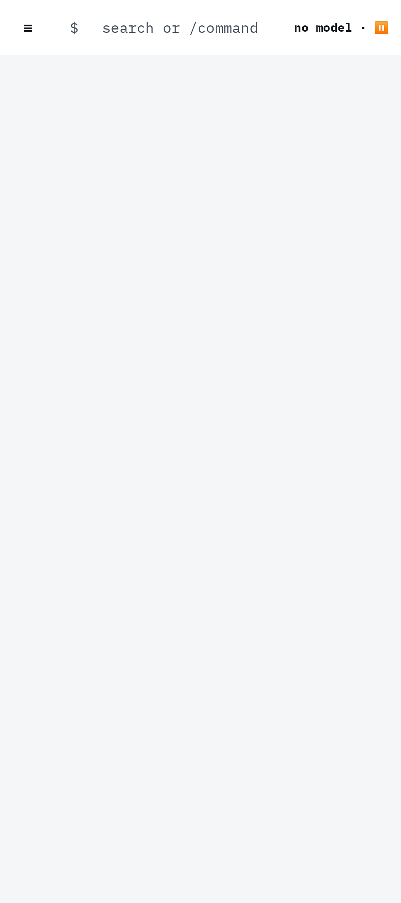 | 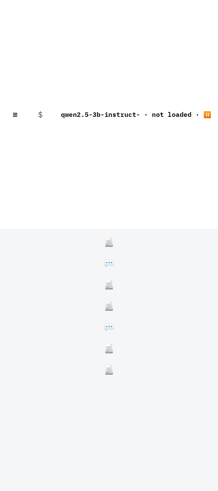 | 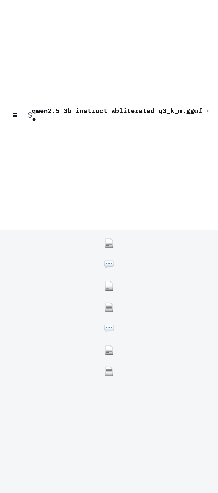 |

What a new user sees and can do on the outer display:
- **First launch:** vault setup ("Step 1 of 2", "Step 2 of 2", then a third unlock prompt). Then the left image: `≡`, a `$` prompt, "search or /command", "no model · ⏸", and an empty screen. Nothing says what Skein is or what to do. The only route forward is to type `/import model` or `/chat`, and nothing on screen says so.
- **Every later launch:** the middle image. The model chip ("qwen2.5-3b-instruct- · not loaded · ⏸") takes the whole bar. The search field and its placeholder disappear, and the bar grows to about 45 % of the screen. Below it, a centred column of 📄 and 💬 glyphs with no titles or dates. TalkBack reads each one only as "Note" or "Chat".
- **Once a model is loaded:** the right image. The raw filename wraps across the bar and over the `$` prompt.
- **Tapping a glyph** opens it, chats included, in the note editor. After that the landing is gone for the rest of the session: "Recent ▾" can only switch between open tabs, there is no Back, and the drawer's destinations are inert while a tab is open.

| A chat, as rendered on the outer display (JVM, shell chrome not shown) | Context panel open |
|---|---|
| 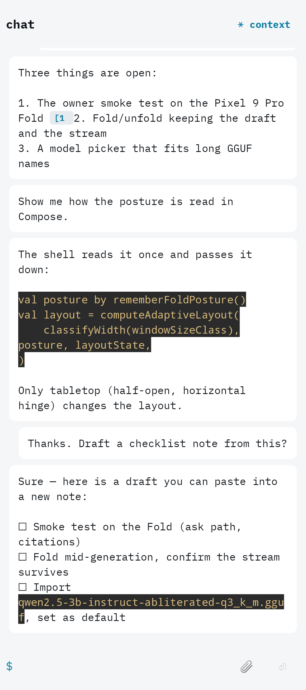 | 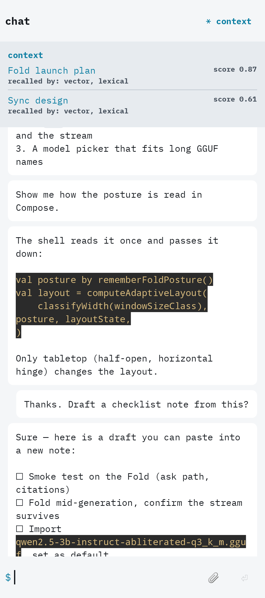 |

In a chat the user sees a lower-case `chat` header (never the chat's title), `⚹ context`, bubbles that are the same colour for both speakers, and a composer whose only affordances are `$`, 📎 and ⏎. The inline citation chip clips to `[1` and breaks the list around it. "Context" means retrieval scores and "recalled by: vector, lexical".

### Open Fold (inner display, Expanded width, owner's 330 dpi)

| Landing | Tapping a past chat |
|---|---|
| 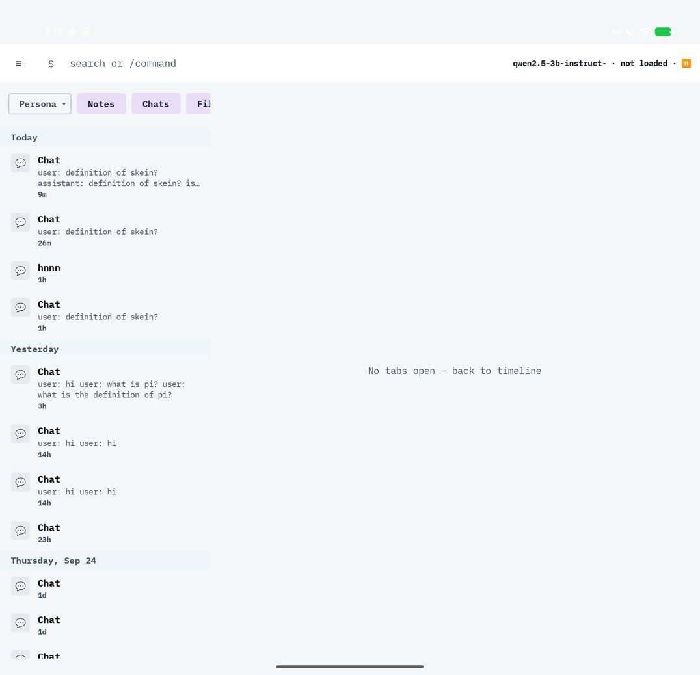 | 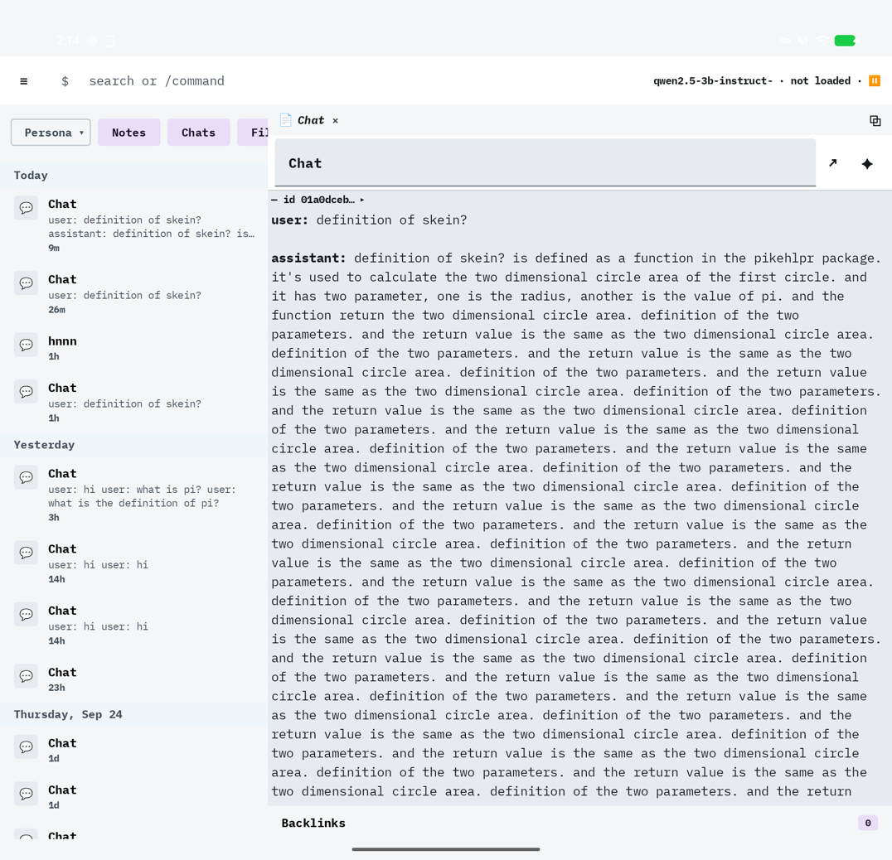 |

| Tapping the `/chat` palette row | After `/chat`, with a model loaded |
|---|---|
| 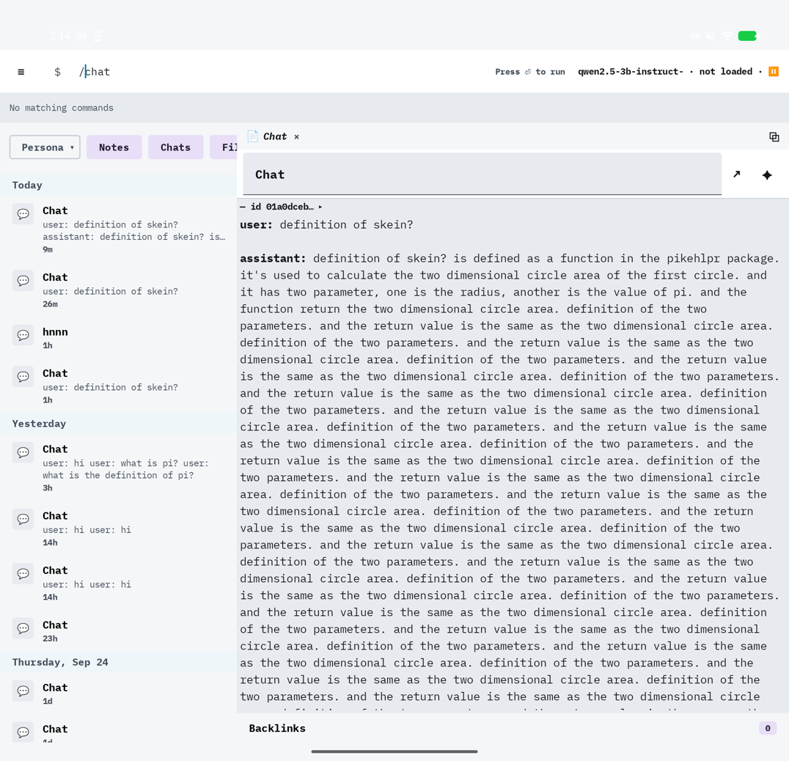 | 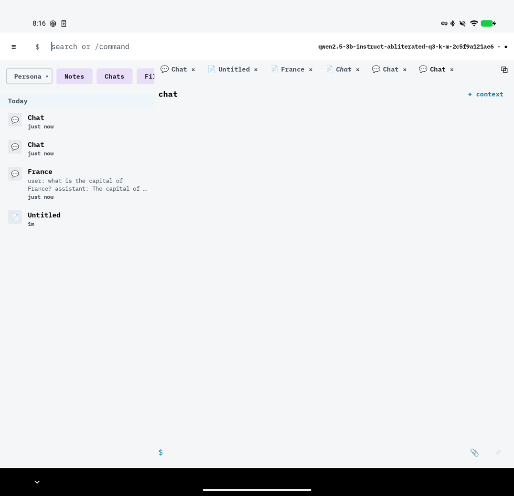 |

What a new user sees and can do on the inner display:
- **Landing:** a 30 % timeline where every chat is titled "Chat" and its only distinguishing text is "user: … assistant: …". About 70 % of the screen is one grey sentence with no action. The kind filter chips clip at "Fi…", and they are all "selected", so tapping "Chats" *hides* chats.
- **Reopening a chat is impossible.** Tapping a past chat opens its transcript in the note editor, with an id chip and "Backlinks 0" and no composer. The only chats on the device with a title other than "Chat" ("France", "hnnn") must have been renamed through that editor, which is the one accidental rename path.
- **Starting a chat:** the palette looks like a menu, but tapping `/chat` only fills the field, and the palette then says "No matching commands". Enter is still required. The new chat appears at once in the timeline as another empty "Chat", and the keyboard stays attached to the command bar.
- **With a model loaded,** the chip shows the full 51-character registry id, and the tab strip fills with look-alike "Chat" tabs.

| Settings (device) | After a fold that went through the keyguard |
|---|---|
| 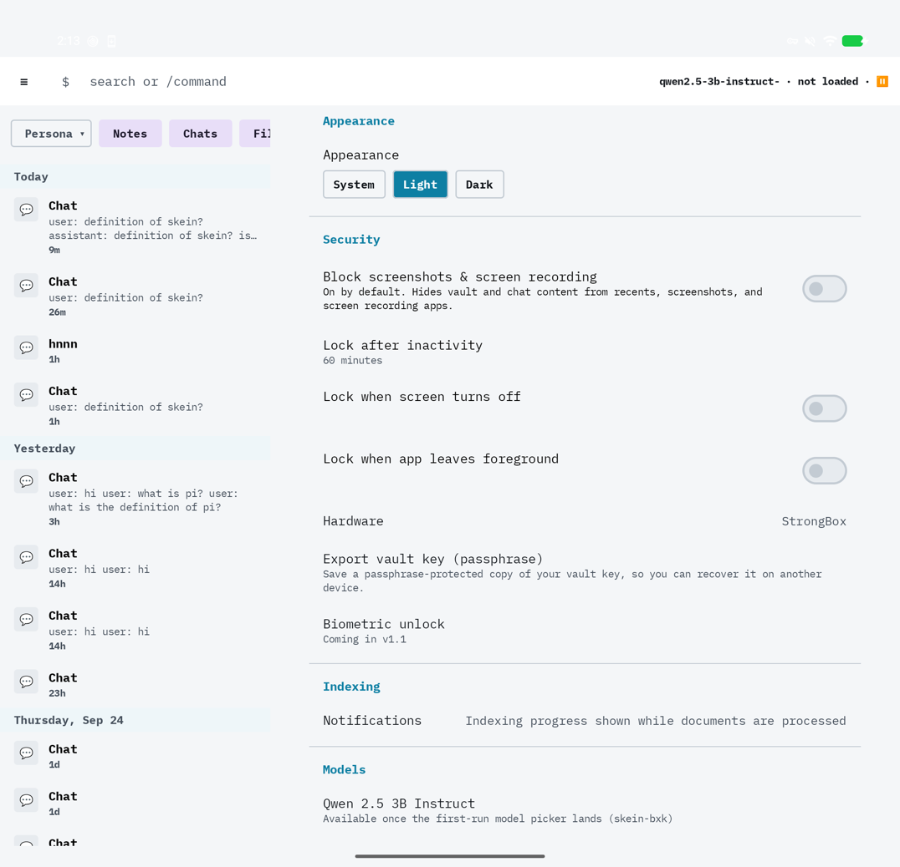 | 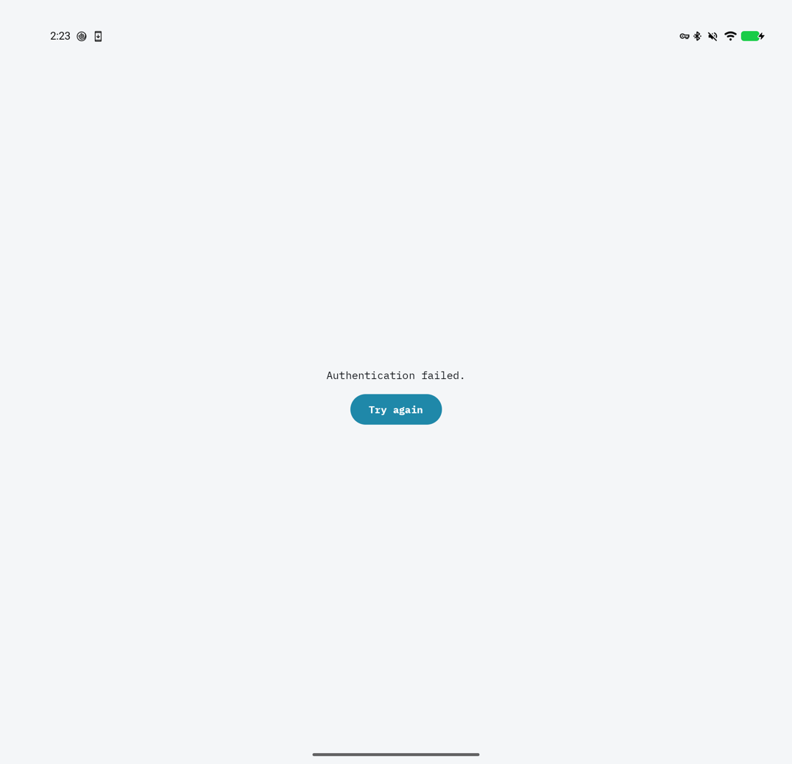 |

Settings mixes live controls with inert rows: a feature "Coming in v1.1" that contradicts the app, a bead id shown to users, and, further down, "Export vault" and a red "Erase vault" that do nothing. After one real fold, Skein came back with its vault locked, the shell reset (tabs and draft gone), and a bare "Authentication failed." with no app context.

Other decisive captures, not repeated here: [`before/phone/models.png`](../../ux-baselines/before/phone/models.png) (the "· default" label wraps one letter per line; a filled "Delete" is the loudest control on every row), [`before/fold-outer/settings.png`](../../ux-baselines/before/fold-outer/settings.png) (the Indexing label wraps one character per line), [`before/fold-outer/note-backlinks.png`](../../ux-baselines/before/fold-outer/note-backlinks.png) (the id chip is the first line of every note; the backlinks drawer grows without bound), [`before/fold-outer/graph.png`](../../ux-baselines/before/fold-outer/graph.png) (labels run off the canvas), [`before/fold-inner/shell-landing-dark.png`](../../ux-baselines/before/fold-inner/shell-landing-dark.png) (timeline titles near-black on near-black).

---

## 3. P0 — must fix

Sixteen findings after merging. Each merges every source that reported it. "Stop-gap" means a small change that does not wait for its wave and does not pre-empt the redesign.

| ID | Finding (impact) | Sources merged | Key evidence | Fix wave | Stop-gap now? |
|---|---|---|---|---|---|
| **UX-P0-01** | The closed Fold and phones land on a centred column of ≤ 20 untitled emoji (no titles, dates or filters; TalkBack says "Note"/"Chat"). With an empty vault the screen is blank. This is the §22 "orphaned rail / floating icons / huge empty area" layout. | SH P0-01; K-P0-4 (outer display); `SH-35 = KN-12` | code `MainActivity.kt:712-718`, `TimelineRail.kt:40-65`; JVM [`fold-outer/shell-landing`](../../ux-baselines/before/fold-outer/shell-landing.png), [`shell-empty`](../../ux-baselines/before/fold-outer/shell-empty.png) | 1 + 3 | No: the landing is the redesign |
| **UX-P0-02** | On the outer display and phones the model chip takes the command bar's width first. The search/command field, the only way to start a chat, collapses to ~0 dp, and a loaded filename wraps over the prompt. | SH P0-12; CMS-P0-06; `CH-01 = SH-05`, `SH-02 = KN-01` | code `CommandBar.kt:80-137`, `MainActivity.kt:430-434`; JVM [`fold-outer/shell-landing`](../../ux-baselines/before/fold-outer/shell-landing.png), [`shell-model-loaded`](../../ux-baselines/before/fold-outer/shell-model-loaded.png); device P01 | 4 (model label) + 9 (friendly name) | **Yes:** `maxLines = 1`, ellipsis and a width cap on the chip (S) |
| **UX-P0-03** | Dead navigation. Drawer Notes/Graph/Personas render their enum names. Every drawer item, including Settings and Timeline, does nothing while any tab is open, yet shows as selected. All five split-view rail buttons are no-ops. Graph entity/tag/unresolved nodes do nothing when tapped. | SH P0-03, P0-04; CMS-P0-05; K-P0-6; `SH-12…16`, `SH-30…34`, `SH-46`, `KN-47` | code `NavDrawer.kt:25-33`, `MainActivity.kt:687`, `IconRail.kt:41-57`, `TabHost.kt:83-87`; device 02 | 1 + 3 (graph nodes: 8) | **Yes:** hide the three placeholders and the rail (S) |
| **UX-P0-04** | No Back and no way home. System Back backgrounds the app from every state (tab, drawer, graph, Models). On the outer display "Recent ▾" can only switch tabs, so after the first tap the landing, Settings and every destination are unreachable until a vault lock. | SH P0-02, P0-06; K-P0-5; CMS §6; `SH-57 = KN-24`, `SH-52`, `SH-54 = CH-24`, `SH-28 = KN-21` | code: no `BackHandler` anywhere in `app/` or `feature/`; `RecentDropdown.kt:62-80`; device-confirmed for Models (handoff `:94`) | 3 | **Partly:** `BackHandler` for the two overlays (S); the rest needs a back stack |
| **UX-P0-05** | Every document opens in the note editor. A past chat becomes an editable transcript with no composer; edits are silently overwritten by the next turn. An attachment becomes an empty editor, and typing rewrites its content hash. The same chat can be open twice, as NOTE and CHAT. | SH P0-05; CMS-P0-02; K-P0-3; LIFECYCLE §9, G18, G19; `SH-10 = KN-02`, `SH-36 = KN-14` | code `SkeinApp.kt:226-241, 270`, `ChatViewModel.kt:269`, `VaultRepositoryImpl.kt:215-216`; device [04](../../ux-baselines/device-before/inner-landscape/04-chat-open.png), 06 | 5 (chats), 6 (files) | **Yes:** map `DocumentKind` → `TabKind` at the open builders (S) |
| **UX-P0-06** | Nothing can be deleted: no chat, note or file, from any surface (`deleteDocument` has no caller). Every `/chat` leaves a permanent empty "Chat", even with no model, and the device already has a wall of them. | CMS-P0-03; K-P0-1; LIFECYCLE §0, G2–G8; `KN-26`, `KN-58` | code `core/model/…/Vault.kt:306`; device 03, 06 | 5 (chats), 6 (notes, files) | **No.** A delete wired today would orphan graph edges and leave open tabs pointing at a dead id; the storage prerequisites (UX-P1-47) come first |
| **UX-P0-07** | The answer being generated and the composer draft are lost whenever the chat leaves composition: a citation or context-row tap, a tab switch, fold/unfold/rotate, a split change, deleting the default model, a lock. The user's message stays, with no reply, badge or retry. | CMS-P0-01; SH P0-07b, P0-10 (chat half); `CH-11`, `CH-08`, `SH-17` | code `ChatScreen.kt:59-71`, `ChatViewModel.kt:196`, `SendPipeline.kt:243-286`, `ChatBottomBar.kt:88`, `TabHost.kt:82-88` | 4 + 3 | No: needs a session-scoped chat holder (M) |
| **UX-P0-08** | Every fold, unfold and rotation recreates the Activity (no `configChanges`, no ViewModels), and pane changes re-parent content even without recreation. The graph and Models overlays close. A multi-GB model import is silently cancelled. Timeline filters reset. The command bar keeps its text but Enter does nothing. Tabs in the split's right pane vanish on the outer display. | SH P0-07a/c/d, P0-08, P0-09, P0-10; ADAPTIVE §2.2; `SH-04`, `SH-08 = CH-03`, `SH-24…26` | code `AndroidManifest.xml:81-88`, `AdaptivePaneHost.kt:57-95, 113-124`, `MainActivity.kt:386, 413, 465`; device: Tests A–G could not be run (keyguard) | 3 | **Partly:** declare the size `configChanges` (S). Not enough alone: re-parenting and process death remain |
| **UX-P0-09** | A vault lock throws away the whole shell: tabs, split, destination, query, drafts. The idle timer counts from unlock and nothing resets it on use, so with the defaults it fires 5 minutes after unlock, even mid-typing. On the device, a fold came back locked and reset, showing a bare "Authentication failed". | SH P0-11; CMS §3.4; K-P1-16 | code `MainActivity.kt:914-915`, `UnlockManager.kt:175-181, 445-449` (no `poke()` caller), `SecurityPrefs.kt:169-170`; device [10](../../ux-baselines/device-before/inner-landscape/10-vault-relocked-auth-failed.png) | 3 (+ vault owner) | **Yes** for calling `poke()` on user interaction (S, vault-owned); restoring the shell after a lock is Wave 3 |
| **UX-P0-10** | The first keystroke in a new note, or at the start of any note's first line, lands before the hidden frontmatter. The `id:` block moves into the body and duplicates on reopen. No test catches it. | K-P0-2; `KN-33`, `KN-06` | code `LivePreviewTransformer.kt:135-136`, `NoteTabState.kt:205`, `OffsetMappingTest.kt:120-156`; 1-minute device repro in [K §3.3](audit/AUDIT_KNOWLEDGE.md#33-edit-autosave-frontmatter-the-caret-at-zero-bug) | 6 | **Yes:** map transformed 0 to the body start and seed the caret there, plus a typing test (S) |
| **UX-P0-11** | Unsaved note edits (the 500 ms debounce plus the write in flight) are dropped when a note tab closes, switches to a chat, the vault locks or the Fold folds. `FlushRegistry.flushAll()` is never called. | K-P0-9; `SH-20 = KN-22` | code `NoteTab.kt:112-128`, `EditorState.kt:140-146`, `MainActivity.kt:359-366` | 6 (+ 3) | **Yes:** flush on dispose, `ON_STOP` and before lock, in a longer-lived scope (S) |
| **UX-P0-12** | Crash paths: attaching an image in chat (uncaught `UnsupportedOperationException`); Save as `.md`/`.docx` I/O errors; editing the title of a note that no longer exists; and, once delete exists, sending into a deleted chat. | K-P0-7, K-P1-17; CMS-P1-12; LIFECYCLE §12.1; `KN-53 = CH-19`, `KN-29`, `KN-30`, `KN-40` | code `ImportServiceImpl.kt:176-184`, `ChatBottomBar.kt:121-133`, `NoteTab.kt:171-175`, `NoteTabState.kt:122-132`, `ChatViewModel.kt:231` | 4, 6 | **Yes:** a MIME filter plus try/catch with a user message (S) |
| **UX-P0-13** | Settings has three dead rows: Export vault, Erase vault (red, the loudest row on the screen) and View NOTICE (so the licences screen is unreachable). | CMS-P0-04; `CH-42`, `CH-43`, `CH-45` | code `SettingsScreen.kt:137-138, 143`, `MainActivity.kt:682-685` (`SettingsRoute` unused) | 9 | **Yes:** call `SettingsRoute`, hide the other two (S) |
| **UX-P0-14** | The chat composer's `[[` popup offers `Create "x"` and creates nothing. | CMS-P0-07; K-P0-8; `CH-18 = KN-54` | code `ChatScreen.kt:56`, `MainActivity.kt:589-600` | 4 / 7 | **Yes:** wire `onCreateWikilink` or drop the row (S) |
| **UX-P0-15** | Enrolling a new fingerprint invalidates the key. The user then lands on "Recovery is not available in this build yet" with no button, locked out of their own vault, although a restore-from-export flow exists. | CMS-P0-08; `SH-59 = CH-63` | code `MainActivity.kt:1017-1028`, `AndroidKeystoreFacade.kt:62` | Outside §48 (vault gate); schedule with 9 | **Yes:** offer the existing restore flow and a guarded reset (S–M) |
| **UX-P0-16** | Starting a chat, the product's primary action, has no visible control. The only path is typing `/chat` and Enter. Tapping the palette row fills the text and then shows "No matching commands", and focus stays in the command bar. The unwired timeline "New chat / New note" buttons are the only creation UI in the codebase. *Promoted from P1 by this consolidation (§47 "inaccessible important screens").* | SH P1-02, P1-07; CMS Flow 2; K-P1-1; `SH-07 = CH-02`, `SH-43 = KN-20`, `SH-44` | code `BuiltinCommands.kt:22-36`, `CommandBarHost.kt:56-64`, `MainActivity.kt:704-711`; device [05b](../../ux-baselines/device-before/inner-landscape/05b-palette-no-matching-after-tap.png), 06 | 1 + 4 | **Yes:** wire the existing timeline buttons and FAB; run palette rows on tap (S) |

---

## 4. Cross-cutting themes

These are the causes behind most of the findings. Fixing a theme at its root closes several findings at once.

1. **Every document opens as a note.** The open builders hard-code `TabKind.NOTE` whatever the document's kind (`SkeinApp.kt:226-241, 270`; `ChatViewModel.kt:269`). The chain it causes: chats can't be resumed (UX-P0-05), so abandoned chats pile up (UX-P0-06); chat edits are silently overwritten; attachments get their hash rewritten; a backlinks strip appears where the composer should be (skein-gg11.23); two tabs point at the same chat (UX-P1-05). Routing by `DocumentKind` is a one-line mapping and is a prerequisite for any chat lifecycle UI (LIFECYCLE §9).
2. **Nothing survives recreation, or a lock.** There is no `androidx.lifecycle.ViewModel` in the app, no `SavedStateHandle`, and no `android:configChanges`. Long-running work (generation, model import) runs in `rememberCoroutineScope`, and `AdaptivePaneHost` re-parents pane content between call sites. A vault lock swaps the whole shell out. Result: UX-P0-07, -08, -09, -11 and UX-P1-17. The fix is structural: retained holders plus Navigation 3 entries plus size `configChanges` ([`research/ANDROID_ADAPTIVE_SAMPLES.md` §5.6](research/ANDROID_ADAPTIVE_SAMPLES.md#56-live-transition-state-preservation-checklist-exact-apis)). Declaring `configChanges` alone would hide the bug, not fix it.
3. **Creation only via typed commands.** Chat, note and model import exist only as `/chat`, `/new note` and `/import model`. The palette fills text instead of running, and the empty states tell users to type slash commands ("No model yet. Use /import model…"). The one input that accepts those commands is the field the model chip crushes on the outer display (UX-P0-02, UX-P0-16, UX-P1-36, UX-P1-37).
4. **Implementation language everywhere.** "No tabs open — back to timeline", `NOTES`/`GRAPH`/`PERSONAS`, `$`, "search or /command", "open it pinned", `score 0.87 · recalled by: vector, lexical`, `— id 0192abcd… ▸`, "user: … assistant: …", `StructurallyInvalid(NOT_GGUF)`, `UNKNOWN` licence, `StrongBox`, `(skein-bxk)`. Full list in [`AUDIT_SHELL.md` §10](audit/AUDIT_SHELL.md#10-terminology-implementation-language-shown-to-users) and [`AUDIT_CHAT_MODELS_SETTINGS.md` §5](audit/AUDIT_CHAT_MODELS_SETTINGS.md#5-model-identity-the-exact-strings-users-see).
5. **Model identity is the filename.** The chip shows a 20-character filename prefix, then the 51-character slug+hash id once loaded. The Models list shows the `.gguf` filename and `UNKNOWN`. The import already computes architecture, quantization and parameter count and throws them away, and `messages.model_id` is never written, so no turn records which model answered (UX-P0-02, UX-P1-21). The remedy is Jan's resolution chain ([`research/JAN.md` §6.1](research/JAN.md#61-make-local-ai-feel-normal)).
6. **No Back handling.** There is no `BackHandler`, `OnBackPressedCallback` or `NavigationBackHandler` in any main source set. Overlays are Booleans, not routes, so Back always leaves the app (UX-P0-04). The navigation-event skill is already on the classpath ([`ANDROID_SKILLS_ASSESSMENT.md` §6.5](ANDROID_SKILLS_ASSESSMENT.md#65-navigationnavigation-event-use-now-from-wave-3)).
7. **Placeholders shipped as product.** 18 DEAD controls: three drawer placeholders, five dead rail buttons, three dead Settings rows, a Create row that creates nothing, a recovery screen with no action. Add inert Settings rows ("Coming in v1.1", model presets captioned with a bead id). Brief §2 says no visible control may be nonfunctional. Jan's capability table (J10) and Zed's availability filter (Z1) are the mechanical form of that rule.
8. **Previews and tests describe a different app.** Previews show a `qwen · ●` chip, a chat tab called "Research thread", timeline FABs that production never renders, and 400/1000 dp widths that are not Fold sizes. Two tests pin current bugs as intended: the retry duplicate (`ChatScreenTest.kt:318-325`) and "No tabs open" (`SkeinAppTest`). The Roborazzi "before" set now shows the real app, and it is what later waves should be diffed against.

---

## 5. P1 — should fix in its wave

Grouped by theme. Each row merges its sources.

### 5.1 Front door, navigation and Fold layout

| ID | Finding | Sources | Evidence | Wave |
|---|---|---|---|---|
| UX-P1-01 | On the primary device, ~70 % of the landing is "No tabs open — back to timeline" with no action. | SH P1-01; K-P1-13; `SH-45` | device 03; JVM [`fold-inner/shell-landing`](../../ux-baselines/before/fold-inner/shell-landing.png) | 1, 3 |
| UX-P1-02 | Eleven overlapping navigation mechanisms. Timeline appears in five places, Graph in three. The drawer and the tabs don't coordinate, so the drawer's selected item disagrees with the screen. | SH P1-03 | [`AUDIT_SHELL.md` §3.1–3.2](audit/AUDIT_SHELL.md#31-navigation-paradigms-present-in-production) | 1 |
| UX-P1-03 | A modal hamburger at every width; no rail or permanent navigation on the inner display. The drawer has no New chat, no chat history, no Models. | SH P1-05; `SH-11` | device 02 | 3 |
| UX-P1-04 | Width-only adaptive model. The closed Fold in landscape (≈ 994 × 443 dp) gets the dual pane. The inner display straddles the 840 dp breakpoint at one Display-size step, which switches the whole IA. Book posture and hinge bounds are ignored. The 30 % pane has no dp limits. Posture detection is hand-rolled. | SH P1-04, §4; ADAPTIVE §1–2 | code `PaneLayout.kt:13-21, 44-80`, `FoldPosture.kt:61-67` | 3 |
| UX-P1-05 | Tabs: titles are snapshots that never refresh after a rename; up to six look-alike "Chat" tabs; preview vs pinned shown only by italics; following a link replaces the origin preview (no back stack); the same chat can be open as NOTE and CHAT. | SH P1-09; K-P1-2 (tab part), K-P1-5; `KN-23`, `SH-17` | device P01, 06 | 3 |
| UX-P1-06 | Split view has no exit control; the 4 dp divider resets to 50 % after a fold. | SH P1-14; `SH-29` | code `SplitCoordinator.kt:63-67`, `SplitHost.kt:45` | 3 |
| UX-P1-07 | Timeline filters: kind chips start all selected, so a tap *hides* that kind; the row clips at the pane edge; no filters on the outer display. | SH P1-10; `SH-40 = KN-16` | device 03 | 6 |
| UX-P1-08 | First run and unlock. No onboarding and no "Add a model" button. The notification permission prompt appears over vault setup. Setup ends in a third biometric prompt after "Step 2 of 2". Unlock is biometric-only, with no screen-lock fallback. After a relock, a bare "Authentication failed". | CMS-P1-19, P1-20; SH P1-15; `CH-48`, `CH-56` | device 10; [`AUDIT_CHAT_MODELS_SETTINGS.md` §9](audit/AUDIT_CHAT_MODELS_SETTINGS.md#9-unlock-setup-reset-and-restore-first-impression-1-understand-what-to-do-in-about-five-seconds) | 1 (auth flows are outside §48) |

### 5.2 Chat

| ID | Finding | Sources | Evidence | Wave |
|---|---|---|---|---|
| UX-P1-09 | Every chat is titled "Chat". The header is the literal `chat`. There is no rename in the chat. Timeline previews read "user: … assistant: …". | CMS-P1-01; SH P1-09; `CH-06` | device 03, 06 | 5 |
| UX-P1-10 | No activity UI. One static `thinking…` covers retrieval, model load and prefill (over 10 minutes on the Fold). The elapsed time is computed and hidden. No completion summary. The chip's ● looks the same when ready and when generating. | CMS-P1-03, §4.4 | code `ChatTurnState.kt:15-31`, `AssistantBubble.kt:241-255` | 4 |
| UX-P1-11 | Stop is silently ignored before the stream registers (during retrieval, load and prompt assembly). A stop during prefill leaves no trace. No "Stopping…" state. | CMS-P1-04; `CH-21` | code `LlamaCppEngine.kt:474-478`, `SendPipeline.kt:271-274` | 4 |
| UX-P1-12 | Retry duplicates the user message (a test pins it). No regenerate for a completed or interrupted answer, and no way to stop, retry or flag a runaway answer. The error banner can't be dismissed and never names the cause. | CMS-P1-05; LIFECYCLE §3.2, G17; `CH-09`, `DV-01` | device 04 (repetition loop, no recourse) | 4 |
| UX-P1-13 | Streaming: the list doesn't follow the growing bubble. Streamed text is held back until a `[n]` closes, so the bubble stops mid-sentence. Nothing is announced to TalkBack. | CMS-P1-09; spike §6 | JVM `*/chat-streaming.png` | 4 |
| UX-P1-14 | Answer rendering: no select or copy. A `[N]` split breaks bold, list and code structure, and the chip clips to `[1` and eats the line break. Tables render raw. Code blocks have no scroll or copy. | CMS-P1-08, P1-10; `CH-12` | JVM [`fold-outer/chat-long`](../../ux-baselines/before/fold-outer/chat-long.png) | 4 |
| UX-P1-15 | Citations: the second-tap excerpt is unreachable; non-note sources open in the note editor; the target is about 32 × 18. | CMS-P1-07; `CH-10 = KN-56` | code `ChatViewModel.kt:265-278` | 4, 7 |
| UX-P1-16 | Composer: no hint or label; a `$` glyph like the command bar's; grows without bound; the soft keyboard can't insert a newline; not focused after `/chat` (the IME stays on the command bar); a leading `/` is sent to the model as text. | CMS-P1-11; SH P1-16, P1-19; `CH-15`, `CH-16 = SH-48` | device 06 | 4 |
| UX-P1-17 | The context panel shows **another chat's** retrieval, and the previous turn's during a turn. It uses RAG labels (score, recalled by), doesn't scroll, can collapse the message list, and closes after recreation. | CMS-P1-06; SH P1-19; `CH-07`, `CH-08` | JVM [`fold-outer/chat-context-open`](../../ux-baselines/before/fold-outer/chat-context-open.png); device 08 | 7 |
| UX-P1-18 | Attaching knowledge: there is no explicit "attach". 📎 imports the file into the vault permanently, with no progress or feedback, inserts a `[[link]]` that doesn't match the new note, and extracts PDFs on the main thread. `[[` in the composer doesn't pin that note into context. | CMS-P1-12; K-P1-10, §4.1; `CH-17 = KN-55` | code `ChatViewModel.kt:286-298`, `SendPipeline.kt:214` | 7 |
| UX-P1-19 | The import status row covers the chat composer; failure rows stay until dismissed. | SH P1-17; CMS-P1-23; `SH-56 = CH-05` | handoff `:94` (device) | 4, 9 |
| UX-P1-20 | No persona can be seen or chosen. Every turn uses a hidden "Default" persona with no prompt. Chats are created with no persona, so a persona filter hides them. | CMS-P1-18; LIFECYCLE §6 | code `MainActivity.kt:599` | 1, 9 |

### 5.3 Models

| ID | Finding | Sources | Evidence | Wave |
|---|---|---|---|---|
| UX-P1-21 | Model identity is a filename or slug+hash in the chip, the Models list and the header; the friendly GGUF metadata is discarded; `UNKNOWN` licence is a row headline; `messages.model_id` is never written. | CMS-P1-02, §5; `CH-26` | JVM [`phone/models`](../../ux-baselines/before/phone/models.png); device P01 | 9 |
| UX-P1-22 | The chip looks like a control but isn't one. LOADING shows ⏸ ("paused"), ERROR reads "not loaded", READY and GENERATING look the same. | CMS-P1-16; SH P1-08; `CH-01 = SH-05` | code `MainActivity.kt:430-435` | 4 |
| UX-P1-23 | "Set default" doesn't switch the loaded model and says nothing; `/import model` silently makes the import the default. | CMS-P1-13; `CH-27` | code `ManagedInferenceEngine.kt:125-135` | 9 |
| UX-P1-24 | Model Delete: one tap deletes a multi-GB file with no confirmation, as a filled primary button; the outcome is ignored; the button is disabled with no reason; deleting the default mid-chat flips every chat to "No model yet". | CMS-P1-14; LIFECYCLE §7, G24; `CH-28 = SH-55` | JVM `phone/models` | 9 |
| UX-P1-25 | Models is reachable only through `/models`. Settings › Models shows three inert presets captioned with a bead id. "· default" wraps one letter per line on a phone. | CMS-P1-15; `SH-09 = CH-04`, `CH-39…41` | device 01; JVM `phone/models` | 9 |
| UX-P1-26 | Model and import errors are implementation language: `StructurallyInvalid(NOT_GGUF)`, `FromStore(…)`, `UNKNOWN`. | CMS-P1-17 | code `ModelManager.kt:770-776` | 9 |

### 5.4 Knowledge and notes

| ID | Finding | Sources | Evidence | Wave |
|---|---|---|---|---|
| UX-P1-27 | Rename writes on every keystroke (each one re-ingests), has no label, leaves tab labels stale, and silently breaks inbound links (tapping an old link then creates a new empty note). Frontmatter `title` drifts. Chats have no rename API that avoids echoing the transcript back. | K-P1-2; LIFECYCLE §11, G1, G12, G13; `KN-25` | code `NoteTabState.kt:122-132` | 5, 6 |
| UX-P1-28 | Search: titles match by prefix only; body hits exist only after ingest; the snippet is dropped; no loading or "no results" state; the inline, unbounded list pushes the panes down and stays after focus leaves; Enter opens the top hit silently; results are rows of identical "💬 Chat". | SH P1-06; K-P1-3; `SH-03 = KN-03`, `KN-04` | device 05 | 6 |
| UX-P1-29 | Wikilinks: tapping an unresolved link silently creates a note that can't be deleted; broken links aren't dimmed; the Create row duplicates an existing title; links can't be activated by keyboard or TalkBack. | K-P1-4; `KN-36`, `KN-38` | code `NoteTabState.kt:280-282, 299-309` | 6 |
| UX-P1-30 | The backlinks drawer is unbounded and unscrollable and can crush the editor; it is composed for chat transcripts too; its "0" badge is noise. | K-P1-6, §5.4; `KN-41…43` | JVM [`fold-outer/note-backlinks`](../../ux-baselines/before/fold-outer/note-backlinks.png); device 04 | 6 |
| UX-P1-31 | Save and export status are invisible, and autosave errors are silent. | K-P1-8; `KN-34` | code `EditorState.kt:126-132` | 6 |
| UX-P1-32 | Editor chrome: the frontmatter id chip is the first line of every note (≈ 20 dp target); the title field is typographically weaker than a body H1; about 200 dp of chrome sits above the keyboard on the outer display; the empty body is a one-line tap target. | K-P1-12, K-P1-14; `KN-35` | JVM [`fold-outer/note`](../../ux-baselines/before/fold-outer/note.png) | 6 |
| UX-P1-33 | Files: no attachment viewer, no Files list, no import from Knowledge, no share target. | K-P1-11; `KN-57` | code `SkeinApp.kt:419`, `AndroidManifest.xml:81-88` | 6 |
| UX-P1-34 | "Note not found" is a dead end (its crash is UX-P0-12). Two editors on the same note: the last writer wins. | K-P1-16, K-P1-17 | code `NoteTabState.kt:193-213` | 6 |
| UX-P1-35 | The graph is reachable only from a note's ✦, as a full-window overlay at every width. A tap navigates away instead of selecting. There are no labels beyond 40 nodes, and labels run off the canvas on narrow screens. It ignores the theme override, and the canvas has no semantics at all. | SH P1-18; K-P1-7; `KN-45 = SH-51`, `KN-52` | JVM [`fold-outer/graph`](../../ux-baselines/before/fold-outer/graph.png) | 8 |

### 5.5 Empty states, palette, keyboard, settings

| ID | Finding | Sources | Evidence | Wave |
|---|---|---|---|---|
| UX-P1-36 | Empty states give no next action. "Nothing here yet" has no action and flashes falsely on every launch, unlock and fold. "No model yet" and "No models imported yet" tell the user to type a slash command. The empty chat, the empty note and search with no hits show nothing. The graph with no connections is unexplained. | SH P1-11; K-P1-13; `SH-47 = CH-22`, `CH-25`, `KN-13` | JVM [`fold-outer/shell-empty`](../../ux-baselines/before/fold-outer/shell-empty.png), `*/timeline-empty.png` | 4, 6, 9 |
| UX-P1-37 | The palette is a raw parser: no icons, descriptions or ranking; prefix-only matching; jargon hints ("open it pinned", "GGUF"); it pushes the layout down instead of overlaying. | SH P1-07; `SH-06 = KN-05`, `KN-07` | device 05 | 10 |
| UX-P1-38 | Physical keyboard and mouse: no shortcuts, no Esc, no Ctrl+K, no arrow keys in the palette or results, no right-click menu. In the editor, Shift and Ctrl arrows are broken. | SH P1-12; K-P1-9; `KN-39` | [`AUDIT_SHELL.md` Flow 27](audit/AUDIT_SHELL.md#flow-27-physical-keyboard) | 10 |
| UX-P1-39 | Settings honesty and hierarchy: "Biometric unlock — Coming in v1.1" contradicts the app; the Indexing info row reads like a setting and wraps one letter per line on the outer display; implementation labels (StrongBox, TEE, GGUF); no Models, Personas or "Lock now" entries. | CMS-P1-21, §8; `CH-34`, `CH-37`, `CH-38` | JVM [`fold-outer/settings`](../../ux-baselines/before/fold-outer/settings.png); device 01 | 9 |

### 5.6 Accessibility and contrast

| ID | Finding | Sources | Evidence | Wave |
|---|---|---|---|---|
| UX-P1-40 | Touch targets under 48 dp: tab × (≈ 8–12 dp), split divider (4 dp), citation chip (≈ 32 × 18), frontmatter chip (≈ 20 dp), theme options (≈ 34 dp), rail cells (40 dp), palette and search rows (≈ 40 dp). | SH §9; CMS §13.1; K §10 | code per audit | 2, 11 |
| UX-P1-41 | Missing labels and semantics: 📎 ■ ⏎ ↗ ✦ ✕ × have no labels; `$` and emoji are read aloud; Settings switches are unlabelled; no selected, expanded or heading semantics; long-press-only actions have no custom actions; there is no live region anywhere (streaming, `thinking…`, errors, import). | SH §9; CMS-P1-22, §13.1; K §10 | code per audit | 11 (and each wave) |
| UX-P1-42 | Dark theme: timeline titles are near-black on near-black inside the shell's pane on the inner display (the same list on its own is fine). | spike §6 | JVM [`fold-inner/shell-landing-dark`](../../ux-baselines/before/fold-inner/shell-landing-dark.png) | 2 |
| UX-P1-43 | Status-bar icons are white on the light theme on the device, and illegible. | device pass row 01 | device 01, 03 | 2, 3 |
| UX-P1-44 | Fixed heights clip text at large font scales: the 36 dp tab strip and "Recent ▾" row, 40 dp rail cells, the 28 dp kind glyph. | SH §8 | JVM `fold-outer/*-font150.png` | 2 |

### 5.7 Performance

| ID | Finding | Sources | Evidence | Wave |
|---|---|---|---|---|
| UX-P1-45 | Chat: each streaming update re-parses the whole answer (O(n²), main thread). Token counting may block the main thread for up to 3 s during send. A 200 ms ticker recomposes for a value nothing shows. Each emission does one read per citation. | CMS-P1-24, §13.2 | code `AssistantBubble.kt:116-134`, `ModelServices.kt:348-356` | 4 |
| UX-P1-46 | Knowledge: 2–3 full-document transforms per keystroke. Each autosave fans out to revisions, ingest, backlinks and graph reloads, and title edits do this per keystroke. The graph layout runs on the main thread and reruns on every edge change. | K-P1-15, §11 | code `SkeinEditor.kt:123-143`, `GraphState.kt:150-156` | 6, 8 |

### 5.8 Lifecycle prerequisites (storage work that gates UX-P0-06)

| ID | Finding | Sources | Evidence | Wave |
|---|---|---|---|---|
| UX-P1-47 | A delete wired today would be partial. Graph edges are orphaned in both directions (ghost UUID nodes; they keep steering retrieval). Open views get the wrong change events. The attachment blob is deleted before COMMIT. Staged export plaintext outlives the timed sweep. FTS token residue remains. Ingest can recreate edges for a deleted id. No instrumented cascade test exists. | LIFECYCLE §1.2, §10, §12–13; G3–G6, G11, G21 | host SQLite experiment (LIFECYCLE Appendix A) | 5, 6 (storage beads first) |
| UX-P1-48 | After a delete, the UI must close tabs in both panes (otherwise the next send crashes), clear `lastOutcome`, re-query search results, and show citations to the deleted source as "source deleted". | LIFECYCLE §9, §12.1; G7–G9 | code `TabsState.kt:100-115`, `ChatViewModel.kt:142-147` | 5 |
| UX-P1-49 | Persona delete semantics must be decided before any persona UI: its documents become visible to every persona, the default can move silently, and no change event reaches the timeline. | LIFECYCLE §6, G23 | code `PersonaServiceImpl.kt:147-168`, `PprRanker.kt:97-101` | 9 |

---

## 6. P2 — polish, after the architecture settles

| ID | Finding | Sources | Wave |
|---|---|---|---|
| UX-P2-01 | Icon language is inconsistent: colour emoji mixed with monochrome glyphs; AI output is ✧, 🤖 or red depending on the surface; Files, Attachment and 📎 name the same thing; Settings reuses the context glyph. | SH P2-01; K-P2-1; CMS-P2-09 | 2 |
| UX-P2-02 | Terse lower-case copy: `chat`, `retry`, `generation failed, retry`, `interrupted — stopped`, `thinking…`. | CMS-P2-02 | 4 |
| UX-P2-03 | The composer's `$` glyph imitates a terminal and competes with the command bar's. | CMS-P2-01; `CH-14` | 4 |
| UX-P2-04 | Bubbles: user and assistant share a colour; no maximum width on the inner display; queued vs picked-up is signalled by colour only. | CMS-P2-03; `CH-13` | 4 |
| UX-P2-05 | Settings polish: "Appearance" label repeats the section; theme options lack a radio role; the Hardware row belongs under Advanced; "View NOTICE" should read "Open-source licences". | CMS-P2-04; `CH-29…35` | 9 |
| UX-P2-06 | Vault gate polish: the final reset button isn't error-coloured; open-failure text shows exception class names; the unlock backdrop has no app identity. | CMS-P2-05…07; `CH-61`, `CH-62` | outside §48 |
| UX-P2-07 | No model details view (quantization, context, import date, hash under Advanced). | CMS-P2-08 | 9 |
| UX-P2-08 | Relative times in the timeline never tick. | SH P2-02 | 6 |
| UX-P2-09 | An open drawer reopens over the new posture after a fold (Test G). | SH P2-05 | 3 |
| UX-P2-10 | Previews and tests describe a different app (theme 8): non-Fold preview widths, preview-only FABs, "Research thread", `qwen · ●`; tests pin the retry duplicate and "No tabs open". | SH P2-07; CMS §14 | 11 |
| UX-P2-11 | Dead or stale code misleads future work: `TimelineDestination`, `useTabDropdown`, `MockTabContent` defaults, stale KDoc. | SH P2-06; K-P2-8; `KN-59` | 3 |
| UX-P2-12 | Collector leaks: `IndexingNotifier` relaunched on every unlock; `CommandBarState` and old `NoteTabState` collectors outlive their state; the backlinks expanded flag carries to the next note. | SH P2-04, P2-08; K-P2-6 | 3, 6 |
| UX-P2-13 | "Close others" has no undo. | SH P2-09; `SH-23` | 3 |
| UX-P2-14 | Autocorrect, suggestions and auto-capitals are off in the note body (a threat-model trade-off). Needs an explicit owner decision, perhaps opt-in. | K-P2-2 | 6 |
| UX-P2-15 | The editor doesn't render nested lists deeper than three spaces, tables or long code lines specially. | K-P2-3 | 6 |
| UX-P2-16 | Graph: the legend is always on; no fit or zoom reset; AI output uses the error colour; kinds differ by colour only. | K-P2-4; `KN-50`, `KN-51` | 8 |
| UX-P2-17 | Long titles are unclipped in the tab strip and "Recent ▾". | K-P2-5; SH §8 | 3 |
| UX-P2-18 | A tap on a rendered wikilink consumes the down event, so the caret can't be placed inside a link. | K-P2-7 | 6 |
| UX-P2-19 | An unknown or partial `/command` plus Enter gives no feedback. | `KN-07` | 10 |

---

## 7. Inventory summary

The full inventories are in the area audits; these tables are the index.

### 7.1 Screens and routes (what production actually composes)

| Surface | How a user reaches it | Status | Detail |
|---|---|---|---|
| Vault setup / restore | First launch | Works; says "vault", not what Skein is | [CMS §1](audit/AUDIT_CHAT_MODELS_SETTINGS.md#1-reachability-map-what-the-running-app-actually-composes) |
| Biometric unlock / reset | Every launch, every lock | Works; biometric-only | CMS §9 |
| Recovery required | Key invalidated (new fingerprint) | **Dead end** (UX-P0-15) | CMS §9 |
| Landing (outer, Medium, tabletop) | Default when no tab is open | Glyph-only `TimelineRail`, blank when empty (UX-P0-01) | [SH §2.9](audit/AUDIT_SHELL.md#29-what-each-form-factor-actually-shows) |
| Landing (inner, Expanded) | Default when no tab is open | 30 % timeline + "No tabs open" (UX-P1-01) | SH §2.9 |
| Chat tab | `/chat` + Enter only | Works for a *new* chat; never for a past one | [SH §2.2](audit/AUDIT_SHELL.md#22-routes-and-destinations) |
| Note tab | Timeline, search, links, backlinks, graph, citations | Opens **every** kind (UX-P0-05) | [K §1](audit/AUDIT_KNOWLEDGE.md#1-what-is-actually-composed-in-the-running-app) |
| Settings | Drawer, only when no tab is open | Partly dead (UX-P0-13) | CMS §8 |
| Models overlay | `/models` + Enter only | Works; Back leaves the app | CMS §6 |
| Graph overlay | ✦ in a note header only | Works as a canvas; closes on fold | K §6 |
| NOTES / GRAPH / PERSONAS | Drawer | Enum-name placeholders (UX-P0-03) | SH §2.2 |
| About / licences | Nothing (`SettingsRoute` has no caller) | Unreachable | CMS §1 |
| Attachment viewer, `TimelineDestination`, `:feature:personas`, `:feature:onboarding` | Nothing | Not built, dead code, or not in `:app` | SH §2.3; K §4.2 |

**Commands registered in production:** four (`/new note`, `/chat`, `/import model`, `/models`). Named in specs but not implemented: `/new chat`, `/persona`, `/model`, `/index now`, `/graph`, `/settings`, `/export` ([SH §2.7](audit/AUDIT_SHELL.md#27-command-actions-every-command-registered-in-production)).

### 7.2 Navigation paradigms

There are eleven, plus system Back, which is handled by nothing ([SH §3.1](audit/AUDIT_SHELL.md#31-navigation-paradigms-present-in-production)).

| # | Paradigm | Width | State |
|---|---|---|---|
| 1 | Modal hamburger drawer | all | 3 of 5 destinations are placeholders; all 5 inert while a tab is open |
| 2 | Timeline pane (30 %) | E | Works; kind-blind opening |
| 3 | Timeline "rail" as landing | C, M, tabletop | Untitled glyphs |
| 4 | Shell icon rail | E + split | All 5 buttons dead |
| 5 | Tab strip | ≥ 600 dp | Works; snapshot titles |
| 6 | "Recent ▾" dropdown | < 600 dp | Select only: no close, no home |
| 7 | Command-bar search | all | Kind-blind opening |
| 8 | `/` palette | all | The only creation path; tap doesn't run |
| 9 | Split view | E | No exit control |
| 10 | Full-screen overlays (graph, Models) | all | Booleans, not routes; die on fold |
| 11 | In-content links (wikilinks, backlinks, citations) | all | Replace the origin preview; no back stack |
| – | System Back | all | **Not handled anywhere** |

### 7.3 State holders

There is **no `androidx.lifecycle.ViewModel`, no `SavedStateHandle` and no `viewModel()` call** in `app/` or `feature/` ([SH §2.4](audit/AUDIT_SHELL.md#24-state-holders-and-viewmodels)).

| Holder | Lifetime today | Survives fold/rotate? | Survives a lock? |
|---|---|---|---|
| `NavState` (destination, drawer, query) | `rememberSaveable` | Yes (but the command bar's own state desyncs) | No |
| `TabsState` ×2 | `rememberSaveable` | Yes (right-pane tabs hidden on the outer display) | No |
| `AdaptiveLayoutState` | `rememberSaveable` | Yes | No |
| `ChatViewModel` (turn, messages, context panel) | plain class in `remember` + composition scope | **No: generation cancelled** | No |
| Chat draft | `remember` | **No** | No |
| `NoteTabState` / editor | `remember`; text reloaded from the vault | Text yes; caret, scroll and ≤ 500 ms of edits no | Reloaded |
| `TimelineState` (filters) | `remember` | **No** | No |
| Graph / Models overlay flags | `remember` in `MainActivity` | **No** | No |
| Model import job | `rememberCoroutineScope` | **No: cancelled** | No |
| Vault session, model services, engine | process | Yes | Torn down by design |

Full table with every holder: [SH §5.2](audit/AUDIT_SHELL.md#52-state-survival-open--closed-and-closed--open-identical-mechanism-both-ways). Predicted results of the §25 fold tests: A fail, B partial, C fail, D fail, E partial, F fail, G partial ([SH §5.3](audit/AUDIT_SHELL.md#53-acceptance-tests-ag-brief-25-predicted-from-code)).

---

## 8. User-flow audit (brief §43)

Taps are counted on the outer display, from the landing, with the vault unlocked. "Works?" is the consolidated verdict.

| # | Flow | Works? | Taps | Dead ends | Top issue | Detail |
|---|---|---|---|---|---|---|
| 1 | Launch application | Partly | 0 + biometric (first run: setup, 2 steps, then a 3rd prompt) | Recovery-required screen; blank landing with an empty vault | Outer: glyph column or blank screen. Inner: 70 % "No tabs open". No visible "New chat" | [SH Flow 1](audit/AUDIT_SHELL.md#flow-1-launch-the-app) |
| 2 | Start new chat | Partly | 3 taps + typing (bar, `/chat`, Enter, tap composer) | No model: the chat is created anyway, with text-only "No model yet" | No visible control; tapping the palette row ends in "No matching commands" (UX-P0-16) | [CMS Flow 2](audit/AUDIT_CHAT_MODELS_SETTINGS.md#flow-2-start-new-chat) |
| 3 | Send prompt | Works | 2 (composer, send) | — | The `$` composer looks like the command bar; no hint; no newline on a soft keyboard | [CMS Flow 3](audit/AUDIT_CHAT_MODELS_SETTINGS.md#flow-3-send-prompt) |
| 4 | View response | Partly | 0 | No copy, no regenerate | The list doesn't follow the stream; text held until a `[n]` closes; raw tables | [CMS Flow 4](audit/AUDIT_CHAT_MODELS_SETTINGS.md#flow-4-view-response) |
| 5 | View activity | Missing | — | One static `thinking…`, for minutes | No stages, elapsed time or summary (UX-P1-10) | [CMS Flow 5](audit/AUDIT_CHAT_MODELS_SETTINGS.md#flow-5-view-activity-27) |
| 6 | Stop response | Partly | 1 | A tap before the stream registers is ignored | A stop during prefill leaves no trace | [CMS Flow 6](audit/AUDIT_CHAT_MODELS_SETTINGS.md#flow-6-stop-response) |
| 7 | Retry | Partly | 1 (after an error only) | No retry for a completed or runaway answer (device 04) | Retry duplicates the user message | [CMS Flow 7](audit/AUDIT_CHAT_MODELS_SETTINGS.md#flow-7-retry) |
| 8 | Open previous chat | **Broken** | 1–2 (guess an untitled glyph) | Opens as a note; can't be continued; after a lock no chat can be continued at all | Kind-blind routing (UX-P0-05) | [SH Flow 8](audit/AUDIT_SHELL.md#flow-8-open-a-previous-chat-navigation-part), [CMS Flow 8](audit/AUDIT_CHAT_MODELS_SETTINGS.md#flow-8-open-previous-chat) |
| 9 | Rename chat | Missing | — (accidental path: open as a note, edit the title) | No control in the chat | Tab keeps "Chat"; header says `chat` | [CMS Flow 9](audit/AUDIT_CHAT_MODELS_SETTINGS.md#flow-9-rename-chat) |
| 10 | Delete chat | Missing | — | Total | `deleteDocument` has no caller (UX-P0-06) | [CMS Flow 10](audit/AUDIT_CHAT_MODELS_SETTINGS.md#flow-10-delete-chat) |
| 11 | Search chats | Partly | 1 tap + typing | Results open as notes | Every hit reads "💬 Chat", with no snippet or date | [SH Flow 11](audit/AUDIT_SHELL.md#flow-11-search-chats) |
| 12 | Create note | Partly | 4 taps + typing | — | Slash command only; the first keystroke corrupts the note (UX-P0-10) | [K Flow 12](audit/AUDIT_KNOWLEDGE.md#flow-12-create-note) |
| 13 | Edit note | Partly (data risk) | 1–2 | — | Caret-at-0 corruption; ≤ 500 ms of edits lost; no save status | [K Flow 13](audit/AUDIT_KNOWLEDGE.md#flow-13-edit-note) |
| 14 | Rename note | Works, with side effects | 2 | — | Per-keystroke writes; stale tab label; inbound links break | [K Flow 14](audit/AUDIT_KNOWLEDGE.md#flow-14-rename-note) |
| 15 | Delete note | Missing | — | Total | No path exists (UX-P0-06) | [K Flow 15](audit/AUDIT_KNOWLEDGE.md#flow-15-delete-note) |
| 16 | Search Knowledge | Partly | 1 tap + typing, +1 to open | No "no results" | Prefix-only title match; inline results push the layout and linger | [K Flow 16](audit/AUDIT_KNOWLEDGE.md#flow-16-search-knowledge-results-side), [SH Flow 16](audit/AUDIT_SHELL.md#flow-16-search-knowledge-command-bar) |
| 17 | Open document | Partly | 1–2 | Outer: the landing is unreachable after the first open | Untitled glyphs; chats and attachments open in the wrong editor | [K Flow 17](audit/AUDIT_KNOWLEDGE.md#flow-17-open-document) |
| 18 | Attach Knowledge to chat | Partly | 📎: 1 + picker; `[[`: typing | `Create "x"` is dead; attaching an image crashes | No explicit attach; 📎 imports permanently; `[[` doesn't pin context | [K Flow 18](audit/AUDIT_KNOWLEDGE.md#flow-18-attach-knowledge-to-chat) |
| 19 | Open citation | Partly | 1 | The second-tap excerpt is unreachable; a tap mid-stream loses the answer | Leaves the chat; non-note sources open in the note editor | [CMS Flow 19](audit/AUDIT_CHAT_MODELS_SETTINGS.md#flow-19-open-citation) |
| 20 | Inspect context | Partly | 1 | — | Shows another chat's retrieval, as scores | [CMS Flow 20](audit/AUDIT_CHAT_MODELS_SETTINGS.md#flow-20-inspect-context) |
| 21 | Open graph node | Partly | 3 (note, ✦, node) | Entity and tag nodes do nothing; Back leaves the app | A tap closes the graph (no selection); the graph closes on fold | [K Flow 21](audit/AUDIT_KNOWLEDGE.md#flow-21-open-graph-node) |
| 22 | Switch model | Partly | ≥ 4 (`/models`, Enter, Set default, Close) | The loaded model keeps answering | Reachable only by slash command; the chip doesn't change | [CMS Flow 22](audit/AUDIT_CHAT_MODELS_SETTINGS.md#flow-22-switch-model) |
| 23 | Change persona | Missing | 2 (≡, Personas) → a "PERSONAS" placeholder | Total | No persona UI; a hidden Default is always used | [CMS Flow 23](audit/AUDIT_CHAT_MODELS_SETTINGS.md#flow-23-change-persona) |
| 24 | Close Fold | **Broken** | 0 | A chat in the split's right pane disappears | Recreation loses the draft, generation, overlays, import and filters; not yet device-tested (keyguard blocks automation) | [SH Flow 24](audit/AUDIT_SHELL.md#flow-24-close-the-fold-inner-expanded--outer-compact), [device §25 tests](audit/DEVICE_BEFORE_PASS.md#foldunfold-tests-prompt-25--status) |
| 25 | Open Fold | Partly | 0 | — | The same losses; the right split pane reappears unexpectedly at 50 % | [SH Flow 25](audit/AUDIT_SHELL.md#flow-25-open-the-fold-compact--expanded) |
| 26 | Rotate device | **Broken** | 0 | — | The same losses; the outer display in landscape gets a dual pane in ~443 dp of height | [SH Flow 26](audit/AUDIT_SHELL.md#flow-26-rotate) |
| 27 | Use physical keyboard | Partly | — | — | Only Enter and Shift+Enter; no shortcuts, Esc or Ctrl+K; broken Shift/Ctrl arrows in the editor | [SH Flow 27](audit/AUDIT_SHELL.md#flow-27-physical-keyboard), [K §2.4](audit/AUDIT_KNOWLEDGE.md#24-keyboard-and-ime-behaviour-in-the-editor) |
| 28 | Return after backgrounding | Partly | biometric | A lock returns a fresh, empty shell | The idle lock isn't reset by use; device relock with a bare "Authentication failed" | [SH Flow 28](audit/AUDIT_SHELL.md#flow-28-return-after-backgrounding-vault-auto-lock-interplay), [device 10](../../ux-baselines/device-before/inner-landscape/10-vault-relocked-auth-failed.png) |

Eight flows are missing or broken outright (5, 8, 9, 10, 15, 23, 24, 26). Only flow 3 works without a significant defect.

---

## 9. Visual hierarchy, responsive text, accessibility, performance

### 9.1 Visual hierarchy (§44)

- **What draws the eye first is never the user's content.** On the outer display it is the colour emoji column (the only saturated pixels on a monospace screen) and the bold model chip. On the inner display it is the empty 70 % pane and four kind chips that all look selected. In a chat it is the chip's long bold id, then two `$` prompts. In a note it is the command bar, "Recent ▾", a filled grey title field, two unlabelled glyphs and the id chip, all before the body ([SH §7](audit/AUDIT_SHELL.md#7-visual-hierarchy-brief-44), [CMS §11](audit/AUDIT_CHAT_MODELS_SETTINGS.md#11-visual-hierarchy-44), [K §8](audit/AUDIT_KNOWLEDGE.md#8-visual-hierarchy-brief-44-note-tab-on-the-outer-display)).
- **No screen says where you are.** There is no title bar. The drawer's selected item is wrong whenever a tab is open. The active tab differs only by text colour, and preview tabs only by italics.
- **Destructive actions are the loudest.** A filled "Delete" is the most prominent control on every Models row ([`phone/models`](../../ux-baselines/before/phone/models.png)). The red "Erase vault" is the most eye-catching Settings row, and it is dead.
- **The one well-structured screen is vault setup**: centred, one primary action, clear secondary.

### 9.2 Responsive text (§45)

- **Long model names break the outer display** (UX-P0-02) and the Models rows ("· default" one letter per line).
- **Long titles:** tab chips have no `maxLines` and can fill the strip; "Recent ▾" wraps inside a fixed 36 dp row and clips; graph labels overlap and run off the canvas. Timeline, search and backlink rows ellipsize correctly.
- **Large font:** the chip crush gets worse ([`fold-outer/shell-landing-font150`](../../ux-baselines/before/fold-outer/shell-landing-font150.png)); fixed 36 and 40 dp heights clip text (UX-P1-44).
- **Content:** citation chips break bold, list and code structure; tables render as raw pipes in chat and editor; code blocks wrap with no horizontal scroll; the editor stops recognising list items nested deeper than three spaces.
- **Monospace everywhere** (IBM Plex Mono, 0.6 em advance) means 20–30 % fewer characters per line than a proportional face, so every truncation happens sooner ([SH §8](audit/AUDIT_SHELL.md#8-responsive-text-and-large-font-brief-45), [CMS §12](audit/AUDIT_CHAT_MODELS_SETTINGS.md#12-responsive-text-and-content-45), [K §9](audit/AUDIT_KNOWLEDGE.md#9-responsive-text-and-content-brief-45)).

### 9.3 Accessibility (§40)

- **The outer landing is unusable with TalkBack:** every cell reads "Note" or "Chat" (UX-P0-01). The graph canvas exposes nothing (UX-P1-35).
- **Labels, targets and semantics:** UX-P1-40 and UX-P1-41. There is no live region anywhere, so an answer arriving or failing is silent.
- **Keyboard and focus:** no focus management; focus isn't handed to the composer or editor after create; wikilinks can be activated only by pointer.
- **Contrast:** the palette is WCAG-checked (`SkeinColorContrastTest`), but the dark-theme timeline pane and the light-theme status bar fail on screen (UX-P1-42, UX-P1-43).
- **No upstream agent skill covers accessibility**; Skein has to author those rules itself ([`ANDROID_SKILLS_ASSESSMENT.md` §4](ANDROID_SKILLS_ASSESSMENT.md#4-coverage-of-the-brief-9-topic-list)). Details: [SH §9](audit/AUDIT_SHELL.md#9-accessibility-brief-40), [CMS §13.1](audit/AUDIT_CHAT_MODELS_SETTINGS.md#131-accessibility), [K §10](audit/AUDIT_KNOWLEDGE.md#10-accessibility-brief-40).

### 9.4 UI performance (§46)

Nothing has been profiled. All of the following is from reading the code:
- **Streaming is quadratic** in answer length, on the main thread, on a CPU already saturated by inference.
- **Sending may block the UI thread** for up to 3 s per uncached token count.
- **The editor transforms the whole document 2–3 times per keystroke.**
- **The graph layout (300 iterations of O(N²), N ≤ 80) runs on the main thread** and reruns whenever ingest rewrites edges.
- **PDF extraction runs on the main thread.**

What is fine: the message list, Models list and palette are keyed lazy lists. Details: [CMS §13.2](audit/AUDIT_CHAT_MODELS_SETTINGS.md#132-ui-performance-risks), [K §11](audit/AUDIT_KNOWLEDGE.md#11-ui-performance-brief-46).

---

## 10. What we could not determine

Merged from every input's own list. Each item names what would settle it.

1. ~~The outer display's real width~~ — settled: ~524 dp at the owner's 330 dpi, ~443 dp at stock; both panels share the density, so `density` need not join `configChanges` (see Reconciliations).
2. **Why the fold in device row 10 relocked the vault.** The owner's settings at the time showed a 60-minute idle lock and lock-on-screen-off **off** (device 01). The code audit's explanation (P0-11) assumes the defaults. Candidates: process death, the keyguard path of `cmd device_state`, or a lifecycle path not in the audit.
3. **Fold tests A–G on the device.** Not run: `cmd device_state state 0` behaves like a power-button sleep and lands on the keyguard. They need a physical fold with a watcher on `cmd device_state print-state` ([device pass](audit/DEVICE_BEFORE_PASS.md#foldunfold-tests-prompt-25--status)).
4. ~~What happens to a partial answer when its collector is cancelled~~ — settled from code: lost (Stop persists it as interrupted; composition cancellation does not). See Reconciliations.
5. **Whether the idle lock really fires mid-use** (UX-P0-09). Code says yes (no `poke()` caller); nobody has observed it; the owner's 60-minute setting would mask it. Also unknown: whether an in-flight generation counts as activity.
6. **Device repros still owed:** the caret-at-0 corruption (UX-P0-10; `/new note Test`, tap, type), the image-attach crash (UX-P0-12; attach a JPEG), and whether a drag starting on a wikilink opens it.
7. **Whether the Material 3 drawer closes on system Back** when `ModalDrawerSheet` is used without `drawerState` (`NavDrawer.kt:74`).
8. **Scroll restoration** of the timeline and message list after recreation, when the first emission is empty.
9. **Real frame costs:** main-thread token counting during send, `ForceLayout` at N = 80, per-keystroke `transform()` on long notes. Needs a profiler pass (the android-profiler skill is deferred to after Wave 4).
10. **The owner's GGUF `general.*` metadata**, which decides what the friendly-name chain actually produces on the device ([JAN "What could not be determined"](research/JAN.md#what-could-not-be-determined)).
11. **Process death while backgrounded:** whether saved tabs are restored after the vault is reopened.
12. **What the JVM captures cannot show:** the keyboard-visible state, system bars and insets, real posture and hinge, fold transitions, the system biometric prompt, and chat or note inside the shell chrome ([spike §6](research/ROBORAZZI_SPIKE.md#6-what-was-captured)). Also: macOS vs Linux rendering differences for the baselines, not yet measured.
13. **Whether FLAG_SECURE blocks a given device-screenshot library's in-process capture path** (skills assessment; matters only if device baselines are ever wanted).
