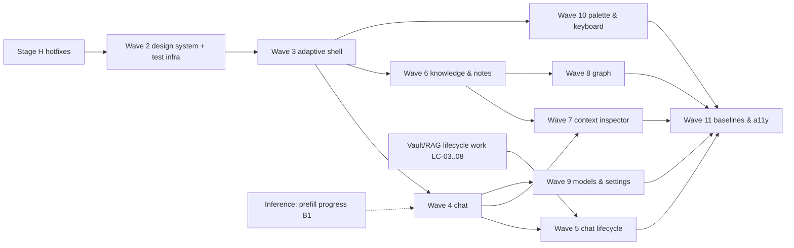

# Skein UX migration plan

**Bead:** `skein-xtov.20` · **Epic:** `skein-xtov` · **Authority:** `docs/research/SKEIN_UI_UX_OVERHAUL_PROMPT.md` §47–§51, §55
**Status:** For owner review. Stage H (P0 hotfixes) is independent of every open decision. Waves 2–11 start after sign-off on §2.

This plan sequences the redesign described in `INFORMATION_ARCHITECTURE.md` and the specs next to it. It turns their proposed beads into waves with entry gates and exit evidence. It routes the backend work they need to the epics that own it, and it reconciles the existing E6/E7 beads.

---

## 0. The documents this plan executes

| Doc | What it decides |
|---|---|
| `UX_AUDIT.md`, `UX_INTERACTION_MATRIX.md` | 16 P0 / 49 P1 / 19 P2 findings; 143 controls, 18 of them dead |
| `REFERENCE_REPO_STUDY.md`, `research/*.md`, `ANDROID_SKILLS_ASSESSMENT.md` | What we take from 12 projects and android/skills, and what we don't |
| `INFORMATION_ARCHITECTURE.md` | 5 destinations, drawer/rail, list–detail, open by kind, palette; decisions D1–D8 |
| `DESIGN_SYSTEM.md` | Tokens, IBM Plex Sans + Mono, colour (108 contrast pairs pass), components; beads DS1–DS16 |
| `ADAPTIVE_LAYOUT_SPEC.md` | Window decision function, panes, the state-preservation contract, fold tests; Wave 3 beads |
| `CHAT_UX_SPEC.md` | Chat, activity/reasoning block, conversation lifecycle UI, context inspector; beads C1–C13, L1–L6, I1–I4 |
| `KNOWLEDGE_UX_SPEC.md` | Knowledge list–detail, notes, files, Connections, Graph; beads KN-6.1–6.15, KN-8.1–8.6 |
| `OBJECT_LIFECYCLE_SPEC.md` | Rename/delete contracts, no-undo policy, migration 010; beads LC-01–LC-28 |
| `UX_TEST_PLAN.md`, `MAC_UX_LAB_PLAN.md` | Screenshot matrix, fake inference engine, fold tests A–G, CI; beads UT-0–UT-20, ML-1–ML-8 |

Bead ids in this plan are the specs' ids (e.g. `C1`, `KN-6.4`). Each is filed as a child of that wave's bead when the wave opens (§6).

---

## 1. How the work runs

1. **Waves, not a big bang** (prompt §48). Each wave has an entry gate and exit evidence. A wave does not start until the one it depends on meets its exit criteria on `main`.
2. **Every UI PR carries evidence** (prompt §39): Roborazzi before/after images for the states it touches, the relevant test, and a one-paragraph explanation. "Implemented the redesigned chat" is not a hand-back.
3. **No dead control ever ships.** Stage H hides today's dead controls. From Wave 3 on, a destination or control appears only in the wave that makes it work.
4. **Presentation layer only.** Backend needs go to the owning epic as narrowly scoped asks (§5), with the wave that needs them. No inference, llama.cpp, RAG, embeddings, storage or graph-logic refactors inside this epic.
5. **Dispatch discipline** (repo memories): worktree isolation for parallel agents; logs under `./.agent-logs/`; pre-close = compile + `ktlintCheck` + unit tests + the module's own `:check`; any migration runs the emulator lane before a device install; only the hardware runner touches the Fold; tiering per `docs/BD_TAXONOMY.md` (Opus for shell/state/storage contracts, Sonnet for bulk UI, Haiku for docs).
6. **The P0 ledger** (`UX_TEST_PLAN.md` §8, UT-8): each P0 has a named regression test and a wave. Wave 11 closes only when all are green.

---

## 2. Owner decisions (the review gate)

Grouped by when they block. Each has a recommended default; silence means the default.

### 2.1 Before Wave 2 (they shape everything)

| # | Decision | Recommended | Source |
|---|---|---|---|
| **D1** | Replace the persistent top command bar with per-destination top bars + a command palette; model moves to the chat header | Yes | IA §9 |
| **D2** | Destinations Chat · Knowledge · Graph · Models · Settings; drawer on Compact, rail on Medium+; retire Timeline as a destination | Yes | IA §9 |
| **D3** | Remove Cursor-style tabs, the tab strip, "Recent ▾" and split view in v1 | Yes | IA §9 |
| **D4** | Legible UI typeface for UI and messages; monospace only for code, paths, ids, commands, logs, model technical details | Yes | IA §9, DESIGN_SYSTEM §3 |
| **D5** | Composer `＋ · text · Send/Stop` and a context chip + inspector replace `$ · 📎 · ⏎` and `⚹ context` | Yes | IA §9 |
| **D6** | Graph is a primary destination (centred on the most recent note) | Yes | IA §9 |
| **D7** | The back stack survives a vault lock as ids only; drafts are encrypted vault rows. **Security review requested.** | Yes, after review | IA §6.3 |
| **D8** | Navigation 3 + material3-adaptive scene strategies, behind a prototype gate | Yes | IA §9, ADAPTIVE spec |
| DS-a | UI face: IBM Plex Sans (pairs with the mono) vs Atkinson Hyperlegible Next | Plex Sans | DESIGN_SYSTEM §19 |
| DS-b | Accent: desaturated cyan `#7ACCE0` dark / `#0D6880` light, derived from the logo | Yes | DESIGN_SYSTEM §19 |
| DS-c | New installs default to System theme (vs Dark) | System | DESIGN_SYSTEM §19 |
| DS-d | Dynamic colour stays off (identity and predictability) | Off | DESIGN_SYSTEM §19 |
| DS-e | Bundle Greek + Cyrillic (+128 KB)? A vector logo exists? | No / please supply | DESIGN_SYSTEM §19 |

### 2.2 Before Waves 4–5 (chat and its lifecycle)

| # | Decision | Recommended | Source |
|---|---|---|---|
| C-a | Soft-keyboard Enter sends, with a Settings switch for newline | Yes | CHAT Q2 |
| C-b | Header shows `Qwen 2.5 3B`; "Abliterated" is a tag, not part of the name | Yes | CHAT Q3 |
| C-c | Hide the "Worked for" summary on quick turns with no sources (< 3 s) | Yes, tune in prototype | CHAT Q4 |
| C-d | Model-generated chat titles: off in v1 (provisional title from the first message) | Off | CHAT Q5 |
| C-e | After deleting the open chat, land on a new chat | Yes | CHAT Q7 |
| C-f | Attach scope: ＋ = this chat; `[[` = this message | Yes | CHAT Q8 |
| **L-a** | **No undo for deletes**: confirm, then hard delete (the vault is excluded from backups; a deferred delete would resurrect on process death) | Yes | LIFECYCLE §14.1, KNOWLEDGE |
| L-b | Migration 010 (FTS5 secure-delete) gates the first delete UI; it is a one-way format change (readers need SQLite ≥ 3.42) | Yes | LIFECYCLE §14.6 |
| L-c | Legacy chats titled "Chat" are re-titled once from their first message at the next unlock | Yes | LIFECYCLE §14.8 |
| L-d | Rename leaves Recent order alone | Yes | LIFECYCLE §14.4 |
| **R-1** | **Deleting a chat that is answering** — the chat spec says "stop, then delete"; the lifecycle spec says "delete is disabled while generating". **Resolved here:** one action, *Stop and delete*, implemented as cancel → await turn end → the delete transaction. The lifecycle contract (no delete during a live turn) still holds underneath. | Stop and delete | CHAT Q6, LIFECYCLE L10 |

### 2.3 Before Wave 6 (knowledge)

| # | Decision | Recommended | Source |
|---|---|---|---|
| **R-2** | **Rename and `[[links]]`** — the knowledge spec rewrites `[[Old]]` in linking notes, with Undo; the lifecycle spec defers that (G12) and discloses "N links will show as missing". **Resolved here:** ship the rewrite (KN-6.6 + KB-1/KB-7/G12) as the Wave 6 target; the disclosure is the fallback behind a flag if G12 slips. | Rewrite with Undo | KNOWLEDGE Q1, LIFECYCLE Q5 |
| K-a | Deleting a PDF also removes its extracted text | Yes | KNOWLEDGE Q3, LIFECYCLE Q2 |
| K-b | Chats appear as graph nodes; excluded from `[[` suggestions in notes | Yes | KNOWLEDGE Q4 |
| K-c | "Save answer as note" creates an AI output (so the AI outputs filter means something) | AI output | KNOWLEDGE Q5 |
| K-d | Keyboard suggestions in notes stay off (threat-model default); no opt-in in v1 | Off | KNOWLEDGE Q2 |
| K-e | Editor undo/redo: not in v1 | Not v1 | KNOWLEDGE Q6 |
| K-f | "Clean up" banner if the first-keystroke bug already corrupted notes | Only if the device check finds corruption | KNOWLEDGE Q7 |

### 2.2a Before Wave 3 (adaptive shell)

| # | Decision | Recommended | Source |
|---|---|---|---|
| A-a | The owner's "Continue using apps on fold" setting is **Always** (set during the device pass); the live-transition contract assumes it | Keep Always | ADAPTIVE §14.1 |
| A-b | Encrypted draft rows (written after ~2 s idle, on backgrounding and at lock) — part of D7 | Yes | ADAPTIVE §14.2 |
| A-c | The ids-only back stack survives a lock, so unlocking returns to the same chat or note — part of D7 | Yes | ADAPTIVE §14.3 |
| A-d | Locking mid-answer keeps the partial answer (ends the turn through the Stop path) instead of discarding it; changes `LOCK_POLICY_INDEXING.md`, needs E3/security sign-off | Yes, after review | ADAPTIVE §13.7, §14.4 |
| A-e | Do you half-fold (tabletop) in your landscape grip? If yes, AL-20 tabletop layouts move up from Wave 8 | Ask | ADAPTIVE §14.5 |

### 2.4 Later

| # | Decision | Recommended | Source |
|---|---|---|---|
| P-a | Persona delete reassigns its notes to the next default persona (not "shared with all") | Yes | LIFECYCLE §14.3 |
| P-b | Purge quotes of deleted notes from chats: post-v1 | Post-v1 | LIFECYCLE §14.7 |
| T-a | A separate `.ux` debug application id for fixture-vault device runs | Only if needed | UX_TEST_PLAN UT-16 |

---

## 3. Stage H — P0 hotfixes (now; independent of §2)

These fix data loss, crashes and dead controls in the app the owner uses today. Each is small and survives the redesign (or is deliberately temporary and says so). They do not wait for the review.

| # | Fix | P0 | Size | Survives redesign? |
|---|---|---|---|---|
| **H1** | Editor safety (KN-6.1): the first keystroke in a note lands before the hidden frontmatter — map transformed offset 0 to the body start and seed the caret there; flush pending note edits on dispose, `ON_STOP` and before lock; typing tests. Device check of the owner's vault first (`/new note Test`, tap, type). | UX-P0-10, UX-P0-11 | S | Yes (KN-6.4 later replaces the hide/show path) |
| **H2** | Crash paths: MIME filter + try/catch with a user message for chat 📎 images and Save-as write errors | UX-P0-12 | S | Yes (becomes the shared never-throw import helper, KN-6.8) |
| **H3** | Hide the dead (AL-01 + the non-shell rows): drawer Notes/Graph/Personas placeholders; drawer Timeline/Settings stop being inert while a tab is open; "No tabs open — back to timeline" gets neutral copy; the split-view icon rail; Settings "Export vault"/"Erase vault" hidden and "View NOTICE" wired via `SettingsRoute`; the composer `[[` "Create" row removed; the bead id and "Coming in v1.1" strings (DS16 copy pass); model Delete gets a confirmation and shows refusals (LC-27); regression tests (UT-9) | UX-P0-03, -13, -14 | S | Yes |
| **H4** | Open by kind at the existing open builders: `DocumentKind` → `TabKind`, so a past chat opens as a chat with its composer | UX-P0-05 | S | Temporary wiring; the rule itself is permanent |
| **H5** | Visible creation: wire the timeline's existing New chat / New note buttons; a tapped palette row *runs* its command | UX-P0-16 | S | Temporary (Wave 3 replaces the shell); the palette rule is permanent |
| **H6** | Model chip: `maxLines = 1`, ellipsis, width cap, so the command field keeps its width on the outer screen | UX-P0-02 | S | Temporary (the chip leaves in Wave 3) |
| **H7** | System Back closes the graph and models overlays | UX-P0-04 (part) | S | Temporary |
| **H8** | AL-02: declare `configChanges` on `MainActivity` per `ADAPTIVE_LAYOUT_SPEC.md` §7.5 (`screenSize|smallestScreenSize|screenLayout|orientation|keyboard|keyboardHidden|navigation`; no `density` — both panels run at the same density, measured); `ManifestPolicyTest`; a Robolectric same-instance test for a size change | UX-P0-08 (part) | S | Yes (the adaptive spec keeps it); state still must survive recreation (Wave 3–4) |

Filed separately to their owners (not UI-layer): the idle-lock `poke()` on user interaction (UX-P0-09, vault/security); the recovery-required screen's missing action (UX-P0-15, security review). UX-P0-01, -06 and -07 need the redesign (Waves 3, 5, 4).

**Exit:** each fix has its test; the touched modules' `:check` pass on `main`; CI green; the hardware runner confirms H1, H4, H5 and H8 on the Fold at the next install.

---

## 4. Waves 2–11

Sizes are the specs' (S/M/L). Every wave's exit includes: the P0 tests it owns are green, its Roborazzi states are recorded, and CI is green.

### Wave 2 — Design system and test infrastructure
**Entry:** §2.1 signed off. **Beads:** DS1–DS10, DS13, DS14, DS16 (`DESIGN_SYSTEM.md` §17); UT-0–UT-5 (`UX_TEST_PLAN.md` §14); ML-1, ML-2, ML-6 (`MAC_UX_LAB_PLAN.md` §8). DS1 (extract `:core:designsystem`) and UT-1 (`:testing-ui`) go first; UT-4 (`:testing-fakes` + `ScenarioInferenceEngine`) in parallel.
**Exit:** tokens v2 and Plex Sans/Mono live with today's screens unchanged in structure; the component gallery recorded (light/dark, three sizes, font 2.0); the contrast test mirrors `contrast.py`; the outer screen re-recorded at 443 and 524 dp; the `ux-screenshots` CI job runs non-blocking.

### Wave 3 — Adaptive navigation shell
**Entry:** Wave 2 exit; D7 security review done. **Beads** (`ADAPTIVE_LAYOUT_SPEC.md` §12): critical path AL-04 (decision function) → **AL-05 Nav3 spike, 4-day time box, gate G1–G10** (fallback: a hand-rolled back stack with the same keys, not Navigation Compose 2.x) → AL-06 (`:core:navigation` keys + Navigator; delivers LC-20) → AL-08 (`NavDisplay` host, session ViewModel store, lock/unlock sequence) → AL-09a/AL-09b (re-host every destination; delete tabs, timeline rail, overlays, split, `AdaptivePaneHost`) → AL-10/AL-11 → AL-15 (JVM A–G) → AL-17 (the owner's-device watcher: the Wave 3 validation gate). Beside it: AL-03, AL-07, AL-12, AL-13, AL-14, AL-16, AL-18, AL-19; UT-6, UT-7, UT-10, UT-13, UT-14 (UT-15 = AL-17). Later: AL-20 tabletop (Wave 8, earlier if A-e), AL-21 (Wave 10), AL-22 (Wave 6), AL-23 (Wave 7).
**Scope:** the IA's shell with today's screens re-hosted: drawer/rail, top bars, list–detail panes, sheets vs extra panes, back handling, the palette seam, state that survives recreation, fold and lock. Timeline, tabs, split, icon rail and the command bar are removed here.
**Exit:** fold tests A, B, D (draft), G green on JVM and on the emulator lane; the hardware runner walks A/B/G on the Fold with the watcher (UT-15); no Stage H temporary wiring remains.

### Wave 4 — Chat
**Entry:** Wave 3 exit. **Beads:** C1 (turn controller out of composition — first), C2–C10, C12 when B1 lands, C13 when B2 lands; DS11, DS12; LC-01, LC-02, LC-21; UT-12, UT-17, UT-19; ML-4, ML-5, ML-8.
**Exit:** `PartialAnswerSurvivesCompositionExitTest` green; the activity block's 13 states recorded; no filename/id/`.gguf` on any chat surface (CHAT AC-01); fold test C passes on the Fold.

### Wave 5 — Conversation lifecycle
**Entry:** Wave 4 exit; L-a/L-b/L-c decided; LC-03–LC-08 and LC-10 landed (LC-07 migration 010 and LC-08 on the emulator lane are the gate). **Beads:** L1–L5 (L6 only if C-d changes), LC-22, LC-23.
**Exit:** create, rename, delete, search chats work; no "Chat" titles; deletion is durable across restart and lock; the prompt §51 "Chats" block passes.

### Wave 6 — Knowledge and notes
**Entry:** Wave 3 exit (can run beside Waves 4–5 once the shell is in); §2.3 decided; KB-1–KB-7 and LC-05, LC-09, LC-24 landed for the beads that need them. **Beads:** KN-6.2–KN-6.13 (KN-6.1 is H1), LC-25, LC-26; UT-7 (E).
**Exit:** the prompt §51 "Notes" block passes (create, edit, rename, delete, search); fold test E on the Fold.

### Wave 7 — Context inspector
**Entry:** Waves 4 and 6 exit (the picker and citation landing come from Wave 6). **Beads:** I1–I4, C11; KN-6.11, KN-6.12 (picker); LC-13 if per-chat attachments are stored.
**Exit:** the prompt ≡ inspector fixture test; the inspector as a sheet on Compact and a 320 dp extra pane on Expanded, surviving a fold.

### Wave 8 — Graph
**Entry:** Wave 6 exit. **Beads:** KN-8.1–KN-8.6, DS15; UT-7 (F).
**Exit:** select-then-open; List view as the TalkBack default; the simulation stops within 4 s; fold test F on the Fold.

### Wave 9 — Models and settings
**Entry:** Wave 4 exit (the model sheet and name resolver). **Beads:** a short Models & Settings spec bead first (from `JAN.md` §6.1–6.2, IA §3.2, `DESIGN_SYSTEM.md`, and the chat spec's model rules; no separate spec exists yet); then Models (On device · Available; details in mono; import progress in Models, never over the composer — supersedes `skein-gg11.21`'s UI half); Settings hierarchy (Appearance · Privacy & security · Personas · Knowledge & search · About · Advanced); LC-11, LC-28 with `skein-3iw`.
**Exit:** no implementation language in Settings; model technical details only in Details.

### Wave 10 — Command palette and power UX
**Entry:** Wave 3 exit (the palette seam), Waves 4–6 for their commands. **Beads:** the palette per `CONTINUE.md` §Proposed Skein command palette & shortcuts (registry evolution, ranking by recency, catalogue, keyboard map with Ctrl, Esc/focus rules), KN-6.12 (palette provider), L5 (Compact chat search), UT-11.
**Exit:** every palette row runs on tap and on Enter; the keyboard map works on the unfolded Fold with a physical keyboard; shortcuts are discoverable in the palette.

### Wave 11 — Baselines and accessibility
**Beads:** UT-8 (ledger closed), UT-18 (macrobenchmark), UT-20 coverage, the E6.I20 accessibility pass re-scoped to the new UI, font-scale and keyboard suites, final interaction audit (re-run the matrix against the new UI).
**Exit:** the prompt §51 acceptance rules all pass; every row of the new interaction matrix is WORKING or deliberately FUTURE-hidden.

### Dependency sketch

---

## 5. Backend asks routed to other epics

None of these is a refactor. Each is the narrow seam a UX wave needs; the owning epic decides how.

| Ask | What | Owner epic | Needed by | Size |
|---|---|---|---|---|
| B1 | Counts-only prefill progress callback (tokens read / total) from the inference service | E4 inference | Wave 4 (C12) | S |
| B2 | Mark reasoning spans (`<think>`) as reasoning in the token stream | E4 inference | Wave 4 (C13, gated) | S |
| B3 | Read GGUF `general.name` / `size_label` at import | E4 / model store | Wave 4 (C4 steps 2–3) | S |
| B4 | Store model display fields (friendly name, tags) | Model store | Wave 4/9 | S |
| B5 | Activity/reasoning column on messages (migration → emulator lane) | E2 vault | Wave 4 (C11, C13) | S |
| B6 / KB-1 / LC-05 | `renameDocument(id, title, ifTitleIs?)`; body saves never carry a title | E2 vault | Waves 5–6 | S–M |
| B7 | Chat-list summaries; message-level search | E2 vault | Wave 5 | S–M |
| B8 | Idle lock waits while a turn is generating; `poke()` on interaction | E3 security | Wave 4 (and UX-P0-09 now) | S |
| B9 / LC-13 | Per-chat attached notes (storage key) | E5 RAG / E2 | Wave 7 | S–M |
| B10 / KB-2 | Per-item "preparing for search" status | E5 RAG | Waves 6–7 | S |
| B13 / KB-8 / LC-03–LC-08 | Correct delete: edges detached, after-commit blob/staging purge, change events, ingest-vs-delete, migration 010 secure-delete, emulator-lane suite | E2 vault, E5 RAG | Wave 5 gate | M total |
| KB-3–KB-7 | Title "contains" search, snippet markers, non-Latin search, list preview, link rewrites that don't bump "last edited" | E2 / E5 | Wave 6 | S each |
| LC-09 | File delete in one transaction + orphan-blob sweep | E2 vault | Wave 6 | S–M |
| LC-11 | Persona delete with explicit reassignment | E2 vault | Wave 9 | S |
| — | App/session-scoped model import job (so a lock or recreation can't cancel it) | E4 (`skein-gg11.19`) | Wave 3 | S–M |

Bugs found during Wave 0/1 and already filed: `skein-g1bd` (fake vs real exception), `skein-cbn2` (ingest revision stamp), `skein-p24q` (frontmatter-only edit never re-indexes), `skein-xath` (autosave reverts a rename), `skein-azrr` (SAF round trip reverts a rename), `skein-50w6` (rename can lose its re-ingest); `skein-mzm5` (fake transaction deadlock) was already open.

---

## 6. Existing beads: what happens to each

| Bead | Today | Verdict |
|---|---|---|
| `skein-ps0` E6.I4 Command bar (in progress) | Search + slash palette + model chip | **Superseded** by D1: its search and command registry move into the palette (Wave 10); the chip leaves in Wave 3. Stage H6 is its last change. |
| `skein-3uh` E6.I22 New-chat flow, AI outputs as documents | "Chat · date" titles, pinned tab | **Re-scope** to CHAT L2 (provisional titles) + C9 (landing) + K-c (Save answer as note); no tabs. |
| `skein-ym3` E6.I13 Model management screen | List, import, default, delete, details | **Re-scope** into Wave 9 (Models: On device · Available · Details). |
| `skein-3iw` E6.I10 Personas screen | Persona list and editor | **Re-scope**: persona picked in the Model sheet (row appears when personas exist); managed in Settings › Personas (Wave 9); LC-11/LC-28. |
| `skein-7zw` E6.I12 Onboarding flow | First-run model choice, biometric, first persona | **Keep, restyle** in Wave 9 against the design system; first run lands on the Chat empty state. |
| `skein-jvw` E6.I20 Accessibility pass | Glyph labels, tab roles, 48 dp | **Re-scope** to Wave 11 against the new UI (tabs no longer exist). |
| `skein-t7k` E6.I19 Fold posture on-device validation | Checklist incl. tabs, split | **Re-scope** to fold tests A–G (UT-15 watcher) at the end of Waves 3, 4, 6, 8. |
| `skein-f92` E6.I21 Light theme polish against §8.1 | "Monospace everywhere" | **Superseded** by Wave 2 (D4 amends §8.1). |
| `skein-cmoe` Chat thinking-orbs indicator | Canvas orbs, 9 states | **Superseded** by the activity block (C3/DS12); no ambient animation (design system motion rules). |
| `skein-gg11.21` Import status row over the composer | UI half of an inference bead | **UI half** resolved by Wave 3/9 (progress in Models + snackbar); the ModelsScreen inset part by Stage H or Wave 3. |
| `skein-gg11.23` Backlinks strip over the chat composer | Chat opened as a note | **Resolved by H4** (open by kind). |
| `skein-94fh` Fold smoke #1 (timeline → note → backlinks → graph) | Walks the old shell | **Keep** as a regression of today's build until Wave 3; then replaced by UT-15 journeys. |
| `skein-6sd` E7.I6 Slash commands in the editor, `skein-2cd` E7.I7 Selection AI actions | Editor features | **Keep**; route their commands through the palette registry (Wave 10). |
| `skein-pj4` Share target receiver, `skein-eev` Assistant integration | Entry points | **Keep**; their deep links become back-stack keys (Wave 3). |

---

## 7. Risks

| Risk | Mitigation |
|---|---|
| Navigation 3 is newer than the rest of the stack | Prototype gate with measurable criteria in Wave 3 (`ADAPTIVE_LAYOUT_SPEC.md`); a minimal hand-rolled back stack is the fallback; either way, keys are ids |
| The inference session is changing `MainActivity`, `ChatScreen` and `SendPipeline` at the same time | Stage H diffs stay small; Wave 3 moves wiring out of `MainActivity` into entry providers, which reduces future conflicts; merges are verified with each touched module's `:check` |
| Delete ships before its storage prerequisites | LC-07/LC-08 are a hard gate for Wave 5 and KN-6.7 (principle: no deletion UI without a correct delete) |
| Screenshot flakiness or Mac↔Linux differences | Record on the Mac; CI compare non-blocking until measured (UT-3); flip to blocking after 10 green `main` runs |
| Scope creep into a plugin platform, cloud providers or a desktop app | The IA reserves room (§7 there) without building; Compose Desktop is rejected; no `ux-lab/` in the repo |
| Fold testing needs the owner's hands (the software fold hits the keyguard) | Physical fold + watcher (UT-15) once per wave; JVM + emulator carry the rest |

---

## 8. Definition of done (prompt §51)

| §51 block | Proven in | By |
|---|---|---|
| Navigation: every control works; no duplicate navigation; destinations obvious | Wave 3 (+ H3) | interaction matrix re-run, `assertNoDeadControls`, UT-6 |
| Chat: clean on the outer screen, uses the inner screen, understandable activity, human model name | Wave 4 | CHAT AC-01…, Roborazzi, fold test C |
| Chats: create, rename, delete, useful history, no anonymous "Chat" | Wave 5 | L1–L5 tests, LC-22 |
| Notes: create, edit, rename, delete, search | Wave 6 | KN-6.x tests, LC-25 |
| Fold: both screens usable; open↔close keep state; nothing squeezed | Waves 3–8 | UT-7 A–G (JVM, emulator), UT-15 (Fold) |
| Visual quality: screenshots for key states; regressions detectable | Waves 2–11 | `ux-screenshots` CI job, blocking after UT-3 |
| Accessibility: targets, contrast, font scaling, labels, keyboard | Waves 2, 11 | UT-5, UT-10, UT-11, contrast test |
