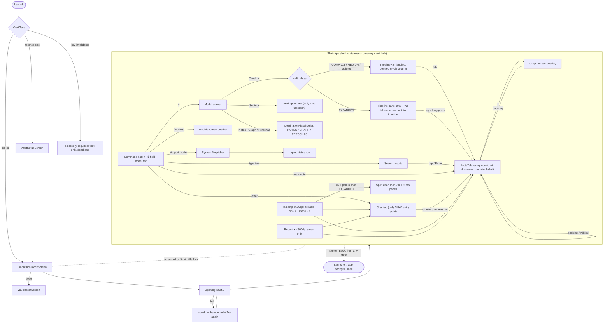

# Skein UX audit: shell, navigation, and Fold behaviour

**Bead:** skein-xtov.1 (epic skein-xtov)
**Brief:** `docs/research/SKEIN_UI_UX_OVERHAUL_PROMPT.md` §1–3, §18–25, §33, §40–45, §47, §55
**Baseline spec:** `docs/superpowers/specs/2026-09-19-skein-design.md` §8
**Tree audited:** `main` at `009cbb6`
**Scope:** `feature/shell/**` (except `auth/`, which is audited elsewhere), `feature/timeline/**`, `app/src/main/kotlin/app/skein/MainActivity.kt`, `app/src/main/AndroidManifest.xml`. Chat, models, settings, onboarding, auth, editor, graph and notes are covered by other audits. They appear here only where the shell hosts them or routes to them.

Companion file: `docs/ux/audit/MATRIX_SHELL.md` (one row per visible interactive element).

---

## 0. Method and evidence rules

- **All claims come from reading the code.** Every claim cites `path:line` at `009cbb6`. Paths are relative to the repo root. Shell files sit under `feature/shell/src/main/kotlin/app/skein/feature/shell/`, written below as `shell/…`. Timeline files sit under `feature/timeline/src/main/kotlin/app/skein/feature/timeline/`, written as `timeline/…`.
- **Production vs preview.** "Production" means the code can be reached from `MainActivity.setContent` (`MainActivity.kt:294-338`) with the real slot lambdas that `UnlockedShell` passes to `SkeinApp` (`MainActivity.kt:628-816`). Other code is labelled as one of:
  - `@Preview` (`shell/nav/NavPreviews.kt`, `shell/layout/AdaptivePaneHostPreviews.kt`, `shell/tabs/TabStripPreviews.kt`, `shell/theme/ThemeGallery.kt`, `feature/timeline/src/debug/.../TimelineScreenPreview.kt`)
  - mock (`MockTabContent`)
  - test-only
  - dead in production (compiled but unreachable)
- **Device evidence.** I did not run the app, and screenshots come out black under `FLAG_SECURE` (`docs/Handoffs/skein-v1-autonomous-completion.md:80`). Where the handoffs, or the coordinator's measurement on the owner's device (2026-09-26), confirm or refute a code-derived finding, this document says so.
- **Computed layout numbers.** Widths are worked out from the typography tokens: IBM Plex Mono, with a 0.6 em advance, plus the `SkeinTypography` tracking. They are estimates at font scale 1.0 and are marked "(computed)".

---

## 1. Device classification: the Pixel 9 Pro Fold is not "Medium" when unfolded

The brief assumed the inner display is about 790–820 dp wide, which is the Medium width class. **The evidence does not support that.**

| Display | Physical px (public spec) | Density | Width dp (portrait / landscape) | `classifyWidth` result (`shell/layout/PaneLayout.kt:13-21`) |
|---|---|---|---|---|
| Inner, stock | 2076 × 2152, 373 ppi | 390 (measured by the coordinator on the owner's device; a third-party report also gives 390 dpi, about 852 × 883 dp) | **~852 / ~883** | EXPANDED / EXPANDED (portrait is only ~12 dp above the 840 breakpoint) |
| Inner, owner's current setting | 2076 × 2152 | forced 330 | **~1006 / ~1043** | EXPANDED / EXPANDED (V2 breakpoints put both inside 840–1199; `classifyWidth` has no Large/XL tier) |
| Inner, brief's assumption | 2076 × 2152 | 420 | ~791 / ~820 | MEDIUM / MEDIUM |
| Inner, one step larger Display size | 2076 × 2152 | about 410 or more | 840 or less | **MEDIUM**: a completely different IA (§4.3) |
| Outer, stock | 1080 × 2424, 422 ppi | 390 (if the same logical density applies) | ~443 / ~994 | COMPACT / **EXPANDED** in landscape |
| Outer, owner's forced 330 (if it applies to the outer panel) | 1080 × 2424 | 330 | ~524 / ~1175 | COMPACT / **EXPANDED** in landscape |

The device evidence agrees with the code:
- The coordinator's screenshot of the unfolded app shows a timeline pane of about 30% on the left. That is `DUAL_PANE`, which the code only produces at EXPANDED (`PaneLayout.kt:73-78`, `AdaptivePaneHost.kt:58-69`).
- The runner saw split view on the unfolded device (`docs/Handoffs/skein-v1-autonomous-completion.md:95`). Split is only offered when the layout is not `SINGLE_PANE`, and that requires EXPANDED (`AdaptivePaneHost.kt:54`, `PaneLayout.kt:55-66`).
- A uiautomator dump put the chat composer at x = 690 px on a 2152-px-wide window (`…autonomous-completion.md:94`). That is roughly 30% plus padding, so again dual pane.

**What this means for the audit:**
1. The primary target renders the **EXPANDED dual-pane** branch at stock density and at the owner's density.
2. Any density of about 410 dpi or more (a larger "Display size" setting, or accessibility zoom) pushes the inner display below 840 dp. The app then switches to the **MEDIUM single-pane** branch, which has a different landing surface, no timeline pane and no split. The inner display straddles a breakpoint the app treats as a hard IA switch.
3. The **outer display in landscape is EXPANDED.** The app renders the full dual-pane workbench in a window only about 443–524 dp tall. `classifyWidth` never reads height (`PaneLayout.kt:13-21`).

Both single-pane branches and both dual-pane branches are audited below.

---

## 2. Inventory

### 2.1 What production actually composes

```
MainActivity.onCreate                                   MainActivity.kt:223-339
└─ setContent → VaultGate                               MainActivity.kt:294-338, 892-966
   ├─ Probing (blank Box)                               :920-921, 969-972
   ├─ Setup → VaultSetupScreen            (auth audit)  :922-935
   ├─ Unlock → BiometricUnlockScreen | VaultResetScreen (auth audit) :936-964
   ├─ Opening → "Opening vault…" / "The vault could not be opened: …" + [Try again]  :916-917, 974-1015
   ├─ RecoveryRequired → text only, no action           :918-919, 1017-1028
   └─ Open → UnlockedShell(session) → SkeinApp(...)     :335, 341-817
      SkeinApp                                          shell/SkeinApp.kt:158-371
      ├─ NavDrawer (ModalNavigationDrawer, every width) SkeinApp.kt:290-295 → shell/nav/NavDrawer.kt:49-87
      │   └─ Column (safeDrawing insets)                SkeinApp.kt:296-302
      │       ├─ CommandBarHost                         SkeinApp.kt:303-308 → shell/nav/CommandBarHost.kt:27-76
      │       │   ├─ CommandBar (≡ · $ field · hint · model chip)   shell/nav/CommandBar.kt:56-140
      │       │   ├─ CommandPalette (when query starts with "/")   CommandBarHost.kt:56-64
      │       │   └─ SearchResults (when results exist)            CommandBarHost.kt:65-74
      │       └─ AdaptivePaneHost                       SkeinApp.kt:309-365 → shell/layout/AdaptivePaneHost.kt:41-97
      │           ├─ timeline slot (FULL only)  → TimelineScreen(expanded = true)   MainActivity.kt:704-711
      │           ├─ IconRail (RAIL only; in practice split only)                  AdaptivePaneHost.kt:70-82
      │           ├─ primary TabHost                    SkeinApp.kt:318-346 → shell/tabs/TabHost.kt:39-90
      │           │   ├─ TabStrip (width ≥ 600) | RecentDropdown (width < 600)     TabHost.kt:52, 60-81
      │           │   └─ active tab → NoteTab | ChatScreen   (else emptyContent)   TabHost.kt:82-88
      │           │        emptyContent: destination == TIMELINE
      │           │            single pane → TimelineRail (fillMaxSize)             SkeinApp.kt:324-326, MainActivity.kt:712-718
      │           │            dual pane   → "No tabs open — back to timeline"       SkeinApp.kt:327-328
      │           │        other destination → destinationContent                  SkeinApp.kt:330-331
      │           │            SETTINGS → SettingsScreen (settings audit)          MainActivity.kt:648-686
      │           │            NOTES / GRAPH / PERSONAS → DestinationPlaceholder   MainActivity.kt:687
      │           └─ secondary TabHost (SPLIT_DUAL only)  SkeinApp.kt:347-364, AdaptivePaneHost.kt:114-121
      └─ overlay slot (drawn over everything)           SkeinApp.kt:368, MainActivity.kt:720-815
          ├─ GraphScreen, while graphDocId != null      MainActivity.kt:729-750
          ├─ ModelsScreen, while modelsOverlayOpen      MainActivity.kt:755-773
          └─ import status row (text + Dismiss)         MainActivity.kt:783-814
```

### 2.2 Routes and destinations

There is **no navigation library and no back stack.** Navigation state is spread across four holders:

| Holder | What it routes | Where |
|---|---|---|
| `NavState.destination` | enum `TIMELINE, NOTES, GRAPH, PERSONAS, SETTINGS` | `shell/nav/NavState.kt:17, 35-36` |
| `TabsState` × 2 (primary, secondary) | open documents (`NOTE`/`CHAT`/`ATTACHMENT` tabs), plus a preview/pinned flag | `shell/tabs/TabsState.kt:23-171`; created at `SkeinApp.kt:216-217` |
| `AdaptiveLayoutState` | `timelineMode` (`FULL`/`RAIL`/`HIDDEN`), `splitEnabled` | `shell/layout/AdaptiveLayoutState.kt:25-91` |
| local `remember` in `MainActivity` | overlays: graph (`graphDocId`) and models (`modelsOverlayOpen`) | `MainActivity.kt:386, 413` |

How each destination renders in production:

| Destination | Renders | Reachable? |
|---|---|---|
| TIMELINE | Single pane: `TimelineRail` as the landing surface. Dual pane: the left pane shows `TimelineScreen`, the right pane shows "No tabs open — back to timeline" | Yes, but only while no tab is active (`TabHost.kt:83-87`) |
| NOTES | `DestinationPlaceholder("NOTES")`: the enum name in headlineMedium at the top-left corner with no padding | Dead (`MainActivity.kt:687`, `SkeinApp.kt:430-441`) |
| GRAPH | `DestinationPlaceholder("GRAPH")` | Dead. The real graph is only an overlay opened from a note's ✦ (`MainActivity.kt:698`) |
| PERSONAS | `DestinationPlaceholder("PERSONAS")` | Dead |
| SETTINGS | `SettingsScreen` | Only while no tab is active. Confirmed on device: the owner's screenshot shows Settings in the right pane |
| (overlay) Graph | `GraphScreen(docId)` | Only via the ✦ button in a note tab (`MainActivity.kt:698`) |
| (overlay) Models | `ModelsScreen` | Only via the `/models` command (`MainActivity.kt:619-625`) |
| (tab) Chat | `ChatScreen`, or "No model yet." guidance | Only via `/chat` (`shell/nav/BuiltinCommands.kt:22-36`). The only code that creates a `TabKind.CHAT` tab is `BuiltinCommands.kt:35` |
| (tab) Note | `NoteTab` | Timeline tap, search result, `/new note`, graph node, citation, backlink |
| `MainActivity.TimelineDestination` | a second `TimelineScreen` whose taps do nothing (`onEntryClick = {}`) | **Dead code.** `destinationContent(TIMELINE)` is only called for `ATTACHMENT` tabs (`SkeinApp.kt:419`), and production never creates one. See `MainActivity.kt:647, 852-857` |

### 2.3 Composables: production vs preview/mock

| Composable | File | Production? |
|---|---|---|
| `SkeinApp`, `tabContent`, `DestinationPlaceholder` | `shell/SkeinApp.kt:158-441` | yes |
| `NavDrawer` | `shell/nav/NavDrawer.kt:49-87` | yes |
| `CommandBarHost`, `CommandBar`, `CommandPalette`, `SearchResults` | `shell/nav/*.kt` | yes |
| `AdaptivePaneHost`, `RightZone` | `shell/layout/AdaptivePaneHost.kt` | yes |
| `IconRail` | `shell/layout/IconRail.kt:40-85` | yes, but only at EXPANDED width with split active (§4.2) |
| `SplitHost` | `shell/layout/SplitHost.kt:35-78` | yes, at EXPANDED width with split active |
| `EdgeToEdgeSurface` | `shell/layout/EdgeToEdge.kt:36-44` | yes (gate screens, `GraphScreen`) |
| `TabHost`, `TabStrip`, `TabChip`, `SplitButton`, `TabContextMenu`, `RecentDropdown`, `EmptyTabHostPlaceholder` | `shell/tabs/*.kt` | yes |
| `MockTabContent` | `shell/tabs/TabHost.kt:116-135` | **no.** It is the default for `noteTabContent`/`chatTabContent` (`SkeinApp.kt:172, 183`), and `MainActivity` overrides both |
| `TimelineScreen`, `FilterBar`, `TimelineRow`, `KindGlyph`, `PersonaChip`, `EmptyState` | `timeline/*.kt` | yes, dual-pane left pane only |
| `TimelineScreen` `HeaderActions` and `FloatingActions` ("📄 New note" / "💬 New chat") | `timeline/TimelineScreen.kt:279-336` | **no.** They render only when `onNewNote`/`onNewChat` are non-null (`:95-96`), and `MainActivity` passes neither (`MainActivity.kt:705-711`). The debug preview does pass them (`TimelineScreenPreview.kt:38-39, 53-54`), so previews show creation actions that production lacks |
| `TimelineRail` | `timeline/TimelineRail.kt:34-66` | yes, as the full-screen **landing surface** for any single-pane layout |
| `NavPreviews`, `AdaptivePaneHostPreviews`, `TabStripPreviews`, `ThemeGallery`, `TimelineScreenPreview` | as named | preview only. Preview widths are 400 dp and 1000 dp, and neither matches a real Fold width (§1) |

### 2.4 State holders and ViewModels

**There is no `androidx.lifecycle.ViewModel`, no `SavedStateHandle` and no `viewModel()` call anywhere in `app/` or `feature/`.** `ChatViewModel` is a plain class created with `remember` over a `rememberCoroutineScope()` (`feature/chat/.../ChatScreen.kt:59-71`). Every holder's lifetime is the composition, or at best the saved-instance-state Bundle.

| Holder | Created | Persistence | Survives Activity recreation? | Survives vault lock/unlock? |
|---|---|---|---|---|
| `NavState` (drawerOpen, destination, query) | `rememberNavState` `NavState.kt:88-92` | `rememberSaveable` with a Saver (`:72-85`) | yes | **no.** `SkeinApp` leaves composition (§5.4) |
| `TabsState` primary/secondary | `rememberTabsState` `TabsState.kt:173-180` | `rememberSaveable` with a Saver (`:140-170`) | yes | **no** |
| `AdaptiveLayoutState` | `AdaptiveLayoutState.kt:93-103` | `rememberSaveable` | yes | **no** |
| `SplitCoordinator` | `remember` `SplitCoordinator.kt:70-78` | stateless | n/a | n/a |
| `CommandRegistry` | `remember` `SkeinApp.kt:250` | re-registered by `LaunchedEffect` (`:251-263`) | rebuilt | rebuilt |
| `CommandBarState` (queryState, results) | `remember(...)` `SkeinApp.kt:265-273`; query at `CommandBarState.kt:55` | plain `mutableStateOf` | **no.** Its query starts empty while `NavState.query` is restored, so the two fall out of sync (P0-08) | no |
| `FlushRegistry` | `remember` `MainActivity.kt:366` | none; it is never called on lock (`:359-365`) | rebuilt | rebuilt |
| `TimelineState` (filter, page limit) | `rememberTimelineState` `timeline/TimelineScreen.kt:147-157`, hoisted at `MainActivity.kt:392-393` | `remember`, not saveable | **no**: filters reset | no |
| Graph overlay (`graphDocId`) | `MainActivity.kt:386` | `remember` | **no** | no |
| Models overlay (`modelsOverlayOpen`) | `MainActivity.kt:413` | `remember` | **no** | no |
| Import job, progress, status | `MainActivity.kt:410, 465-466, 496` | `remember` plus `rememberCoroutineScope` | **no.** The import itself is cancelled (P0-07c) | no |
| `ChatViewModel` (messages, turn, context panel) | `ChatScreen.kt:59-71` | `remember` | **no**; generation is cancelled | no |
| Chat draft | `ChatBottomBar.kt:88` | `remember` | **no** | no |
| `NoteTabState` / editor | `NoteTab.kt:112-120` | `remember`. `EditorState.Saver` exists (`EditorState.kt:236-238`) but `NoteTab` does not use it | text is reloaded from the vault; cursor and scroll are lost (editor audit) | reloaded |
| Drawer animation state | `rememberDrawerState` `NavDrawer.kt:59` | saveable (Material 3) | yes | no |
| `RecentDropdown.expanded` | `RecentDropdown.kt:37` | `remember` | no (closes; acceptable) | no |
| `TabChip.menuExpanded` | `TabStrip.kt:134` | `rememberSaveable(tab.id)` | yes, if the strip is still composed | no |
| `SplitHost.splitFraction` | `SplitHost.kt:45` | `rememberSaveable` | only if split is composed both before and after. Folding drops it, so unfolding resets it to 0.5 | no |
| `VaultSession`, `ModelServices`, engine | `SkeinApplication.vault` (process) | process-scoped | yes | the session is torn down by design |

### 2.5 Drawers, rails, tabs, menus, dialogs, overlays

| Element | Where | Production behaviour |
|---|---|---|
| Hamburger drawer | `NavDrawer.kt:70-86` | Modal at every width. Five items, each a glyph plus a label (`:25-33, 76-81`). No header, no app name, no "New chat", no recents |
| Icon rail (shell) | `IconRail.kt:40-85` via `AdaptivePaneHost.kt:70-82` | Composed only when `timelineMode == RAIL`. Nothing in production sets RAIL except `toggleSplit()` (`AdaptiveLayoutState.kt:52-61`); no ◂ collapse control exists anywhere (the `collapse` glyph at `SkeinTokens.kt:58` is unused). **All five entries are dead** (§4.2) |
| Timeline rail | `TimelineRail.kt:34-66` | Used as the **full-screen landing** in single pane (`MainActivity.kt:712-718`), not as a rail |
| Tab strip | `TabStrip.kt:46-87` | Width ≥ 600 dp (`TabHost.kt:52`). Tap to activate, double-tap to pin, × to close, long-press for the menu, ⧉ for split (EXPANDED only) |
| "Recent ▾" dropdown | `RecentDropdown.kt:30-82` | Width < 600 dp. **Select only.** No close, pin, split, "home" or "new" |
| Tab context menu | `TabContextMenu.kt:16-65` | Pin, Close, Close others, Open in split ⧉. Tab strip only |
| Split view | `SplitHost.kt`, `SplitCoordinator.kt` | EXPANDED only. You leave split by closing every secondary tab (`SplitCoordinator.kt:63-67`); there is no explicit exit control |
| Command palette | `CommandPalette.kt:25-59` | Pushes content down; it does not overlay. Tapping a row only fills the text |
| Search results | `SearchResults.kt:45-78` | Same pushing and persistence behaviour |
| Graph overlay | `MainActivity.kt:729-750` | Full screen. ✕ closes it; system Back leaves the app (§3.3) |
| Models overlay | `MainActivity.kt:755-773` | Full screen. Close button; system Back leaves the app (device-confirmed, `…autonomous-completion.md:94`) |
| Import status row | `MainActivity.kt:783-814` | Pinned to the bottom over whatever is there, including the chat composer (device-confirmed, `:94`). Success rows clear after 6 s (`:483-493`); failures persist |
| Dialogs | none in the shell | The first-launch system `POST_NOTIFICATIONS` dialog comes from `MainActivity.kt:283-291` |

### 2.6 Buttons, icon buttons, text fields

See `MATRIX_SHELL.md` for every control. In summary:
- **Text fields:** one, the command bar `SecureTextField` (`CommandBar.kt:91-112`). No label; placeholder "search or /command"; IME action Search. (The chat composer and note editor belong to other audits.)
- **Icon buttons:** ≡ (`CommandBar.kt:84-89`), the icon-rail cells (`IconRail.kt:67-83`), ⧉ (`TabStrip.kt:95-119`), × (`TabStrip.kt:161-168`). The last three are hand-rolled `clickable` Boxes or Texts, not `IconButton`.
- **Text buttons:** import-row "Dismiss" (`MainActivity.kt:810`), gate "Try again" (`:1009-1011`), timeline "Clear filters" (`timeline/TimelineScreen.kt:264-271`).
- **Chips:** persona ▾, kind chips and tag chips (`timeline/FilterBar.kt:54-76`). The model "chip" (`CommandBar.kt:125-137`) is a **plain `Text`, not a control.**

### 2.7 Command actions: every command registered in production

`CommandRegistry` is filled in exactly one place (`SkeinApp.kt:251-263`) with GLOBAL scope. The EDITOR scope (`CommandRegistry.kt:19`) is never registered in production. Matching is keyword-prefix (`CommandRegistry.kt:72-78`); running needs an exact keyword plus Enter (`:86-96`, `CommandBarState.kt:105-114`).

| Command | Hint shown to users | What it does | Source |
|---|---|---|---|
| `/new note [title]` | "[title] — create a note and open it pinned" | Creates a `NOTE` document (title defaults to "Untitled") and opens it as a pinned tab | `BuiltinCommands.kt:53-68` |
| `/chat` | "— start a new chat and open it pinned" | Creates a `CHAT` document **always titled "Chat"** (`:33`) and opens it as a pinned `CHAT` tab. It does not move focus to the composer | `BuiltinCommands.kt:22-36` |
| `/import model` | "— pick a GGUF file to import and set as default" | Opens the SAF picker; the import streams into the status row and chip; on success it sets the default. Hidden if the session has no `ModelServices` | `MainActivity.kt:607-618, 497-550` |
| `/models` | "— list imported models" | Opens the `ModelsScreen` overlay | `MainActivity.kt:619-625` |

These commands are named in the spec or KDoc but **not implemented**: `/new chat`, `/persona`, `/model`, `/index now`, `/graph`, `/settings`, `/export` (`CommandRegistry.kt:9-12`), and editor `/ai continue` / `/link related` (`:13-15`). The chat composer's own `/` hook (`ChatBottomBar.kt:168`) is not wired by `MainActivity` (`:589-600`), so typing `/new note x` in a chat sends it to the model as a prompt.

### 2.8 Empty, loading and error states (shell-owned or shell-hosted)

| State | Text | Where | Assessment |
|---|---|---|---|
| Dual-pane landing, no tab | "No tabs open — back to timeline" | `TabHost.kt:99-109` via `SkeinApp.kt:327-328` | Implementation language; fills ~70% of the primary device's screen; offers no action (§33) |
| Single-pane landing, empty vault | *(blank)*: `TimelineRail` with zero items | `TimelineRail.kt:40-65` | **No empty state at all.** First launch on the outer display shows only a command bar over a blank screen |
| Timeline pane, empty | "Nothing here yet / New notes, chats, and AI outputs show up here." | `timeline/TimelineScreen.kt:244-273` | No action button |
| Timeline pane, filtered empty | "Nothing matches these filters" + [Clear filters] | same | Fine |
| Timeline pane, loading | *(none)*. `entries` starts as `emptyList()` (`TimelineState.kt:105-108`), so **"Nothing here yet" flashes** on every launch, unlock and fold | `TimelineScreen.kt:111-116` | False empty state |
| Placeholder destinations | "NOTES" / "GRAPH" / "PERSONAS" | `SkeinApp.kt:430-441` | Dead end with raw enum names |
| Secondary pane, empty | "No tabs open — back to timeline" | `TabHost.kt:48` default | Rarely seen, because `onEmpty` exits split |
| Palette, no match | "No matching commands" | `CommandPalette.kt:35-41` | Also shown wrongly after recreation (P0-08) |
| Search, no results | *(nothing)* | `CommandBarHost.kt:65` | No "no results" feedback; Enter silently does nothing |
| Search, in flight | *(nothing)* | `CommandBarState.kt:60-66` | No progress indication |
| Chat tab, no default model | "No model yet. / Use /import model to add one, then come back to this chat." | `MainActivity.kt:567-586` | Slash syntax offered as the fix; no button |
| Chat tab, no ModelServices | "Chat is unavailable in this build." | `MainActivity.kt:560-566` | Test fixtures only |
| Model chip | "no model" / "<20 chars> · not loaded · ⏸" / "importing 42%" / "<model id> · ●" | `MainActivity.kt:430-435`, `CommandBar.kt:125-137` | Technical, duplicated, and truncated mid-word (device: "qwen2.5-3b-instruct- · not loaded · ⏸") |
| Import running / success / failure | "Importing model… 42%" / "Imported "X" and set as default" / "Import failed: <refusal.describe()>" / "Registered <ids> from an earlier import…" | `MainActivity.kt:474, 502, 507, 519, 531, 542` | Covers the composer; shows ids and refusal codes |
| Vault open failure | "The vault could not be opened: $reason" + [Try again] | `MainActivity.kt:998-1012` | Reason string is technical |
| Recovery required | "The biometric key was invalidated. Recovery is not available in this build yet." | `MainActivity.kt:1017-1028` | **Dead end with no action** (auth audit owns this; flagged because the shell hosts it) |

### 2.9 What each form factor actually shows

**Phone portrait and Fold outer display (COMPACT, ~443 dp at stock density).** `SINGLE_PANE`, timeline `HIDDEN` (`PaneLayout.kt:55-60`).
```
┌ status bar ─────────────────────────────────┐
│ ≡  $ search or /command   qwen2.5-3b-instruct- · not loaded · ⏸ │  ← chip ~290 dp (computed); field ~97 dp
├─────────────────────────────────────────────┤  (no tab row until a tab exists)
│                    📄                        │
│                    💬                        │  ← TimelineRail: 40 dp glyph cells, horizontally
│                    💬                        │     centred, max 20, no titles/dates/filters,
│                    💬                        │     no long-press, no empty state
│                    📄                        │
│                                              │
│                (~90% empty)                  │
└──────────────────────────────────────────────┘
After any tap:  [💬 Chat                     ▾]   ← 36 dp RecentDropdown, select-only
                <NoteTab or ChatScreen>            no close, no back, drawer destinations now no-ops
```
This is the layout §22 forbids: "orphaned icon rail", "vertically stacked sidebar icons floating in the center", "huge accidental empty areas".

**Fold inner display (EXPANDED, ~852–1043 dp).** `DUAL_PANE`, timeline `FULL` at 30% (`SkeinTokens.kt:16`, `AdaptivePaneHost.kt:58-69`).
```
┌──────────────────────────────────────────────────────────────────────────────┐
│ ≡  $ search or /command                         qwen2.5-3b-instruct- · not loaded · ⏸ │
├───────────────────────┬──────────────────────────────────────────────────────┤
│ Persona▾ Notes Chats Fi… │                                                   │ ← filter row clipped at the
│ Today                 │                                                      │   pane edge (device screenshot)
│ 💬 Chat               │          No tabs open — back to timeline             │
│   user: … assistant:… │                                                      │ ← ~70% of the device is
│ 💬 Chat               │                                                      │   one grey sentence
│ 📄 Smoke              │                                                      │
└───────────────────────┴──────────────────────────────────────────────────────┘
With tabs:  right zone = [📄 Smoke ×][💬 Chat ×] ……… [⧉]  (36 dp strip) + content
With split: [40 dp IconRail: ▸ ◐ ✦ ◈ ⚹ (all dead)] | primary tabs | 4 dp divider | secondary tabs
```
Device-confirmed: the 30% timeline, the clipped chips, rows all titled "Chat" with "user: … assistant: …" previews, the chip text, and Settings rendering in the right pane.

**Fold inner at a larger Display size (MEDIUM, 600–839 dp).** `SINGLE_PANE`, timeline `HIDDEN`, but `TabHost` shows the **strip**, not the dropdown, because it tests only `== COMPACT` (`TabHost.kt:52`). There is no ⧉ because `splitAvailable` is false (`AdaptivePaneHost.kt:54`). The landing is again `TimelineRail`: a 40 dp glyph column centred in a ~800 dp-wide screen. `AdaptiveLayoutResult.useTabDropdown = true` (`PaneLayout.kt:61-66`) says the opposite, but nothing reads it.

**Outer display or phone in landscape (EXPANDED width, ~411–524 dp tall).** Full dual pane. The vertical budget, minus status and nav bars (~350–470 dp), goes to a 56 dp command bar, a 36 dp tab strip, then the content. With the IME up (~200+ dp in landscape) only about 60–200 dp of chat is visible (computed).

**Keyboard visible (any width).** The shell's `Column` uses `safeDrawing`, which includes the IME (`SkeinApp.kt:296-301`), so the pane area shrinks correctly. However:
- The palette and search results are an unweighted `LazyColumn` in the command-bar column (`CommandBarHost.kt:37-75`). They take height before the `weight(1f)` pane host, so many results can push the panes to zero height.
- The import status row adds `imePadding()` itself (`MainActivity.kt:787`) and floats over the composer.
- After `/chat`, focus stays in the command bar, so the keyboard serves the wrong field (handoff follow-up at `…autonomous-completion.md:94`).

---

## 3. Current information architecture

### 3.1 Navigation paradigms present in production

| # | Paradigm | Where | Width | What it navigates |
|---|---|---|---|---|
| 1 | Hamburger modal drawer | `NavDrawer.kt` | all | 5 destinations. 3 are placeholders; all 5 are no-ops while a tab is open |
| 2 | Timeline pane (left 30%) | `AdaptivePaneHost.kt:58-69` | EXPANDED | documents → NOTE tabs |
| 3 | Timeline "rail" as landing | `SkeinApp.kt:324-326`, `MainActivity.kt:712-718` | COMPACT, MEDIUM, tabletop | documents → NOTE preview tabs |
| 4 | Shell icon rail | `AdaptivePaneHost.kt:70-82` | EXPANDED + split | nothing (all dead) |
| 5 | Tab strip | `TabStrip.kt` | ≥ 600 | open documents; pin, close, split |
| 6 | "Recent ▾" dropdown | `RecentDropdown.kt` | < 600 | open documents (select only) |
| 7 | Command bar search | `CommandBarState.kt:81-96` | all | any document → NOTE preview tab |
| 8 | Command bar `/` palette | `CommandPalette.kt` | all | creates chats and notes, opens models, runs the import |
| 9 | Split view | `SplitHost.kt` | EXPANDED | a second tab set |
| 10 | Full-screen overlays | `MainActivity.kt:720-815` | all | graph (from ✦ in a note), models (from `/models`) |
| 11 | In-content links | NoteTab backlinks and wikilinks, chat citations and context rows | all | → NOTE preview tabs |
| – | System Back | **not handled anywhere**: no `BackHandler` in `app/` or `feature/` | all | leaves the app |

### 3.2 Overlap and duplication

- **"Timeline" appears in five places:** drawer item, left pane, single-pane landing rail, shell-rail ◐ (dead), and `TimelineDestination` (dead code). On EXPANDED width, choosing drawer → Timeline gives the same screen, because the pane is already there and the right side still says "No tabs open — back to timeline".
- **Graph appears in three places:** drawer (placeholder), shell rail ✦ (dead), and the note ✦ (the only working one, and it is an overlay rather than a destination).
- **Settings appears in two places:** drawer (works only with no tab open) and shell rail ⚹ (dead). Its glyph is also reused from "context panel" (`NavDrawer.kt:31-32`).
- **Personas appears in two places**, both dead. The only persona surface that works is the timeline's persona filter chip. There is no "current persona": `SkeinApp.personaId` is always null (`MainActivity.kt:636-639`) and `ChatScreen` gets `currentPersonaId = { null }` (`:599`).
- **Open documents have two different controls for the same job:** strip at ≥ 600 dp, dropdown below 600 dp, with different capabilities. The dropdown cannot close anything.
- **The two layers don't coordinate.** The destinations (drawer) and the tabs are independent, but the tab layer silently wins (`TabHost.kt:83-87`, locked in by `SkeinAppTest` "an open tab still wins over a non-TIMELINE destination"). The drawer's selected item then disagrees with the screen.
- **Creation exists only as typed commands.** No visible "New chat" or "New note" control is composed in production (§2.3).
- **Model state appears in three places:** the chip, `/models`, and the import status row. None of them lets you switch models from the chip.

### 3.3 Current navigation graph



Dead ends and traps in this graph:
- Placeholder destinations.
- A COMPACT tab (no close and no back, so the rail can never be reached again).
- A chat reopened from the timeline or search lands in `NoteTab`, not `ChatTab`.
- `RecoveryRequired`.
- System Back, which leaves the app.

---

## 4. Current Fold behaviour

### 4.1 How width and posture are classified

- **Width.** `SkeinApp` reads `currentWindowAdaptiveInfoV2().windowSizeClass` (`SkeinApp.kt:210`) and passes it to `AdaptivePaneHost` (`:312`). `classifyWidth` compares against `WindowSizeClass.WIDTH_DP_EXPANDED_LOWER_BOUND` and `…MEDIUM_LOWER_BOUND` (`PaneLayout.kt:13-21`). These are the platform constants (600 and 840), not hard-coded numbers, and **that is correct.** `TabHost` computes its own class separately (`TabHost.kt:43, 52`) because `SkeinApp` does not pass it down (`SkeinApp.kt:319-345`). It agrees in production but not in tests or previews that force a size.
- **Height is ignored everywhere.**
- **Tiers above EXPANDED (Large at 1200 dp, XL at 1600 dp) are ignored.**
- **Posture.** `rememberFoldPosture()` collects `WindowInfoTracker.windowLayoutInfo` (`FoldPosture.kt:77-103`) and keeps only the state and orientation of the first `FoldingFeature` (`:61-67`). It ignores `isSeparating`, `occlusionType` and hinge bounds. The only rule that uses posture is **tabletop** (`HALF_OPENED` + `HORIZONTAL`), which forces single pane (`PaneLayout.kt:52-60`). Book posture is treated as flat. The first frame is always `Unknown` (`FoldPosture.kt:95`). This duplicates what `currentWindowAdaptiveInfo().windowPosture` already provides from the same Material 3 adaptive dependency.
- **Decision table** (`computeAdaptiveLayout`, `PaneLayout.kt:44-80`):

| Width tier | Posture | Pane layout | Timeline | Tab chrome (`TabHost.kt:52`) | Split? |
|---|---|---|---|---|---|
| COMPACT < 600 | any | SINGLE_PANE | HIDDEN; rail landing when no tab | Recent ▾ | no |
| any | tabletop | SINGLE_PANE | HIDDEN; rail landing | strip at ≥ 600 | no |
| MEDIUM 600–839 | flat or book | SINGLE_PANE | HIDDEN; rail landing | **strip** (`useTabDropdown = true` is never read) | no |
| EXPANDED ≥ 840 | flat or book | DUAL_PANE | `layoutState.timelineMode` (FULL; RAIL only via split) | strip | yes (⧉) |
| EXPANDED + split | flat or book | SPLIT_DUAL | forced RAIL | strip per pane | secondary pane: no |

### 4.2 What each posture renders, and the defects

1. **Fold closed (outer, COMPACT portrait): an orphaned rail and huge empty areas.** The landing surface is `TimelineRail` stretched to `fillMaxSize()` with `horizontalAlignment = CenterHorizontally` (`MainActivity.kt:713-717`, `TimelineRail.kt:42-46`). The result is 20 or fewer 40 dp emoji cells floating in the centre of the screen: no title, no date, no persona, no filter, no long-press. The TalkBack label is only "Note" or "Chat" (`TimelineRail.kt:55`), and there is nothing at all when the vault is empty. `SkeinAppTest` locks this in ("single-pane with no tabs renders the timeline slot compact as landing content"). This matches, almost word for word, the anti-patterns in brief §22. **P0-01.**
2. **Fold open (inner, EXPANDED): squeezed side pane plus a huge empty area.** The left pane is a fixed 30% (256–313 dp across the densities in §1). That clips the filter chips at the edge (device screenshot: "Persona ▾ | Notes | Chats | Fi…") with no scroll affordance (`FilterBar.kt:44-53`). The right ~70% says only "No tabs open — back to timeline". The dual pane has **no inspector or context third pane**; the chat's context panel is an inline toggle inside `ChatScreen` (chat audit).
3. **Split: an orphaned, dead icon rail.** Entering split forces `RAIL` (`AdaptiveLayoutState.kt:52-57`). The `IconRail` gets only `onExpand` (`AdaptivePaneHost.kt:71-74`), so ◐ ✦ ◈ ⚹ fall back to `{}` (`IconRail.kt:44-47`). ▸ calls `toggleTimeline()`, which returns immediately while split is on (`AdaptiveLayoutState.kt:43`). **All five rail buttons are dead. P0-04.**
4. **MEDIUM tier: single pane in an 800 dp-wide window.** The same centred rail landing, but even emptier. The width only reaches MEDIUM at a non-default density on the Fold (§1). Android's own adaptive guidance at MEDIUM is a navigation rail and, on foldables, optionally two panes (`calculatePaneScaffoldDirectiveWithTwoPanesOnMediumWidth`). Skein uses neither `NavigationSuiteScaffold` nor `ListDetailPaneScaffold`.
5. **Tabletop (half-open, horizontal hinge).** Single pane is forced regardless of width, with no top/bottom split. Content straddles the hinge. The mode switch **re-parents the primary pane** (P0-10), so the active chat or note is torn down and rebuilt **without** any Activity recreation.
6. **Book posture (half-open, vertical hinge).** Treated as flat. On the inner display the hinge sits at 50%, which falls inside the right zone (30–100%), so the chat and composer are split by the crease. Hinge bounds are never read.
7. **Outer landscape / phone landscape.** Width-only classification gives dual pane at ~411–524 dp height (§2.9).
8. **The IA flips on a density setting.** Moving the Fold's Display size across ~410 dpi swaps the landing surface, removes the timeline pane and removes split (§1). A breakpoint used as a hard IA switch is fragile on a device that sits right on it.
9. **Breakpoints themselves are not hard-coded** (they are the platform constants). **Other things are:**
   - 30% timeline share with no minimum or maximum dp (`SkeinTokens.kt:16`)
   - 36 dp tab height (`:18`)
   - 40 dp rail cells (`:14`, `TimelineRail.kt:68`)
   - 4 dp split divider (`SplitHost.kt:41`)

   Canonical adaptive layouts would replace these.

### 4.3 Spec §8 compared with reality

| Spec §8 | Reality |
|---|---|
| §8.2 Persistent command bar: search + slash-commands + model status "qwen · ●" | Present. The chip shows a truncated file slug or a 55+ character registry id, plus redundant "not loaded · ⏸" |
| §8.2 Hamburger reveals Timeline · Notes · Graph · Personas · Settings | Present. Three of five are placeholders; all five are no-ops while a tab is open |
| §8.2 Dual pane on unfolded: timeline 30% / tabs 70% | Present at EXPANDED only |
| §8.2 Timeline collapsible via ◂ to a 40 px icon rail | **Not implemented.** No ◂ control; RAIL appears only via split, and its buttons are dead |
| §8.2 Single pane on folded or narrow | Present, but the landing is a glyph-only rail |
| §8.3 Cursor-style preview tabs (italic, single click replaces, double click pins) | Present on the strip. Italic is the only cue, with no semantics |
| §8.3 Tab types 💬 📄 📎 | 📎 is never created in production |
| §8.3 Split via ⧉ and the long-press menu; split auto-collapses the timeline | Present at EXPANDED |
| §8.3 Folded phone: tabs → "Recent ▾" | Present below 600 dp only, and it cannot close tabs |
| §8.4 Bottom bar slash-commands | The chat `/` hook is not wired (`MainActivity.kt:589-600`) |
| §8.6 Graph "tap node → preview; long-press → pin as tab" | Present, but always as a NOTE tab (chat nodes open in the editor) |
| §8.7 First-run model choice | Not in the shell; the user must discover `/import model` |

---

## 5. Live transition audit (brief §24–25)

### 5.1 Mechanism

- `MainActivity` declares **no `android:configChanges`** (`AndroidManifest.xml:81-88`). Folding, unfolding, rotating, a density or font-scale change, or a Display-size change therefore **destroys and recreates the Activity**. The handoff records forced recreations via `font_scale` returning to RESUMED on the same pid (`…autonomous-completion.md:89`).
- The process, `SkeinApplication.vault`, the `VaultSession` and `ModelServices` survive. `gatePhase` returns `Open` immediately when a session exists (`app/src/main/kotlin/app/skein/vault/GatePhase.kt:51-52`), so the vault gate does not flash.
- **Compose state survives only if it is `rememberSaveable`.** There are no ViewModels (§2.4), so anything held in plain `remember` or `rememberCoroutineScope` is lost, and any coroutine launched from a composition scope is **cancelled**.
- `ProcessLifecycleOwner` does not report ON_STOP during a configuration change, so a fold does not trip lock-on-background (`app/src/main/kotlin/app/skein/vault/LockPolicyObserver.kt:75-77`).
- **Transitions that do not recreate the Activity** (a posture change into or out of tabletop, entering or leaving split) still move the primary `TabHost` to a different call site inside `AdaptivePaneHost`'s `when` branches (`AdaptivePaneHost.kt:57-95` and `RightZone` `:113-124`). There is no `movableContentOf`, so that content is disposed as well (P0-10).

### 5.2 State survival: open → closed and closed → open (identical mechanism both ways)

| State | Holder (evidence) | Survives recreation? | Notes / verdict |
|---|---|---|---|
| Active destination | `NavState` saveable (`NavState.kt:72-92`) | **yes** | |
| Drawer open | `NavState.drawerOpen` + `rememberDrawerState` | **yes** | Reopens after a fold. Test G expects it to "resolve appropriately"; restoring an open modal over a new layout is questionable (P2) |
| Command bar text | `NavState.query` saveable | **yes** | |
| Command bar results and palette | `CommandBarState.queryState` / `results` in plain `remember` (`SkeinApp.kt:265-273`, `CommandBarState.kt:55-58`) | **no; desynced** | After recreation the field still shows "/new note x", but `CommandBarState` holds "". The palette renders "No matching commands" (`CommandBarHost.kt:56-58` reads `NavState.isCommand`, while `paletteCommands` reads the empty query), and **Enter does nothing** (`CommandBarState.kt:105-114`) until the next keystroke. **P0-08** |
| Open tabs, active tab, recency, preview/pinned, kind | `TabsState` saveable (`TabsState.kt:140-180`) | **yes** | Tab titles are snapshots and never refresh (P1) |
| Split enabled, timeline mode | `AdaptiveLayoutState` saveable | **yes** | But see the next row |
| Secondary split pane contents | `secondaryTabsState` saveable | **kept but invisible** | On close, `RightZone` renders only `primary` for `SINGLE_PANE` (`AdaptivePaneHost.kt:122-123`). A chat open in the right split pane **disappears** on the outer display, with no merge or indication. It reappears on unfold. **P0-09** |
| Split divider fraction | `rememberSaveable` in `SplitHost` (`SplitHost.kt:45`) | **lost** after a closed → open round trip | `SplitHost` is not composed while folded (P2) |
| Timeline filters (persona, kinds, tag) and page window | `TimelineState` in `remember` (`TimelineScreen.kt:147-157`, `MainActivity.kt:392-393`) | **no** | Reset to all kinds, all personas. **P0-07d** |
| Timeline scroll position | `rememberLazyListState` inside `EntryList` (`TimelineScreen.kt:177`) | **unreliable** | `EntryList` is not composed while `entries` is the initial `emptyList()` (`TimelineState.kt:105-108`, `TimelineScreen.kt:111`), and the page limit resets to 50. Likely lost past item 50; needs a device check |
| Graph overlay open + document | `graphDocId` `remember` (`MainActivity.kt:386`) | **no** | Graph closes. **P0-07a** |
| Selected graph node, zoom, pan, layout | The graph has no separate "selected node" state; the centred document *is* `graphDocId`. Zoom, pan and positions are plain `remember` (`feature/graph/.../GraphView.kt:108-109, 135-140`) | **no** | The layout re-simulates from scratch |
| Models overlay | `modelsOverlayOpen` `remember` (`MainActivity.kt:413`) | **no** | Closes. **P0-07a** |
| In-flight model import | `importJob` in a `rememberCoroutineScope` (`MainActivity.kt:465, 496-550`); `ModelManager.import` is a cold `channelFlow` (`core/inference/.../ModelManager.kt:131-155`) | **no: import cancelled** | The status row and progress vanish silently; a 1.6 GB copy is abandoned. **P0-07c** |
| Import status text | `remember` (`MainActivity.kt:466`) | no | |
| Chat draft (composer text) | `remember { TextFieldValue("") }` (`feature/chat/.../ChatBottomBar.kt:88`) | **no** | **P0-07b** |
| Chat generation in progress | `ChatViewModel` scope = `ChatScreen`'s `rememberCoroutineScope` (`ChatScreen.kt:59-71`; `ChatViewModel.kt:196`) | **no: collector cancelled** | Test C fails. Whether `SendPipeline` persists the partial answer as interrupted is for the chat audit. **P0-07b** |
| Chat scroll position | `rememberLazyListState` (`feature/chat/.../MessageList.kt:47`) | uncertain | Messages are re-collected asynchronously |
| Chat context panel open | `ChatViewModel.contextPanelOpen` (`ChatViewModel.kt:115`) | **no** | Test A ("context inspector") fails (P1) |
| Active chat (which conversation) | the pinned CHAT tab in `TabsState` | **yes** | Test B's "no duplicate chat" passes, unless the chat was opened from the timeline, which creates a NOTE tab (P0-05) |
| Note editor text | vault autosave; `NoteTab` `remember` (`NoteTab.kt:112-120`) | reloaded from the vault | Unsaved keystrokes inside the autosave debounce and the cursor or selection depend on the editor (`EditorState.Saver` exists but is unused). Editor audit |
| Backlinks drawer expanded | `rememberSaveable` (`feature/editor/.../BacklinksDrawer.kt:58`) | yes | |
| Model selection (default) | on-disk registry | **yes** | |
| Loaded model / engine | process-scoped `ModelServices` | **yes** | The chip is re-derived |
| Persona | no current-persona concept (`MainActivity.kt:599, 636-639`) | n/a | |
| IME / focus | none saved | **no** | Keyboard dismissed; the composer is not refocused (Test D fails, P1) |
| Recent ▾ menu, tab context menu | `remember` / `rememberSaveable(tab.id)` | closes / may reopen | Acceptable |
| `FLAG_SECURE`, theme | DataStore, re-applied synchronously (`MainActivity.kt:245-271`) | yes | |

**Every "no" above is a reset bug on the Fold's most basic gesture.** The root causes:
- No `configChanges` (`AndroidManifest.xml:81-88`).
- No ViewModel or `SavedStateHandle` layer.
- Composition-scoped coroutines own long-running work (chat generation, model import).
- `AdaptivePaneHost` has no `movableContentOf`.

Declaring `configChanges` alone would **not** fix it: pane re-parenting (P0-10) would still dispose the content.

### 5.3 Acceptance tests A–G (brief §25), predicted from code

| Test | Prediction | Why |
|---|---|---|
| A. Open → closed with an active chat, inspector and knowledge context | **FAIL** | Draft lost, context panel closed, generation cancelled. If the chat was in the split's right pane, it disappears (P0-09). If it was opened from the timeline, it was never a chat (P0-05) |
| B. Closed → open mid-conversation | **PARTIAL** | The tab survives with no duplicate, but the draft and running generation are lost, and the landing switches from rail to "No tabs open" if no tab was active |
| C. While generating | **FAIL** | The collector is cancelled (`ChatViewModel.kt:196`) |
| D. Keyboard active | **FAIL** | Focus and draft are lost; the IME closes |
| E. Knowledge (document selected) | **PARTIAL** | The tab survives; the editor cursor is lost; timeline filters reset |
| F. Graph node selected | **FAIL** | The overlay closes (`MainActivity.kt:386`) |
| G. Drawer or sheet state | **PARTIAL** | The drawer reopens; the command bar palette desyncs (P0-08) |

### 5.4 The other reset: vault lock tears down the whole shell

- `VaultGate` renders `unlockedContent` only while `session != null` (`MainActivity.kt:914-915`, `GatePhase.kt:51-52`). A lock switches to the unlock screen, so `SkeinApp` **leaves composition** and every `rememberSaveable` entry inside it is unregistered. After unlock the user gets a **fresh shell**: no tabs, destination TIMELINE, no split, empty query, no drafts.
- The default policy locks on screen-off (`app/src/main/kotlin/app/skein/system/SecurityPrefs.kt:170`) and after **5 minutes idle** (`:169`).
- **Nothing in production ever calls `UnlockManager.poke()`.** The only definition is at `core/vault/.../UnlockManager.kt:445-449`, and `IngestScheduler.kt:32` notes that it deliberately does not call it either. The production `UnlockManager` runs its idle poller (`VaultServices.kt:102-106`, `UnlockManager.kt:175-181`, `:461-468`), measured from **unlock time** (`:248`).
- **So the vault is expected to lock 5 minutes after every unlock, even mid-typing, wiping all shell state.** This is code-derived and should be confirmed on the device. It is P0-11. The fix is cross-cutting (vault, plus the shell or app wiring `poke()` into user interaction); the reset half is shell-owned.

---

## 6. User flows (brief §43)

### Flow 1: Launch the app
1. **First-ever launch:** a system `POST_NOTIFICATIONS` dialog pops over vault setup with no explanation. `MainActivity.kt:283-291` calls it "lazy", but it asks in `onCreate`. **P1**
2. **Cold launch:** blank probe (`MainActivity.kt:969-972`), then the biometric prompt, then "Opening vault…", then the shell.
3. **Outer display:** the glyph-column landing (P0-01), or a blank screen when the vault is empty. **Inner display:** the 30% timeline and 70% "No tabs open — back to timeline" (P1-01).
4. **No visible "New chat".** The only hint is the placeholder "search or /command" (P1-02).
5. **No model on first run:** the chip says "no model" and nothing offers the import until the user has already found `/chat` (`MainActivity.kt:567-586`).
6. **On every launch the timeline flashes "Nothing here yet"** before data arrives (P1-11).

Taps to reach a first chat, if the user knows the syntax: tap the command bar, type `/chat`, press Enter, then tap the composer, because focus is not handed over. That is 4 steps plus typing. If a model is needed first: `/import model` → picker → wait → `/chat`.

### Flow 8: Open a previous chat (navigation part)
- **Outer display:** the rail shows 💬 glyphs with no titles and no dates. The user has to guess. Tapping opens the document as a **NOTE preview tab**: `onTimelineEntryOpen` hard-codes `TabKind.NOTE` (`SkeinApp.kt:226-228`). The user lands in `NoteTab` with the chat's Markdown **transcript** in an editable editor (chats materialise `body_md` as a transcript, `core/model/.../Vault.kt:331-339`). There is no composer, so **the conversation cannot be continued. P0-05.**
- Once a tab is open on COMPACT, the rail is gone for the rest of the session: no close, no back, and the drawer's Timeline is a no-op (P0-02).
- **Inner display:** rows are all titled "Chat" (`BuiltinCommands.kt:33`; device screenshot), with previews "user: … assistant: …". Same NOTE-tab dead end. If the original `/chat` tab is still open, this creates a **second tab for the same document** in a different renderer, because `openPreview` de-duplicates only against the current preview (`TabsState.kt:54-70`).
- **The only working path back into a chat** is the "Recent ▾" dropdown or the tab strip, and only while that chat's original `/chat` tab is still open. A vault lock wipes it (§5.4).
- Duplicate navigation: timeline, search and the Recent dropdown all list the same chat, each with different behaviour.

### Flow 11: Search chats
- There is no chat list and no chat search. The only search is the global command bar (`CommandBarState.kt:81-96`): title-prefix hits, then body full-text hits, debounced 150 ms.
- Every chat is titled "Chat", so results are identical 💬 rows with no snippet, date or match highlight (`SearchResults.kt:57-74`).
- A tapped result opens as a NOTE tab (same P0-05).
- Enter opens the top hit without any preview of what it is (`CommandBarState.kt:111-113`).
- No results means no feedback (`CommandBarHost.kt:65`).
- The timeline's "Chats" kind chip exists only on EXPANDED width, and its semantics are inverted: tapping it *hides* chats (`TimelineState.kt:154-159`, P1-10).

### Flow 16: Search Knowledge (command bar)
- Typing plain text starts the debounced search. There is no loading indicator.
- Results render inline under the bar and **push the panes down**; they are not an overlay (`CommandBarHost.kt:65-74`, `SkeinApp.kt:303-311`).
- There is no kind filter, no snippets, no "no results" state, no clear (×) button and no Esc handling. Results **stay on screen when focus moves** to the chat composer or editor, until the text is deleted by hand.
- Tapping a result opens a NOTE preview tab and clears the query (`CommandBarHost.kt:68-72`). Focus stays in the command bar.
- On COMPACT with a model name in the chip, the field is about 97 dp wide (computed; P0-12), so the typed query is barely visible.
- Terminology: "search or /command" frames search as a terminal (P1).

### Flow 24: Close the Fold (inner EXPANDED → outer COMPACT)
- The Activity is recreated (§5).
- Dual pane collapses to single pane. The timeline pane disappears, and if no tab is active the landing becomes the glyph column.
- The tab strip becomes "Recent ▾", so close, pin and split disappear. The right split pane's tabs vanish (P0-09).
- The graph and models overlays close. The chat draft is lost and generation cancelled. Any model import is cancelled. Timeline filters reset. The command bar desyncs. The keyboard is dismissed.
- The drawer, if it was open, reopens over the new layout.
- The chip text grows relative to the available width, and the search field shrinks to about 97 dp (P0-12).

### Flow 25: Open the Fold (COMPACT → EXPANDED)
- The same recreation losses (draft, generation, overlays, import, filters, focus).
- The timeline pane reappears with reset filters.
- If split was on when the Fold was closed, the secondary pane **reappears** unexpectedly, restored from saved state, with its divider back at 50%.
- The empty-state landing switches from the rail to "No tabs open — back to timeline". A tab opened while folded is still active, which is correct.

### Flow 26: Rotate
- **Inner display:** EXPANDED in both orientations, so the layout is unchanged, but the Activity is still recreated. Every P0-07 loss happens on rotation.
- **Outer display and phones:** portrait COMPACT becomes landscape EXPANDED, giving the full dual pane plus tab strip in about 411–524 dp of height. With the IME open, the chat has roughly 60–200 dp of vertical space (computed; P1-04).
- The rail landing is replaced by "No tabs open" and back again with each rotation.
- There is no orientation lock (`AndroidManifest.xml:81-88`), which is correct, but there is also no height-aware layout.

### Flow 27: Physical keyboard
- Enter in the command bar submits. It is a single-line field with the Search IME action (`CommandBar.kt:95, 101-102`).
- **No application shortcuts exist.** There is no `onKeyEvent` or `onPreviewKeyEvent` in `shell/` or `app/`. The only key handling lives in chat and editor (`ChatBottomBar.kt:179-180`, `SkeinEditor.kt:199`, `WikilinkAutocomplete.kt:69`). Missing:
  - Ctrl/Cmd+K or `/` to focus the command bar
  - Ctrl+N for a new chat
  - Ctrl+W to close a tab
  - Ctrl+Tab to switch tabs
  - Esc to dismiss palette, results or overlays
  - Arrow-key selection in the palette or results (they are `clickable` rows reachable only by Tab-key focus traversal)
  - `onProvideKeyboardShortcuts` for the Meta+/ helper
- In the palette, selection and running are separate steps: tap or Enter-on-focus only fills the text (`CommandBarHost.kt:57-63`), so the command needs a second Enter.
- Mouse: right-click does not open the tab context menu (long-press only, `TabStrip.kt:144-148`). There are no hover states.
- After `/chat`, focus is not moved to the composer.
- **P1-12** for the group. Per §41, keyboard support must stay optional, so none of this is P0.

### Flow 28: Return after backgrounding (vault auto-lock interplay)
- **Short background with the screen on and less than 5 minutes since unlock:** the Activity is only stopped, so state is intact. `FLAG_SECURE` and the stubbed task description hide the recents thumbnail (`MainActivity.kt:251-271`).
- **Screen off (default `lockOnScreenOff = true`), or 5 minutes since *unlock*:** the vault locks and `SkeinApp` is disposed. Returning shows the biometric prompt, then "Opening vault…", then a **fresh shell**: all tabs, the split, the destination, the query and drafts are gone (§5.4, P0-11).
- **The idle lock ignores user activity** (no `poke()`), so it can fire while the user is typing. The user is dropped to the unlock screen and then to an empty shell.
- **Lock-on-background** is opt-in (`SecurityPrefs.kt:171`). When on, every app switch is a full shell reset.
- **Process death while backgrounded:** the session is gone, so the unlock screen appears. Whether `rememberSaveable` then restores the old tabs depends on whether the registry's restored values are consumed before the next save. I could not determine this without a device.
- **Every unlock** re-runs `LaunchedEffect(Unit)` inside `unlockedContent`, which launches another `IndexingNotifier.observeAndNotify()` into the Activity's `lifecycleScope` (`MainActivity.kt:321-334`). Earlier ones are never cancelled, so observers pile up across lock cycles (P2, possibly duplicate notifications).

---

## 7. Visual hierarchy (brief §44)

- **What draws attention first.**
  - Outer display: colour **emoji** (📄 💬) in a centred column. They are the only saturated pixels on a monospace, terminal-style screen, and they carry no information.
  - Inner display: the empty right 70%, then the four kind chips, which all look *selected* by default because the default filter is "all kinds" (`core/model/.../Vault.kt:133`, `FilterBar.kt:61-68`).
  - Both displays: the bold 12 sp model chip at the top right (`CommandBar.kt:126-129`) is the loudest text in the command bar, louder than the search field.
- **Titles.**
  - No screen has a title bar. The app never says which destination you are in, except through the drawer's selected item, and that item is wrong while a tab is open.
  - Placeholder destinations draw their enum name at the top-left pixel with **no padding** (`SkeinApp.kt:430-441`).
  - The chat tab header reads lowercase "chat" (chat audit).
- **Active navigation.**
  - The active tab differs only by text colour, `onSurface` vs `onSurfaceVariant` (`TabStrip.kt:136`).
  - Preview vs pinned is shown only by italics (`TabStrip.kt:157`, `RecentDropdown.kt:55`).
  - There is no underline, container or divider between the strip and the content.
- **Model information is too prominent.** It is always visible, bold, shown as a raw file slug or registry id, and carries a double status ("not loaded · ⏸").
- **Controls compete for one 56 dp row:** ≡, `$`, placeholder, "Press ⏎ to run", and the chip.
- **Empty space.** The empty space on both displays is caused by layout gaps, not intentional (§4.2).
- **Icon language is inconsistent:**
  - colour emoji (📄 💬 📎 🤖) mixed with monochrome Unicode glyphs (≡ ◐ ▤ ✦ ◈ ⚹ ⧉ ▸ ● ⏸)
  - AI output is "✧" in the timeline (`TimelineFormatting.kt:177`) but "🤖" in search (`SearchResults.kt:35`)
  - the emoji clash with spec §8.1's terminal aesthetic

  **P2**
- **Technical detail swamps user content:** timeline previews show "user: … assistant: …" role labels from the transcript (device screenshot); import rows show refusal codes and ids.

---

## 8. Responsive text and large font (brief §45)

| Issue | Evidence | Effect |
|---|---|---|
| Tab strip fixed height of 36 dp | `TabHost.kt:78`, `SkeinTokens.kt:18` | At large font scale, the 13 sp bold title (line height 18 sp, about 36 sp at 200%) is clipped vertically |
| Tab title has no `maxLines` or ellipsis inside a horizontally scrolling row | `TabStrip.kt:152-159` | A long title makes a chip as wide as the title; one long note can fill the strip |
| Recent ▾ row fixed at 36 dp, title with no `maxLines` | `RecentDropdown.kt:47, 51-59` | A long title wraps inside 36 dp and is clipped, both on the outer display and at large font |
| Model chip `Text` has no `maxLines` or overflow; it is unweighted in a `Row` next to a `weight(1f)` field | `CommandBar.kt:126-137` | It takes its full intrinsic width first. Default "qwen2.5-3b-instruct- · not loaded · ⏸" is 37 chars ≈ 274 dp + 16 dp (computed), leaving about 97 dp for the field at 443 dp. In `/` mode the hint takes about 111 dp more, so the **field is about 0 dp**. Once loaded, the chip shows the full registry id (slug + 12-hex hash, up to 64 chars, `ModelManager.kt:623-631, 666-667`), for example 51+ chars ≈ 380+ dp: it **wraps and the field collapses to 0 dp** on the outer display. **P0-12** |
| Chip truncation is a hard cut | `MainActivity.kt:433`, `CHIP_NAME_MAX = 20` (`:1034`) | "qwen2.5-3b-instruct-" with a dangling hyphen and no ellipsis (device-confirmed) |
| Shell rail cells 40 × 40 dp; timeline-rail cells 40 dp | `IconRail.kt:68-73`, `TimelineRail.kt:52, 68` | Glyphs at `titleMedium` overflow at large font scale |
| `KindGlyph` fixed 28 dp box, clipped | `TimelineRow.kt:101-111, 131` | Emoji clipped at large font scale |
| Timeline row title | `TimelineRow.kt:58-63` | `maxLines = 1` + ellipsis: good |
| Search result title | `SearchResults.kt:66-72` | `maxLines = 1` + ellipsis: good, but there is no second line to tell identical "Chat" titles apart |
| Filter bar | `FilterBar.kt:44-53` | Scrolls horizontally with no fade or edge affordance; clipped at the 30% pane (device) |
| Command bar height | `CommandBar.kt:77` (`heightIn(min)`) | Correct after skein-wr7m |
| Monospace everywhere | `shell/theme/SkeinTypography.kt` | Plex Mono's 0.6 em advance means about 20–30% fewer characters per line than a proportional face, so every truncation happens sooner |

---

## 9. Accessibility (brief §40)

| Area | Finding | Evidence | Severity |
|---|---|---|---|
| Touch targets < 48 dp | tab chips 36 dp tall; × is a bare glyph about 8 dp wide; Recent ▾ header 36 dp; ⧉ 36 dp tall; shell rail 40 × 40; timeline rail 40 × 40; split divider 4 dp; palette and search rows about 40 dp (10 dp padding + 20 sp line) | `TabHost.kt:78`, `TabStrip.kt:161-168, 95-110`, `RecentDropdown.kt:47`, `IconRail.kt:72`, `TimelineRail.kt:68`, `SplitHost.kt:41, 56-72`, `CommandPalette.kt:53`, `SearchResults.kt:63` | P1 (tab close and the divider are the worst) |
| Missing labels | × has no `contentDescription`, so TalkBack reads "multiplication sign". The "Recent ▾" header has no role or expanded state. Drawer labels include decorative glyphs ("left half black circle Timeline", `NavDrawer.kt:77`). The `$` and emoji kind glyphs in search rows are read aloud | as cited | P1 / P2 |
| Screen-reader landing | Timeline-rail cells announce only "Note" or "Chat" (`TimelineRail.kt:55`). A TalkBack user on the outer display cannot tell entries apart | | P0 (part of P0-01) |
| Selected state | The tab chip exposes no `selected` semantics, and preview vs pinned has no semantics (`TabStrip.kt:138-169`). The drawer does expose `selected` via `NavigationDrawerItem`, but it is wrong while a tab is active (§3.2) | | P1 |
| Disabled state | ⧉ uses `clickable(enabled = …)` plus colour (`TabStrip.kt:106, 115`): fine. The model "chip" looks like a control but is not one (non-interactive text with a status description, `CommandBar.kt:130-136`) | | P2 |
| Hidden gestures | double-tap to pin, long-press for the tab menu, long-press to pin a timeline row. None has `onLongClickLabel` or a custom accessibility action (`TabStrip.kt:144-148`, `TimelineRow.kt:47`) | | P1 |
| Status communication | The import status row and chip changes have no `liveRegion` (`MainActivity.kt:788-812`, `CommandBar.kt:126-137`) | | P2 |
| Focus order and keyboard | no focus management (no `FocusRequester` in the shell); focus is not moved after `/chat`; palette and results cannot be navigated with arrow keys | §6 Flow 27 | P1 |
| Back navigation | System Back leaves the app from every in-app state (§3.1) | no `BackHandler` in `app/` or `feature/`; device-confirmed for ModelsScreen, `…autonomous-completion.md:94` | **P0-06** |
| Contrast | Covered by `SkeinColorContrastTest` / `WcagContrast.kt`; not re-audited | | – |
| Motion | Only the default drawer and menu animations | | – |
| Destructive actions | Close others has no confirmation or undo (`TabContextMenu.kt:46-54`). It only closes tabs, not documents, so the risk is low | | P2 |

---

## 10. Terminology: implementation language shown to users

| Text | Where | Problem |
|---|---|---|
| "No tabs open — back to timeline" | `TabHost.kt:103` | Called out by name in brief §33; describes internals, gives no next step |
| "search or /command" | `CommandBar.kt:98` | Presents slash syntax as the primary UX (§42) |
| `$` prompt glyph | `CommandBar.kt:100`, `SkeinTokens.kt:63` | Terminal jargon |
| "Press ⏎ to run" | `CommandBar.kt:116` | Raw command-parser UX |
| "qwen2.5-3b-instruct- · not loaded · ⏸", "<slug>-<12 hex> · ●", "no model", "importing 42%" | `MainActivity.kt:430-434`, `CommandBar.kt:127` | GGUF file slug or registry id shown as the model's name; redundant status |
| "/chat — start a new chat and open it pinned" | `BuiltinCommands.kt:29` | "pinned" is tab-system jargon |
| "/new note [title] — create a note and open it pinned" | `BuiltinCommands.kt:60` | same |
| "/import model — pick a GGUF file to import and set as default" | `MainActivity.kt:610` | "GGUF" |
| "No model yet. Use /import model to add one…" | `MainActivity.kt:578-582` | The recovery path is a slash command, not a button |
| "NOTES" / "GRAPH" / "PERSONAS" | `MainActivity.kt:687` → `SkeinApp.kt:430-441` | Raw enum names on screen |
| "Timeline" (primary destination) | `NavDrawer.kt:27` | System-model word; users think "Recent" or "Home" |
| "Personas" as primary navigation | `NavDrawer.kt:30` | A power-user concept in Level-1 navigation (§3) |
| Italic = "preview" (unlabelled) | `TabStrip.kt:157` | Invisible semantics |
| "Recent ▾" | `RecentDropdown.kt:52` | The label is shown only when there is no active tab, which cannot happen once a tab exists |
| "Open in split ⧉", "Close others", "Pin" | `TabContextMenu.kt` | Acceptable; "Pin" means nothing without understanding preview tabs |
| "user: … assistant: …" in timeline previews | transcript `body_md` (device screenshot) | Role labels from the implementation |
| "Chat" as every chat's title | `BuiltinCommands.kt:33` | Chats cannot be told apart |
| "Registered <ids> from an earlier import and set as default" | `MainActivity.kt:474` | Internal ids |
| "Import failed: <refusal.describe()>" | `MainActivity.kt:542` | Pre-check reason names and error codes |
| "Opening vault…", "The vault could not be opened: $reason" | `MainActivity.kt:996, 1005` | "vault" is fine as a brand term; "$reason" is technical |
| "Nothing here yet / New notes, chats, and AI outputs show up here." | `timeline/TimelineScreen.kt:256-262` | "AI outputs" is a system concept, and there is no action |
| Kind chips "Notes · Chats · Files · AI" (all "selected") | `TimelineFormatting.kt:190-196` | "AI" is ambiguous; inverted toggle semantics |

---

## 11. Ranked findings

Priority definitions follow brief §47. P0 = dead control, broken navigation, crash, layout unusable on the Fold outer screen, data loss, reset during a Fold transition, or an important screen being inaccessible.

### P0

| ID | Finding | Evidence |
|---|---|---|
| **P0-01** | **The single-pane landing (outer display, phones, MEDIUM, tabletop) is `TimelineRail` stretched full screen:** a centred column of 40 dp emoji with no titles, dates, filters or long-press, capped at 20 items, blank when the vault is empty, and read by TalkBack only as "Note"/"Chat". It is the §22 "orphaned rail / floating icons / huge empty area" layout. | `MainActivity.kt:712-718`; `SkeinApp.kt:324-326`; `TimelineRail.kt:41-46, 55`; locked in by `SkeinAppTest` |
| **P0-02** | **Navigation trap on COMPACT.** "Recent ▾" can only select, there is no Back handling, and an active tab hides every destination. After the first tap on the outer display the timeline, Settings and every destination are unreachable for the rest of the session. Tabs are saveable, so they come back after a fold; only a vault lock "escapes". | `RecentDropdown.kt:62-80`; `TabHost.kt:60-67, 82-88`; `SkeinApp.kt:323-333`; no `BackHandler` in `app/`/`feature/` |
| **P0-03** | **Drawer destinations are dead.** Notes, Graph and Personas render only their enum name. **All five items (including Settings and Timeline) do nothing while any tab is active**, yet the drawer marks the tapped item as selected. | `NavDrawer.kt:25-33, 76-81`; `MainActivity.kt:687`; `SkeinApp.kt:323-333, 405-420`; `TabHost.kt:83-87` |
| **P0-04** | **All five shell icon-rail buttons are dead.** ◐ ✦ ◈ ⚹ are `{}` defaults; ▸ is a no-op during split, which is the only state in which the rail appears. | `IconRail.kt:41-57`; `AdaptivePaneHost.kt:70-74`; `AdaptiveLayoutState.kt:42-43, 52-57` |
| **P0-05** | **A previous chat cannot be reopened as a chat.** Timeline tap and long-press, search tap and Enter, and graph node taps all open documents as `TabKind.NOTE`. A chat opens as an editable Markdown transcript in `NoteTab`, with no composer. Doing this while its `/chat` tab is open creates a duplicate tab for the same document. | `SkeinApp.kt:226-231, 237-242, 270`; `CommandBarState.kt:112, 117`; only CHAT source is `BuiltinCommands.kt:35`; `TabsState.kt:54-70` |
| **P0-06** | **System Back leaves the app from every in-app state:** graph overlay, models overlay, an open tab, and probably the open drawer (the drawer uses the `ModalDrawerSheet` overload without `drawerState`, `NavDrawer.kt:74`). | No `BackHandler` in `app/` or `feature/`; device: "Back sends the app home" (`…autonomous-completion.md:94`) |
| **P0-07a** | Fold or rotate closes the **graph overlay** (and loses the selected node) and the **models overlay**. | `MainActivity.kt:386, 413`; `AndroidManifest.xml:81-88` |
| **P0-07b** | Fold or rotate **loses the chat draft and cancels an in-flight generation**. Switching tabs does the same, because `TabHost` composes only the active tab. | `ChatBottomBar.kt:88`; `ChatScreen.kt:59-71`; `ChatViewModel.kt:196`; `TabHost.kt:82-87` |
| **P0-07c** | Fold or rotate **cancels an in-flight model import** silently. | `MainActivity.kt:465, 496-550`; `ModelManager.kt:131-155` |
| **P0-07d** | Fold or rotate **resets timeline filters** and the page window. | `timeline/TimelineScreen.kt:147-157`; `MainActivity.kt:392-393` |
| **P0-08** | After recreation, the **command bar desyncs**: the text is restored, but the palette shows "No matching commands" and Enter does nothing until the next keystroke. | `NavState.kt:72-92` vs `CommandBarState.kt:55`, `SkeinApp.kt:265-273`, `CommandBarHost.kt:56-58` |
| **P0-09** | Closing the Fold with split active **hides the secondary pane's tabs**, and the conversation there disappears from the outer display. | `AdaptivePaneHost.kt:113-124`; `PaneLayout.kt:55-66`; `SplitCoordinator.kt:47-67` |
| **P0-10** | **Pane re-parenting** disposes the active tab's content with no Activity recreation: posture changes into or out of tabletop, entering split, and FULL↔RAIL. Draft lost, generation cancelled, editor state rebuilt. | `AdaptivePaneHost.kt:57-95, 113-124` (separate call sites; no `movableContentOf`) |
| **P0-11** | **A vault lock resets the whole shell** (tabs, split, destination, query, drafts). The default idle lock is **never poked by user activity**, so it fires 5 minutes after unlock even mid-use. *(Code-derived; confirm on device.)* | `MainActivity.kt:914-915`; `GatePhase.kt:51-58`; `UnlockManager.kt:175-181, 445-449, 461-468`; no `poke()` caller; `SecurityPrefs.kt:169-170` |
| **P0-12** | **The outer display's command field is crushed by the model chip.** About 97 dp at stock density with the default "…· not loaded · ⏸" chip; about 0 dp in `/` mode; 0 dp once a model is loaded, because the untruncated id wraps. *(Computed; verify with a uiautomator dump.)* | `CommandBar.kt:80-137`; `MainActivity.kt:430-434`; `ModelManager.kt:623-631, 666-667` |

### P1

| ID | Finding | Evidence |
|---|---|---|
| P1-01 | The EXPANDED landing (the primary device) is 70% blank with "No tabs open — back to timeline" and no action. | `TabHost.kt:99-109`; `SkeinApp.kt:327-328` |
| P1-02 | **No visible "New chat" or "New note" control in production.** Creation is only via typed `/chat` and `/new note`. The timeline's FABs and header actions exist but are not wired. First run has no model guidance beyond slash-text. | `timeline/TimelineScreen.kt:83-85, 95-96, 279-336`; `MainActivity.kt:704-711, 567-586` |
| P1-03 | Eleven overlapping navigation mechanisms (§3.1). Timeline appears 5×, Graph 3×, Settings 2×, Personas 2×. Destinations and tabs don't coordinate. | §3.2 |
| P1-04 | **Fold layout model.** Width-only classification (no height; outer or phone landscape → dual pane in ~411–524 dp height). The inner display straddles 840 dp at plausible Display-size settings, and MEDIUM falls back to a single pane with the rail landing. Book posture and hinge bounds are ignored. Fixed 30% pane with no dp limits. The ◂ collapse from the spec is missing. `useTabDropdown` is dead and contradicts `TabHost`. `TabHost` computes its own size class. No canonical adaptive scaffolds (`NavigationSuiteScaffold`, `ListDetailPaneScaffold`). | `PaneLayout.kt:13-21, 33-34, 44-80`; `FoldPosture.kt:61-67`; `TabHost.kt:43, 52`; `SkeinTokens.kt:16, 58` |
| P1-05 | A modal hamburger at every width, with no navigation rail or permanent navigation at EXPANDED width. The drawer has no header, no "New chat", no recents. | `NavDrawer.kt:35-87` |
| P1-06 | Search UX: no loading, empty or "no results" states; no snippet, kind or date; Enter opens the top hit silently; results push content and linger after focus leaves; no clear button or Esc. | `CommandBarHost.kt:65-74`; `CommandBarState.kt:81-117`; `SearchResults.kt` |
| P1-07 | The palette is a raw parser. A tap only fills the text, so a second Enter is needed. No icons, descriptions or ranking. Hints use jargon. | `CommandPalette.kt:43-56`; `CommandBarHost.kt:57-63`; `BuiltinCommands.kt:29, 60` |
| P1-08 | The model chip is not interactive (it looks like a switcher), shows file slugs or ids, and duplicates status. | `CommandBar.kt:125-137`; `MainActivity.kt:430-435` |
| P1-09 | Every chat is titled "Chat". Tab titles are snapshots and never refresh. Timeline previews show "user:/assistant:" transcript text. | `BuiltinCommands.kt:33`; `Tab.kt:47-53`; device screenshot |
| P1-10 | Timeline kind chips have inverted semantics: all selected by default, and tapping one hides that kind. The filter row is clipped at the 30% pane with no affordance. Filters are unavailable on COMPACT. | `TimelineState.kt:154-159`; `FilterBar.kt:44-77`; device screenshot |
| P1-11 | A false "Nothing here yet" flashes on every launch, unlock and fold (no loading state), and the empty state offers no action. | `TimelineState.kt:105-108`; `TimelineScreen.kt:111-116, 244-273` |
| P1-12 | Physical keyboard and mouse: no shortcuts, Esc, Ctrl+K, arrow navigation, focus hand-off after `/chat`, right-click menu, or shortcut helper. | §6 Flow 27 |
| P1-13 | Accessibility: many touch targets under 48 dp; tabs have no selected semantics; × has no label; long-press-only actions have no labels or custom actions; fixed heights clip text at large font scale. | §8, §9 |
| P1-14 | Split can only be left by closing every secondary tab; there is no exit control. The divider resets after a fold. | `SplitCoordinator.kt:63-67`; `SplitHost.kt:45` |
| P1-15 | `POST_NOTIFICATIONS` is requested on the first `onCreate`, over vault setup, with no rationale. | `MainActivity.kt:283-291` |
| P1-16 | Chat-composer routing seams are not wired: `/` (and `[[` create) do nothing, so slash text is sent to the model. | `MainActivity.kt:589-600`; `ChatBottomBar.kt:86, 168` |
| P1-17 | The import status row floats over the chat composer. There is no snackbar host; failures persist over the composer. | `MainActivity.kt:783-814`; device (`…autonomous-completion.md:94`) |
| P1-18 | The graph is only reachable from a note's ✦ overlay (drawer and rail entries are dead). Graph node taps open chats as notes. | `MainActivity.kt:698, 729-750`; `SkeinApp.kt:237-242` |
| P1-19 | After recreation the chat context panel closes and focus or IME is not restored (Test A and Test D). | `ChatViewModel.kt:115`; no focus restoration |

### P2

| ID | Finding | Evidence |
|---|---|---|
| P2-01 | Inconsistent glyphs: colour emoji mixed with mono Unicode; ✧ vs 🤖 for AI output; Settings reuses the context glyph. | `TimelineFormatting.kt:172-178`; `SearchResults.kt:35`; `NavDrawer.kt:31-32` |
| P2-02 | Relative timeline times never tick; `now()` is sampled at recomposition. | `timeline/TimelineScreen.kt:127` |
| P2-03 | `DestinationPlaceholder` has no padding and no context. | `SkeinApp.kt:430-441` |
| P2-04 | `IndexingNotifier` is relaunched on every unlock into `lifecycleScope` and never cancelled. | `MainActivity.kt:321-334` |
| P2-05 | A restored open drawer reappears over a new posture (Test G). | `NavState.kt:75`; `NavDrawer.kt:59` |
| P2-06 | Dead or stale code misleads future work: `TimelineDestination`, `AdaptiveLayoutState.activeTabId`/`openTab`, `useTabDropdown`, `MockTabContent` defaults, and the stale KDoc on `MainActivity` and `TimelineDestination`. | `MainActivity.kt:105-127, 841-857`; `AdaptiveLayoutState.kt:38-39, 63-66`; `PaneLayout.kt:33-34` |
| P2-07 | Previews use 400 dp and 1000 dp, neither a real Fold width. The timeline preview shows FABs that production lacks. Tests lock in "No tabs open — back to timeline". | `AdaptivePaneHostPreviews.kt:113-165`; `TimelineScreenPreview.kt:38-39`; `SkeinAppTest.kt:53` |
| P2-08 | Each `CommandBarState` starts a collector in the shared `rememberCoroutineScope`. When the state is re-keyed, the old collector keeps running until the scope dies. | `SkeinApp.kt:264-273`; `CommandBarState.kt:60-66` |
| P2-09 | Close others has no undo; mouse right-click is unsupported. | `TabContextMenu.kt:46-54`; `TabStrip.kt:144-148` |

---

## 12. What I could not determine

1. **Outer-display density.** Whether the owner's forced density of 330 also applies to the outer panel (which would give ~524 dp instead of ~443 dp in portrait). Either way it is COMPACT in portrait and EXPANDED in landscape.
2. **Folding with the system "Continue apps on fold" setting.** Whether folding with this set to *Swipe up to continue* or *Never* sends `ACTION_SCREEN_OFF` or stops the process lifecycle. If it does, every fold is a vault lock and a full shell reset (§5.4) on top of the recreation losses.
3. **Material 3 1.4 drawer Back handling.** Whether it closes the drawer on system Back when `ModalDrawerSheet` is used without `drawerState` (`NavDrawer.kt:74`). The code implies no; this needs a device check.
4. **Partial answers after cancellation.** Whether `SendPipeline` persists a partial assistant turn when its collector is cancelled by recreation (chat audit).
5. **Scroll restoration after an async reload.** Whether the timeline and message-list `LazyListState` restore correctly after recreation when the first emission is empty.
6. **Note flush on dispose.** Whether `NoteTab` flushes pending autosave when disposed by a tab switch or pane re-parenting (editor audit). `FlushRegistry` is never invoked (`MainActivity.kt:359-365`).
7. **Rendered widths.** Exact widths of the chip and field on device (P0-12 is computed). `FLAG_SECURE` blocks screenshots, so a uiautomator dump on the outer display with a model loaded would settle it.
8. **The idle lock (P0-11).** Whether it really fires 5 minutes after unlock during active use. The code says yes (no `poke()` caller). It has not been observed in the handoffs, so it may be masked by frequent screen-off locks.
